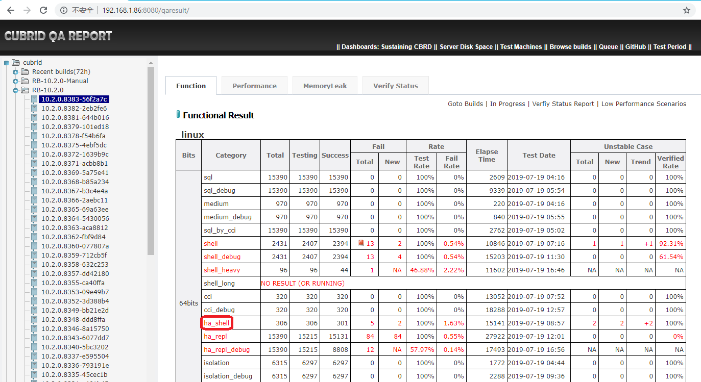
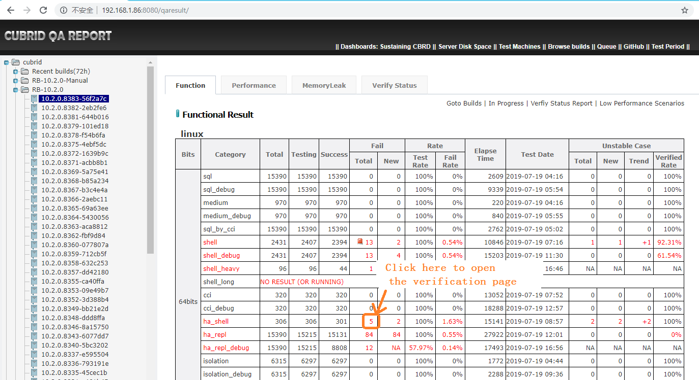

# HA Shell Test Guide
# 1 Test Introduction
HA Shell test suit is used to test CUBRID HA features.  
To run a HA shell case, we usually need at least two machines. But sometimes, we need more than two machines.  
So HA shell test is divided to two categories:    
1. Test the HA shell cases which can be run on two machines. The cases are put in 'HA' case path. And these cases are executed for each CI build.  
2. Test the other HA shell cases. The cases are put in 'shell_ext' path. And these cases are usually run before a release.  

In this document, I will mainly introduce the first kind of test. This kind of test is almost the same as shell test.  
For the second kind of test , I will introduce it an the end of this document.  

# 2 Tools Introduction
CTP is the only test tool which is used in HA shell test.   
Source URL: [https://github.com/CUBRID/cubrid-testtools](https://github.com/CUBRID/cubrid-testtools)

# 3 Test Deployments
## 3.1 create and set users  
### controller node
We need create a new user: controller.  
Login root user and execute:  
```
sudo useradd controller
```
Set password as our common password for user controller.  
```
sudo passwd controller
```
 Set the user's password to never expire.  
 ```
 sudo chage -E 2999-1-1 -m 0 -M 99999 controller
 ```
 
 ### worker nodes
We need create two new users: ha, dev.
Login root user and execute:  
```
sudo useradd ha
sudo useradd dev
```
Set password as our common password for user shell and user dev.  
```
sudo passwd ha
sudo passwd dev
```
 Set these users' password to never expire.  
 ```
 sudo chage -E 2999-1-1 -m 0 -M 99999 ha
 sudo chage -E 2999-1-1 -m 0 -M 99999 dev
 ```
 ## 3.2 install software packages
Required software packages: jdk, lcov, bc, lrzsz.   

|software|version|usage|  
|---|---|---|  
|jdk|1.8.0 (need larger than 1.6)|run CTP, run shell test case|  
|lcov|lcov-1.11|run code coverage test|  
|bc|latest version|run shell test case|  
|lrzsz|latest version|upload/download files|  

These software packages are installed by root user and can be used by all the users.  

## 3.3 Deploy controller node
### install CTP 
**Step 1: download CTP**  
*method 1: install from git*    
```
cd ~
git colne https://github.com/CUBRID/cubrid-testtools.git
cd cubrid-testtools
git checkout develop
cp -rf ~/cubrid-testtools/CTP ~
```  
*method 2: install from our server*     
```
cd ~
wget http://192.168.1.91:8080/REPO_ROOT/CTP.tar.gz
tar zxvf CTP.tar.gz
```  
Usually, we use method 2.

**Step 2: set CTP configuration files**    
*~/CTP/conf/common.conf*   
```
git_user=cubridqa
git_pwd=GITPASSWORD
git_email=dl_cubridqa_bj_internal@navercorp.com
default_ssh_pwd=PASSWORD
default_ssh_port=22

grepo_service_url=rmi://192.168.1.91:11099
coverage_controller_pwd=PASSWORD

qahome_db_driver=cubrid.jdbc.driver.CUBRIDDriver
qahome_db_url=jdbc:cubrid:192.168.1.86:33080:qaresu:dba::
qahome_db_user=dba
qahome_db_pwd=

qahome_server_host=192.168.1.86
qahome_server_port=22
qahome_server_user=qahome
qahome_server_pwd=PASSWORD

activemq_user=admin
activemq_pwd=admin
activemq_url=failover:tcp://192.168.1.91:61616?wireFormat.maxInactivityDurationInitalDelay=30000

mail_from_nickname=CUBRIDQA_BJ
mail_from_address=dl_cubridqa_bj_internal@navercorp.com
```
*~/CTP/conf/shell_template.conf* 
```
default.ssh.port=22
default.ssh.user=ha
default.ssh.pwd=PASSWORD
default.cubrid.cubrid_port_id = 1568
default.broker1.BROKER_PORT = 30090
default.broker2.BROKER_PORT = 33091
default.broker1.APPL_SERVER_SHM_ID=30090
default.broker2.APPL_SERVER_SHM_ID=33091
default.ha.ha_port_id = 59907

env.83.ssh.host=192.168.1.83
env.83.ssh.relatedhosts=192.168.1.93

env.84.ssh.host=192.168.1.84
env.84.ssh.relatedhosts=192.168.1.94

env.85.ssh.host=192.168.1.85
env.85.ssh.relatedhosts=192.168.1.95

env.87.ssh.host=192.168.1.87
env.87.ssh.relatedhosts=192.168.1.97

env.88.ssh.host=192.168.1.88
env.88.ssh.relatedhosts=192.168.1.92

#env.89.ssh.host=192.168.1.89
#env.89.ssh.relatedhosts=192.168.1.97

test_continue_yn=false
scenario=$HOME/cubrid-testcases-private/HA/shell
testcase_exclude_from_file=$HOME/cubrid-testcases-private/HA/shell/config/daily_regression_test_excluded_list_linux.conf
testcase_git_branch=develop

testcase_timeout_in_secs=604800
testcase_update_yn=true
test_platform=linux
test_category=ha_shell
testcase_retry_num=0
ignore_core_by_keywords=
owner_email=cui.man@navercorp.com
enable_check_disk_space_yn=true

feedback_type=database
feedback_db_host=192.168.1.86
feedback_db_port=33080
feedback_db_name=qaresu
feedback_db_user=dba
feedback_db_pwd=
feedback_notice_qahome_url=http://192.168.1.86:8080/qaresult/shellImportAction.nhn?main_id=<MAINID>
```
shell_template.conf will be copied to \~/CTP/conf/shell_runtime.conf when test is started.  
For more details about the parameters, please refer to CTP guide. 

### set ~/.bash_profile 
*~/.bash_profile*  
```
# .bash_profile

# Get the aliases and functions
if [ -f ~/.bashrc ]; then
        . ~/.bashrc
fi

# User specific environment and startup programs

PATH=$JAVA_HOME/bin:$HOME/CTP/common/script:$PATH:$HOME/.local/bin:$HOME/bin

export PATH

export CTP_BRANCH_NAME="develop"
export CTP_SKIP_UPDATE=0
```

### create a script to start consumer
~/start_test.sh
```
nohup start_consumer.sh -q QUEUE_CUBRID_QA_SHELL_HA_LINUX -exec run_shell &
```
In our regression test, ha shell test and isolation test share the same controller and worker machines. So the script is like this:  
```
nohup start_consumer.sh -q QUEUE_CUBRID_QA_CC_BASIC,QUEUE_CUBRID_QA_SHELL_HA_LINUX -exec run_isolation,run_shell &
```
Execute the script to start listening the test message after deployment. This will start a shell test when the consumer receive the test message.
```
cd ~
sh start_test.sh
```

## 3.4 Deploy worker node  
### install CTP
This step is the same as 'install CTP' on controller node. Plese refer to [install CTP](#install_CTP).  
### set ~/.bash_profile
*~/.bash_profile*
```
# .bash_profile

# Get the aliases and functions
if [ -f ~/.bashrc ]; then
        . ~/.bashrc
fi

# User specific environment and startup programs

PATH=$PATH:$HOME/.local/bin:$HOME/bin

export CTP_HOME=$HOME/CTP
## init_path is used when we run shell case manually on this machine.
export init_path=$CTP_HOME/shell/init_path

export PATH=$CTP_HOME/bin:$CTP_HOME/common/script:$PATH

export CTP_BRANCH_NAME="develop"
export CTP_SKIP_UPDATE=0

. ~/.cubrid.sh
export GCOV_PREFIX=/home/ha
export GCOV_PREFIX_STRIP=2
ulimit -c unlimited
```

### deploy test cases
```
git clone --no-checkout https://github.com/CUBRID/cubrid-testcases-private-ex.git
cd ~/cubrid-testcases-private-ex
git config core.sparseCheckout true
echo 'HA/*' > ~/cubrid-testcases-private-ex/.git/info/sparse-checkout
git checkout develop
```

### make directories for test
```
cd
mkdir do_not_delete_core
mkdir ERROR_BACKUP
```

### create .cubrid.sh file 
If cubrid has never been installed on the machine, we need create file '.cubrid.sh' at $HOME path manually.  
*.cubrid.sh file:*   
```
CUBRID=/home/shell/CUBRID
CUBRID_DATABASES=$CUBRID/databases
if [ "x${LD_LIBRARY_PATH}x" = xx ]; then
  LD_LIBRARY_PATH=$CUBRID/lib
else
  LD_LIBRARY_PATH=$CUBRID/lib:$LD_LIBRARY_PATH
fi
SHLIB_PATH=$LD_LIBRARY_PATH
LIBPATH=$LD_LIBRARY_PATH
PATH=$CUBRID/bin:$PATH
export CUBRID
export CUBRID_DATABASES
export LD_LIBRARY_PATH
export SHLIB_PATH
export LIBPATH
export PATH
```

# 4 Regression Test
We execute HA shell test for each CI build, and execute code coverage test monthly. Both of these test are started automatically when the controller receive a test message. We just need to prepare the conf files, verify the test results, and report issues.

## 4.1	Set conf files for regression test
Edit the file: ~/CTP/conf/shell_template.conf.  
shell_template.conf will be copied to \~/CTP/conf/shell_runtime.conf when test is started.  
For more details, please refer to ['install CTP'](#install_CTP)

## 4.2 Verify dailyqa test results
### Result overview
Open qahome in browser, then select build number. 'Function Result' page will be displayed.
Find ha_shell in linux part.    
  
In the overview page, we should check the values in all the colomns. The most important check items are:  
1. Whether the test is completed ('Test Rate' column)
2. How many cases are failed('Failed' columns)
3. The elapse time of the test ('Elapse Time' column). The elapse time of the test should not be longer than the elapse time of the previous build too much.  

### verfy the failed cases
Click the link in this image to open the online verification page.  
  
For the online verification, please refer to shell test guide:
(I will add the link here after shell guide is merged)

## 4.3 Verify code coverage test result
please refer to shell test guide.  

## 4.4 Report issues
please refer to shell test guide.  

# 5 Execute Test  
# 5.1 Execute a single test case  
To execute a single test case, we juse need to login a test machine, and go to the case path, and then execute shell command 'sh case_name.sh'. 

# 5.2 Execute a HA shell test  
We can use the regression tools to trigger a test.  
1. Change the parameters in ~/CTP/conf/shell_template.conf on controller node.    
2. Send a message to start the test  
Login: message@192.168.1.91  
Send test message as:  
```
sender.sh QUEUE_CUBRID_QA_SHELL_HA_LINUX http://192.168.1.91:8080/REPO_ROOT/store_01/10.2.0.8330-d4d8464/drop/CUBRID-10.2.0.8330-d4d8464-Linux.x86_64.sh ha_shell default
```
3. Start consumer on the controller node  
If the consumer is not started, login the controller node to start it.  
```
cd ~
sh start_test.sh 
```
4. Check test result  
The results will be uploaded to qahome automatically. You can follow ['4.2 Verify dailyqa test results'](#4.2_Verify_dailyqa_test_results) to check the test results. 

# 6 Code Coverage Test
Please refer to shell test guide.  

# 7 Run test manually
1. Login controller node.
2. Set the conf file ~/CTP/conf/shell_template.conf.
3. run ctp
```
ctp.sh shell -c conf/shell_template.conf
```

# 8 HA shell case standards
HA shell case is a special kind of shell test case. It should fowllow all the shell test case standards.   
For shell case standards, please refer to shell test guide.   
In this section, I will only introduce the contents which are not included in shell test guide.  

## 8.1 case path standard
### new feature path:  
We created folders for each cubrid version like this:  
```
PATH/TO/HA/shell/_27_features_920
PATH/TO/HA/shell/_28_features_930
PATH/TO/HA/shell/_29_banana_qa
PATH/TO/HA/shell/_30_banana_pie
PATH/TO/HA/shell/_31_cherry
```

### cases added for jira issues:
We created a folder for test cases added for jira issues.  
```
PATH/TO/HA/shell/_12_bts_issue
```

## 8.2 the beginning of the case
```bash
#!/bin/bash
set -x
. $init_path/init.sh
. $init_path/make_ha.sh
init test
setup_ha_environment
```

These lines will export system variables, import all the functions.  
'init.sh' contains all the common functions for shell test cases.   
*make_ha.sh*  
'make_ha.sh' will source make_ha_upper.sh( >=8.4) or make_ha_lower.sh( <8.4) according to cubrid versions.
```
if [ $is_R40 -eq 1 ]; then
        . $init_path/make_ha_upper.sh
else
        . $init_path/make_ha_lower.sh
fi
```
make_ha_upper.sh and make_ha_lower.sh contain all the common functions for ha shell test cases.  

*setup_ha_environment*  
setup_ha_environment is used to setup a HA environment which contains one master node, and one slave node.  
The current machine is used as the master node, and slave node is set in ~/CTP/shell/init_path/HA.properties.  
Example of HA.properties:  
```
##Configure HA enviorment.

MASTER_SERVER_IP = 192.168.1.83
MASTER_SERVER_USER = ha
MASTER_SERVER_PW = *******
MASTER_SERVER_SSH_PORT = 22
SLAVE_SERVER_IP = 192.168.1.93
SLAVE_SERVER_USER = ha
SLAVE_SERVER_PW = *******
SLAVE_SERVER_SSH_PORT = 22
#set port numbers according to different users
CUBRID_PORT_ID = 1568
HA_PORT_ID = 59907
MASTER_SHM_ID = 1568
BROKER_PORT1 = 30090
APPL_SERVER_SHM_ID1 = 30090
BROKER_PORT2 = 33091
APPL_SERVER_SHM_ID2 = 33091
CM_PORT = 8001
```
If you need to run a HA shell, you need to edit HA.properties first.  
In regression test,  file 'HA.properties' is configured by CTP.  
CTP read info from file ~/CTP/conf/shell_template.conf on controller node, and set $init_path/HA.properties on each master node. 

For example:  
$init_path/HA.properties on node ha@192.168.1.83:
```
##Configure HA enviorment.

MASTER_SERVER_IP = 192.168.1.83
MASTER_SERVER_USER = ha
MASTER_SERVER_PW = uV9b3KMp5%%
MASTER_SERVER_SSH_PORT = 22
SLAVE_SERVER_IP = 192.168.1.93
SLAVE_SERVER_USER = ha
SLAVE_SERVER_PW = uV9b3KMp5%%
SLAVE_SERVER_SSH_PORT = 22
#set port numbers according to different users
CUBRID_PORT_ID = 1568
HA_PORT_ID = 59907
MASTER_SHM_ID = 1568
BROKER_PORT1 = 30090
APPL_SERVER_SHM_ID1 = 30090
BROKER_PORT2 = 33091
APPL_SERVER_SHM_ID2 = 33091
CM_PORT = 8001

```
This is depend on file ~/CTP/conf/shell_template.conf on controller node:  


```
default.ssh.port=22
default.ssh.user=ha
default.ssh.pwd=uV9b3KMp5%%
default.cubrid.cubrid_port_id = 1568
default.broker1.BROKER_PORT = 30090
default.broker2.BROKER_PORT = 33091
default.broker1.APPL_SERVER_SHM_ID=30090
default.broker2.APPL_SERVER_SHM_ID=33091
default.ha.ha_port_id = 59907

#master node
env.83.ssh.host=192.168.1.83
#slave node
env.83.ssh.relatedhosts=192.168.1.93
...
```

## 8.3 the end of the case
```bash
cubrid service stop
revert_ha_environment
finish
```
'revert_ha_environment' function:  revert all the conf files to the original status on master node and slave node. 

## 8.4 functions in make_ha_upper.sh
### setup_ha_environment  
Please refer to ['8.2 the beginning of the case'](#8.2_the_beginning_of_the_case)  

### revert_ha_environment  
Please refer to ['8.3 the end of the case'](#8.3_the_end_of_the_case)  

### format_hb_status

### wait_for_slave

### wait_for_slave_failover

### add_ha_db

