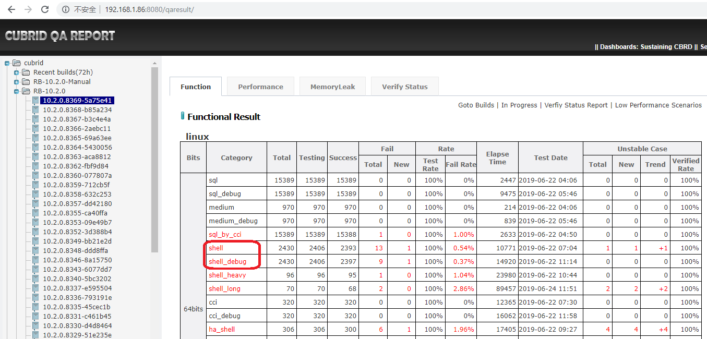
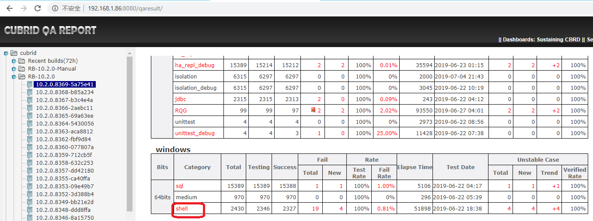
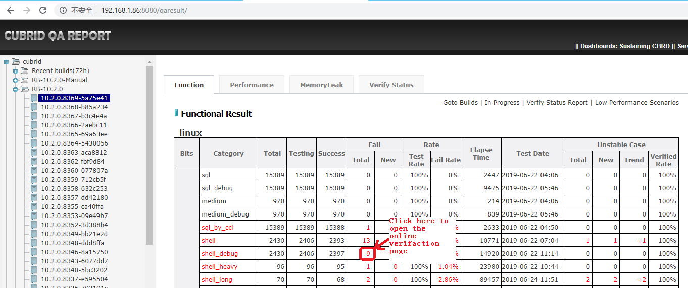
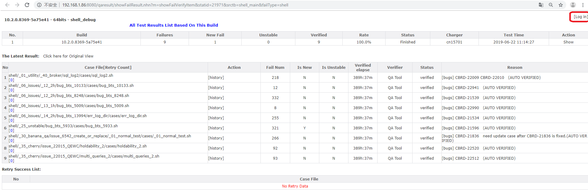
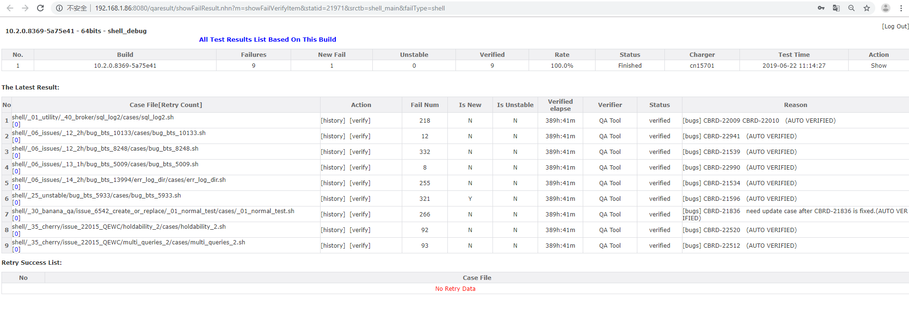
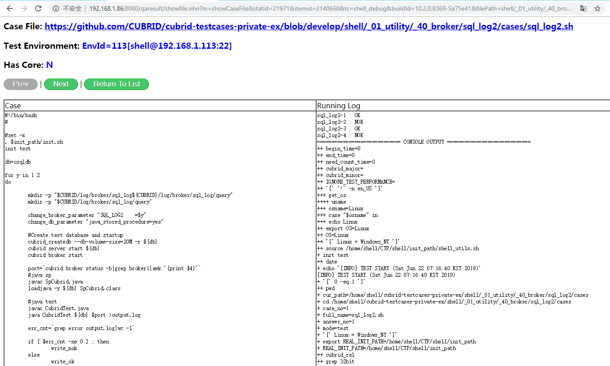
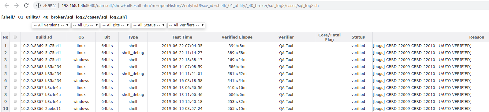
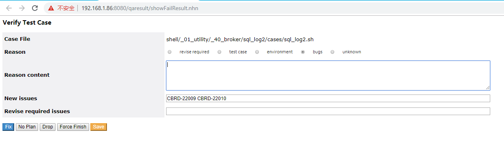

# Shell Test Guide
# 1 Test Introduction
Shell test is an important test suit in cubrid test.  
It contains almost all the feature test and some performance test which cannot be test by sql test or other test suits.  

# 2 Tools Introduction
CTP is the only test tool which is used in shell test.   
Source URL: [https://github.com/CUBRID/cubrid-testtools](https://github.com/CUBRID/cubrid-testtools)

# 3 Test Deployments
## 3.1 create and set users  
### controller node
We need create a new user: shell_ctrl.
Login root user and execute:  
```
sudo useradd shell_ctrl
```
Set password as our common password for user shell_ctrl.  
```
sudo passwd shell_ctrl
```
 Set the user's password to never expire.  
 ```
 sudo chage -E 2999-1-1 -m 0 -M 99999 shell_ctrl
 ```
 
### worker nodes
We need create two new users: shell, dev.  
Login root user and execute:  
```
sudo useradd shell
sudo useradd dev
```
Set password as our common password for user shell and user dev.  
```
sudo passwd shell
sudo passwd dev
```
 Set these users' password to never expire.  
 ```
 sudo chage -E 2999-1-1 -m 0 -M 99999 shell
 sudo chage -E 2999-1-1 -m 0 -M 99999 dev
 ```
## 3.2 install software packages
Required software packages: jdk, lcov, bc, lrzsz.   

|software|version|usage|  
|---|---|---|  
|jdk|1.8.0 (need larger than 1.6)|run CTP, run shell test case|  
|lcov|lcov-1.11|run code coverage test|  
|bc|latest version|run shell test case|  
|lrzsz|latest version|upload/download files|  

These software packages are installed by root user and can be used by all the users.  

## 3.3 Deploy controller node
### install CTP   
**Step 1: download CTP**   
*method 1: install from git*    
```
cd ~
git colne https://github.com/CUBRID/cubrid-testtools.git
cd cubrid-testtools
git checkout develop
cp -rf ~/cubrid-testtools/CTP ~
```  
*method 2: install from our server*     
```
cd ~
wget http://192.168.1.91:8080/REPO_ROOT/CTP.tar.gz
tar zxvf CTP.tar.gz
```  
Usually, we use method 2.

**Step 2: set CTP configuration files**    
*~/CTP/conf/common.conf*   
```
git_user=cubridqa
git_pwd=GITPASSWORD
git_email=dl_cubridqa_bj_internal@navercorp.com
default_ssh_pwd=PASSWORD
default_ssh_port=22

grepo_service_url=rmi://192.168.1.91:11099
coverage_controller_pwd=PASSWORD

qahome_db_driver=cubrid.jdbc.driver.CUBRIDDriver
qahome_db_url=jdbc:cubrid:192.168.1.86:33080:qaresu:dba::
qahome_db_user=dba
qahome_db_pwd=

qahome_server_host=192.168.1.86
qahome_server_port=22
qahome_server_user=qahome
qahome_server_pwd=PASSWORD

activemq_user=admin
activemq_pwd=admin
activemq_url=failover:tcp://192.168.1.91:61616?wireFormat.maxInactivityDurationInitalDelay=30000

mail_from_nickname=CUBRIDQA_BJ
mail_from_address=dl_cubridqa_bj_internal@navercorp.com
```
*~/CTP/conf/shell_template.conf* 
```
default.cubrid.cubrid_port_id=1568
default.broker1.BROKER_PORT=10090
default.broker1.APPL_SERVER_SHM_ID=10090
default.broker2.BROKER_PORT=13091
default.broker2.APPL_SERVER_SHM_ID=13091
default.ha.ha_port_id=19909

env.104.ssh.host=192.168.1.104
env.104.ssh.port=22
env.104.ssh.user=shell
env.104.ssh.pwd=PASSWORD

env.105.ssh.host=192.168.1.105
env.105.ssh.port=22
env.105.ssh.user=shell
env.105.ssh.pwd=PASSWORD

env.106.ssh.host=192.168.1.106
env.106.ssh.port=22
env.106.ssh.user=shell
env.106.ssh.pwd=PASSWORD

env.107.ssh.host=192.168.1.107
env.107.ssh.port=22
env.107.ssh.user=shell
env.107.ssh.pwd=PASSWORD

env.108.ssh.host=192.168.1.108
env.108.ssh.port=22
env.108.ssh.user=shell
env.108.ssh.pwd=PASSWORD

env.109.ssh.host=192.168.1.109
env.109.ssh.port=22
env.109.ssh.user=shell
env.109.ssh.pwd=PASSWORD

env.110.ssh.host=192.168.1.110
env.110.ssh.port=22
env.110.ssh.user=shell
env.110.ssh.pwd=PASSWORD

env.111.ssh.host=192.168.1.111
env.111.ssh.port=22
env.111.ssh.user=shell
env.111.ssh.pwd=PASSWORD

env.112.ssh.host=192.168.1.112
env.112.ssh.port=22
env.112.ssh.user=shell
env.112.ssh.pwd=PASSWORD

env.113.ssh.host=192.168.1.113
env.113.ssh.port=22
env.113.ssh.user=shell
env.113.ssh.pwd=PASSWORD

env.114.ssh.host=192.168.1.114
env.114.ssh.port=22
env.114.ssh.user=shell
env.114.ssh.pwd=PASSWORD

scenario=${HOME}/cubrid-testcases-private-ex/shell
test_continue_yn=false
cubrid_download_url=http://127.0.0.1/REPO_ROOT/store_02/10.1.0.6876-f9026f8/drop/CUBRID-10.1.0.6876-f9026f8-Linux.x86_64.sh
testcase_exclude_from_file=${HOME}/cubrid-testcases-private-ex/shell/config/daily_regression_test_excluded_list_linux.conf
testcase_update_yn=true
testcase_git_branch=develop
testcase_timeout_in_secs=604800
test_platform=linux
test_category=shell
testcase_exclude_by_macro=LINUX_NOT_SUPPORTED
testcase_retry_num=0
delete_testcase_after_each_execution_yn=false
enable_check_disk_space_yn=true

feedback_type=database
feedback_notice_qahome_url=http://192.168.1.86:8080/qaresult/shellImportAction.nhn?main_id=<MAINID>

owner_email=Mandy<cui.man@navercorp.com>

git_user=cubridqa
git_email=dl_cubridqa_bj_internal@navercorp.com
git_pwd=N6P0Sm5U7h

feedback_db_host=192.168.1.86
feedback_db_port=33080
feedback_db_name=qaresu
feedback_db_user=dba
feedback_db_pwd=
```
shell_template.conf will be copied to \~/CTP/conf/shell_runtime.conf when test is started.  
For more details about the parameters, please refer to CTP guide.  

### set ~/.bash_profile 
*~/.bash_profile*  
```
# .bash_profile

# Get the aliases and functions
if [ -f ~/.bashrc ]; then
        . ~/.bashrc
fi

# User specific environment and startup programs

PATH=$JAVA_HOME/bin:$HOME/CTP/common/script:$PATH:$HOME/.local/bin:$HOME/bin

export PATH

export CTP_BRANCH_NAME="develop"
export CTP_SKIP_UPDATE=0
```

### create a script to start consumer
~/start_test.sh
```
nohup start_consumer.sh -q QUEUE_CUBRID_QA_SHELL_LINUX -exec run_shell &
```
Execute the script to start listening the test message after deployment. This will start a shell test when the consumer receive the test message.
```
cd ~
sh start_test.sh
```

## 3.4 Deploy worker node  
### install CTP
This step is the same as 'install CTP' on controller node. Plese refer to [install CTP](#install_CTP).  
### set ~/.bash_profile
*~/.bash_profile*
```
# .bash_profile

# Get the aliases and functions
if [ -f ~/.bashrc ]; then
        . ~/.bashrc
fi

# User specific environment and startup programs

PATH=$PATH:$HOME/.local/bin:$HOME/bin

export CTP_HOME=$HOME/CTP
## init_path is used when we run shell case manually on this machine.
export init_path=$CTP_HOME/shell/init_path

export PATH=$CTP_HOME/bin:$CTP_HOME/common/script:$PATH

export CTP_BRANCH_NAME="develop"
export CTP_SKIP_UPDATE=0

. ~/.cubrid.sh
export GCOV_PREFIX=/home/shell
export GCOV_PREFIX_STRIP=2
ulimit -c unlimited
```

### deploy test cases
```
git clone --no-checkout https://github.com/CUBRID/cubrid-testcases-private-ex.git
cd ~/cubrid-testcases-private-ex
git config core.sparseCheckout true
echo 'shell/*' > ~/cubrid-testcases-private-ex/.git/info/sparse-checkout
git checkout develop
```

### make directories for test
```
cd
mkdir do_not_delete_core
mkdir ERROR_BACKUP
```

### create .cubrid.sh file 
If cubrid has never been installed on the machine, we need create file '.cubrid.sh' at $HOME path manually.  
*.cubrid.sh file:*    
```
CUBRID=/home/shell/CUBRID
CUBRID_DATABASES=$CUBRID/databases
if [ "x${LD_LIBRARY_PATH}x" = xx ]; then
  LD_LIBRARY_PATH=$CUBRID/lib
else
  LD_LIBRARY_PATH=$CUBRID/lib:$LD_LIBRARY_PATH
fi
SHLIB_PATH=$LD_LIBRARY_PATH
LIBPATH=$LD_LIBRARY_PATH
PATH=$CUBRID/bin:$PATH
export CUBRID
export CUBRID_DATABASES
export LD_LIBRARY_PATH
export SHLIB_PATH
export LIBPATH
export PATH
```

# 4 Regression Test
We execute shell test for each CI build, and execute code coverage test monthly. Both of these test are started automatically when the controller receive a test message. We just need to prepare the conf files, verify the test results, and report issues.

## 4.1	Set conf files for regression test
Edit the file: ~/CTP/conf/shell_template.conf.  
shell_template.conf will be copied to \~/CTP/conf/shell_runtime.conf when test is started.  
For more details, please refer to ['install CTP'](#install_CTP)

## 4.2 Verify dailyqa test results
### Result overview
Open qahome in browser, then select build number. 'Function Result' page will be displayed.
Find shell and shell_debug in linux part, and find shell in windows part.  


If there are crash failures, an alarm icon will appear in the 'Total' column, like this:  
  
In the overview page, we should check the values in all the colomns. The most important check items are:  
1. Whether the test is completed ('Test Rate' column)
2. How many cases are failed('Failed' columns)
3. The elapse time of the test ('Elapse Time' column). The elapse time of the test should not be longer than the elapse time of the previous build too much.    

### verfy the failed cases
Click the link in this image to open the online verification page.  
  
On the verification page, click 'Log in' to login.  
  
After logging in, we can start to verify the failed cases online.    
    
**Click the link in 'Case File' column to check the case and the screen output.**  
  
**'[history]':** check the test case history failure   
*history page*    
   
**'[verify]':** open the case's verification page to write the verification result   
*case verification page*   
  
On this page:
1. select a failure reason.  
2. write some comments in 'Reason content'  
3. write the issue number in 'New issues' or 'New issues'  
4. click the button at the bottom to close this page.  
Fix: I am sure of this verication result.  
Save: I am not sure of this verication result. I will decide it later.  

Sometimes, we cannot find the failure reason from the screen output directly. At this time, we need login the test machine, go to the case path, check the logs. If we still cannot find the failure reason from the logs, we should run the case step by step on this machine to find the failure reason.  
We should verify the crash failures first.  

## 4.3 Verify code coverage test result
Go to QA homepage and find the 'code coverage' node in the left area, click the link of the latest result.  

Click 'shell' link.  
  
Check the value of 'Coverage' column. The coverage value should not lower than previous code coverage test result.  
 

## 4.4 Report issues
### crash issue  
If there is a crash, report it following the rules in this link: [‘How to Report Regression Crash Issues’](http://jira.cubrid.org/browse/CUBRIDQA-1?focusedCommentId=4739244&page=com.atlassian.jira.plugin.system.issuetabpanels:comment-tabpanel#comment-4739244)  

### normal issue  
If the the test result is as expected, first we should confirm whether it is revise required. If not, report it as an issue on jira.   

# 5 Execute Test  
# 5.1 Execute a single test case  
To execute a single test case, we juse need to login a test machine, and go to the case path, and then execute shell command 'sh case_name.sh'.  

# 5.2 Execute a shell test  
We can use the regression tools to trigger a test.  
1. Change the parameters in ~/CTP/conf/shell_template.conf on controller node.    
2. Send a message to start the test  
Login: message@192.168.1.91  
Send test message as:  
```
sender.sh QUEUE_CUBRID_QA_SHELL_LINUX http://192.168.1.91:8080/REPO_ROOT/store_01/10.2.0.8330-d4d8464/drop/CUBRID-10.2.0.8330-d4d8464-Linux.x86_64.sh shell default
```
3. Start consumer on the controller node  
If the consumer is not started, login the controller node to start it.  
```
cd ~
sh start_test.sh 
```
4. Check test result  
The results will be uploaded to qahome automatically. You can follow section 4.2 to check the test results.  

# 6 Code Coverage Test
For code coverage test, just need to send a message.  
Login: message@192.168.1.91  
Send test message as:  
```
cd ~/manual
sh sender_code_coverage_testing_message.sh Queue:QUEUE_CUBRID_QA_SHELL_LINUX Build URL:http://192.168.1.91:8080/REPO_ROOT/store_01/10.2.0.8270-c897055/drop/CUBRID-10.2.0.8270-c897055-gcov-Linux.x86_64.tar.gz Source URL:http://192.168.1.91:8080/REPO_ROOT/store_01/10.2.0.8270-c897055/drop/cubrid-10.2.0.8270-c897055-gcov-src-Linux.x86_64.tar.gz Category:shell
```
The result will be uploaded to qahome automatically.  
To check the result, please refer to ['Verify code coverage test result'](#Verify-code-coverage-test-result) 

# 7 Run test manually
1. Login controller node.
2. Set the conf file ~/CTP/conf/shell_template.conf.
3. run ctp
```
ctp.sh shell -c conf/shell_template.conf
```

# 8 shell case standards
## 8.1 case path standard
### new feature path:  
We create folders for each cubrid version like this:  
```
PATH/TO/shell/_34_banana_pie
PATH/TO/shell/_35_cherry
```
Please add the cases for new new features in the related folder.  

### cases added for jira issues:
We create a folder for test cases added for jira issues.  
```
PATH/TO/shell/_06_issues
```
The folder contains sub folders like this:  
```
_10_1h  _10_2h  _11_1h  _11_2h  _12_1h  _12_2h  _13_1h  _13_2h  _14_1h  _14_2h  _15_1h  _15_2h  _16_2h  _17_1h  _17_2h  _18_1h  _18_2h  _19_1h
```
The folder name means the date when we added this case.  
For example, I verified an issue and I need add cases for it on 6/1/2019. I need add these cases in '\_19_1h'.  

## 8.2 the beginning of the case
```
#!/bin/bash
. $init_path/init.sh
init test
```
These lines will export system variables, import all the functions.  

## 8.3 the end of the case
```
cubrid service stop
cubrid deleted $dbname
finish
```
The command 'cubrid deletedb' will check whether there are core files and fatal error generated in the case, and backup db volumns, core files, logs.   
'finish' is a function in init.sh, which will revert all the conf files to the original status.    

## 8.4 'cubrid' script
When execute 'init test' at the beginning of the case, '${init_path}/../../bin:${init_path}/../../common/script' is added to PATH:  
```
PATH=${init_path}/../../bin:${init_path}/../../common/script:$PATH
```
'cubrid' script in init_path will be used instead of $CUBRID/bin/cubrid in the case.  
*'cubrid deletedb':*  
It will check whether there are core files and fatal error generated in the case. If there are, backup db volumns, core files, logs. Then execute $CUBRID/bin/cubrid deletedb.  
*'cubrid checkdb':*  
It will check whether checkdb is failed, and if it is, backup db volumns, logs, core files. Then execute $CUBRID/bin/cubrid checkdb.  

## 8.5 functions in init.sh
I will introduce some important functions in init.sh. They are frequently used in shell test cases.  

### init
'init test' is used at the beginning of each case.  
These lines will do many init operations, such as: export system variables, import all the functions.  

### finish
Used at the end of each test case.
1. cubrid service stop  
2. release_broker_sharedmemory  
3. revert all the conf files to original ones  

### WINDOWS_NOT_SUPPORTED/LINUX_NOT_SUPPORTED
Indicate that the case will not be run on windows or linux platform.

### cubrid_createdb
Used to createdb. This is used to make 'cubrid createdb' utility to be compatible with leagcy builds.  
Before CUBRID 9.1, locale parameter is not supported in 'cubrid createdb'.

### write_ok/write_nok  
Used to assert the test point.  
Example:  
```
cnt1=`cat result.log | grep "error" | wc -l`

if [ -s result.log ] && [ $cnt1 -eq 0 ]; then
        write_ok
else
        write_nok result.log
fi
```

### compare_result_between_files
compare_result_between_files filename1 filename2
Used to compare the actual result to the expected result.  
Examples:  
```
compare_result_between_files test.answer test.log
compare_result_between_files master_data.answer slave_data.log
```

### change_db_parameter/change_broker_parameter/change_ha_parameter
Used to change the db/broker/ha parameters in the conf files.  
When you need to change the parameters in the conf files, better to use these functions.  
Examples:   
```
change_db_parameter "java_stored_procedure=yes"
change_db_parameter "log_max_archives=1
change_broker_parameter "SQL_LOG=ON"
change_broker_parameter "MAX_NUM_APPL_SERVER=5"
change_ha_parameter "ha_enable_sql_logging=true"
change_ha_parameter "ha_copy_log_max_archives=100"
```

### get_broker_port_from_shell_config
Used to get broker port.
```
port=`get_broker_port_from_shell_config`
javac *.java
java Test_Batch $port $dbname > batch.log 2>&1
```
We should get broker port from the runtime environment, instead of write it in the java/c file directly.  
Another method we used is:  
```
port=`cubrid broker status -b | grep broker1 |awk '{print $4}'`
```

### xgcc
Used to compile c/c++ files on both linux and windows platforms.
Examples:   
```
xgcc -o test test.c
xgcc -o execute_batch utils.c execute_batch.c
xgcc -pthread -o multiple  multiple.c
```

### do_make_locale
Used to make_locale on both linux and windows platforms.  
Parameter introduction:    
*force:*  
If we do not add this parameter, the function will check whether the file '$CUBRID/lib/libcubrid_all_locales.so' exists first. If the file exists, it will return immediately and skip 'make_locale'. If we add 'force' parameter, the function will call make_locale in any case.  
*nocheck:*  
do not check make_locale result.  
*debug/release:*  
It will be used in make_locale. For example, if we use 'do_make_locale force debug', the fucntion will call 'make_locale.sh -t 64 -m debug'.  
*locale value:*
It will be used in make_locale. For example, if we use 'do_make_locale force zh_CN', the fucntion will call 'make_locale.sh -t 64 zh_CN'.   
Example:  
```
cp $CUBRID/conf/cubrid_locales.all.txt $CUBRID/conf/cubrid_locales.txt
do_make_locale force
```

### delete_make_locale
Revert the make_locale results. Change CUBRID to its original locale status.

### do_make_tz
Used to make_tz on both linux and windows platforms.    
Examples:  
```
do_make_tz
do_make_tz new
do_make_tz extend
do_make_tz release extend
do_make_tz new nocheck
```

### revert_tz
Revert the make_tz results. Change CUBRID to its original timezone status.

### xkill
Used to kill the processes on both linux and windows platforms.   
Both pid and process name can be used as a parameter.  
When using '-f', it means it will search in the full process name.  
For example:
```
if [ $OS == "Windows_NT" ]
then
        xkill -f "cub_admin"
else
        xkill -f "statdump"
fi
```

Without '-f', this command will be excuted on linux:  
```
$ ps -u $USER -o pid,comm
   PID COMMAND
114832 sshd
120255 cub_master
120257 cub_server
121785 cubrid
121786 cub_admin
121816 ps
```
With '-f', this command will be excuted: 

```
$ ps -u $USER -o pid,command
   PID COMMAND
114832 sshd: cuiman@pts/0,pts/1
120255 cub_master
120257 cub_server demodb
121785 cubrid statdump            
121786 cubrid statdump demodb -i 1
121789 ps -u cuiman -o pid,command
```
In this case 'xkill -f "statdump"', the processes cannot be killed whithout -f paramenter.

Other examples:  
```
xkill $pid
xkill cub_server
xkill -f "statdump"
```

### xkill_pid
Used to kill the processes on both linux and windows platforms.  
Only process id can be used as a parameter.  
```
xkill_pid $pid
```

### format_csql_output
Used to remove the time related lines in csql output file.  
```
csql -u dba demodb -c 'select count(*) from game' > test.log 2>&1
format_csql_output test.log
```
Before use this function:  
```
$ cat test.log

=== <Result of SELECT Command in Line 1> ===

     count(*)
=============
         8653

1 row selected. (0.006435 sec) Committed.
```
After use this function:  
```
$ cat test.log               

=== <Result of SELECT Command in Line 1> ===

     count(*)
=============
         8653

```

### format_query_plan
Used to format query plan.

### format_path_output. 
Used to format path.


