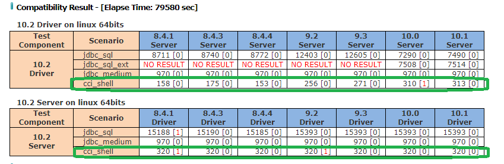
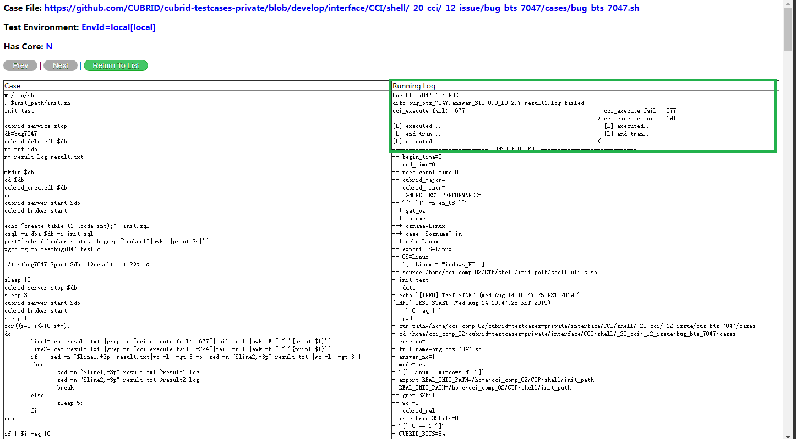

# 1. Test Objective
The CCI compatibility test is aimed to test CUBRID compatibility with different version's CCI driver and server. Actually the test cases is the same with CCI test.

# 2. Execute CCI Compatibility Test
To perform the test, we need to install CTP first.   
## 2.1 Install CTP
Please refer to [2.1 Install CTP of cci guide](https://github.com/slamdunkorchid/cubrid-testtools/blob/0815/doc/cci_guide.md#21-install-ctp).    

## 2.2 Prepare Test Cases
Please refer to [2.2 Prepare Test Cases of cci guide](https://github.com/slamdunkorchid/cubrid-testtools/blob/0815/doc/cci_guide.md#22-prepare-test-cases).    

## 2.3 Install CUBRID 
For compatibility test, we need to install different driver and server version. For example:
we test 10.2's server with 8.4.1's driver, install CUBRID as below:     
```bash    
run_cubrid_install -s http://192.168.1.91:8080/REPO_ROOT/store_01/10.2.0.8396-1bc28b2/drop/CUBRID-10.2.0.8396-1bc28b2-Linux.x86_64.sh http://192.168.1.91:8080/REPO_ROOT/store_03/8.4.1.35001/drop/CUBRID-8.4.1.35001-linux.x86_64.sh   
```
we test 10.2's driver with 8.4.1's server, install CUBRID as below:     
```bash    
run_cubrid_install -d http://192.168.1.91:8080/REPO_ROOT/store_01/10.2.0.8396-1bc28b2/drop/CUBRID-10.2.0.8396-1bc28b2-Linux.x86_64.sh http://192.168.1.91:8080/REPO_ROOT/store_03/8.4.1.35001/drop/CUBRID-8.4.1.35001-linux.x86_64.sh   
```

## 2.4 Execute test      
Please refer to [2.4 Execute test of cci guide](https://github.com/slamdunkorchid/cubrid-testtools/blob/0815/doc/cci_guide.md#24-execute-test).     

## 2.5 Examine test results
Please refer to [2.5 Examine test results of cci guide](https://github.com/slamdunkorchid/cubrid-testtools/blob/0815/doc/cci_guide.md#25-examine-test-results).      

# 3. Deploy Regression Test Environment
## 3.1 Test Machines
For current daily regression test, controller node and test node are the same one.

No.|role|user|ip|hostname
--|--|--|--|--
1.|Controller node and Test node|ccompat1|192.168.1.80|func05
2.|Controller node and Test node|ccompat2|192.168.1.80|func05
3.|Controller node and Test node|ccompat3|192.168.1.80|func05
4.|Controller node and Test node|ccompat4|192.168.1.80|func05

**Controller node**: It listens to test messages and starts a test when there is a test message. It will distribute test cases to each test node for execution.    
**Test node**: It executes test cases.     


## 3.2 Deploy Test Environment
### On controller & test node
* Install CTP     
Please refer to [install CTP as Regression Test platform](https://github.com/CUBRID/cubrid-testtools/blob/develop/doc/ctp_install_guide.md#3-install-ctp-as-regression-test-platform)         

    Create CCI compatibility test configuration file `~/CTP/conf/shell_template.conf`:     
    For node1:
    ```
    default.cubrid.cubrid_port_id=8217
    default.broker1.BROKER_PORT=8417
    default.broker1.APPL_SERVER_SHM_ID=8417
    default.broker2.BROKER_PORT=8517
    default.broker2.APPL_SERVER_SHM_ID=8517

    scenario=$HOME/cubrid-testcases-private/interface/CCI/shell/_20_cci
    test_continue_yn=false
    testcase_exclude_from_file=
    testcase_update_yn=true
    testcase_git_branch=develop
    testcase_timeout_in_secs=7200
    test_platform=linux
    test_category=cci
    testcase_exclude_by_macro=LINUX_NOT_SUPPORTED
    testcase_retry_num=0

    git_user=cubridqa
    git_pwd=******
    git_email=dl_cubridqa_bj_internal@navercorp.com

    feedback_type=database
    feedback_notice_qahome_url=http://192.168.1.86:6060/qaresult/shellImportAction.nhn?main_id=<MAINID>
    feedback_db_host=192.168.1.86
    feedback_db_port=33080
    feedback_db_name=qaresu
    feedback_db_user=dba
    feedback_db_pwd=
    ```
   For node2, we just need to modify port
   ```
    default.cubrid.cubrid_port_id=8218
    default.broker1.BROKER_PORT=8418
    default.broker1.APPL_SERVER_SHM_ID=8418
    default.broker2.BROKER_PORT=8518
    default.broker2.APPL_SERVER_SHM_ID=8518
    ...
   ```
   For node3, we also just need to modify port
    ```
    default.cubrid.cubrid_port_id=8219
    default.broker1.BROKER_PORT=8419
    default.broker1.APPL_SERVER_SHM_ID=8419
    default.broker2.BROKER_PORT=8519
    default.broker2.APPL_SERVER_SHM_ID=8519
    ...
    ```
   For node4, we just need to modify port
   ```
    default.cubrid.cubrid_port_id=8220
    default.broker1.BROKER_PORT=8420
    default.broker1.APPL_SERVER_SHM_ID=8420
    default.broker2.BROKER_PORT=8520
    default.broker2.APPL_SERVER_SHM_ID=8520
    ...
   ```

* Install CQT
  * Check out CQT
    ```bash
    cd ~
    git clone https://github.com/CUBRID/cubrid-testtools-internal.git
    cd cubrid-testtools-internal/
    git checkout develop
    cp -rf QATool/CQT ~/
    ```
  * Setup CQT
    ```bash
    $ cd ~
    $ cd CQT
    $ sh setup.sh 
    ```
    for node1:
    ```
    $ sh setup.sh 
    This Software is CUBRID QA Tool(CQT).
    Please choose the method to download the scenario, A or M(Automatic or Manual)[Default: M]: 
    You need to download the scenario from http://svn.bds.nhncorp.com/xdbms/cubridqa/branches/
    And the dailyqa directory should be made in the same level with the CQT directory!
    The expected  directory structure like below:

        CQT_HOME
            |---CQT
            |    |---configuration
            |    |---function
            |    |---lib
            |    `---...
            |---dailyqa
                |---RB-8.2.2
                |---RB-8.3.1
                |---RB-8.4.0
                |---........
                |---RB-9.0.0
                |---trunk
                    |---scenario
                    |   |---sql
                    |   |--medium
                    |   |--site
                    |   `--shell
                    `---files
                        |---unload
                            |---mdb.tar.gz
                            |---kcc.tar.gz
                            |---neise05.tar.gz
                            `---neise08.tar.gz
            
    Do you want to copy the execution results to remote host? (yes or no)[Default: no]:
    Do you want to modify the CUBRID default ports in testing?(yes or no)[Default: no]:yes
    Please input the CUBRID Manager port[Default 8001,Recommended 8003] :8003
    Please input the CUBRID port[Default 1523,Recommended 1533] :8213
    Please input the MASTER_SHM_ID[Default 30001,Recommended 30003] :8313
    Please input the CUBRID query_broker port[Default 30000,Recommended 30030] :8413
    Please input the CUBRID broker1 port[Default 33000,Recommended 33030] :8513
    Please input the HA port[Default 11539,Recommended 45633] :59901

    The CUBRID QA Command Tool has been successfully installed.
    If you want to use this command tool, run the following command:

    sh /home/ccompat1/CQT/qatool_bin/console/scripts/cqt.sh
    ```

    for node2:
    ```bash
    $ sh setup.sh 
    This Software is CUBRID QA Tool(CQT).
    Please choose the method to download the scenario, A or M(Automatic or Manual)[Default: M]: 
    You need to download the scenario from http://svn.bds.nhncorp.com/xdbms/cubridqa/branches/
    And the dailyqa directory should be made in the same level with the CQT directory!
    The expected  directory structure like below:

        CQT_HOME
            |---CQT
            |    |---configuration
            |    |---function
            |    |---lib
            |    `---...
            |---dailyqa
                |---RB-8.2.2
                |---RB-8.3.1
                |---RB-8.4.0
                |---........
                |---RB-9.0.0
                |---trunk
                    |---scenario
                    |   |---sql
                    |   |--medium
                    |   |--site
                    |   `--shell
                    `---files
                        |---unload
                            |---mdb.tar.gz
                            |---kcc.tar.gz
                            |---neise05.tar.gz
                            `---neise08.tar.gz
            
    Do you want to copy the execution results to remote host? (yes or no)[Default: no]:
    Do you want to modify the CUBRID default ports in testing?(yes or no)[Default: no]:yes
    Please input the CUBRID Manager port[Default 8001,Recommended 8003] :8004
    Please input the CUBRID port[Default 1523,Recommended 1533] :8214
    Please input the MASTER_SHM_ID[Default 30001,Recommended 30003] :8314
    Please input the CUBRID query_broker port[Default 30000,Recommended 30030] :8414
    Please input the CUBRID broker1 port[Default 33000,Recommended 33030] :8514
    Please input the HA port[Default 11539,Recommended 45633] :59902

    The CUBRID QA Command Tool has been successfully installed.
    If you want to use this command tool, run the following command:

    sh /home/ccompat2/CQT/qatool_bin/console/scripts/cqt.sh
    ```

    for node3:
    ```bash
    $ sh setup.sh 
    This Software is CUBRID QA Tool(CQT).
    Please choose the method to download the scenario, A or M(Automatic or Manual)[Default: M]: 
    You need to download the scenario from http://svn.bds.nhncorp.com/xdbms/cubridqa/branches/
    And the dailyqa directory should be made in the same level with the CQT directory!
    The expected  directory structure like below:

        CQT_HOME
            |---CQT
            |    |---configuration
            |    |---function
            |    |---lib
            |    `---...
            |---dailyqa
                |---RB-8.2.2
                |---RB-8.3.1
                |---RB-8.4.0
                |---........
                |---RB-9.0.0
                |---trunk
                    |---scenario
                    |   |---sql
                    |   |--medium
                    |   |--site
                    |   `--shell
                    `---files
                        |---unload
                            |---mdb.tar.gz
                            |---kcc.tar.gz
                            |---neise05.tar.gz
                            `---neise08.tar.gz
            
    Do you want to copy the execution results to remote host? (yes or no)[Default: no]:
    Do you want to modify the CUBRID default ports in testing?(yes or no)[Default: no]:yes
    Please input the CUBRID Manager port[Default 8001,Recommended 8003] :8005
    Please input the CUBRID port[Default 1523,Recommended 1533] :8215
    Please input the MASTER_SHM_ID[Default 30001,Recommended 30003] :8315
    Please input the CUBRID query_broker port[Default 30000,Recommended 30030] :8415
    Please input the CUBRID broker1 port[Default 33000,Recommended 33030] :8515
    Please input the HA port[Default 11539,Recommended 45633] :59903

    The CUBRID QA Command Tool has been successfully installed.
    If you want to use this command tool, run the following command:

    sh /home/ccompat3/CQT/qatool_bin/console/scripts/cqt.sh
    ```

    for node4:
    ```bash
    $ sh setup.sh 
    This Software is CUBRID QA Tool(CQT).
    Please choose the method to download the scenario, A or M(Automatic or Manual)[Default: M]: 
    You need to download the scenario from http://svn.bds.nhncorp.com/xdbms/cubridqa/branches/
    And the dailyqa directory should be made in the same level with the CQT directory!
    The expected  directory structure like below:

        CQT_HOME
            |---CQT
            |    |---configuration
            |    |---function
            |    |---lib
            |    `---...
            |---dailyqa
                |---RB-8.2.2
                |---RB-8.3.1
                |---RB-8.4.0
                |---........
                |---RB-9.0.0
                |---trunk
                    |---scenario
                    |   |---sql
                    |   |--medium
                    |   |--site
                    |   `--shell
                    `---files
                        |---unload
                            |---mdb.tar.gz
                            |---kcc.tar.gz
                            |---neise05.tar.gz
                            `---neise08.tar.gz
            
    Do you want to copy the execution results to remote host? (yes or no)[Default: no]:
    Do you want to modify the CUBRID default ports in testing?(yes or no)[Default: no]:yes
    Please input the CUBRID Manager port[Default 8001,Recommended 8003] :8006
    Please input the CUBRID port[Default 1523,Recommended 1533] :8216
    Please input the MASTER_SHM_ID[Default 30001,Recommended 30003] :8316
    Please input the CUBRID query_broker port[Default 30000,Recommended 30030] :8416
    Please input the CUBRID broker1 port[Default 33000,Recommended 33030] :8516
    Please input the HA port[Default 11539,Recommended 45633] :59904

    The CUBRID QA Command Tool has been successfully installed.
    If you want to use this command tool, run the following command:

    sh /home/ccompat4/CQT/qatool_bin/console/scripts/cqt.sh
    ```
    >Note: now we use different users on the same one machine to test, so we need to set different port for CUBRID to avoid conflict.
  
  * Modify shell_config.xml        
    for node1
    ```bash
    $ cat ./CQT/configuration/Function_Db/shell_config.xml
    <ShellConfig>
    <ip>localhost</ip>
    <port>8513</port>
    </ShellConfig>
    ```
    for node2
    ```bash
    $ cat ./CQT/configuration/Function_Db/shell_config.xml
    <ShellConfig>
    <ip>localhost</ip>
    <port>8514</port>
    </ShellConfig>
    ```

    for node3
    ```bash
    $ cat ./CQT/configuration/Function_Db/shell_config.xml
    <ShellConfig>
    <ip>localhost</ip>
    <port>8515</port>
    </ShellConfig>
    ```
    for node3
    ```bash
    $ cat ./CQT/configuration/Function_Db/shell_config.xml
    <ShellConfig>
    <ip>localhost</ip>
    <port>8516</port>
    </ShellConfig>
    ```
 
* Touch start_test.sh       
    ```bash
    #!/bin/sh
    cd $HOME/CTP/common/script
    sh upgrade.sh
    cd $HOME
    stop_consumer.sh 
    rm -f nohup.out
    nohup start_consumer.sh -q QUEUE_CUBRID_QA_COMPAT_CCI_SHELL_DRIVER_64,QUEUE_CUBRID_QA_COMPAT_CCI_SHELL_SERVER_64 -exec run_compat_cci,run_compat_cci -s china &
    ```
* Check out test cases        
We need to prepare test case of both high version and low version.      
  * For high version's server(>=10.0)    
    ```bash
    cd ~
    git clone https://github.com/CUBRID/cubrid-testcases-private.git 
    ```
  * For low version's server(<10.0)     
    ```bash
    cd ~
    mkdir dailyqa
    cd dailyqa
    svn co https://oss.navercorp.com/CUBRID/cubridqa/branches/RB-8.4.1
    svn co https://oss.navercorp.com/CUBRID/cubridqa/branches/RB-8.4.3
    svn co https://oss.navercorp.com/CUBRID/cubridqa/branches/RB-8.4.4
    svn co https://oss.navercorp.com/CUBRID/cubridqa/branches/RB-9.2.0
    svn co https://oss.navercorp.com/CUBRID/cubridqa/branches/RB-9.3.0
    ```
* Configure .bash_profile    
    ```
    export QA_REPOSITORY=$HOME/CQT
    export PROPERTIES_PATH=$QA_REPOSITORY/qatool_bin/qamanager
    export init_path=$QA_REPOSITORY/lib/shell/common
    export SHELL_CONFIG_PATH=$QA_REPOSITORY/lib/shell/common


    export DEFAULT_BRANCH_NAME=develop
    export CTP_HOME=$HOME/CTP
    export CTP_BRANCH_NAME=develop
    export CTP_SKIP_UPDATE=0

    ulimit -c unlimited
    export LC_ALL=en_US

    . $HOME/.cubrid.sh
    export CLASSPATH=.:$JAVA_HOME/lib/:$QA_REPOSITORY/qatool_bin/console/for_jdk6/cubridqa-console.jar:$CUBRID/jdbc/cubrid_jdbc.jar:$QA_REPOSITORY/lib/shell/common/commonforjdbc.jar
    export PATH=$CTP_HOME/bin:$CTP_HOME/common/script:$JAVA_HOME/bin:/usr/local/bin:/bin:/usr/bin:$PATH


    #-------------------------------------------------------------------------------
    # set CUBRID environment variables
    #-------------------------------------------------------------------------------
    . /home/ccompat3/.cubrid.sh
    ```

* Install necessary shell commands     
  cci test cases use killall command, centos7 can not find this command
   ```bash
   yum install psmisc
   ```    
# 4. Regression Tests
We perform cci compatibility test for each build.     
## 4.1 Daily Regresion Test
When a new build comes, the test will start. We just need to make sure that test environment has no problem and listener has been started. Sometimes, in order to investigate or correct a test, we need to send messages manually.
### Start the listener
```bash
$ cd ~
$ sh start_test.sh &
$ tail -f nohup.out
```
### Send test message
#### Configuration 
There are configuration files for compatibility messages
```
$ ls ~/CTP/conf/compat |grep cci
cci_shell_10.0_D64.msg
cci_shell_10.0_S64.msg
cci_shell_10.1_D64.msg
cci_shell_10.1_S64.msg
cci_shell_10.2_D64.msg
cci_shell_10.2_S64.msg
cci_shell_8.4.1_D64.msg
cci_shell_8.4.1_S64.msg
cci_shell_8.4.3_D64.msg
cci_shell_8.4.3_S64.msg
cci_shell_8.4.4_D64.msg
cci_shell_8.4.4_S64.msg
cci_shell_8.4.5_D64.msg
cci_shell_8.4.5_S64.msg
cci_shell_9.0_D64.msg
cci_shell_9.0_S64.msg
cci_shell_9.1_D64.msg
cci_shell_9.1_S64.msg
cci_shell_9.2_D64.msg
cci_shell_9.2_S64.msg
cci_shell_9.3_D64.msg
cci_shell_9.3_S64.msg
cci_shell_9.4_D64.msg
cci_shell_9.4_S64.msg
```
cci_shell_10.0_D64.msg - it means test current build's server with 10.0's driver   
cci_shell_10.0_S64.msg - it means test current build's driver with 10.0's server   
cci_shell_8.4.1_S64.msg - it means test current build's driver with 8.4.1's server   
cci_shell_8.4.1_D64.msg - it means test current build's server with 8.4.1's driver    
 
#### Current server test
For current server test, we use queue " QUEUE_CUBRID_QA_COMPAT_CCI_SHELL_SERVER_64 ", and select driver configurations in "~/CTP/conf/compat "     
For example:    
Login message@192.168.1.91     
```bash
cd ~/manual
sender.sh QUEUE_CUBRID_QA_COMPAT_CCI_SHELL_SERVER_64 http://192.168.1.91:8080/REPO_ROOT/store_01/10.2.0.8369-5a75e41/drop/CUBRID-10.2.0.8369-5a75e41-Linux.x86_64.sh compat_cci default ~/CTP/conf/compat/cci_shell_8.4.1_D64.msg 
```
>Note: you just need to select the message configuration file corresponding to the driver version
> 8.4.1 driver -> cci_shell_8.4.1_D64.msg 
> 8.4.3 driver -> cci_shell_8.4.1_D64.msg 
> 8.4.4 driver -> cci_shell_8.4.1_D64.msg 
> 9.2.x driver -> cci_shell_9.2_D64.msg 
> 9.3.x driver -> cci_shell_9.3_D64.msg 
> 10.0 driver -> cci_shell_10.0_D64.msg
> 10.1 driver -> cci_shell_10.1_D64.msg

**There is a way to sender all messages for different driver, see below:**     
```bash
cd ~/manual
sender.sh QUEUE_CUBRID_QA_COMPAT_CCI_SHELL_SERVER_64 http://192.168.1.91:8080/REPO_ROOT/store_01/10.2.0.8429-2e1a113/drop/CUBRID-10.2.0.8429-2e1a113-Linux.x86_64.sh compat_cci default -compatALL
```

**message examples:**     
**10.2 server and 8.4.1 driver**     
```
$ sender.sh QUEUE_CUBRID_QA_COMPAT_CCI_SHELL_SERVER_64 http://192.168.1.91:8080/REPO_ROOT/store_01/10.2.0.8369-5a75e41/drop/CUBRID-10.2.0.8369-5a75e41-Linux.x86_64.sh compat_cci default ~/CTP/conf/compat/cci_shell_8.4.1_D64.msg 

Message: 

Message Content: Test for build 10.2.0.8369-5a75e41 by CUBRID QA Team, China
MSG_ID = 190903-162810-654-000001
MSG_PRIORITY = 4
BUILD_ABSOLUTE_PATH=/home/ci_build/REPO_ROOT/store_01/10.2.0.8369-5a75e41/drop
BUILD_BIT=0
BUILD_CREATE_TIME=1561143743000
BUILD_GENERATE_MSG_WAY=MANUAL
BUILD_ID=10.2.0.8369-5a75e41
BUILD_IS_FROM_GIT=1
BUILD_PACKAGE_PATTERN=CUBRID-{1}-Linux.x86_64.sh
BUILD_SCENARIOS=compat_cci
BUILD_SCENARIO_BRANCH_GIT=develop
BUILD_SEND_DELAY=6351947
BUILD_SEND_TIME=1567495690653
BUILD_STORE_ID=store_01
BUILD_SVN_BRANCH=RB-10.2.0
BUILD_SVN_BRANCH_NEW=RB-10.2.0
BUILD_TYPE=general
BUILD_URLS=http://192.168.1.91:8080/REPO_ROOT/store_01/10.2.0.8369-5a75e41/drop/CUBRID-10.2.0.8369-5a75e41-Linux.x86_64.sh
BUILD_URLS_CNT=1
BUILD_URLS_KR=http://192.168.1.91:8080/REPO_ROOT/store_01/10.2.0.8369-5a75e41/drop/CUBRID-10.2.0.8369-5a75e41-Linux.x86_64.sh
COMPAT_BUILD_BIT=64
COMPAT_BUILD_ID=8.4.1.35001
COMPAT_BUILD_SCENARIOS=cci
COMPAT_BUILD_TYPE=general
COMPAT_BUILD_URLS=http://192.168.1.91:8080/REPO_ROOT/store_03/8.4.1.35001/drop/CUBRID-8.4.1.35001-linux.x86_64.sh
COMPAT_BUILD_URLS_KR=null/8.4.1.35001/drop/CUBRID-8.4.1.35001-linux.x86_64.sh
COMPAT_TEST_CATAGORY=cci_shell_8.4.1_D64
MSG_FILEID=cci_shell_8.4.1_D64


Do you accept above message [Y/N]:
Y
log4j:WARN No appenders could be found for logger (org.apache.activemq.thread.TaskRunnerFactory).
log4j:WARN Please initialize the log4j system properly.
log4j:WARN See http://logging.apache.org/log4j/1.2/faq.html#noconfig for more info.

```
**10.2 server and 8.4.3 driver**     
```
$ sender.sh QUEUE_CUBRID_QA_COMPAT_CCI_SHELL_SERVER_64 http://192.168.1.91:8080/REPO_ROOT/store_01/10.2.0.8369-5a75e41rop/CUBRID-10.2.0.8369-5a75e41-Linux.x86_64.sh compat_cci default ~/CTP/conf/compat/cci_shell_8.4.3_D64.msg  

Message: 

Message Content: Test for build 10.2.0.8369-5a75e41 by CUBRID QA Team, China
MSG_ID = 190903-162909-505-000001
MSG_PRIORITY = 4
BUILD_ABSOLUTE_PATH=/home/ci_build/REPO_ROOT/store_01/10.2.0.8369-5a75e41/drop
BUILD_BIT=0
BUILD_CREATE_TIME=1561143743000
BUILD_GENERATE_MSG_WAY=MANUAL
BUILD_ID=10.2.0.8369-5a75e41
BUILD_IS_FROM_GIT=1
BUILD_PACKAGE_PATTERN=CUBRID-{1}-Linux.x86_64.sh
BUILD_SCENARIOS=compat_cci
BUILD_SCENARIO_BRANCH_GIT=develop
BUILD_SEND_DELAY=6352006
BUILD_SEND_TIME=1567495749503
BUILD_STORE_ID=store_01
BUILD_SVN_BRANCH=RB-10.2.0
BUILD_SVN_BRANCH_NEW=RB-10.2.0
BUILD_TYPE=general
BUILD_URLS=http://192.168.1.91:8080/REPO_ROOT/store_01/10.2.0.8369-5a75e41/drop/CUBRID-10.2.0.8369-5a75e41-Linux.x86_64.sh
BUILD_URLS_CNT=1
BUILD_URLS_KR=http://192.168.1.91:8080/REPO_ROOT/store_01/10.2.0.8369-5a75e41/drop/CUBRID-10.2.0.8369-5a75e41-Linux.x86_64.sh
COMPAT_BUILD_BIT=64
COMPAT_BUILD_ID=8.4.3.10001
COMPAT_BUILD_SCENARIOS=cci
COMPAT_BUILD_TYPE=general
COMPAT_BUILD_URLS=http://192.168.1.91:8080/REPO_ROOT/store_03/8.4.3.10001/drop/CUBRID-8.4.3.10001-linux.x86_64.sh
COMPAT_BUILD_URLS_KR=null/8.4.3.10001/drop/CUBRID-8.4.3.10001-linux.x86_64.sh
COMPAT_TEST_CATAGORY=cci_shell_8.4.3_D64
MSG_FILEID=cci_shell_8.4.3_D64


Do you accept above message [Y/N]:
Y
log4j:WARN No appenders could be found for logger (org.apache.activemq.thread.TaskRunnerFactory).
log4j:WARN Please initialize the log4j system properly.
log4j:WARN See http://logging.apache.org/log4j/1.2/faq.html#noconfig for more info.
```

  
#### Current driver test     
For current driver test, we use queue " QUEUE_CUBRID_QA_COMPAT_CCI_SHELL_DRIVER_64 ", and select server configurations in "~/CTP/conf/compat "     
For example:    
Login message@192.168.1.91   
```bash
cd ~/manual
sender.sh QUEUE_CUBRID_QA_COMPAT_CCI_SHELL_DRIVER_64 http://192.168.1.91:8080/REPO_ROOT/store_01/10.2.0.8369-5a75e41/drop/CUBRID-10.2.0.8369-5a75e41-Linux.x86_64.sh compat_cci default ~/CTP/conf/compat/cci_shell_8.4.1_S64.msg
```
>Note: you just need to select the message configuration file corresponding to the server version
> 8.4.1 server -> cci_shell_8.4.1_S64.msg
> 8.4.3 server -> cci_shell_8.4.3_S64.msg
> 8.4.4 server -> cci_shell_8.4.4_S64.msg
> 9.2.x server -> cci_shell_9.2_S64.msg
> 9.3.x server -> cci_shell_9.3_S64.msg
> 10.0 server -> cci_shell_10.0_S64.msg
> 10.1 server -> cci_shell_10.1_S64.msg 
> 10.2 server -> cci_shell_10.2_S64.msg 


**message examples:**     
**10.2 driver and 9.2 server**      
```
cd ~/manual
$ sender.sh QUEUE_CUBRID_QA_COMPAT_CCI_SHELL_DRIVER_64 http://192.168.1.91:8080/REPO_ROOT/store_01/10.2.0.8369-5a75e41/drop/CUBRID-10.2.0.8369-5a75e41-Linux.x86_64.sh compat_cci default ~/CTP/conf/compat/cci_shell_9.2_S64.msg 

Message: 

Message Content: Test for build 10.2.0.8369-5a75e41 by CUBRID QA Team, China
MSG_ID = 190903-164149-543-000001
MSG_PRIORITY = 4
BUILD_ABSOLUTE_PATH=/home/ci_build/REPO_ROOT/store_01/10.2.0.8369-5a75e41/drop
BUILD_BIT=0
BUILD_CREATE_TIME=1561143743000
BUILD_GENERATE_MSG_WAY=MANUAL
BUILD_ID=10.2.0.8369-5a75e41
BUILD_IS_FROM_GIT=1
BUILD_PACKAGE_PATTERN=CUBRID-{1}-Linux.x86_64.sh
BUILD_SCENARIOS=compat_cci
BUILD_SCENARIO_BRANCH_GIT=develop
BUILD_SEND_DELAY=6352766
BUILD_SEND_TIME=1567496509541
BUILD_STORE_ID=store_01
BUILD_SVN_BRANCH=RB-10.2.0
BUILD_SVN_BRANCH_NEW=RB-10.2.0
BUILD_TYPE=general
BUILD_URLS=http://192.168.1.91:8080/REPO_ROOT/store_01/10.2.0.8369-5a75e41/drop/CUBRID-10.2.0.8369-5a75e41-Linux.x86_64.sh
BUILD_URLS_CNT=1
BUILD_URLS_KR=http://192.168.1.91:8080/REPO_ROOT/store_01/10.2.0.8369-5a75e41/drop/CUBRID-10.2.0.8369-5a75e41-Linux.x86_64.sh
COMPAT_BUILD_BIT=64
COMPAT_BUILD_ID=9.2.30.0002
COMPAT_BUILD_SCENARIOS=cci
COMPAT_BUILD_SVN_BRANCH=RB-9.2.0
COMPAT_BUILD_TYPE=general
COMPAT_BUILD_URLS=http://192.168.1.91:8080/REPO_ROOT/store_03/9.2.30.0002/drop/CUBRID-9.2.30.0002-linux.x86_64.sh
COMPAT_BUILD_URLS_KR=null/9.2.30.0002/drop/CUBRID-9.2.30.0002-linux.x86_64.sh
COMPAT_TEST_CATAGORY=cci_shell_9.2_S64
MSG_FILEID=cci_shell_9.2_S64


Do you accept above message [Y/N]:
Y
log4j:WARN No appenders could be found for logger (org.apache.activemq.thread.TaskRunnerFactory).
log4j:WARN Please initialize the log4j system properly.
log4j:WARN See http://logging.apache.org/log4j/1.2/faq.html#noconfig for more info.
```

**10.2 driver and 9.3 server**     
```
$ sender.sh QUEUE_CUBRID_QA_COMPAT_CCI_SHELL_DRIVER_64 http://192.168.1.91:8080/REPO_ROOT/store_01/10.2.0.8369-5a75e41rop/CUBRID-10.2.0.8369-5a75e41-Linux.x86_64.sh compat_cci default ~/CTP/conf/compat/cci_shell_9.3_S64.msg 

Message: 

Message Content: Test for build 10.2.0.8369-5a75e41 by CUBRID QA Team, China
MSG_ID = 190903-164238-127-000001
MSG_PRIORITY = 4
BUILD_ABSOLUTE_PATH=/home/ci_build/REPO_ROOT/store_01/10.2.0.8369-5a75e41/drop
BUILD_BIT=0
BUILD_CREATE_TIME=1561143743000
BUILD_GENERATE_MSG_WAY=MANUAL
BUILD_ID=10.2.0.8369-5a75e41
BUILD_IS_FROM_GIT=1
BUILD_PACKAGE_PATTERN=CUBRID-{1}-Linux.x86_64.sh
BUILD_SCENARIOS=compat_cci
BUILD_SCENARIO_BRANCH_GIT=develop
BUILD_SEND_DELAY=6352815
BUILD_SEND_TIME=1567496558125
BUILD_STORE_ID=store_01
BUILD_SVN_BRANCH=RB-10.2.0
BUILD_SVN_BRANCH_NEW=RB-10.2.0
BUILD_TYPE=general
BUILD_URLS=http://192.168.1.91:8080/REPO_ROOT/store_01/10.2.0.8369-5a75e41/drop/CUBRID-10.2.0.8369-5a75e41-Linux.x86_64.sh
BUILD_URLS_CNT=1
BUILD_URLS_KR=http://192.168.1.91:8080/REPO_ROOT/store_01/10.2.0.8369-5a75e41/drop/CUBRID-10.2.0.8369-5a75e41-Linux.x86_64.sh
COMPAT_BUILD_BIT=64
COMPAT_BUILD_ID=9.3.10.0001
COMPAT_BUILD_SCENARIOS=cci
COMPAT_BUILD_SVN_BRANCH=RB-9.3.0
COMPAT_BUILD_TYPE=general
COMPAT_BUILD_URLS=http://192.168.1.91:8080/REPO_ROOT/store_03/9.3.10.0001/drop/CUBRID-9.3.10.0001-linux.x86_64.sh
COMPAT_BUILD_URLS_KR=null/9.3.10.0001/drop/CUBRID-9.3.10.0001-linux.x86_64.sh
COMPAT_TEST_CATAGORY=cci_shell_9.3_S64
MSG_FILEID=cci_shell_9.3_S64


Do you accept above message [Y/N]:
Y
log4j:WARN No appenders could be found for logger (org.apache.activemq.thread.TaskRunnerFactory).
log4j:WARN Please initialize the log4j system properly.
log4j:WARN See http://logging.apache.org/log4j/1.2/faq.html#noconfig for more info.
```
### Check running status 
There are two ways. One is to check nohup.out log on the controller node. The other way is to check cci compatibility items on qahome monitor page.      
Please refer to [Check running status of cci guide](https://github.com/slamdunkorchid/cubrid-testtools/blob/0815/doc/cci_guide.md#check-running-status)    

### Verify test result
#### Check whether there are results 
There are two tables, one is for driver and the other is for server. All these items of cci_shell should have results.     
click [qahome](http://qahome.cubrid.org/qaresult)->click `build number`->find `Compatibility Result`.     

Above test has failure, two test case executed failed(10.0 Server and 9.2 Driver column), we need to investigate them.    

#### Check failure list
Click the number of fail marked with red color,you can enter into the failure list        
Please refer to [Check failure list, verify failed cases of cci guide](
https://github.com/slamdunkorchid/cubrid-testtools/blob/0815/doc/cci_guide.md#check-failure-list-verify-failed-cases)

#### Check failure detail
Open [page](http://qahome.cubrid.org/qaresult/showFailResult.nhn?m=showFailVerifyItem&statid=22849&srctb=shell_main&failType=shell), we need to analyze the reason of case execution fail.

 
 
 Above told us that, when program can not connect to server ,sometime it will appears -191 error, it is not a bug. So we need modify test cases.    

 Refer to [Check failure detail of cci guide](https://github.com/slamdunkorchid/cubrid-testtools/blob/0815/doc/cci_guide.md#check-failure-detail)
    
# 5. CCI Compatibility Test Case 
## Test Case Version
CCI compatibility test cases are the same with CCI test cases. But we need to decide the version of test case. it based on current server. For example:
* Compat with low version server       
If we test 10.2's driver with 8.4.1's server, we need use [8.4.1's test cases](https://oss.navercorp.com/CUBRID/cubridqa/tree/RB-8.4.1/interface/CCI/shell/_20_cci)    
If we test 10.2's driver with 8.4.3's server, we need use [8.4.3's test cases](https://oss.navercorp.com/CUBRID/cubridqa/tree/RB-8.4.3/interface/CCI/shell/_20_cci)   
If we test 10.2's driver with 8.4.4's server, we need use [8.4.4's test cases](https://oss.navercorp.com/CUBRID/cubridqa/tree/RB-8.4.4/interface/CCI/shell/_20_cci)   
If we test 10.2's driver with 9.2's server, we need use [9.2's test cases](https://oss.navercorp.com/CUBRID/cubridqa/tree/RB-9.2.0/interface/CCI/shell/_20_cci)   
If we test 10.2's driver with 9.3's server, we need use [9.3's test cases](https://oss.navercorp.com/CUBRID/cubridqa/tree/RB-9.3.0/interface/CCI/shell/_20_cci)    
If we test 10.2's driver with 10.0's server, we need use [10.0's test cases](https://github.com/CUBRID/cubrid-testcases-private/tree/release/10.0/interface/CCI/shell)   
If we test 10.2's driver with 10.1's server, we need use [10.1's test cases](https://github.com/CUBRID/cubrid-testcases-private/tree/release/10.1/interface/CCI/shell)     

* Compat with low version driver          
If we test 10.2's server with 8.4.1/8.4.3/8.4.4/9.2/9.3/10.0/10.1's driver, we need use [10.2's test cases](https://github.com/CUBRID/cubrid-testcases-private/tree/develop/interface/CCI/shell)     

## Test Case Specification
Regarding as test case specification, please refer to [CCI test cases](https://github.com/slamdunkorchid/cubrid-testtools/blob/0815/doc/cci_guide.md#6-cci-test-case)


