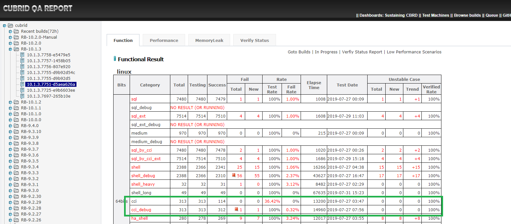
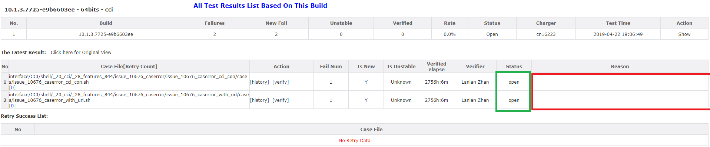

# 1. Test Objective
The cci test is aimed to test CUBRID CCI driver. We write cci test cases to test all kinds of CCI APIs, such as `cci_connect()`, `cci_connect_with_url()`, `cci_cursor()`, `cci_fetch()`, `cci_get_data()`, `cci_get_result_info()` and so on. Actually cci test is a branch of shell test, the only difference is that cci shell scripts must execute C codes which include CUBRID CCI API.


# 2. Execute CCI Test
To perform the cci test, we need to install CTP first.   
## 2.1 Install CTP
Please refer to the guide to [install CTP in Linux platform](https://github.com/CUBRID/cubrid-testtools/blob/develop/doc/ctp_install_guide.md#1-install-ctp-in-linux-platform).

Create cci test configuration file as below:    
File CTP/conf/cci.conf   
```    
scenario=$HOME/cubrid-testcases-private/interface/CCI/shell/_20_cci/_13_enhancement/cci_execute_batch     
```
>Note: `scenario` should be a path to a folder but not a file

## 2.2 Prepare test cases
Generally, we check out test cases from git repository. CCI test cases are located in https://github.com/CUBRID/cubrid-testcases-private/tree/develop/interface/CCI/shell. 
```bash
$ git clone https://github.com/CUBRID/cubrid-testcases-private.git
$ cd cubrid-testcases-private/interface/CCI/shell/_20_cci
$ ls
_01_simple  _03_func  _05_set   _07_query     _10_bigint  _12_issue        _14_1h_issue  _15_Cursor        _28_features_844
_02_adv     _04_db    _06_bind  _09_datetime  _11_other   _13_enhancement  _14_ENUM      _28_features_841  files    
```
## 2.3 Install CUBRID      
```bash    
run_cubrid_install http://192.168.1.91:8080/REPO_ROOT/store_01/10.2.0.8396-1bc28b2/drop/CUBRID-10.2.0.8396-1bc28b2-Linux.x86_64.sh    
```

## 2.4 Execute test     
```bash    
ctp.sh shell -c ./cci.conf    
```    
Screen output:    
Druing the test, CTP prints testing information like test configs, deploy status, test results, execution time and so on.      
```
$ ctp.sh shell -c ./cci.conf  

====================================== SHELL ==========================================
[SHELL] TEST STARTED (Tue Aug 13 18:32:30 KST 2019)

[SHELL] CONFIG FILE: /home/ccitest/CTP/conf/cci.conf

scenario=$HOME/cubrid-testcases-private/interface/CCI/shell/_20_cci/_13_enhancement/cci_execute_batch


----------END OF FILE----------
Available Env: [local]
Continue Mode: false
Build Number: 10.2.0.8396-1bc28b2
java.runtime.name=Java(TM) SE Runtime Environment
sun.boot.library.path=/usr/local/cubridqa/jdk1.8.0_201/jre/lib/amd64
java.vm.version=25.201-b09
java.vm.vendor=Oracle Corporation
java.vendor.url=http://java.oracle.com/
path.separator=:
java.vm.name=Java HotSpot(TM) 64-Bit Server VM
file.encoding.pkg=sun.io
user.country=US
sun.java.launcher=SUN_STANDARD
sun.os.patch.level=unknown
java.vm.specification.name=Java Virtual Machine Specification
user.dir=/home/ccitest/CTP/conf
java.runtime.version=1.8.0_201-b09
java.awt.graphicsenv=sun.awt.X11GraphicsEnvironment
java.endorsed.dirs=/usr/local/cubridqa/jdk1.8.0_201/jre/lib/endorsed
os.arch=amd64
java.io.tmpdir=/tmp
line.separator=

java.vm.specification.vendor=Oracle Corporation
os.name=Linux
sun.jnu.encoding=ISO-8859-1
java.library.path=/home/ccitest/CUBRID/lib:/usr/java/packages/lib/amd64:/usr/lib64:/lib64:/lib:/usr/lib
scenario=$HOME/cubrid-testcases-private/interface/CCI/shell/_20_cci/_13_enhancement/cci_execute_batch 
java.specification.name=Java Platform API Specification
java.class.version=52.0
sun.management.compiler=HotSpot 64-Bit Tiered Compilers
os.version=3.10.0-957.21.3.el7.x86_64
user.home=/home/ccitest
user.timezone=Asia/Seoul
java.awt.printerjob=sun.print.PSPrinterJob
file.encoding=ISO-8859-1
java.specification.version=1.8
user.name=ccitest
java.class.path=/home/ccitest/CTP/common/lib/cubridqa-common.jar
java.vm.specification.version=1.8
sun.arch.data.model=64
java.home=/usr/local/cubridqa/jdk1.8.0_201/jre
sun.java.command=com.navercorp.cubridqa.ctp.CTP shell -c ./cci_quick_start.conf
java.specification.vendor=Oracle Corporation
user.language=en
awt.toolkit=sun.awt.X11.XToolkit
java.vm.info=mixed mode
java.version=1.8.0_201
java.ext.dirs=/usr/local/cubridqa/jdk1.8.0_201/jre/lib/ext:/usr/java/packages/lib/ext
sun.boot.class.path=/usr/local/cubridqa/jdk1.8.0_201/jre/lib/resources.jar:/usr/local/cubridqa/jdk1.8.0_201/jre/lib/rt.jar:/usr/local/cubridqa/jdk1.8.0_201/jre/lib/sunrsasign.jar:/usr/local/cubridqa/jdk1.8.0_201/jre/lib/jsse.jar:/usr/local/cubridqa/jdk1.8.0_201/jre/lib/jce.jar:/usr/local/cubridqa/jdk1.8.0_201/jre/lib/charsets.jar:/usr/local/cubridqa/jdk1.8.0_201/jre/lib/jfr.jar:/usr/local/cubridqa/jdk1.8.0_201/jre/classes
java.vendor=Oracle Corporation
file.separator=/
java.vendor.url.bug=http://bugreport.sun.com/bugreport/
sun.cpu.endian=little
sun.io.unicode.encoding=UnicodeLittle
sun.rmi.transport.connectionTimeout=10000000
sun.cpu.isalist=
AUTO_TEST_VERSION=10.2.0.8396-1bc28b2
AUTO_TEST_BITS=64bits
BEGIN TO CHECK: 
=================== Check local============================
==> Check connection(ssh) ...... PASS
==> Check variable 'HOME' ...... PASS
==> Check variable 'USER' ...... PASS
==> Check variable 'JAVA_HOME' ...... PASS
==> Check variable 'CTP_HOME' ...... PASS
==> Check variable 'init_path' ...... PASS
==> Check variable 'CUBRID' ...... PASS
==> Check command 'java' ...... PASS
==> Check command 'javac' ...... PASS
==> Check command 'diff' ...... PASS
==> Check command 'wget' ...... PASS
==> Check command 'find' ...... PASS
==> Check command 'cat' ...... PASS
==> Check command 'kill' ...... PASS
==> Check command 'dos2unix' ...... PASS
==> Check command 'tar' ...... PASS
==> Check directory '${CTP_HOME}/bin' ...... PASS
==> Check directory '${CTP_HOME}/common/script' ...... PASS
==> Check directory 'cubrid-testcases-private/interface/CCI/shell/_20_cci/_13_enhancement/cci_execute_batch' ...... PASS

CHECK RESULT: PASS
============= UPDATE TEST CASES ==================
CLEAN PROCESSES:
++ cubrid service is not running.
UID        PID  PPID  C STIME TTY          TIME CMD
ccitest  23144 23143  0 18:31 pts/1    00:00:00 -bash
ccitest  24547 23144  0 18:32 pts/1    00:00:00 /bin/sh /home/ccitest/CTP/bin/ctp.sh shell -c ./cci_quick_start.conf
ccitest  24554 24547 50 18:32 pts/1    00:00:00 /usr/local/cubridqa/jdk1.8.0_201/bin/java -cp /home/ccitest/CTP/common/lib/cubridqa-common.jar com.navercorp.cubridqa.ctp.CTP shell -c ./cci_quick_start.conf
ccitest  24555 24547  0 18:32 pts/1    00:00:00 tee /home/ccitest/CTP/.output_2019081318321565688750.log
ccitest  24873 24554  3 18:32 pts/1    00:00:00 sh /tmp/.localexec316459764768233302.sh 2>&1
ccitest  25069 24873  0 18:32 pts/1    00:00:00 ps -u ccitest -f
ccitest  24554 24547 50 18:32 pts/1    00:00:00 /usr/local/cubridqa/jdk1.8.0_201/bin/java -cp /home/ccitest/CTP/common/lib/cubridqa-common.jar com.navercorp.cubridqa.ctp.CTP shell -c ./cci_quick_start.conf
ccitest  25071 24873  0 18:32 pts/1    00:00:00 grep --color=auto cub

------ Message Queues --------
key        msqid      owner      perms      used-bytes   messages    

------ Shared Memory Segments --------
key        shmid      owner      perms      bytes      nattch     status      

------ Semaphore Arrays --------
key        semid      owner      perms      nsems
EXPECT NOTHING FOR BELOW (local)
Above EnvId is local
SKIP TEST CASES UPDATE
DONE
============= FETCH TEST CASES ==================
Test Category:shell
The Number of Test Cases: 2 (macro skipped: 0, bug skipped: 0)
The Number of Test Case : 2
============= DEPLOY ==================
CLEAN PROCESSES:
++ cubrid service is not running.
UID        PID  PPID  C STIME TTY          TIME CMD
ccitest  23144 23143  0 18:31 pts/1    00:00:00 -bash
ccitest  24547 23144  0 18:32 pts/1    00:00:00 /bin/sh /home/ccitest/CTP/bin/ctp.sh shell -c ./cci_quick_start.conf
ccitest  24554 24547 27 18:32 pts/1    00:00:00 /usr/local/cubridqa/jdk1.8.0_201/bin/java -cp /home/ccitest/CTP/common/lib/cubridqa-common.jar com.navercorp.cubridqa.ctp.CTP shell -c ./cci_quick_start.conf
ccitest  24555 24547  0 18:32 pts/1    00:00:00 tee /home/ccitest/CTP/.output_2019081318321565688750.log
ccitest  25162 24554  2 18:32 pts/1    00:00:00 sh /tmp/.localexec2970484221793586929.sh 2>&1
ccitest  25358 25162  0 18:32 pts/1    00:00:00 ps -u ccitest -f
ccitest  24554 24547 27 18:32 pts/1    00:00:00 /usr/local/cubridqa/jdk1.8.0_201/bin/java -cp /home/ccitest/CTP/common/lib/cubridqa-common.jar com.navercorp.cubridqa.ctp.CTP shell -c ./cci_quick_start.conf
ccitest  25360 25162  0 18:32 pts/1    00:00:00 grep --color=auto cub

------ Message Queues --------
key        msqid      owner      perms      used-bytes   messages    

------ Shared Memory Segments --------
key        shmid      owner      perms      bytes      nattch     status      

------ Semaphore Arrays --------
key        semid      owner      perms      nsems
DONE
============= TEST ==================
[ENV START] local
STARTED
[TESTCASE] cubrid-testcases-private/interface/CCI/shell/_20_cci/_13_enhancement/cci_execute_batch/cci_execute_batch_01/cases/cci_execute_batch_01.sh EnvId=local [OK]
[TESTCASE] cubrid-testcases-private/interface/CCI/shell/_20_cci/_13_enhancement/cci_execute_batch/cci_execute_batch_02/cases/cci_execute_batch_02.sh EnvId=local [OK]
[ENV STOP] local
============= PRINT SUMMARY ==================
Test Category:shell
Total Case:2
Total Execution Case:2
Total Success Case:2
Total Fail Case:0
Total Skip Case:0

TEST COMPLETE
[SHELL] TEST END (Tue Aug 13 18:33:10 KST 2019)
[SHELL] ELAPSE TIME: 39 seconds
```
## 2.5 Examine test results
### Check test logs  
During the test, the test logs are generated to CTP/result/shell/current_runtime_logs, after test finish, current_runtime_logs will be backuped as a .tar.gz file.
```
$ cd ~/CTP/result/shell/
$ ls
current_runtime_logs  shell_result_10.2.0.8396-1bc28b2_64bits_0_2019.8.13_6.33.10.tar.gz
$ ls current_runtime_logs/
check_local.log  dispatch_tc_ALL.txt        feedback.log              monitor_local.log  test_local.log
current_task_id  dispatch_tc_FIN_local.txt  main_snapshot.properties  runtime.log        test_status.data
``` 
For more detail information, plesae refer to shell test guide.

### Check detail result for each case  
The results of each test case are generated to the same path with test cases.
```
$ cd $HOME/cubrid-testcases-private/interface/CCI/shell/_20_cci/_13_enhancement/cci_execute_batch
$ cd cci_execute_batch_01/cases
$ ls -l
total 24
-rw-r--r-- 1 ccitest ccitest  754 Aug 13 18:32 cci_execute_batch_01.answer
-rw-r--r-- 1 ccitest ccitest  754 Aug 13 18:32 cci_execute_batch_01.output
-rw-rw-r-- 1 ccitest ccitest   28 Aug 13 18:32 cci_execute_batch_01.result
-rw-r--r-- 1 ccitest ccitest  633 Aug 13 18:11 cci_execute_batch_01.sh
-rw-r--r-- 1 ccitest ccitest    0 Aug 13 18:32 listdrv
-rw-r--r-- 1 ccitest ccitest 6343 Aug 13 18:11 test.c
``` 
* The file which file name ended with `.result` record success or failure of the test case.
    ```bash
    $ cat cci_execute_batch_01.result
    cci_execute_batch_01-1 : OK
    ```
* The file which file name ended with `.output` is actual result of the test case.
    ```bash
    $ cat cci_execute_batch_01.output
    cci_set_autocommit
    negative of cci_set_autocommit

    negative of cci_get_autocommit
    test.c(82) - batch_01 ERROR : Invalid connection handle ( [0]) 

    test.c(88) - batch_01 ERROR : Invalid connection handle ( [0]) 

    autocommit: 0
    num_query=0 of cci_execute_batch()
    num_query<0 of cci_execute_batch()
    conn_handle is null in cci_execute_batch()
    test.c(122) - batch_01 ERROR : Invalid connection handle) 

    conn_handle is digit in cci_execute_batch()
    num_query< number_sql_stmts of cci_execute_batch()

    positive cases

    query_result: 0@0@1@1@1@1@

    negative of cci_end_tran()
    test.c(179) - batch_01 ERROR : Invalid transaction type argument) 

    test.c(185) - batch_01 ERROR : Invalid connection handle) 

    test.c(191) - batch_01 ERROR : Invalid connection handle) 
    ```
* The file which file name ended with `.answer` is expect result of the test case.
* Success or failure of the test case is obtained by comparing the .output file with the .answer file
    ```bash
    $ diff cci_execute_batch_01.output cci_execute_batch_01.answer -y
    cci_set_autocommit                                              cci_set_autocommit
    negative of cci_set_autocommit                                  negative of cci_set_autocommit

    negative of cci_get_autocommit                                  negative of cci_get_autocommit
    test.c(82) - batch_01 ERROR : Invalid connection handle ( [0]   test.c(82) - batch_01 ERROR : Invalid connection handle ( [0]

    test.c(88) - batch_01 ERROR : Invalid connection handle ( [0]   test.c(88) - batch_01 ERROR : Invalid connection handle ( [0]

    autocommit: 0                                                   autocommit: 0
    num_query=0 of cci_execute_batch()                              num_query=0 of cci_execute_batch()
    num_query<0 of cci_execute_batch()                              num_query<0 of cci_execute_batch()
    conn_handle is null in cci_execute_batch()                      conn_handle is null in cci_execute_batch()
    test.c(122) - batch_01 ERROR : Invalid connection handle)       test.c(122) - batch_01 ERROR : Invalid connection handle) 

    conn_handle is digit in cci_execute_batch()                     conn_handle is digit in cci_execute_batch()
    num_query< number_sql_stmts of cci_execute_batch()              num_query< number_sql_stmts of cci_execute_batch()

    positive cases                                                  positive cases

    query_result: 0@0@1@1@1@1@                                      query_result: 0@0@1@1@1@1@

    negative of cci_end_tran()                                      negative of cci_end_tran()
    test.c(179) - batch_01 ERROR : Invalid transaction type argum   test.c(179) - batch_01 ERROR : Invalid transaction type argum

    test.c(185) - batch_01 ERROR : Invalid connection handle)       test.c(185) - batch_01 ERROR : Invalid connection handle) 

    test.c(191) - batch_01 ERROR : Invalid connection handle)       test.c(191) - batch_01 ERROR : Invalid connection handle) 

    $ echo $?
    0
    ```
   If the .output file is different from .answer file, the result turns out NOK.

>Note: Other way of executing cci test case is as below:
```bash

#It's better to add below to .bash_profile
export init_path=$CTP_HOME/shell/init_path

cd /path/to/test case folder
sh issue_12530_cci.sh
```
or
```
~/CTP/shell/init_path/run_shell.sh --enable-report --report-cron='0 0 9,13,18 * * ?' --issue="http://jira.cubrid.org/browse/CBRD-xxxx"  --mailto="Someone<email address>" --mailcc="<CUBRIDQA DL email address>" --loop --update-build
```
You can refer to these sections of shell_heavy guide: [Execute one test case](shell_heavy_guide.md#25-execute-one-test-case) and [ Execute one test case repeatedly](shell_heavy_guide.md#26-execute-one-test-case-repeatedly).   


# 3. Deploy Regression Test Environment
## 3.1 Test Machines
**Controller node**: It listens to test messages and starts a test when there is a test message. It will distribute test cases to each test node for execution.  
**Test node**: It executes test cases.
For current daily regression test, controller node and test node are the same one.  
<table>
  <tr>
    <th>No.</th>
    <th>Role</th>
    <th>User Name</th>
    <th>IP</th>
    <th>Hostname</th>
  </tr>
   <tr>
    <th>1.</th>
    <th>Controller node and Test node</th>
    <th>cci</th>
    <th>192.168.1.78</th>
    <th>func03</th>
  </tr>
</table>

## 3.2 Deploy Test Environment
### On controller & test node
* Install CTP
  - Please refer to the guide to [install CTP as Regression Test platform](https://github.com/CUBRID/cubrid-testtools/blob/develop/doc/ctp_install_guide.md#3-install-ctp-as-regression-test-platform)
  - touch ~/CTP/conf/shell_template.conf     
    Here is the config file which we used for current daily cci regresion test: `shell_template.conf` 
    ```bash
    $ cat shell_template.conf 
    default.cubrid.cubrid_port_id=1568
    default.broker1.BROKER_PORT=30090
    default.broker1.APPL_SERVER_SHM_ID=30090
    default.broker2.BROKER_PORT=30091
    default.broker2.APPL_SERVER_SHM_ID=30091


    scenario=$HOME/cubrid-testcases-private/interface/CCI/shell/_20_cci
    test_continue_yn=false
    testcase_exclude_from_file=
    testcase_update_yn=true
    testcase_git_branch=develop
    testcase_timeout_in_secs=7200
    test_platform=linux
    test_category=cci
    testcase_exclude_by_macro=LINUX_NOT_SUPPORTED
    testcase_retry_num=0
    delete_testcase_after_each_execution_yn=false
    #enable_check_disk_space_yn=true
    #owner_email=Mandy<cuman@navercorp.com>

    git_user=cubridqa
    git_pwd=******
    git_email=dl_cubridqa_bj_internal@navercorp.com

    feedback_type=database
    feedback_notice_qahome_url=http://192.168.1.86:6060/qaresult/shellImportAction.nhn?main_id=<MAINID>
    feedback_db_host=192.168.1.86
    feedback_db_port=33080
    feedback_db_name=qaresu
    feedback_db_user=dba
    feedback_db_pwd=
    ``` 
* Create quick startup script `start_test.sh`
    ```bash
    $ cat start_test.sh
    #!/bin/sh
    cd $HOME
    stop_consumer.sh 
    cd $HOME/CTP/common/script
    sh upgrade.sh
    cd $HOME
    nohup ~/CTP/common/script/start_consumer.sh -q QUEUE_CUBRID_QA_CCI_LINUX -exec run_shell -s china &
    ```
* Check out test cases
    ```bash
    cd ~
    git clone https://github.com/CUBRID/cubrid-testcases-private.git 
    ```
* Install dependent packages   
  CCI test cases use `killall` command, if no such utility in your OS, please install it.
  
   ```bash
   yum install psmisc
   ```    
# 4. Regression Tests
We perform cci/cci_debug for daily (actually is for each build) and perform code coverage test of cci for monthly. cci_debug is executing CCI test cases with a debug build.

## 4.1 Daily Regresion Test
When a new build comes, cci daily regression test will start. We just need to make sure that test environment has no problem and listener has been started. Sometimes, in order to investigate or correct a test, we need to send messages manually.   
### Start the listener
```bash
$ cd ~
$ sh start_test.sh &
$ tail -f nohup.out
```
### Send test message
* To execute a cci test with release build      
   Login message@192.168.1.91
    ```bash
    sender.sh QUEUE_CUBRID_QA_CCI_LINUX http://192.168.1.91:8080/REPO_ROOT/store_01/10.2.0.8369-5a75e41/drop/CUBRID-10.2.0.8369-5a75e41-Linux.x86_64.sh cci default
    ```
* To execute a cci_debug test with debug build     
    Login message@192.168.1.91
    ```bash
    sender.sh QUEUE_CUBRID_QA_CCI_LINUX http://192.168.1.91:8080/REPO_ROOT/store_01/10.2.0.8369-5a75e41/drop/CUBRID-10.2.0.8369-5a75e41-Linux.x86_64-debug.sh cci_debug default
    ```
* For example, run a cci test on 10.2.0.8369-5a75e41 build, you need to send a message like below.   
    ```bash
    $ sender.sh QUEUE_CUBRID_QA_CCI_LINUX http://192.168.1.91:8080/REPO_ROOT/store_01/10.2.0.8369-5a75e41/drop/CUBRID-10.2.0.8369-5a75e41-Linux.x86_64.sh cci default

    Message: 

    Message Content: Test for build 10.2.0.8369-5a75e41 by CUBRID QA Team, China
    MSG_ID = 190814-174321-806-000001
    MSG_PRIORITY = 4
    BUILD_ABSOLUTE_PATH=/home/ci_build/REPO_ROOT/store_01/10.2.0.8369-5a75e41/drop
    BUILD_BIT=0
    BUILD_CREATE_TIME=1561143743000
    BUILD_GENERATE_MSG_WAY=MANUAL
    BUILD_ID=10.2.0.8369-5a75e41
    BUILD_IS_FROM_GIT=1
    BUILD_PACKAGE_PATTERN=CUBRID-{1}-Linux.x86_64.sh
    BUILD_SCENARIOS=cci
    BUILD_SCENARIO_BRANCH_GIT=develop
    BUILD_SEND_DELAY=4628458
    BUILD_SEND_TIME=1565772201805
    BUILD_STORE_ID=store_01
    BUILD_SVN_BRANCH=RB-10.2.0
    BUILD_SVN_BRANCH_NEW=RB-10.2.0
    BUILD_TYPE=general
    BUILD_URLS=http://192.168.1.91:8080/REPO_ROOT/store_01/10.2.0.8369-5a75e41/drop/CUBRID-10.2.0.8369-5a75e41-Linux.x86_64.sh
    BUILD_URLS_CNT=1
    BUILD_URLS_KR=http://192.168.1.91:8080/REPO_ROOT/store_01/10.2.0.8369-5a75e41/drop/CUBRID-10.2.0.8369-5a75e41-Linux.x86_64.sh


    Do you accept above message [Y/N]:
    Y
    log4j:WARN No appenders could be found for logger (org.apache.activemq.thread.TaskRunnerFactory).
    log4j:WARN Please initialize the log4j system properly.
    log4j:WARN See http://logging.apache.org/log4j/1.2/faq.html#noconfig for more info.
    ```
### Check running status
* Check log on controller node   
    Log into cci@192.168.1.78, check nohup.out log. The whole information for one test message is like below:
    ```bash
    $ cd ~
    $ tail -f nohup.out
    Action: QUEUE_CUBRID_QA_CCI_LINUX , run_shell.sh, GENERAL

    Log msg id into queue file!

    ++++++++ Message-190813-183615-446-000001 start at 2019-08-13 18:36:18 KST ++++++++
    Skip Disk Checking!

    ====================================== SHELL ==========================================
    [SHELL] TEST STARTED (Tue Aug 13 18:36:22 KST 2019)

    [SHELL] CONFIG FILE: /home/cci/CTP/conf/shell_runtime.conf

    testcase_timeout_in_secs=7200
    default.cubrid.cubrid_port_id=1568
    test_continue_yn=false
    default.broker2.BROKER_PORT=30091
    default.broker1.BROKER_PORT=30090
    scenario=$HOME/cubrid-testcases-private/interface/CCI/shell/_20_cci
    feedback_db_pwd=
    testcase_update_yn=true
    feedback_db_user=dba
    cubrid_download_url=http://192.168.1.91:8080/REPO_ROOT/store_01/10.2.0.8397-b7728a8/drop/CUBRID-10.2.0.8397-b7728a8-Linux.x86_64-debug.sh
    git_email=dl_cubridqa_bj_internal@navercorp.com
    default.broker1.APPL_SERVER_SHM_ID=30090
    default.broker2.APPL_SERVER_SHM_ID=30091
    test_platform=linux
    feedback_db_port=33080
    git_pwd=********
    feedback_type=database
    feedback_db_host=192.168.1.86
    testcase_exclude_by_macro=LINUX_NOT_SUPPORTED
    feedback_notice_qahome_url=http://192.168.1.86:6060/qaresult/shellImportAction.nhn?main_id=<MAINID>
    git_user=cubridqa
    testcase_exclude_from_file=
    delete_testcase_after_each_execution_yn=false
    testcase_git_branch=develop
    testcase_git_branch=develop
    testcase_retry_num=0
    feedback_db_name=qaresu
    test_category=cci_debug


    ----------END OF FILE----------
    Available Env: [local]
    Continue Mode: false
    Test Build: http://192.168.1.91:8080/REPO_ROOT/store_01/10.2.0.8397-b7728a8/drop/CUBRID-10.2.0.8397-b7728a8-Linux.x86_64-debug.sh
    Build Number: 10.2.0.8397-b7728a8
    java.vendor=Oracle Corporation
    testcase_git_branch=develop
    sun.java.launcher=SUN_STANDARD
    sun.management.compiler=HotSpot 64-Bit Tiered Compilers
    cubrid_download_url=http://192.168.1.91:8080/REPO_ROOT/store_01/10.2.0.8397-b7728a8/drop/CUBRID-10.2.0.8397-b7728a8-Linux.x86_64-debug.sh
    os.name=Linux
    sun.boot.class.path=/usr/local/cubridqa/jdk1.8.0_201/jre/lib/resources.jar:/usr/local/cubridqa/jdk1.8.0_201/jre/lib/rt.jar:/usr/local/cubridq
    a/jdk1.8.0_201/jre/lib/sunrsasign.jar:/usr/local/cubridqa/jdk1.8.0_201/jre/lib/jsse.jar:/usr/local/cubridqa/jdk1.8.0_201/jre/lib/jce.jar:/usr
    /local/cubridqa/jdk1.8.0_201/jre/lib/charsets.jar:/usr/local/cubridqa/jdk1.8.0_201/jre/lib/jfr.jar:/usr/local/cubridqa/jdk1.8.0_201/jre/class
    es
    java.vm.specification.vendor=Oracle Corporation
    java.runtime.version=1.8.0_201-b09
    testcase_timeout_in_secs=7200
    user.name=cci
    feedback_db_host=192.168.1.86
    git_pwd=********
    testcase_update_yn=true
    user.language=en
    sun.rmi.transport.connectionTimeout=10000000
    sun.boot.library.path=/usr/local/cubridqa/jdk1.8.0_201/jre/lib/amd64
    default.broker2.APPL_SERVER_SHM_ID=30091
    default.broker1.APPL_SERVER_SHM_ID=30090
    java.version=1.8.0_201
    user.timezone=Asia/Seoul
    sun.arch.data.model=64
    java.endorsed.dirs=/usr/local/cubridqa/jdk1.8.0_201/jre/lib/endorsed
    sun.cpu.isalist=
    sun.jnu.encoding=ISO-8859-1
    file.encoding.pkg=sun.io
    file.separator=/
    java.specification.name=Java Platform API Specification
    java.class.version=52.0
    ...
    BEGIN TO CHECK:
    =================== Check local============================
    ==> Check connection(ssh) ...... PASS
    ==> Check variable 'HOME' ...... PASS
    ==> Check variable 'USER' ...... PASS
    ==> Check variable 'JAVA_HOME' ...... PASS
    ==> Check variable 'CTP_HOME' ...... PASS
    ==> Check variable 'init_path' ...... PASS
    ==> Check variable 'CUBRID' ...... PASS
    ==> Check command 'java' ...... PASS
    ==> Check command 'javac' ...... PASS
    ==> Check command 'diff' ...... PASS
    ==> Check command 'wget' ...... PASS
    ==> Check command 'find' ...... PASS
    ==> Check command 'cat' ...... PASS
    ==> Check command 'kill' ...... PASS
    ==> Check command 'dos2unix' ...... PASS
    ==> Check command 'tar' ...... PASS
    ==> Check command 'git' ...... PASS
    ==> Check directory '${CTP_HOME}/bin' ...... PASS
    ==> Check directory '${CTP_HOME}/common/script' ...... PASS
    ==> Check directory 'cubrid-testcases-private/interface/CCI/shell/_20_cci' ...... PASS

    CHECK RESULT: PASS
    ============= UPDATE TEST CASES ==================
    UPDATE TEST CASES START: EnvId=local[local] with ssh protocol!
    CLEAN PROCESSES:
    ++ cubrid service is not running.
    UID        PID  PPID  C STIME TTY          TIME CMD
    cci        618 32764  0 18:36 ?        00:00:00 /bin/sh /home/cci/CTP/bin/ctp.sh shell -c /home/cci/CTP/conf/shell_runtime.conf
    cci        619 32764  0 18:36 ?        00:00:00 tee /home/cci/CTP/result/shell/current_runtime_logs/runtime.log
    cci        626   618 40 18:36 ?        00:00:00 /usr/local/cubridqa/jdk1.8.0_201/bin/java -cp /home/cci/CTP/common/lib/cubridqa-common.jar co
    m.navercorp.cubridqa.ctp.CTP shell -c /home/cci/CTP/conf/shell_runtime.conf
    cci        627   618  0 18:36 ?        00:00:00 tee /home/cci/CTP/.output_2019081318361565688981.log
    cci        974   626  4 18:36 ?        00:00:00 sh /tmp/.localexec9210708576223962006.sh 2>&1
    cci       1181   974  0 18:36 ?        00:00:00 ps -u cci -f
    cci       4235     1  0 Aug12 ?        00:00:58 /bin/bash /home/cci/CTP/common/script/start_consumer.sh -q QUEUE_CUBRID_QA_CCI_LINUX -exec ru
    n_shell -s china
    cci      29536 29528  0 17:04 ?        00:00:00 sshd: cci@pts/0
    cci      29537 29536  0 17:04 pts/0    00:00:00 -bash
    cci      30772 29537  0 18:35 pts/0    00:00:00 tail -f nohup.out
    cci      32506  4235  0 18:36 ?        00:00:00 /bin/bash /home/cci/CTP/common/script/start_consumer.sh -q QUEUE_CUBRID_QA_CCI_LINUX -exec ru
    n_shell -s china
    cci      32764 32506  0 18:36 ?        00:00:00 sh common/ext/run_shell.sh
    cci        626   618 40 18:36 ?        00:00:00 /usr/local/cubridqa/jdk1.8.0_201/bin/java -cp /home/cci/CTP/common/lib/cubridqa-common.jar co
    m.navercorp.cubridqa.ctp.CTP shell -c /home/cci/CTP/conf/shell_runtime.conf
    cci       1183   974  0 18:36 ?        00:00:00 grep --color=auto cub

    ------ Message Queues --------
    key        msqid      owner      perms      used-bytes   messages

    ------ Shared Memory Segments --------
    key        shmid      owner      perms      bytes      nattch     status

    ------ Semaphore Arrays --------
    key        semid      owner      perms      nsems
    Test cases updated results on local:
    ====Start to do update!====
    Removing _01_simple/_01_stest1/cases/_01_stest1.output
    Removing _01_simple/_01_stest1/cases/_01_stest1.result
    Removing _01_simple/_01_stest1/cases/listdrv
    Removing _01_simple/_01_stest1/cases/test
    ...
    Removing _28_features_841/issue_12530_logintime/issue_12530_logintime_cg_pro_incor_scen/cases/listdrv
    Removing _28_features_841/issue_12530_logintime/issue_12530_logintime_set_lg_cor/cases/issue_12530_logintime_set_lg_cor.result
    Removing _28_features_841/issue_12530_logintime/issue_12530_logintime_set_lg_cor/cases/listdrv
    Removing _28_features_844/issue_10676_caserror/issue_10676_caserror_cci_con/cases/csql.err
    Removing _28_features_844/issue_10676_caserror/issue_10676_caserror_cci_con/cases/issue_10676_caserror_cci_con.output
    Removing _28_features_844/issue_10676_caserror/issue_10676_caserror_cci_con/cases/issue_10676_caserror_cci_con.result
    Removing _28_features_844/issue_10676_caserror/issue_10676_caserror_with_url/cases/csql.err
    Removing _28_features_844/issue_10676_caserror/issue_10676_caserror_with_url/cases/issue_10676_caserror_with_url.output
    Removing _28_features_844/issue_10676_caserror/issue_10676_caserror_with_url/cases/issue_10676_caserror_with_url.result
    Removing _28_features_844/issue_10676_caserror/issue_10676_caserror_with_url/cases/listdrv
    Removing _28_features_844/issue_10676_caserror/issue_10676_caserror_with_url/cases/tmp.file
    Deleted branch develop (was a75f7da).
    From https://github.com/CUBRID/cubrid-testcases-private
    * [new branch]      develop    -> auto_update_url/develop
    * [new branch]      master     -> auto_update_url/master
    * [new branch]      memorycheck -> auto_update_url/memorycheck
    * [new branch]      release/10.0 -> auto_update_url/release/10.0
    * [new branch]      release/10.1 -> auto_update_url/release/10.1
    * [new branch]      revert-878-201903121822 -> auto_update_url/revert-878-201903121822
    * [new branch]      rqg_refactor -> auto_update_url/rqg_refactor
    Begin to check out test cases:
    git checkout -f -b develop -t auto_update_url/develop
    Branch develop set up to track remote branch develop from auto_update_url.
    Deleted branch temp_branch_2019081318361565688984 (was a75f7da).
    GIT REPO STATUS:
    * develop
    release_10.1
    ====End to do update!====
    UPDATE TEST CASES COMPLETE !
    UPDATE TEST CASES STOP: EnvId=local[local] with ssh protocol!
    DONE
    ============= FETCH TEST CASES ==================
    The Number of Test Case : 320
    ============= DEPLOY ==================
    DEPLAY START: EnvId=local[local]
    CLEAN PROCESSES:
    ++ cubrid service is not running.
    UID        PID  PPID  C STIME TTY          TIME CMD
    cci        618 32764  0 18:36 ?        00:00:00 /bin/sh /home/cci/CTP/bin/ctp.sh shell -c /home/cci/CTP/conf/shell_runtime.conf
    cci        619 32764  0 18:36 ?        00:00:00 tee /home/cci/CTP/result/shell/current_runtime_logs/runtime.log
    cci        626   618 13 18:36 ?        00:00:00 /usr/local/cubridqa/jdk1.8.0_201/bin/java -cp /home/cci/CTP/common/lib/cubridqa-common.jar co
    m.navercorp.cubridqa.ctp.CTP shell -c /home/cci/CTP/conf/shell_runtime.conf
    cci        627   618  0 18:36 ?        00:00:00 tee /home/cci/CTP/.output_2019081318361565688981.log
    cci       2178   626  0 18:36 ?        00:00:00 sh /tmp/.localexec6619783813575580002.sh 2>&1
    cci       2376  2178  0 18:36 ?        00:00:00 ps -u cci -f
    cci       4235     1  0 Aug12 ?        00:00:58 /bin/bash /home/cci/CTP/common/script/start_consumer.sh -q QUEUE_CUBRID_QA_CCI_LINUX -exec ru
    n_shell -s china
    cci      29536 29528  0 17:04 ?        00:00:00 sshd: cci@pts/0
    cci      29537 29536  0 17:04 pts/0    00:00:00 -bash
    cci      30772 29537  0 18:35 pts/0    00:00:00 tail -f nohup.out
    cci      32506  4235  0 18:36 ?        00:00:00 /bin/bash /home/cci/CTP/common/script/start_consumer.sh -q QUEUE_CUBRID_QA_CCI_LINUX -exec ru
    n_shell -s china
    cci      32764 32506  0 18:36 ?        00:00:00 sh common/ext/run_shell.sh
    cci        626   618 13 18:36 ?        00:00:00 /usr/local/cubridqa/jdk1.8.0_201/bin/java -cp /home/cci/CTP/common/lib/cubridqa-common.jar co
    m.navercorp.cubridqa.ctp.CTP shell -c /home/cci/CTP/conf/shell_runtime.conf
    cci       2378  2178  0 18:36 ?        00:00:00 grep --color=auto cub

    ------ Message Queues --------
    key        msqid      owner      perms      used-bytes   messages

    ------ Shared Memory Segments --------
    key        shmid      owner      perms      bytes      nattch     status

    ------ Semaphore Arrays --------
    key        semid      owner      perms      nsems
    DEPLAY STOP: EnvId=local[local]
    DONE
    ============= TEST ==================
    [ENV START] local
    STARTED
    [TESTCASE] cubrid-testcases-private/interface/CCI/shell/_20_cci/_01_simple/_01_stest1/cases/_01_stest1.sh EnvId=local [OK]
    [TESTCASE] cubrid-testcases-private/interface/CCI/shell/_20_cci/_01_simple/_01_thread/cases/_01_thread.sh EnvId=local [OK]
    [TESTCASE] cubrid-testcases-private/interface/CCI/shell/_20_cci/_01_simple/_02_stest2/cases/_02_stest2.sh EnvId=local [OK]
    [TESTCASE] cubrid-testcases-private/interface/CCI/shell/_20_cci/_01_simple/_03_stest3/cases/_03_stest3.sh EnvId=local [OK]
    ...
    [TESTCASE] cubrid-testcases-private/interface/CCI/shell/_20_cci/_15_Cursor/_03_on_prepare/_11/cases/_11.sh EnvId=local [OK]
    [TESTCASE] cubrid-testcases-private/interface/CCI/shell/_20_cci/_15_Cursor/_04_close_cursor/_01/cases/_01.sh EnvId=local [OK]
    [TESTCASE] cubrid-testcases-private/interface/CCI/shell/_20_cci/_15_Cursor/_04_close_cursor/_02/cases/_02.sh EnvId=local [OK]
    [TESTCASE] cubrid-testcases-private/interface/CCI/shell/_20_cci/_15_Cursor/_04_close_cursor/_03/cases/_03.sh EnvId=local [OK]
    [TESTCASE] cubrid-testcases-private/interface/CCI/shell/_20_cci/_28_features_841/issue_12530_logintime/issue_12530_logintime_cg_pro_cor/cases
    /issue_12530_logintime_cg_pro_cor.sh EnvId=local [OK]
    [TESTCASE] cubrid-testcases-private/interface/CCI/shell/_20_cci/_28_features_841/issue_12530_logintime/issue_12530_logintime_cg_pro_incor/cas
    es/issue_12530_logintime_cg_pro_incor.sh EnvId=local [OK]
    [TESTCASE] cubrid-testcases-private/interface/CCI/shell/_20_cci/_28_features_841/issue_12530_logintime/issue_12530_logintime_cg_pro_incor_sce
    n/cases/issue_12530_logintime_cg_pro_incor_scen.sh EnvId=local [OK]
    [TESTCASE] cubrid-testcases-private/interface/CCI/shell/_20_cci/_28_features_841/issue_12530_logintime/issue_12530_logintime_set_lg_cor/cases
    /issue_12530_logintime_set_lg_cor.sh EnvId=local [OK]
    [TESTCASE] cubrid-testcases-private/interface/CCI/shell/_20_cci/_28_features_844/issue_10676_caserror/issue_10676_caserror_cci_con/cases/issu
    e_10676_caserror_cci_con.sh EnvId=local [OK]
    [TESTCASE] cubrid-testcases-private/interface/CCI/shell/_20_cci/_28_features_844/issue_10676_caserror/issue_10676_caserror_with_url/cases/iss
    ue_10676_caserror_with_url.sh EnvId=local [OK]
    [ENV STOP] local
    Success num: 320, Fail_num: 0, Skipped(macro): 0, Skipped(temp): 0, Total Scenario: 320
    Test Rate: 100.0%
    Success Rate: 100.0%
    log4j:WARN No appenders could be found for logger (org.apache.http.impl.conn.BasicClientConnectionManager).
    log4j:WARN Please initialize the log4j system properly.
    log4j:WARN See http://logging.apache.org/log4j/1.2/faq.html#noconfig for more info.
    The Import Url = http://192.168.1.86:6060/qaresult/shellImportAction.nhn?main_id=22441
    #Status: [Success] Data Import Complete! srcId=22441
    TEST COMPLETE
    [SHELL] TEST END (Tue Aug 13 23:26:18 KST 2019)
    [SHELL] ELAPSE TIME: 17396 seconds
    /home/cci/CTP
    ++++++++ Message-190813-183615-446-000001 stop at 2019-08-13 23:26:19 KST ++++++++

    Clean msg id from queue file
    END_TIME:2019-08-13 23:26:19 KST
    ```
* Check queue on [qahome page](http://qahome.cubrid.org/qaresult)    
  Please find queue monitor by `QA homepage` -> `Left tree menu` -> `Monitor` -> `Check queue`. You may see cci item and find what test is running.   

### Verify cci/cci_debug test result
* ### Check test results
If cci/cci_debug are not tested completely, you need to send a message to test it again, you can check the value of `Test Rate` or check executed cases(success cases plus fail cases). If there are failures, you need to verify them. When there is crash, the fail will be marked with red alert icon.   

Open [qahome](http://qahome.cubrid.org/qaresult)->select `build number`->select `Functions` page ->find `cci/cci_debug` item

Above cci_debug test has failure: one test case executed failed, and it has core, you need to investigate it.   


Below cci/cci_debug are tested completely(`Test Rate` is 100%, `Fail Rate` is 0%) and there are no failure(`Fail` is 0).  


 For cci/cci_debug in `Functions` page, we need to check all the column values. The most important check items are:
 
a. Whether the test is completed ('Test Rate' column). 

b. How many cases are failed('Fail' columns,include total and new columns). 

c. The elapse time of the test ('Elapse Time' column). The elapse time of this test should not be longer than the previous build too much.

* ### Check failure list, verify failed cases
Click the number of fail,you can enter into the failure list    
1. All failed test cases in list are not be verified   


2. All failed test cases in list have been verified   


3. How to verify the failure     
Please find reason of this case executed failed, you can refer to [failure detail page](#check-failure-detail) or reproduce it again.    
Click `[verify]` link to open verification page. In verification page, you may choose one kind of reasons among `revise required / test case / environment / bugs / unknown`. And give detail information in fields `Reason content`, `New issues` or `Revise required issues`.    
`New issues` : It is link to a jira issue which reported by this case   
`Revise required issues`: It is link to a jira issue which lead to change in test case and answer   

When we judge the type of reason for failure is bug, we must fill in CUBRID jira issues.   
When we judge the type of reason for failure is revise required, we need to fill in related jira issues.   
Other failures  maybe caused by test case or environment(eg: execute time are different on machines, test case is unstable which need be enhanced)    


* ### Check failure detail 
Each failed test case has own detail page, for example:   
1. click [interface/CCI/shell/_20_cci/_14_ENUM/_02_bind/cases/_02_bind.sh](
http://qahome.cubrid.org/qaresult/showfile.nhn?treeId=&level=&summaryName=&catPath=&name=&m=showCaseFile&statid=22260&itemid=2144516&tc=cci_debug&buildId=10.1.3.7751-d5aea626a&filePath=interface%2FCCI%2Fshell%2F_20_cci%2F_14_ENUM%2F_02_bind%2Fcases%2F_02_bind.sh&isNew=&isSuccessFul=false) in failure list

2. check left `Case` and right `Running Log` ,you will find what happend. It also show current test case link to github
    **failure detail page:**
    
    

    **case:** 
    ```bash
    #!/bin/bash
    . $init_path/init.sh
    init test

    db=db02
    mkdir $db
    cd $db
    cubrid_createdb --db-volume-size=20M $db
    cubrid server start $db
    cd ..

    MODE=
    is32bit=`file ${CUBRID}/bin/cubrid | grep "ELF 32-bit" | wc -l`
    if [ $is32bit -eq 1 ]
    then
    MODE=-m32
    fi

    #compile source code
    xgcc -I${CUBRID}/include -L${CUBRID}/lib -lcascci ${MODE}  -o test test.c
    xgcc -I${CUBRID}/include -L${CUBRID}/lib -lcascci ${MODE}  -o test2 test2.c
    xgcc -I${CUBRID}/include -L${CUBRID}/lib -lcascci ${MODE}  -o test3 test3.c
    xgcc -I${CUBRID}/include -L${CUBRID}/lib -lcascci ${MODE}  -o test4 test4.c
    xgcc -I${CUBRID}/include -L${CUBRID}/lib -lcascci ${MODE}  -o test5 test5.c

    cubrid broker start
    port=`cubrid broker status -b | grep broker1 | awk '{print $4}'`

    output_file=${case_name}.output
    echo "#####test#####" >$output_file
    ./test $port $db>> $output_file
    echo "#####test2#####" >>$output_file
    ./test2 $port $db>> $output_file
    echo "#####test3#####" >>$output_file
    ./test3 $port $db>> $output_file
    echo "#####test4#####" >>$output_file
    ./test4 $port $db>> $output_file
    echo "#####test5#####" >>$output_file
    ./test5 $port $db>> $output_file


    cas_info_replace "${case_name}.answer"
    cas_info_replace "${output_file}"
    compare_result_between_files ${output_file} ${case_name}.answer

    cubrid server stop $db
    cubrid deletedb $db
    rm -rf $db lob
    rm test test2 test3 test4 test5
    finish
    ```

    **running log:**
    ```bash
    ...
    + cubrid broker start
    @ cubrid broker start
    @ cubrid broker start
    @ cubrid broker start
    ++ cubrid broker start: success
    ++ cubrid broker status -b
    ++ grep broker1
    ++ awk '{print $4}'
    + port=30091
    + output_file=_02_bind.output
    + echo '#####test#####'
    + ./test 30091 db02
    + echo '#####test2#####'
    + ./test2 30091 db02
    + echo '#####test3#####'
    + ./test3 30091 db02
    + echo '#####test4#####'
    + ./test4 30091 db02
    + echo '#####test5#####'
    + ./test5 30091 db02
    broker1_cub_cas_1: /home/jenkins/workspace/cubrid_release_10.1/src/object/object_primitive.c:11108: mr_setval_string: Assertion `!db_value_is_corrupted (src)' failed.
    ...
    ```
    Above told us that when execute `./test5 30091 db02` ,the cubrid broker appears crash.
 

    ```bash
    ...
    + diff _02_bind.output _02_bind.answer -b
    175c175
    < test5.c(269) - main ERROR : (Cannot communicate with server)Cannot communicate with server [-20004] 
    ---
    > test5.c(269) - main ERROR : (CUBRID DBMS Error)Cannot coerce value of domain "character varying" to domain "enum". [-181] 
    177c177
    < test5.c(241) - main ERROR : (Cannot communicate with server -20004)Cannot communicate with server [-20004] 
    ---
    > test5.c(269) - main ERROR : (CUBRID DBMS Error)Cannot coerce value of domain "character varying" to domain "enum". [-181] 
    179c179
    < test5.c(251) - main ERROR : (Cannot allocate request handle -20018)Cannot communicate with server [-20004] 
    ---
    > test5.c(269) - main ERROR : (CUBRID DBMS Error)Cannot coerce value of domain "character varying" to domain "enum". [-181] 
    181,185d180
    < test5.c(261) - main ERROR : (Cannot allocate request handle -20018)Cannot communicate with server [-20004] 
    < 
    < test5.c(269) - main ERROR : (Cannot allocate request handle)Cannot allocate request handle [-20018] 
    < 
    < test5.c(276) - main ERROR : Cannot allocate request handle (Cannot allocate request handle[-20018])
    186a182,203
    > sql:select * from enum02
    > 1-row-1-column:1
    > 1-row-2-column:
    > 1-row-3-column:Yes
    > 2-row-1-column:2
    > 2-row-2-column:Tuesday
    > 2-row-3-column:Yes
    > test5.c(321) - main ERROR : (CUBRID DBMS Error)Cannot coerce value of domain "integer" to domain "enum". [-181] 
    > 
    > test5.c(321) - main ERROR : (CUBRID DBMS Error)Cannot coerce value of domain "integer" to domain "enum". [-181] 
    > 
    > 
    > sql:select * from enum02
    > 1-row-1-column:1
    > 1-row-2-column:
    > 1-row-3-column:Yes
    > 2-row-1-column:2
    > 2-row-2-column:Tuesday
    > 2-row-3-column:Yes
    > 3-row-1-column:3
    > 3-row-2-column:Monday
    > 3-row-3-column:Yes
    + write_nok
    + '[' -z '' ']'
    + echo '----------------- 1 : NOK'
    ----------------- 1 : NOK
    + echo '_02_bind-1 : NOK'
    ...
    ```   
    Above told us that result of this case is nok by comparing actual result `_02_bind.output` with expect result `_02_bind.answer`, command is `diff _02_bind.output _02_bind.answer`

## 4.2 Code Coverage Test
### Send test message
login message@192.168.1.91
```bash
cd ~/manual/
sh sender_code_coverage_testing_message.sh QUEUE_CUBRID_QA_CCI_LINUX http://192.168.1.91:8080/REPO_ROOT/store_01/10.2.0.8362-fbf9d84/drop/CUBRID-10.2.0.8362-fbf9d84-gcov-Linux.x86_64.tar.gz http://192.168.1.91:8080/REPO_ROOT/store_01/10.2.0.8362-fbf9d84/drop/cubrid-10.2.0.8362-fbf9d84-gcov-src-Linux.x86_64.tar.gz cci
```
>Note: 
`$ sh sender_code_coverage_testing_message.sh`    
`Usage: sh  sender_code_coverage_testing_message queue url1 url2 category`    
`Queue:$1`   
`Build URL:$2`   
`Source URL:$3`   
`Category:$4 `  

### Check running status
Please see [Check running status](#check-running-status)
### Verify code coverage test result
1. Click `qahome`->`code coverage`->select `latest year,eg:2019` to get the summary

2. Click `cubrid` to get the details for all kinds of test,eg: cci,shell

3. Click `cci` to get the cci code coverage

We need check the value of `lines`, it is 33.9% on above graph, we need compare this result with last test. Code coverage should not drop too much. For cci, it stays around 33%.  

# 5. CCI Test Case
## 5.1 Writing specification of test case
## Test cases path
1. new feature path    
for example: cubrid-testcases-private/interface/CCI/shell/_20_cci/_28_features_841    
     _28_features_841: it show us the features for 8.4.1    
    ```
    $ ls _28_features_841
    issue_12530_logintime
    $ ls _28_features_841/issue_12530_logintime/
    issue_12530_logintime_cg_pro_cor    issue_12530_logintime_cg_pro_incor_scen
    issue_12530_logintime_cg_pro_incor  issue_12530_logintime_set_lg_cor
    $ ls _28_features_841/issue_12530_logintime/issue_12530_logintime_cg_pro_cor/
    cases
    $ ls _28_features_841/issue_12530_logintime/issue_12530_logintime_cg_pro_cor/cases/
    issue_12530_logintime_cg_pro_cor.answer  issue_12530_logintime_cg_pro_cor.sh  test.c
    $ 
    ``` 
2. cases added for jira issues    
We create a folder based on issue number   
bug_bts_12616 maps to CUBRIDSUS-12616   
cbrd_12616 maps to CBRD-12616    
    ```
    $ cd _12_issue/
    $ ls
    bug_bts_10310  bug_bts_12616  bug_bts_14333  bug_bts_5781  bug_bts_7159  bug_bts_7538  bug_bts_7910  bug_bts_8691  bug_bts_9043
    bug_bts_10435  bug_bts_12817  bug_bts_14377  bug_bts_5810  bug_bts_7167  bug_bts_7575  bug_bts_7941  bug_bts_8693  bug_bts_9262
    bug_bts_10485  bug_bts_13009  bug_bts_15089  bug_bts_5923  bug_bts_7174  bug_bts_7576  bug_bts_8102  bug_bts_8726  bug_bts_9269
    bug_bts_10603  bug_bts_13011  bug_bts_15174  bug_bts_6781  bug_bts_7178  bug_bts_7581  bug_bts_8104  bug_bts_8764  bug_bts_9351
    bug_bts_10817  bug_bts_13144  bug_bts_15223  bug_bts_6804  bug_bts_7191  bug_bts_7606  bug_bts_8106  bug_bts_8796  bug_bts_9397
    bug_bts_10822  bug_bts_13298  bug_bts_15340  bug_bts_6897  bug_bts_7207  bug_bts_7667  bug_bts_8182  bug_bts_8800  bug_bts_9435
    bug_bts_10840  bug_bts_13544  bug_bts_17300  bug_bts_6925  bug_bts_7226  bug_bts_7675  bug_bts_8318  bug_bts_8855  bug_bts_9586
    bug_bts_11171  bug_bts_13576  bug_bts_4077   bug_bts_6958  bug_bts_7227  bug_bts_7683  bug_bts_8383  bug_bts_8856  bug_cubridsus2771
    bug_bts_11542  bug_bts_13581  bug_bts_5253   bug_bts_6967  bug_bts_7306  bug_bts_7716  bug_bts_8508  bug_bts_8915
    bug_bts_11547  bug_bts_14019  bug_bts_5534   bug_bts_6968  bug_bts_7455  bug_bts_7734  bug_bts_8617  bug_bts_8940
    bug_bts_12584  bug_bts_14026  bug_bts_5633   bug_bts_7047  bug_bts_7516  bug_bts_7832  bug_bts_8675  bug_bts_9042
    ```
## Test case template
The cci test case is similar with the shell test case    
please see [shell guide](https://github.com/CUBRID/cubrid-testtools/blob/9682453b59344850b51385628bf8718bf27393e1/doc/shell/shell_guide.md#72-shell-case-template)     
Compared to the shell, the code we need to add is like below: 
```bash
xgcc -o test test.c
./test $port
```

## function in `init.sh`
Please refer to [shell guide](https://github.com/CUBRID/cubrid-testtools/blob/9682453b59344850b51385628bf8718bf27393e1/doc/shell/shell_guide.md#74-functions-in-initsh)      
The most commonly used function is [xgcc](https://github.com/CUBRID/cubrid-testtools/blob/9682453b59344850b51385628bf8718bf27393e1/doc/shell/shell_guide.md#xgcc).
for example:
```
xgcc -g -o test test.c -I${CUBRID}/include -L${CUBRID}/lib -lcascci 
xgcc -o test test.c -I${CUBRID}/include -L${CUBRID}/lib -lcascci ${MODE}
xgcc -g -o test bts12425.c
xgcc -o testbug9351 *.cpp -I${CUBRID}/include -L${CUBRID}/lib -lcascci ${MODE} -lstdc++
```

## Write .C file
### Common steps
1. include .h file  
`cas_cci.h`, `stdio.h` and so on  
2. define variables   
`user`,`port`,`query`, `database_name` and so on   
3. write main function or other functions   
    ```
    int main()
    {
        //main code, it should include the CCI API execution code
    }
    ```
4. CCI API execution code   
    ```
    con=cci_connect(...)
    if (con < 0)
    {
        //print erro information
    }
    req = cci_prepare (con, query, 0, &cci_error);
    if (req < 0)
    {
        //print erro information
    }
    error = cci_execute (req, 0, 0, &cci_error);
    if (error < 0)
    {
    //print erro information
    } 
    ```
### C file example
```C
// Example to execute a simple query
// In Linux: gcc -o simple simple.c -m64 -I${CUBRID}/include -lnsl ${CUBRID}/lib/libcascci.so -lpthread

#include <stdio.h>
#include "cas_cci.h"
#define BUFSIZE  (1024)

int
main (void)
{
    int con = 0, req = 0, col_count = 0, i, ind;
    int error;
    char *data;
    T_CCI_ERROR cci_error;
    T_CCI_COL_INFO *col_info;
    T_CCI_CUBRID_STMT stmt_type;
    char *query = "select * from code";

    //getting a connection handle for a connection with a server
    con = cci_connect ("localhost", 33000, "demodb", "dba", "");
    if (con < 0)
    {
        printf ("cannot connect to database\n");
        return 1;
    }

    //preparing the SQL statement
    req = cci_prepare (con, query, 0, &cci_error);
    if (req < 0)
    {
        printf ("prepare error: %d, %s\n", cci_error.err_code,
                cci_error.err_msg);
        goto handle_error;
    }

    //getting column information when the prepared statement is the SELECT query
    col_info = cci_get_result_info (req, &stmt_type, &col_count);
    if (col_info == NULL)
    {
        printf ("get_result_info error: %d, %s\n", cci_error.err_code,
                cci_error.err_msg);
        goto handle_error;
    }

    //Executing the prepared SQL statement
    error = cci_execute (req, 0, 0, &cci_error);
    if (error < 0)
    {
        printf ("execute error: %d, %s\n", cci_error.err_code,
                cci_error.err_msg);
        goto handle_error;
    }
    while (1)
    {

        //Moving the cursor to access a specific tuple of results
        error = cci_cursor (req, 1, CCI_CURSOR_CURRENT, &cci_error);
        if (error == CCI_ER_NO_MORE_DATA)
        {
            break;
        }
        if (error < 0)
        {
            printf ("cursor error: %d, %s\n", cci_error.err_code,
                    cci_error.err_msg);
            goto handle_error;
        }

        //Fetching the query result into a client buffer
        error = cci_fetch (req, &cci_error);
        if (error < 0)
        {
            printf ("fetch error: %d, %s\n", cci_error.err_code,
                    cci_error.err_msg);
            goto handle_error;
        }
        for (i = 1; i <= col_count; i++)
        {

            //Getting data from the fetched result
            error = cci_get_data (req, i, CCI_A_TYPE_STR, &data, &ind);
            if (error < 0)
            {
                printf ("get_data error: %d, %d\n", error, i);
                goto handle_error;
            }
            printf ("%s\t|", data);
        }
        printf ("\n");
    }

    //Closing the request handle
    error = cci_close_req_handle (req);
    if (error < 0)
    {
        printf ("close_req_handle error: %d, %s\n", cci_error.err_code,
                cci_error.err_msg);
        goto handle_error;
    }

    //Disconnecting with the server
    error = cci_disconnect (con, &cci_error);
    if (error < 0)
    {
        printf ("error: %d, %s\n", cci_error.err_code, cci_error.err_msg);
        goto handle_error;
    }

    return 0;

handle_error:
    if (req > 0)
        cci_close_req_handle (req);
    if (con > 0)
    cci_disconnect (con, &cci_error);

    return 1;
}

```
### Supplement
#### include head file
below is the base
```C
#include <stdio.h> //print and so on
#include "cas_cci.h"  //CCI API
```
but you can also add others
```C
#include <string.h>
#include <stdio.h>
#include <sys/time.h>
#include <fcntl.h>
#include <unistd.h>
#include "cas_cci.h"
```
>Note: you need to refer to C/C++ programing.

#### variables definition
##### within the main function:
```C
int con = 0, req = 0, col_count = 0, i, ind;
int error;
char *data;
T_CCI_ERROR cci_error;    
T_CCI_COL_INFO *col_info;
T_CCI_CUBRID_STMT stmt_type; 
char *query = "select * from code"; 
```
The T_CCI_ERROR object is most commonly defined. It is used in the CCI API.   
We need to print cci_error.err_msg and cci_error.err_code, for example: 
```C
cci_execute(req,0,0,&cci_error)
```
##### outside the main function:
```C
char user[32]   = "dba";
char passwd[32] = "";
char *dbname    = NULL;
char *url       = "cci:cubrid:xseed080.kdev:33888:bug_12530:dba::";
T_CCI_DATASOURCE *dataSource = NULL;
char sql[SQL_MAXNUM][56] = {"drop table if exists t1",
        "create table t1 (a int)"};
```
`user`, `passwod` and url can be used in `cci_connect_with_url(url, user, passwd)`

#### CCI API 
* Opening a database connection handle (related functions: cci_connect(), cci_connect_with_url())   
* Getting the request handle for the prepared statement (related function: cci_prepare())     
* Binding data to the prepared statement (related function: cci_bind_param())    
* Executing the prepared statement (related function: cci_execute())    
* Processing the execution result (related functions: cci_cursor(), cci_fetch(), cci_get_data(), cci_get_result_info())     
* Closing the request handle (related function: cci_close_req_handle())   
* Closing the database connection handle (related function: cci_disconnect())     
* Using database connection pool (related functions: cci_property_create(), cci_property_destroy(), cci_property_set(), cci_datasource_create(), cci_datasource_destroy(), cci_datasource_borrow(), cci_datasource_release(), cci_datasource_change_property())     

## 5.2 CCI API reference
Please refer to [CUBRID manual](https://www.cubrid.org/manual/en/10.1/api/cciapi.html)     
for example:


  


