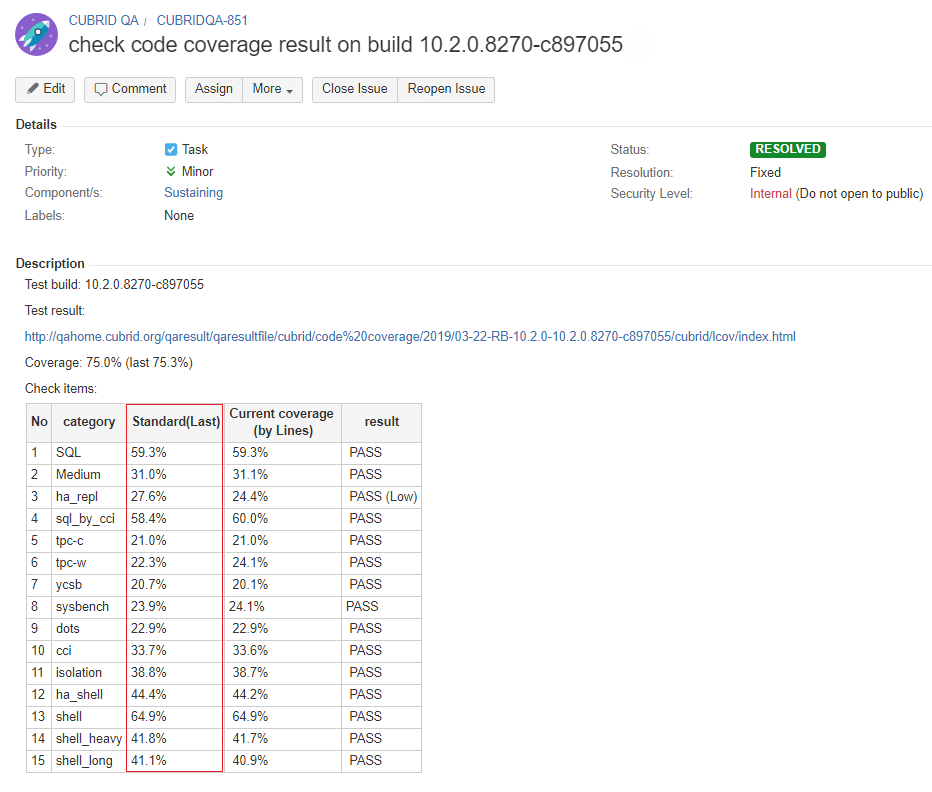

# 1. Test Objective

Code coverage is a measurement of how many lines/blocks/arcs of CUBRID code are executed while the automated tests are running. We use valgrind tool to instrument the binaries and run a full set of automated tests. Near all of existing test cases (SQL, MEDIUM, SQL_BY_CCI, HA_REPL, CCI, ISOLATION, SHELL, HA_SHELL, SHELL_HEAVY, SHELL_LONG, YCSB, SYSBENCH, TPC-W, TPC-C, DOTS) are used for code coverage test and scheduled by manual.

# 2. Code Coverage Test Tools

# 3. Regression Test Deployment

## 3.1 Deployment overview

<table>
<tr>
<th>Description</th>
<th>User Name</th>
<th>IP</th>
<th>Hostname</th>
<th>Tools to deploy</th>
</tr>
<tr class="even">
<td>Controller</td>
<td>codecov</td>
<td>192.168.1.98</td>
<td>func23</td>
<td> CTP<br>
cc4c <br>
CUBRID source <br>  
 </td>
</tr>
</table>


## 3.2 Installation

* ### Install CTP
  Please follow this [guide to install CTP as regression test configuration](https://github.com/CUBRID/cubrid-testtools/blob/develop/doc/ctp_install_guide.md#3-install-ctp-as-regression-test-platform).

  Then, create configuration file used by code coverage controller.

  File `~/CTP/conf/coverage.conf`:

      covarage_build_server_cn_host=192.168.1.91
      coverage_build_server_cn_usr=ci_build
      coverage_build_server_cn_pwd=******
      coverage_build_server_cn_port=22

      coverage_controller_cc4c_home=/home/codecov/cc4c
      coverage_controller_host=192.168.1.98
      coverage_controller_user=codecov
      coverage_controller_pwd=******
      coverage_controller_port=22
      coverage_controller_home=/home/codecov

* ### Install cc4c

  Download cc4c: 

      cd ~
      git clone https://github.com/CUBRID/cubrid-testtools-internal.git
      cd cubrid-testtools-internal
      git checkout develop
      cp -rf cov_compl_tool/cc4c  ~/cc4c

  Then change to actual values in below script file:

  File `cc4c/coverage_monitor.sh`:

      ...
      cc4c_home=/home/codecov/cc4c
      ...
      qahomeUser="qahome"
      qahomePwd="******"
      qahomeTargetPath="/home/qahome/qaresult_en/web/qaresultfile/cubrid/code\ coverage"
      qahomeIP="192.168.1.86"
      port=22
      ...

* ### Append to .bash_profile

  File `.bash_profile`:

      export CTP_SKIP_UPDATE=0
      export CTP_BRANCH_NAME=develop
      export CTP_HOME=~/CTP
      source /opt/rh/devtoolset-8/enable
      export PATH=$CTP_HOME/bin:$CTP_HOME/common/script:$PATH:$HOME/bin

* ### Configure crontab

  Execute `crontab -e` and set content as below:

      0 * * * * sh /home/codecov/cc4c/coverage_monitor.sh >/home/codecov/cc4c/monitor.log 2>&1
      
* ### Create quick start script

  File `~/start_test.sh`:
 
      nohup start_consumer.sh -q QUEUE_CUBRID_QA_CODE_COVERAGE -exec run_coverage -s china &
      
* ### Configure `job.conf` in message service

  Log into message server (message@192.168.1.91). Add configuration as below:
  
  File `~/CTP/conf/job.conf`:

        #################################################################################
        job_codecoverage.service=ON
        
        # The crontab value as below configures when code coverage test will be scheduled.
        job_codecoverage.crontab=0 1 10 ? * 7L
        job_codecoverage.listenfile=cubrid-{1}.tar.gz
        job_codecoverage.acceptversions=10.2.*
        job_codecoverage.package_bits=64
        job_codecoverage.package_type=general

        job_codecoverage.test.1.scenario=gcov_package
        job_codecoverage.test.1.queue=QUEUE_CUBRID_QA_CODE_COVERAGE  
        #################################################################################
        job_coverage_test.service=ON
        job_coverage_test.crontab=0/7 * * * * ?
        job_coverage_test.listenfile=CUBRID-{1}-gcov-linux.x86_64.tar.gz
        job_coverage_test.listenfile.1=cubrid-{1}-gcov-src-linux.x86_64.tar.gz
        job_coverage_test.acceptversions=10.2.*
        job_coverage_test.package_bits=64
        job_coverage_test.package_type=coverage

        job_coverage_test.test.1.scenario=sql
        job_coverage_test.test.1.queue=QUEUE_CUBRID_QA_SQL_PERF_LINUX

        job_coverage_test.test.2.scenario=medium
        job_coverage_test.test.2.queue=QUEUE_CUBRID_QA_SQL_PERF_LINUX

        job_coverage_test.test.3.scenario=ha_repl
        job_coverage_test.test.3.queue=QUEUE_CUBRID_QA_HA_REPL_LINUX

        job_coverage_test.test.4.scenario=sql_by_cci
        job_coverage_test.test.4.queue=QUEUE_CUBRID_QA_SQL_CCI_LINUX_GIT

        job_coverage_test.test.5.scenario=tpcc
        job_coverage_test.test.5.queue=QUEUE_CUBRID_QA_TPCC_LINUX
        job_coverage_test.test.5.MKEY_CONFIG=config_code_coverage_tpcc.properties
        job_coverage_test.test.5.MKEY_TPCC_WARE_HOUSES=2

        job_coverage_test.test.6.scenario=tpcw
        job_coverage_test.test.6.queue=QUEUE_CUBRID_QA_TPCW_LINUX
        job_coverage_test.test.6.MKEY_CONFIG=config_coverage_dailyqa.properties

        job_coverage_test.test.7.scenario=ycsb
        job_coverage_test.test.7.queue=QUEUE_CUBRID_QA_YCSB_NEW_LINUX

        job_coverage_test.test.8.scenario=sysbench
        job_coverage_test.test.8.queue=QUEUE_CUBRID_QA_SYSBENCH_LINUX
        job_coverage_test.test.8.MKEY_CONFIG=config_code_coverage.properties

        job_coverage_test.test.9.scenario=dots
        job_coverage_test.test.9.queue=QUEUE_CUBRID_QA_DOTS_LINUX
        job_coverage_test.test.9.MKEY_DOTS_DURATION=4:00

        job_coverage_test.test.10.scenario=cci
        job_coverage_test.test.10.queue=QUEUE_CUBRID_QA_CCI_LINUX

        job_coverage_test.test.11.scenario=isolation
        job_coverage_test.test.11.queue=QUEUE_CUBRID_QA_CC_BASIC

        job_coverage_test.test.12.scenario=ha_shell
        job_coverage_test.test.12.queue=QUEUE_CUBRID_QA_SHELL_HA_LINUX

        job_coverage_test.test.13.scenario=shell
        job_coverage_test.test.13.queue=QUEUE_CUBRID_QA_SHELL_LINUX

        job_coverage_test.test.14.scenario=shell_heavy
        job_coverage_test.test.14.queue=QUEUE_CUBRID_QA_SHELL_HEAVY_LINUX

        job_coverage_test.test.15.scenario=shell_long
        job_coverage_test.test.15.queue=QUEUE_CUBRID_QA_SHELL_LONG_LINUX
        #################################################################################
        
        
    Note: once configuration changed, we need restart message service. Firstly find existing producer process as below:

    ```
        [message@qa03 ~]$ ps -u $USER  f
          PID TTY      STAT   TIME COMMAND
        22606 ?        S      0:02 sshd: message@pts/2
        22613 pts/2    Ss+    0:00  \_ -bash
        21050 ?        S      0:00 sshd: message@pts/0
        21052 pts/0    Ss+    0:00  \_ -bash
         8118 ?        S      0:00 sshd: message@pts/1
         8124 pts/1    Ss     0:00  \_ -bash
        17589 pts/1    R+     0:00      \_ ps -u message f
        21383 ?        S      0:00 /bin/sh /home/message/CTP/common/script/start_producer.sh
        21389 ?        S      0:00  \_ /bin/sh /home/message/CTP/common/script/start_producer.sh
        21390 ?        Sl   207:42      \_ /usr/local/cubridqa/jdk1.8.0_201/bin/java -cp ./lib/cubridqa-scheduler.jar com.navercorp.cubridqa.scheduler.producer.Main
    ```
    
    and perform kill with `kill -9 21390`.  Then start producer as below:

    ```
        cd ~
        nohup start_producer.sh &
    ```        
        
    

# 4. Regression Test Sustaining

## 4.1 How to start test?

* ### Start test daemon process:

  Log into test server, keep daemon process for `start_test.sh`:

      nohup sh start_test.sh &

  After startup, it will keep listening for new test messages. Once come, it will fire the test immediately. Except CI test messages which were generated automatically monthly, you may send test message by manual.
  
* ### Manually generate code coverage packages and start to fire full test

  Log into message server (message@192.168.1.91).
  
      sender.sh QUEUE_CUBRID_QA_CODE_COVERAGE http://192.168.1.91:8080/REPO_ROOT/store_01/10.2.0.8270-c897055/drop/cubrid-10.2.0.8270-c897055.tar.gz gcov_package default
      
  This message will notice controller node to generate two packages related to code coverage. After generate done, they will be uploaded to build server for download to test.
  
      cubrid-10.2.0.8425-a951607-gcov-src-Linux.x86_64.tar.gz      
      CUBRID-10.2.0.8425-a951607-gcov-Linux.x86_64.tar.gz   
  
* ### Manually send test message to execute specific test


  
## 4.2 Verify test Results

  As configured in job.conf in previous chapter, code coverage test will be scheduled to execute on last Saturday in every month. After each execution, we need verify code coverage test result.

* ### Check if there is code coverage result  
  Open QA home (http://qahome.cubrid.org), navigate to find code coverage test result as below. If there is no any result, you need to find the reason out. 
  
  
  Then click link `'cubrid'` and get overall code coverage test result:
  
  
  
  In `'Category'` list, there should be 15 items as currently configured in `job.conf`. Each item can be clicked into for detail page.
  
  

* ### Each code coverage result should not be much lower ( <1 percent) than previous

  In order to check current test result, suggest to create a QA issue and perform comparison to a baseline in the issue. For example, create QA issue as http://jira.cubrid.org/browse/CUBRIDQA-851,
  
  
  If any code coverage value of some item is lower (<1 percent) than previous, please find reasons out and confirm.
  


