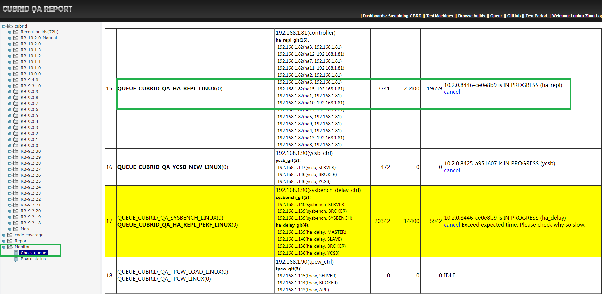
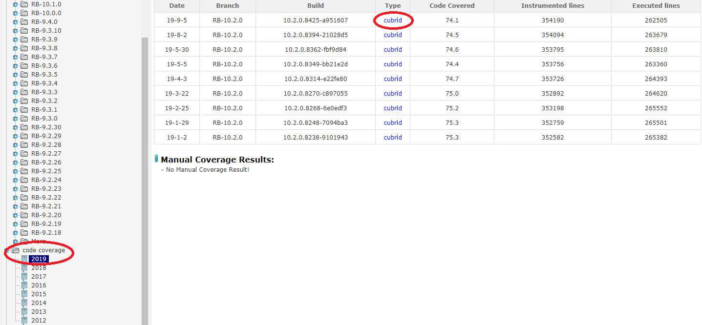
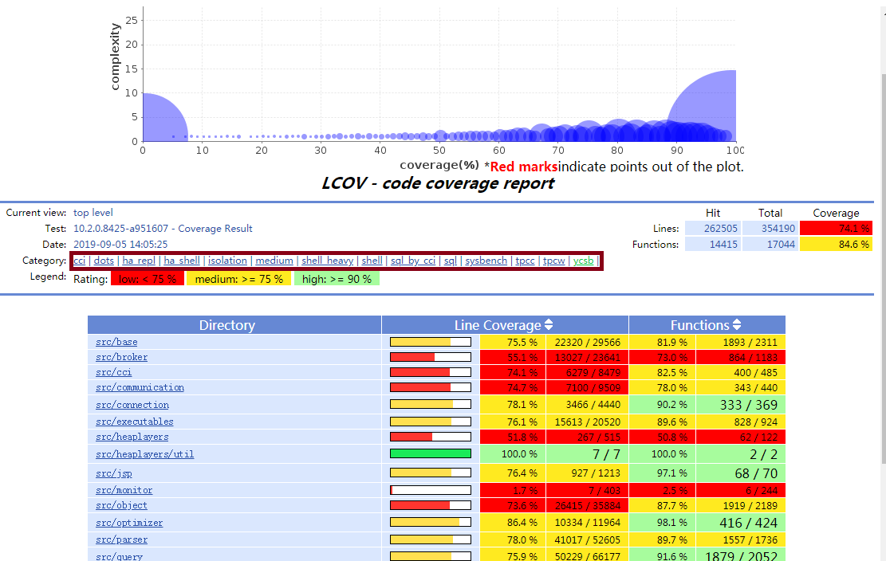
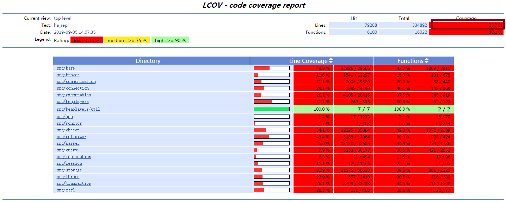
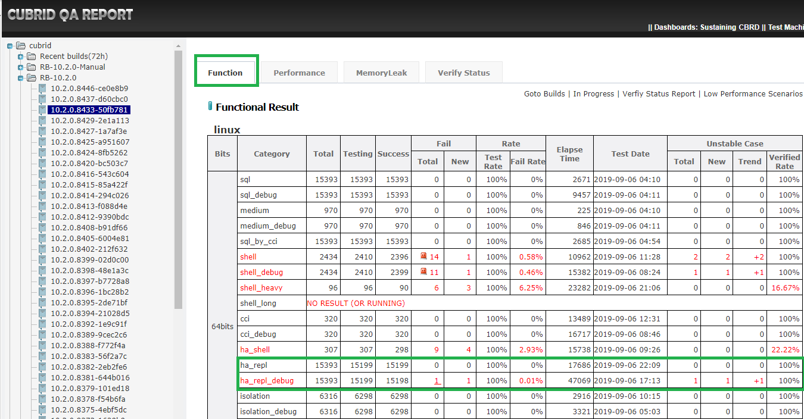
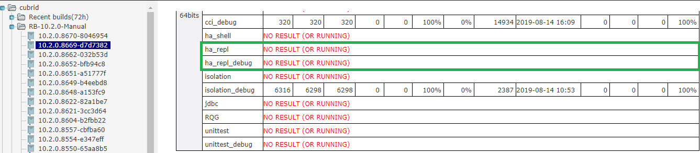
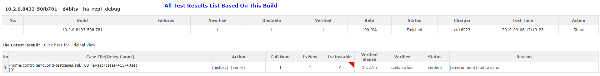
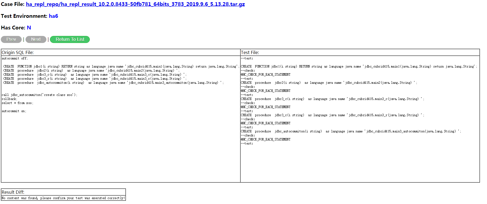
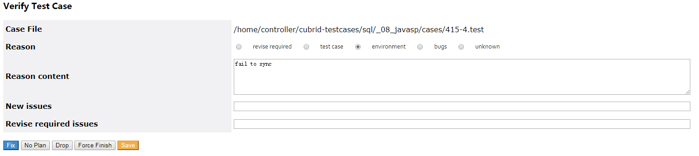

# 1. Test Objective
HA_repl test is aimed to test CUBRID HA replication feature. We convert existing SQL test cases to HA_repl test cases automatically to check data replication between master node and slave node.

# 2. Ha_repl Test Usage
This section introduces how to execute ha_repl test with one HA instance environment.    

## 2.1 Quick Start

* ### Deployment overview
	We need prepare at least 2 servers.
	
	| No. | Role | User | IP | Deployments |
	|-|-|-|-|-|
	|1 | Controller | ctl6 | 192.168.1.81 | CTP<br>Test Cases|
	|2 | CUBRID master | zll | 192.168.1.81 | CTP<br>CUBRID|
	|3 | CUBRID slave | zll | 192.168.1.82 | CTP<br>CUBRID|

* ### Install CTP among all role nodes
	Please refer to [CTP installation guide](#1-install-ctp-in-linux-platform) to install CTP on all role nodes.

* ### Install CUBRID
	Please install CUBRID on CUBRID master and slave
	```bash
	run_cubrid_install http://192.168.1.91:8080/REPO_ROOT/store_01/10.2.0.8368-b85a234/drop/CUBRID-10.2.0.8368-b85a234-Linux.x86_64-debug.sh
	```

	There is a way to avoid installing CUBRID on master and slave manually. It's to set parameter `cubrid_download_url` in ha_repl test configuration file `ha_repl.conf`.      
	For example:
	```
	cubrid_download_url=http://192.168.1.91:8080/REPO_ROOT/store_01/10.2.0.8368-b85a234/drop/CUBRID-10.2.0.8368-b85a234-Linux.x86_64-debug.sh
	```

* ### Prepare Ha_repl Test Cases

	There are two approaches. The first is to create our own test cases.
	Log into the controller node, then create an arbitrary folder exampled as `~/with_online/`, and then put our test cases under the folder. See example below:
	
	File ~/with_online/example1.sql:
	
		drop if exists t;
		create table t(i int,j varchar);
		insert into t values(1,'a');
		insert into t values(2,null);
		create index idx1 on t(i) with online;
		select /*+ recompile*/ * from t where i=2;
		insert into t values(2,3);
		select /*+ recompile*/ * from t where i=2;
		drop table t;	

	The second is to accept to use existing SQL test cases as Ha_repl test cases. Please check out the test cases on controller node as below.
	
	Log into the controller node,  then execute:
	
	```bash
	cd ~
	git clone https://github.com/CUBRID/cubrid-testcases.git
	git checkout develop
	cd cubrid-testcases/sql/	
	$ ls
	_01_object              _08_javasp               _14_mysql_compatibility_2  _22_news_service_mysql_compatibility  _28_features_930
	_02_user_authorization  _09_64bit                _15_fbo                    _23_apricot_qa                        _29_CTE_recursive
	_03_object_oriented     _10_connect_by           _16_index_enhancement      _24_aprium_qa                         _29_recovery
	_04_operator_function   _11_codecoverage         _17_sql_extension2         _25_features_844                      _30_banana_pie_qa
	_06_manipulation        _12_mysql_compatibility  _18_index_enhancement_qa   _26_features_920                      _31_cherry
	_07_misc                _13_issues               _19_apricot                _27_banana_qa                         config
	```

* ### Make test configuration

	Log into controller node, and create Ha_repl test configuration.  
	
	File `~/CTP/conf/ha_repl.conf`
	```bash
	default.testdb = xdb
	default.ssh.pwd=******
	default.ssh.port=22

	# master and slave node
	env.ha1.master.ssh.host = 192.168.1.81
	env.ha1.master.ssh.user = zll
	env.ha1.slave1.ssh.host = 192.168.1.82
	env.ha1.slave1.ssh.user = zll
	env.ha1.cubrid.cubrid_port_id = 1727
	env.ha1.ha.ha_port_id = 58091
	env.ha1.broker1.SERVICE = OFF
	env.ha1.broker2.APPL_SERVER_SHM_ID = 31091
	env.ha1.broker2.BROKER_PORT = 31091
	
	# Use this CUBRID build to test instead of manual installation
	# cubrid_download_url=http://192.168.1.91:8080/REPO_ROOT/store_01/10.2.0.8368-b85a234/drop/CUBRID-10.2.0.8368-b85a234-Linux.x86_64-debug.sh

	# Use our own test cases
	scenario=${HOME}/with_online
	
	# Use existing SQL test cases
	# scenario=${HOME}/cubrid-testcases/sql
	```	

* ### Execute test
	```
	$ ctp.sh ha_repl -c ~/CTP/conf/ha_repl.conf 
	```
	**Console output:**
	```
	$ ctp.sh ha_repl -c ~/CTP/conf/ha_repl.conf  

	====================================== HA_REPL ==========================================
	[HA_REPL] TEST STARTED (Thu Sep 05 19:54:57 KST 2019)

	[HA_REPL] CONFIG FILE: /home/ctl6/ha_repl.conf

	scenario=${HOME}/with_online
	env.ha1.slave1.ssh.host=192.168.1.82
	env.ha1.slave1.ssh.user=zll
	env.ha1.master.ssh.user=zll
	default.ssh.pwd=******
	default.testdb=xdb
	default.ssh.port=22
	env.ha1.master.ssh.host=192.168.1.81


	----------END OF FILE----------
	Available Env: [ha1]
	connect zll@192.168.1.81:22  success
	connect zll@192.168.1.82:22  success
	BUILD ID: 10.2.0.8368-b85a234
	BUILD BITS: 64bits
	Continue Mode: false
	BEGIN TO CHECK: 
	connect zll@192.168.1.81:22  success
	connect zll@192.168.1.82:22  success
	=================== Check zll@192.168.1.81:22:master============================
	==> Check variable 'JAVA_HOME' ...... PASS
	==> Check variable 'CTP_HOME' ...... PASS
	==> Check variable 'CUBRID' ...... PASS
	==> Check command 'java' ...... PASS
	==> Check command 'diff' ...... PASS
	==> Check command 'wget' ...... PASS
	==> Check command 'find' ...... PASS
	==> Check command 'cat' ...... PASS

	=================== Check zll@192.168.1.82:22:slave1============================
	==> Check variable 'JAVA_HOME' ...... PASS
	==> Check variable 'CTP_HOME' ...... PASS
	==> Check variable 'CUBRID' ...... PASS
	==> Check command 'java' ...... PASS
	==> Check command 'diff' ...... PASS
	==> Check command 'wget' ...... PASS
	==> Check command 'find' ...... PASS
	==> Check command 'cat' ...... PASS

	CHECK RESULT: PASS
	java.runtime.name=Java(TM) SE Runtime Environment
	sun.boot.library.path=/usr/local/cubridqa/jdk1.6.0_22/jre/lib/amd64
	java.vm.version=17.1-b03
	env.ha1.slave1.ssh.host=192.168.1.82
	java.vm.vendor=Sun Microsystems Inc.
	java.vendor.url=http://java.sun.com/
	path.separator=:
	java.vm.name=Java HotSpot(TM) 64-Bit Server VM
	file.encoding.pkg=sun.io
	sun.java.launcher=SUN_STANDARD
	user.country=US
	sun.os.patch.level=unknown
	java.vm.specification.name=Java Virtual Machine Specification
	user.dir=/home/ctl6
	default.ssh.port=22
	java.runtime.version=1.6.0_22-b04
	java.awt.graphicsenv=sun.awt.X11GraphicsEnvironment
	java.endorsed.dirs=/usr/local/cubridqa/jdk1.6.0_22/jre/lib/endorsed
	os.arch=amd64
	java.io.tmpdir=/tmp
	line.separator=

	java.vm.specification.vendor=Sun Microsystems Inc.
	os.name=Linux
	default.ssh.pwd=******
	sun.jnu.encoding=UTF-8
	java.library.path=/usr/local/cubridqa/jdk1.6.0_22/jre/lib/amd64/server:/usr/local/cubridqa/jdk1.6.0_22/jre/lib/amd64:/usr/local/cubridqa/jdk1.6.0_22/jre/../lib/amd64:/usr/java/packages/lib/amd64:/usr/lib64:/lib64:/lib:/usr/lib
	env.ha1.master.ssh.host=192.168.1.81
	scenario=${HOME}/with_online
	java.specification.name=Java Platform API Specification
	java.class.version=50.0
	sun.management.compiler=HotSpot 64-Bit Server Compiler
	os.version=3.10.0-957.21.3.el7.x86_64
	env.ha1.slave1.ssh.user=zll
	user.home=/home/ctl6
	user.timezone=Asia/Seoul
	java.awt.printerjob=sun.print.PSPrinterJob
	java.specification.version=1.6
	file.encoding=UTF-8
	user.name=ctl6
	java.class.path=/home/ctl6/CTP/common/lib/cubridqa-common.jar
	java.vm.specification.version=1.0
	sun.arch.data.model=64
	java.home=/usr/local/cubridqa/jdk1.6.0_22/jre
	java.specification.vendor=Sun Microsystems Inc.
	user.language=en
	java.vm.info=mixed mode
	java.version=1.6.0_22
	java.ext.dirs=/usr/local/cubridqa/jdk1.6.0_22/jre/lib/ext:/usr/java/packages/lib/ext
	sun.boot.class.path=/usr/local/cubridqa/jdk1.6.0_22/jre/lib/resources.jar:/usr/local/cubridqa/jdk1.6.0_22/jre/lib/rt.jar:/usr/local/cubridqa/jdk1.6.0_22/jre/lib/sunrsasign.jar:/usr/local/cubridqa/jdk1.6.0_22/jre/lib/jsse.jar:/usr/local/cubridqa/jdk1.6.0_22/jre/lib/jce.jar:/usr/local/cubridqa/jdk1.6.0_22/jre/lib/charsets.jar:/usr/local/cubridqa/jdk1.6.0_22/jre/classes
	java.vendor=Sun Microsystems Inc.
	file.separator=/
	java.vendor.url.bug=http://java.sun.com/cgi-bin/bugreport.cgi
	default.testdb=xdb
	sun.cpu.endian=little
	sun.io.unicode.encoding=UnicodeLittle
	env.ha1.master.ssh.user=zll
	sun.cpu.isalist=
	AUTO_TEST_BUILD_ID=10.2.0.8368-b85a234
	AUTO_TEST_BUILD_BITS=64bits
	Convert Root:  /home/ctl6/with_online
	0
	Finished covert files: 1
	============= DEPLOY STEP ==================
	connect zll@192.168.1.81:22  success
	connect zll@192.168.1.82:22  success
	Start deployAll
	==> Begin to update CTP on zll@192.168.1.81:22:master:
	[INFO] START (Thu Sep 05 19:54:59 KST 2019)
	grepo_service_url: rmi://192.168.1.91:11099/repoService
	[INFO] begin to fetch ... 
					REPO:           cubrid-testtools
					BRANCH:         develop
					PATH:           CTP
					CLIENT SHA1:    d4dffcbe35546683f4133ee0a115a31df83cf2e9
	[INFO] fetch done: NO CHANGE
	[INFO] got package file: /home/zll/CTP/.dailyqa/cubrid-testtools_develop_CTP.zip
	[INFO] begin to expand files ... 
	[INFO] expand done
	[INFO] DONE Thu Sep 05 19:55:00 KST 2019
	DONE
	DONE.
	==> Begin to clean on zll@192.168.1.81:22:master: 
	++ cubrid service is not running.
	==============Clean_CUBRID Process==============
	++ cubrid service is not running.
	==============Release shared Memory==============
	==============Stop monitor=======================
	==============Clean Processes=======================
	DONE.
	envId is ha1. Master deployment finished.master
	==> Begin to update CTP on zll@192.168.1.82:22:slave1:
	[INFO] START (Thu Sep 05 19:55:01 KST 2019)
	grepo_service_url: rmi://192.168.1.91:11099/repoService
	[INFO] begin to fetch ... 
					REPO:           cubrid-testtools
					BRANCH:         develop
					PATH:           CTP
					CLIENT SHA1:    d4dffcbe35546683f4133ee0a115a31df83cf2e9
	[INFO] fetch done: NO CHANGE
	[INFO] got package file: /home/zll/CTP/.dailyqa/cubrid-testtools_develop_CTP.zip
	[INFO] begin to expand files ... 
	[INFO] expand done
	[INFO] DONE Thu Sep 05 19:55:02 KST 2019
	DONE
	DONE.
	==> Begin to clean on zll@192.168.1.82:22:slave1: 
	++ cubrid service is not running.
	==============Clean_CUBRID Process==============
	++ cubrid service is not running.
	==============Release shared Memory==============
	==============Stop monitor=======================
	==============Clean Processes=======================
	DONE.
	envId is ha1. Slave deployment finished.slave1
	DONE.
	============= DISPATCH STEP ==================
	Test category:ha_repl
	Total: 1, tbd: 1, skipped: 0
	Total: 1, tbd: 1, skipped: 0
	DONE.
	============= TEST STEP ==================
	connect zll@192.168.1.81:22  success
	connect zll@192.168.1.82:22  success
	Creating database with 64.0M size using locale en_US. The total amount of disk space needed is 164.0M.

	CUBRID 10.2 (10.2.0.8368) (64 debug build)

	@ cubrid heartbeat start
	@ cubrid master start
	++ cubrid master start: success
	@ HA processes start
	@ cubrid server start: xdb
	++ cubrid server start: success
	@ copylogdb start
	++ copylogdb start: success
	@ applylogdb start
	++ applylogdb start: success
	++ HA processes start: success
	++ cubrid heartbeat start: success
	@ cubrid broker start
	@ cubrid broker start
	@ cubrid broker start
	++ cubrid broker start: success
	Creating database with 64.0M size using locale en_US. The total amount of disk space needed is 164.0M.

	CUBRID 10.2 (10.2.0.8368) (64 debug build)

	@ cubrid heartbeat start
	@ cubrid master start
	++ cubrid master start: success
	@ HA processes start
	@ cubrid server start: xdb
	++ cubrid server start: success
	@ copylogdb start
	++ copylogdb start: success
	@ applylogdb start
	++ applylogdb start: success
	++ HA processes start: success
	++ cubrid heartbeat start: success
	@ cubrid broker start
	@ cubrid broker start
	@ cubrid broker start
	++ cubrid broker start: success
	[TESTCASE] /home/ctl6/with_online/example1.test 11706ms ha1  [OK]
	============= PRINT SUMMARY ==================
	Test Category:ha_repl
	Total Case:1
	Total Execution Case:1
	Total Success Case:1
	Total Fail Case:0
	Total Skip Case:0

	DONE.
	============= BACKUP TEST RESULTS ==================
	./
	./feedback.log
	./deploy_ha1.log
	./dispatch_tc_ALL.txt
	./dispatch_tc_FIN_ha1.txt
	./test_status.data
	./test_ha1.log
	./monitor_ha1.log
	DONE.
	TEST COMPLETED.
	[HA_REPL] TEST END (Thu Sep 05 19:55:57 KST 2019)
	[HA_REPL] ELAPSE TIME: 60 seconds
	```

* ### Examine test results  

	**Test results:**
	
	During running of test cases, test logs are generated in directory `CTP/result/ha_repl/current_runtime_logs`. After test finish, all files under `current_runtime_logs` will be backuped as a `.tar.gz` file.   
	
	```bash
	$ cd ~/CTP/result/ha_repl/
	$ ls -l
	total 8
	drwxr-xr-x 2 ctl6 ctl6  173 Sep  5 19:55 current_runtime_logs
	-rw-rw-r-- 1 ctl6 ctl6 1944 Sep  5 19:35 ha_repl_result_10.2.0.8368-b85a234_64bits_0_2019.9.5_7.35.50.tar.gz
	-rw-rw-r-- 1 ctl6 ctl6 1825 Sep  5 19:55 ha_repl_result_10.2.0.8368-b85a234_64bits_0_2019.9.5_7.55.57.tar.gz
	$ ls -l current_runtime_logs/
	total 28
	-rw-rw-r-- 1 ctl6 ctl6 1684 Sep  5 19:55 deploy_ha1.log
	-rw-rw-r-- 1 ctl6 ctl6   37 Sep  5 19:55 dispatch_tc_ALL.txt
	-rw-rw-r-- 1 ctl6 ctl6   37 Sep  5 19:55 dispatch_tc_FIN_ha1.txt
	-rw-rw-r-- 1 ctl6 ctl6  472 Sep  5 19:55 feedback.log
	-rw-rw-r-- 1 ctl6 ctl6   18 Sep  5 19:55 monitor_ha1.log
	-rw-rw-r-- 1 ctl6 ctl6 2917 Sep  5 19:55 test_ha1.log
	-rw-rw-r-- 1 ctl6 ctl6  154 Sep  5 19:55 test_status.data
	$ tar zxvf ha_repl_result_10.2.0.8368-b85a234_64bits_0_2019.9.5_7.55.57.tar.gz
	./
	./feedback.log
	./deploy_ha1.log
	./dispatch_tc_ALL.txt
	./dispatch_tc_FIN_ha1.txt
	./test_status.data
	./test_ha1.log
	./monitor_ha1.log
	 ```

	>Note: If there are failed cases, the cases and results will also be backuped into .tar.gz.

	**Test case dumped data**

	The dumped data of every test case is generated to the same path with test case.   
	```
	cd ~/with_online
	$ ls -l
	total 1448
	-rw-rw-r-- 1 ctl6 ctl6 736060 Sep  5 19:55 example1.master.dump
	-rw-rw-r-- 1 ctl6 ctl6 736060 Sep  5 19:55 example1.slave1.dump
	-rw-rw-r-- 1 ctl6 ctl6    277 Sep  5 19:54 example1.sql
	-rw-rw-r-- 1 ctl6 ctl6    503 Sep  5 19:54 example1.test
	 ```

	* The files ended with `.dump` record the success or failure of the test cases and also record each sql statement and their execution result.   
	

			[STMT-TEST][Line:2]drop if exists t;
			0
			1


			[STMT-CHECK][Line:26]$HC_CHECK_FOR_DML
			select 't' TABLE_NAME, count(*) from t;select 't' TABLE_NAME, t.* from t order by 1,2,3 limit 1000;select 't' TABLE_NAME, t.* from t order by
			1 desc,2 desc,3 desc limit 1000;
			=== <Result of SELECT Command in Line 2> ===

			TABLE_NAME               count(*)
			===================================
			't'                             2

			1 row selected.Committed.

			=== <Result of SELECT Command in Line 2> ===

			TABLE_NAME                      i  j
			=========================================================
			't'                             1  'a'
			't'                             2  NULL

			2 rows selected.Committed.

			=== <Result of SELECT Command in Line 2> ===

			TABLE_NAME                      i  j
			=========================================================
			't'                             2  NULL
			't'                             1  'a'

			2 rows selected.Committed.

		 >Note: 
			example1.master.dump - the result of master node     
			example1.slave1.dump - the result of slave node         

	 * The file ended with `.test` is test case which is converted by CTP based on `.sql` file.
	 
			--test:
			drop if exists t;
			--check:
			@HC_CHECK_FOR_EACH_STATEMENT
			--test:
			create table t(i int PRIMARY KEY,j varchar);
			--check:
			@HC_CHECK_FOR_EACH_STATEMENT
			--test:
			insert into t values(1,'a');
			--check:
			$HC_CHECK_FOR_DML

			--test:
			insert into t values(2,null);
			--check:
			$HC_CHECK_FOR_DML

			--test:
			create index idx1 on t(i) with online;
			--check:
			@HC_CHECK_FOR_EACH_STATEMENT
			--test:
			insert into t values(2,3);
			--check:
			$HC_CHECK_FOR_DML

			--test:
			drop table t;
			--check:
			@HC_CHECK_FOR_EACH_STATEMENT
			--test:

## 2.2 Test Parameters

In like ~/CTP/conf/ha_repl.conf, more parameters can be used.

* Configure to update statistics data

      update_statistics_on_catalog_classes_yn=y
    
* Detect timeout of sync

    We will abandon to check slave data after a threshold.

      ha_sync_detect_timeout_in_secs=1200 
      
* Exclude test cases

    Some test cases may not be meanningful. We need have a mechanism to exclude them to execute. We introduce a parameter to implement it. All test cases in configured excluded file will be ignored.

	testcase_exclude_from_file = ${HOME}/cubrid-testcases/sql/config/daily_regression_test_exclude_list_ha_repl.conf

    File cubrid-testcases/sql/config/daily_regression_test_exclude_list_ha_repl.conf:
       
			#[PERMANENT] CUBRIDSUS-9241:do not support OO class under HA Replication.
			sql/_04_operator_function/_08_click_counter/_001_incr/cases/1005.test
			sql/_04_operator_function/_08_click_counter/_002_decr/cases/1019.test
			sql/_13_issues/_15_1h/cases/bug_bts_16189.test
			sql/_13_issues/_11_1h/cases/bug_bts_4098.test 
			sql/_03_object_oriented/_01_user_defined_type/_004_authorization/cases/1007.test
			sql/_03_object_oriented/_01_user_defined_type/_004_authorization/cases/1002.test 
			sql/_03_object_oriented/_01_user_defined_type/_004_authorization/cases/1003.test
			sql/_03_object_oriented/_01_user_defined_type/_004_authorization/cases/1005.test
			sql/_01_object/_10_system_table/_002_db_direct_super_class/cases/1004.test
			sql/_01_object/_10_system_table/_002_db_direct_super_class/cases/1014.test 
			sql/_06_manipulation/_01_select/_002_outer_join/cases/1026.test 
			sql/_03_object_oriented/_03_inheritance/_004_manipulation/cases/1003.test 
			sql/_01_object/_10_system_table/_002_db_direct_super_class/cases/1006.test 
			sql/_04_operator_function/_01_all_types/_002_arithmetic_op/cases/1020.test 

			#[PERMANENT] do not support call under HA Replication.CUBRIDSUS-8386.
			sql/_06_manipulation/_01_select/_001_inner_join/cases/1049.test
			sql/_02_user_authorization/_02_authorization/_001_grant/cases/1001.test
			sql/_23_apricot_qa/_03_i18n/tr_TR/_09_identifiers/cases/_009_identifiers_user_002.test
			sql/_02_user_authorization/_02_authorization/_002_revoke/cases/1058.test
			sql/_03_object_oriented/_01_user_defined_type/_004_authorization/cases/1006.test
			sql/_03_object_oriented/_01_user_defined_type/_004_authorization/cases/1004.test
			#[PERMANENT] do not support call under HA Replication.CUBRIDSUS-8386.  do not support session parameters.CUBRIDSUS-11430.
			sql/_13_issues/_15_1h/cases/bug_bts_15454.test
			...
    

## 2.3 Difference File

Sometimes, the file xxx.master.dump is different from xxx.slave1.dump caused by CUBRID design or NOT-FIXED bugs. In order to avoid such failures, we need provide a patch file like `xxx.master.slave1.diff_1` and apply the patch before check so that supress such failures. 

* Generate diff_1 file

    	diff xxx.master.dump  xxx.slave1.dump > xxx.master.slave1.diff_1

* The rule to determine success or failure

    Suppose that after a test of some test case, there are dumped files on master and on slave. If both dumped files are same, the test case will be regarded as pass. If there is any difference, then try to find difference file, and apply it and compare again. If there is no difference file, the case should be regarded as failure.

    In addition, if there is any crash or fatal errors in CUBRID logs, the test case will be also failed.
 
# 3. Deploy Regression Test
## 3.1 Test Machines
In the current daily regression test, we are using one controller node to control 15 HA test instances which are executed in parallel.

No.  |Role  |User Name  |IP  |Hostname | Deployments
 --|--|--|--|--|--
|1|Controller node|controller|192.168.1.81|func06| CTP<br>cubrid-testcases
|2|Test nodes|ha1, ha2, ha3, ..., ha15|192.168.1.81|func06| CTP|
|3|Test nodes|ha1, ha2, ha3, ..., ha15|192.168.1.82|func07| CTP|

 **Controller node** listens to test messages and starts a test when there is a test message. It will distribute test cases to each test node for execution.   
 **Test nodes** execute test cases as worker.   

## 3.2 Deployment

* ### On Controller node

	#### Install CTP

	Please refer to [CTP installation guide](#3-install-ctp-as-regression-test-platform) to install CTP. Then create Ha_repl regression test configuration file.
	
	File `~/CTP/conf/ha_repl_template.conf`:

	    default.testdb = xdb
	    default.ssh.pwd=******
	    default.ssh.port=22

	    env.ha1.master.ssh.host = 192.168.1.82
	    env.ha1.master.ssh.user = ha1
	    env.ha1.slave1.ssh.host = 192.168.1.81
	    env.ha1.slave1.ssh.user = ha1
	    env.ha1.cubrid.cubrid_port_id = 1527
	    env.ha1.ha.ha_port_id = 59091
	    env.ha1.broker1.SERVICE = OFF
	    env.ha1.broker2.APPL_SERVER_SHM_ID = 33091
	    env.ha1.broker2.BROKER_PORT = 33091
	    env.ha2.master.ssh.host = 192.168.1.82
	    env.ha2.master.ssh.user = ha2
	    env.ha2.slave1.ssh.host = 192.168.1.81
	    env.ha2.slave1.ssh.user = ha2
	    env.ha2.cubrid.cubrid_port_id = 1528
	    env.ha2.ha.ha_port_id = 59092
	    env.ha2.broker1.SERVICE = OFF
	    env.ha2.broker2.APPL_SERVER_SHM_ID = 33092
	    env.ha2.broker2.BROKER_PORT = 33092
	    env.ha3.master.ssh.host=192.168.1.82
	    env.ha3.master.ssh.user=ha3
	    env.ha3.slave1.ssh.host=192.168.1.81
	    env.ha3.slave1.ssh.user=ha3
	    env.ha3.cubrid.cubrid_port_id=1529
	    env.ha3.ha.ha_port_id=59093
	    env.ha3.broker1.SERVICE = OFF
	    env.ha3.broker2.APPL_SERVER_SHM_ID = 33093
	    env.ha3.broker2.BROKER_PORT=33093
	    env.ha4.master.ssh.host = 192.168.1.82
	    env.ha4.master.ssh.user = ha4
	    env.ha4.slave1.ssh.host = 192.168.1.81
	    env.ha4.slave1.ssh.user = ha4
	    env.ha4.cubrid.cubrid_port_id = 1530
	    env.ha4.ha.ha_port_id = 59094
	    env.ha4.broker1.SERVICE = OFF
	    env.ha4.broker2.APPL_SERVER_SHM_ID = 33094
	    env.ha4.broker2.BROKER_PORT = 33094
	    env.ha5.master.ssh.host = 192.168.1.82
	    env.ha5.master.ssh.user = ha5
	    env.ha5.slave1.ssh.host = 192.168.1.81
	    env.ha5.slave1.ssh.user = ha5
	    env.ha5.cubrid.cubrid_port_id = 1531
	    env.ha5.ha.ha_port_id = 59095
	    env.ha5.broker1.SERVICE = OFF
	    env.ha5.broker2.APPL_SERVER_SHM_ID =33095
	    env.ha5.broker2.BROKER_PORT = 33095
	    env.ha6.master.ssh.host = 192.168.1.82
	    env.ha6.master.ssh.user = ha6
	    env.ha6.slave1.ssh.host = 192.168.1.81
	    env.ha6.slave1.ssh.user = ha6
	    env.ha6.cubrid.cubrid_port_id = 1532
	    env.ha6.ha.ha_port_id = 59096
	    env.ha6.broker1.SERVICE = OFF
	    env.ha6.broker2.APPL_SERVER_SHM_ID = 33096
	    env.ha6.broker2.BROKER_PORT = 33096
	    env.ha7.master.ssh.host = 192.168.1.82
	    env.ha7.master.ssh.user = ha7
	    env.ha7.slave1.ssh.host = 192.168.1.81
	    env.ha7.slave1.ssh.user = ha7
	    env.ha7.cubrid.cubrid_port_id = 1533
	    env.ha7.ha.ha_port_id = 59097
	    env.ha7.broker1.SERVICE = OFF
	    env.ha7.broker2.APPL_SERVER_SHM_ID = 33097
	    env.ha7.broker2.BROKER_PORT = 33097
	    env.ha8.master.ssh.host = 192.168.1.82
	    env.ha8.master.ssh.user = ha8
	    env.ha8.slave1.ssh.host = 192.168.1.81
	    env.ha8.slave1.ssh.user = ha8
	    env.ha8.cubrid.cubrid_port_id = 1534
	    env.ha8.ha.ha_port_id = 59098
	    env.ha8.broker1.SERVICE = OFF
	    env.ha8.broker2.APPL_SERVER_SHM_ID = 33098
	    env.ha8.broker2.BROKER_PORT = 33098
	    env.ha9.master.ssh.host = 192.168.1.82
	    env.ha9.master.ssh.user = ha9
	    env.ha9.slave1.ssh.host = 192.168.1.81
	    env.ha9.slave1.ssh.user = ha9
	    env.ha9.cubrid.cubrid_port_id = 1535
	    env.ha9.ha.ha_port_id = 59099
	    env.ha9.broker1.SERVICE = OFF
	    env.ha9.broker2.APPL_SERVER_SHM_ID = 33099
	    env.ha9.broker2.BROKER_PORT = 33099
	    env.ha10.master.ssh.host = 192.168.1.82
	    env.ha10.master.ssh.user = ha10
	    env.ha10.slave1.ssh.host = 192.168.1.81
	    env.ha10.slave1.ssh.user = ha10
	    env.ha10.cubrid.cubrid_port_id = 1536
	    env.ha10.ha.ha_port_id = 59100
	    env.ha10.broker1.SERVICE = OFF
	    env.ha10.broker2.APPL_SERVER_SHM_ID = 33100
	    env.ha10.broker2.BROKER_PORT = 33100
	    env.ha11.master.ssh.host = 192.168.1.82
	    env.ha11.master.ssh.user = ha11
	    env.ha11.slave1.ssh.host = 192.168.1.81
	    env.ha11.slave1.ssh.user = ha11
	    env.ha11.cubrid.cubrid_port_id = 1537
	    env.ha11.ha.ha_port_id = 59101
	    env.ha11.broker1.SERVICE = OFF
	    env.ha11.broker2.APPL_SERVER_SHM_ID = 33101
	    env.ha11.broker2.BROKER_PORT = 33101
	    env.ha12.master.ssh.host = 192.168.1.82
	    env.ha12.master.ssh.user = ha12
	    env.ha12.slave1.ssh.host = 192.168.1.81
	    env.ha12.slave1.ssh.user = ha12
	    env.ha12.cubrid.cubrid_port_id = 1538
	    env.ha12.ha.ha_port_id = 59102
	    env.ha12.broker1.SERVICE = OFF
	    env.ha12.broker2.APPL_SERVER_SHM_ID = 33102
	    env.ha12.broker2.BROKER_PORT = 33102
	    env.ha13.master.ssh.host = 192.168.1.82
	    env.ha13.master.ssh.user = ha13
	    env.ha13.slave1.ssh.host = 192.168.1.81
	    env.ha13.slave1.ssh.user = ha13
	    env.ha13.cubrid.cubrid_port_id = 1539
	    env.ha13.ha.ha_port_id = 59103
	    env.ha13.broker1.SERVICE = OFF
	    env.ha13.broker2.APPL_SERVER_SHM_ID = 33103
	    env.ha13.broker2.BROKER_PORT = 33103
	    env.ha14.master.ssh.host = 192.168.1.82
	    env.ha14.master.ssh.user = ha14
	    env.ha14.slave1.ssh.host = 192.168.1.81
	    env.ha14.slave1.ssh.user = ha14
	    env.ha14.cubrid.cubrid_port_id = 1540
	    env.ha14.ha.ha_port_id = 59104
	    env.ha14.broker1.SERVICE = OFF
	    env.ha14.broker2.APPL_SERVER_SHM_ID = 33104
	    env.ha14.broker2.BROKER_PORT = 33104
	    env.ha15.master.ssh.host = 192.168.1.82
	    env.ha15.master.ssh.user = ha15
	    env.ha15.slave1.ssh.host = 192.168.1.81
	    env.ha15.slave1.ssh.user = ha15
	    env.ha15.cubrid.cubrid_port_id = 1541
	    env.ha15.ha.ha_port_id = 59105
	    env.ha15.broker1.SERVICE = OFF
	    env.ha15.broker2.APPL_SERVER_SHM_ID = 33105
	    env.ha15.broker2.BROKER_PORT = 33105

	    # Define how to execute the test statement on master, 'jdbc' driver and 'csql' can be supported by the current CTP, 
	    # and the 'jdbc' mode is recommended.
	    test_interface_type=jdbc

	    # Define the path of test cases used for testing, it should be checked out on controller node.
	    scenario=${HOME}/cubrid-testcases/sql

	    # Define the url of CUBRID build. If the parameter is not configured or is commented out, users need to install CUBRID manually.   
	    cubrid_download_url=http://127.0.0.1/download/CUBRID-10.1.0.6929-b049ba5-Linux.x86_64.sh

	    test_category=ha_repl
	    test_platform=linux
	    test_rebuild_env_yn=yes
	    testcase_update_yn=yes
	    testcase_git_branch=develop
	    testcase_exclude_from_file = ${HOME}/cubrid-testcases/sql/config/daily_regression_test_exclude_list_ha_repl.conf
	    git_user=<git user>
	    git_pwd=********
	    git_email=<git e-mail>

	    test_continue_yn=yes
	    testcase_additional_answer = diff_1
	    test_failure_backup_yn=yes
	    clean_processes_after_quit_yn = yes
	    enable_check_disk_space_yn=yes
	    owner_mail = <owner e-mail>
	    cc_email= <cc e-mail>
	    feedback_type = database
	    feedback_db_host = 192.168.1.86
	    feedback_db_port = 33080
	    feedback_db_name = qaresu
	    feedback_db_user = dba
	    feedback_db_pwd = ********
	    feedback_notice_qahome_url = http://192.168.1.86:6060/qaresult/hareplImportAction.nhn?main_id=<MAINID>
	    ha_sync_detect_timeout_in_secs=1200


	#### Create quick start script  

	A consumer is used to listening to test messages. It requires a queue name and a script name to run.
	Create a script file `~/start_test.sh` as below. 

	    $ cat start_test.sh 
	    echo> nohup.out
	    start_consumer.sh -q QUEUE_CUBRID_QA_HA_REPL_LINUX -exec run_ha_repl -s china

    **QUEUE_CUBRID_QA_HA_REPL_LINUX** is the queue name    
    **run_ha_repl** is the script name, it will execute the script `CTP/common/ext/run_ha_repl.sh` 

* ### On Test nodes   

	#### Install CTP   
	Please refer to [CTP installation guide](#3-install-ctp-as-regression-test-platform) to install CTP.     

	#### Install CUBRID on each test node   

	    run_cubrid_install http://192.168.1.91:8080/REPO_ROOT/store_01/10.2.0.8368-b85a234/drop/CUBRID-10.2.0.8368-b85a234-Linux.x86_64-debug.sh

	 >Note: this step is not necessary for daily regression test. CTP will install CUBRID on each node.    

# 4. Regression Test Sustaining

We perform ha_repl/ha_repl_debug for daily (actually is for each build) and perform code coverage test for monthly. The `ha_repl_debug` is designed to execute based on a debug build.

## 4.1 Start/Stop Test

* ### Start listener
	Log into controller node, then execute below to start the listener.

		$ cd ~
		$ sh start_test.sh 
	
* ### Stop listener

	To stop listener, you may execute `~/CTP/common/script/stop_consumer.sh`. It will try to kill all active processes.	Let's see an example. 

	A running listener shows as below.

		$ ps -u $USER f
		PID TTY      STAT   TIME COMMAND
		5610 ?        S      0:00 sshd: ha_repl@pts/0
		5611 pts/0    Ss     0:00  \_ -bash
		9955 pts/0    R+     0:00      \_ ps -u ha_repl f
		9956 pts/0    S+     0:00      \_ tee
		3636 ?        S      0:00 sh start_test.sh
		3638 ?        S      2:57  \_ /bin/bash /home/ha_repl/CTP/common/script/start_consumer.sh -q QUEUE_CUBRID_QA_HA_REPL_LINUX -exec run_ha_repl -s china
		9927 ?        S      0:00      \_ /bin/bash /home/ha_repl/CTP/common/script/start_consumer.sh -q QUEUE_CUBRID_QA_HA_REPL_LINUX -exec run_ha_repl -s china
		9928 ?        Sl     0:00          \_ /usr/local/jdk1.7.0_01/bin/java -cp ./lib/cubridqa-scheduler.jar com.navercorp.cubridqa.scheduler.consumer.ConsumerAgent QUEUE_CUBRID_QA_HA_REPL_LINUX

	Begin to stop listener:

		$ cd ~/CTP/common/script
		$ sh stop_consumer.sh 

		/home/ha_repl/CTP/common/script/stop_consumer.sh: line 34: kill: (10719) - No such process
		
	Note: such error can be ignored.

	Check again for processes. You may find that the listener process has been stopped.

		$ ps -u $USER f
		PID TTY      STAT   TIME COMMAND
		5610 ?        S      0:00 sshd: ha_repl@pts/0
		5611 pts/0    Ss     0:00  \_ -bash
		10769 pts/0    R+     0:00      \_ ps -u ha_repl f
		10770 pts/0    S+     0:00      \_ tee

## 4.2 Send test message

Log into the message server `message@192.168.1.91`.

* Sent ha_repl test message with release build

		$ sender.sh QUEUE_CUBRID_QA_HA_REPL_LINUX http://192.168.1.91:8080/REPO_ROOT/store_01/10.2.0.8369-5a75e41/drop/CUBRID-10.2.0.8369-5a75e41-Linux.x86_64.sh ha_repl default

		Message: 

		Message Content: Test for build 10.2.0.8369-5a75e41 by CUBRID QA Team, China
		MSG_ID = 190909-190632-328-000001
		MSG_PRIORITY = 4
		BUILD_ABSOLUTE_PATH=/home/ci_build/REPO_ROOT/store_01/10.2.0.8369-5a75e41/drop
		BUILD_BIT=0
		BUILD_CREATE_TIME=1561143743000
		BUILD_GENERATE_MSG_WAY=MANUAL
		BUILD_ID=10.2.0.8369-5a75e41
		BUILD_IS_FROM_GIT=1
		BUILD_PACKAGE_PATTERN=CUBRID-{1}-Linux.x86_64.sh
		BUILD_SCENARIOS=ha_repl
		BUILD_SCENARIO_BRANCH_GIT=develop
		BUILD_SEND_DELAY=6879849
		BUILD_SEND_TIME=1568023592327
		BUILD_STORE_ID=store_01
		BUILD_SVN_BRANCH=RB-10.2.0
		BUILD_SVN_BRANCH_NEW=RB-10.2.0
		BUILD_TYPE=general
		BUILD_URLS=http://192.168.1.91:8080/REPO_ROOT/store_01/10.2.0.8369-5a75e41/drop/CUBRID-10.2.0.8369-5a75e41-Linux.x86_64.sh
		BUILD_URLS_CNT=1
		BUILD_URLS_KR=http://192.168.1.91:8080/REPO_ROOT/store_01/10.2.0.8369-5a75e41/drop/CUBRID-10.2.0.8369-5a75e41-Linux.x86_64.sh


		Do you accept above message [Y/N]: Y

* Sent ha_repl test message with debug build

	    sender.sh QUEUE_CUBRID_QA_HA_REPL_LINUX http://192.168.1.91:8080/REPO_ROOT/store_01/10.2.0.8369-5a75e41/drop/CUBRID-10.2.0.8369-5a75e41-Linux.x86_64-debug.sh ha_repl_debug default

## 4.3 Check Test Status

 * Check test progress in QA Homepage      
   Open [QA homepage](http://qahome.cubrid.org), click a build number from left build tree, find `ha_repl` and `ha_repl_debug` categories in right `Function` tab. The test progress can be shown via `Test Rate` column.  `100%` means that the test is completed.

 * Check queue status
	
	If want to know what test is in progress or what messages are in queue, you may find information via queue status page. Go into page http://qahome.cubrid.org/qaresult/monitor/checkQueue.nhn (or open through `QA homepage -> Left tree -> Monitor -> Check queue`). You may find ha_repl queue status under `QUEUE_CUBRID_QA_HA_REPL_LINUX`.
    
 
## 4.4 Ha_repl Code Coverage Test

As scheduled in regression test, code coverage test for Ha_repl is executed on the last Saturday in every month. But sometimes, due to failure reason, we also need sent test message by manual. To execute code coverage test of ha_repl, please log into the message server `message@192.168.1.91`, then execute like:
    
    $ cd ~/manual/
    $ sh sender_code_coverage_testing_message.sh QUEUE_CUBRID_QA_HA_REPL_LINUX http://192.168.1.91:8080/REPO_ROOT/store_010.2.0.8362-fbf9d84/drop/CUBRID-10.2.0.8362-fbf9d84-gcov-Linux.x86_64.tar.gz http://192.168.1.91:8080/REPO_ROOT/store_01/10.2.0.8362-fbf9d84/drop/cubrid-10.2.0.8362-fbf9d84-gcov-src-Linux.x86_64.tar.gz ha_repl
    Queue:QUEUE_CUBRID_QA_HA_REPL_LINUX
    Build URL:http://192.168.1.91:8080/REPO_ROOT/store_01/10.2.0.8362-fbf9d84/drop/CUBRID-10.2.0.8362-fbf9d84-gcov-Linux.x86_64.tar.gz
    Source URL:http://192.168.1.91:8080/REPO_ROOT/store_01/10.2.0.8362-fbf9d84/drop/cubrid-10.2.0.8362-fbf9d84-gcov-src-Linux.x86_64.tar.gz
    Category:ha_repl

    Message: 

    Message Content: Test for build 10.2.0.8362-fbf9d84 by CUBRID QA Team, China
    MSG_ID = 190909-193746-235-000001
    MSG_PRIORITY = 4
    BUILD_ABSOLUTE_PATH=/home/ci_build/REPO_ROOT/store_01/10.2.0.8362-fbf9d84/drop
    BUILD_BIT=0
    BUILD_CREATE_TIME=1558747605000
    BUILD_GENERATE_MSG_WAY=MANUAL
    BUILD_ID=10.2.0.8362-fbf9d84
    BUILD_IS_FROM_GIT=1
    BUILD_PACKAGE_PATTERN=CUBRID-{1}-gcov-Linux.x86_64.tar.gz
    BUILD_SCENARIOS=ha_repl
    BUILD_SCENARIO_BRANCH_GIT=develop
    BUILD_SEND_DELAY=9277861
    BUILD_SEND_TIME=1568025466234
    BUILD_STORE_ID=store_01
    BUILD_SVN_BRANCH=RB-10.2.0
    BUILD_SVN_BRANCH_NEW=RB-10.2.0
    BUILD_TYPE=coverage
    BUILD_URLS=http://192.168.1.91:8080/REPO_ROOT/store_01/10.2.0.8362-fbf9d84/drop/CUBRID-10.2.0.8362-fbf9d84-gcov-Linux.x86_64.tar.gz
    BUILD_URLS_1=http://192.168.1.91:8080/REPO_ROOT/store_01/10.2.0.8362-fbf9d84/drop/cubrid-10.2.0.8362-fbf9d84-gcov-src-Linux.x86_64.tar.gz
    BUILD_URLS_CNT=2
    BUILD_URLS_KR=http://192.168.1.91:8080/REPO_ROOT/store_01/10.2.0.8362-fbf9d84/drop/CUBRID-10.2.0.8362-fbf9d84-gcov-Linux.x86_64.tar.gz
    BUILD_URLS_KR_1=http://192.168.1.91:8080/REPO_ROOT/store_01/10.2.0.8362-fbf9d84/drop/cubrid-10.2.0.8362-fbf9d84-gcov-src-Linux.x86_64.tar.gz

    Do you accept above message [Y/N]: Y

For code coverage test, it doesn't show funcation result in the QA homepage `Function` page. After the test finished, you can find the result in the `code coverage` page (open through `QA homepage -> Left tree -> code coverage -> like 2019`).

      

Click `ha_repl` link.       
     

Find code coverage rate by `lines`. Normally, ha_repl code coverage rate by lines is around 24%. If it does not meet expectation, you need examine and re-test to confirm.    
      

Additionally, during code coverage execution, you can log into the controller node to see test logs in the `$CTP_HOME/result/ha_repl/current_runtime_logs`.

## 4.5 Check Test Result

* ### Check if there is a result

Generally, you may find `ha_repl` and `ha_repl_debug` test results in QA homepage as below.

  

 **Total column:** The number of test cases, it counts all the cases.         
 **Testing column:** The number of test cases that should be executed. It excludes the test cases that defined in `~/cubrid-testcases/sql/config/daily_regression_test_exclude_list_ha_repl.conf`.     

If it shows `'NO RESULT (OR RUNNING)'` as bellow, you need to find the reason that why not execute.
  

Sometimes, the CI build comes late, so that the test starts late; or there is another test executed before the CI build. In this case, just wait for the test completion and then verify the results.  

* ### Test Rate should be 100%
It means that all test cases except cases in excluded list should be executed.

* ### Verified Rate should be 100%

It means that all failures should be verified. Please verify failures in online verification page.

    

Click the failed number `1`, it shows the list of failed test cases.   
    

Click the test case, it shows the details.   
    

Note: **Ha_repl does not yet support comparison between master result and slave result in QA homepage. We need improve the feature in  the future.**  Currently, you can check test logs to examine failure reason:   
```
$ cd CTP/result/ha_repl/
$ tar zxvf ha_repl_result_10.2.0.8433-50fb781_64bits_3783_2019.9.6_5.13.28.tar.gz
./
./current_task_id
./deploy_ha3.log
./deploy_ha12.log
./deploy_ha7.log
./deploy_ha4.log
./deploy_ha8.log
./deploy_ha13.log
./deploy_ha1.log
./deploy_ha5.log
./deploy_ha6.log
./deploy_ha9.log
./deploy_ha2.log
./deploy_ha10.log
./deploy_ha11.log
./deploy_ha15.log
./deploy_ha14.log
./dispatch_tc_ALL.txt
./dispatch_tc_FIN_ha3.txt
./dispatch_tc_FIN_ha7.txt
./dispatch_tc_FIN_ha12.txt
./dispatch_tc_FIN_ha4.txt
./dispatch_tc_FIN_ha8.txt
./dispatch_tc_FIN_ha13.txt
./dispatch_tc_FIN_ha1.txt
./dispatch_tc_FIN_ha5.txt
./dispatch_tc_FIN_ha9.txt
./dispatch_tc_FIN_ha10.txt
./dispatch_tc_FIN_ha14.txt
./dispatch_tc_FIN_ha2.txt
./dispatch_tc_FIN_ha6.txt
./dispatch_tc_FIN_ha11.txt
./dispatch_tc_FIN_ha15.txt
./test_ha3.log
./monitor_ha3.log
./test_ha7.log
./monitor_ha7.log
./test_ha12.log
./monitor_ha12.log
./test_ha4.log
./monitor_ha4.log
./test_ha8.log
./monitor_ha8.log
./test_ha13.log
./monitor_ha13.log
./test_ha1.log
./monitor_ha1.log
./test_ha5.log
./monitor_ha5.log
./test_ha9.log
./monitor_ha9.log
./test_ha10.log
./monitor_ha10.log
./test_ha14.log
./monitor_ha14.log
./test_ha2.log
./monitor_ha2.log
./test_ha6.log
./monitor_ha6.log
./test_ha11.log
./monitor_ha11.log
./test_ha15.log
./monitor_ha15.log
tar: Removing leading `/' from member names
/home/controller/cubrid-testcases/sql/_08_javasp/cases/415-4.master.dump
/home/controller/cubrid-testcases/sql/_08_javasp/cases/415-4.master.slave1.diff_1.temp
/home/controller/cubrid-testcases/sql/_08_javasp/cases/415-4.slave1.dump
/home/controller/cubrid-testcases/sql/_08_javasp/cases/415-4.sql
/home/controller/cubrid-testcases/sql/_08_javasp/cases/415-4.test
$ cat home/controller/cubrid-testcases/sql/_08_javasp/cases/415-4.master.slave1.diff_1.temp 
$ 
```
vim `home/controller/cubrid-testcases/sql/_08_javasp/cases/415-4.master.dump` and find `FAIL TO SYNC` error.    
```
1. [NOK]: [5]select 'db_stored_procedure_args' TABLE_NAME, db_stored_procedure_args.* from db_stored_procedure_args order by 1,2,3,4,5,6,7;
select 'db_stored_procedure' TABLE_NAME, db_stored_procedure.* from db_stored_procedure order by 1,2,3,4,5,6,7,8,9;
select 'db_partition' TABLE_NAME, db_partition.* from db_partition order by 1,2,3,4,5,6,7,8;
select 'db_trig' TABLE_NAME, db_trig.* from db_trig order by 1,2,3,4,5,6,7,8;
select 'db_index_key' TABLE_NAME, db_index_key.* from db_index_key order by 1,2,3,4,5,6,7,8;
select 'db_index' TABLE_NAME, db_index.* from db_index order by 1,2,3,4,5,6,7,8,9,10,11;
select 'db_meth_file' TABLE_NAME, db_meth_file.* from db_meth_file order by 1,2,3,4;
select 'db_meth_arg_setdomain_elm' TABLE_NAME, db_meth_arg_setdomain_elm.* from db_meth_arg_setdomain_elm order by 1,2,3,4,5,6,7,8,9;
select 'db_method' TABLE_NAME, db_method.* from db_method order by 1,2,3,4,5,6,7;
select 'db_attr_setdomain_elm' TABLE_NAME, db_attr_setdomain_elm.* from db_attr_setdomain_elm order by 1,2,3,4,5,6,7,8;
select 'db_attribute' TABLE_NAME, db_attribute.* from db_attribute order by 1,2,3,4,5,6,7,8,9,10,11,12,13,14,15,16;
select 'db_vclass' TABLE_NAME, db_vclass.* from db_vclass order by 1,2,3,4;
select 'db_direct_super_class' TABLE_NAME, db_direct_super_class.* from db_direct_super_class order by 1,2;
select 'db_class' TABLE_NAME, db_class.* from db_class order by 1,2,3,4,5,6,7,8,9;
select 'db_serial' TABLE_NAME, if(owner is null, USER, (select name from db_user where db_user=owner)) owner, db_serial.name, db_serial.curre
nt_val, db_serial.increment_val, db_serial.max_val, db_serial.min_val, db_serial.cyclic, db_serial.started, db_serial.class_name, db_serial.a
tt_name, db_serial.cached_num, db_serial.comment from db_serial;
select '_db_collation' TABLE_NAME, _db_collation.* from _db_collation order by 1,2,3,4,5,6,7,8,9;
select '_db_data_type' TABLE_NAME, _db_data_type.* from _db_data_type order by 1,2,3;
select '_db_query_spec' TABLE_NAME, _db_query_spec.* from _db_query_spec order by 3,1,2;
select '_db_meth_arg' TABLE_NAME, _db_meth_arg.* from _db_meth_arg order by 1,2,3,4,5;
select '_db_meth_sig' TABLE_NAME, _db_meth_sig.* from _db_meth_sig order by 1,2,3,4,5;
select 'db_trigger' TABLE_NAME, db_trigger.* from db_trigger order by 1,2,3,4,5,6,7,8,9,10,11,12,13,14,15;
select 'db_password' TABLE_NAME, db_password.* from db_password order by 1,2;
select 'db_root' TABLE_NAME, db_root.* from db_root order by 1,2,3,4,5;(FAIL TO SYNC. BREAK!!!)
```

Try to find the failure reason, then input the reason into online verification page.
    

**Report issues**

Here are some example issues for your reference.   
* Data consistency issue: http://jira.cubrid.org/browse/CBRD-20235
* Crash issue: http://jira.cubrid.org/browse/CBRD-20534

# 5. Ha_repl Test Case Specification   

## 5.1 Naming rule

Ha_repl test cases should end with suffix `.test`. For example, a test case names  `example.test`.

## 5.2 Conversion
As you known, Ha_repl test cases are converted from existing SQL test cases (https://github.com/CUBRID/cubrid-testcases). About the conversion, there are some changes.

* CTP converts all test cases from `case_name.sql` to `case_name.test`.
For example, 

**example1.sql**

		drop if exists t;
		create table t(i int,j varchar);
		insert into t values(1,'a');
		insert into t values(2,null);
		create index idx1 on t(i) with online;
		select /*+ recompile*/ * from t where i=2;
		insert into t values(2,3);
		select /*+ recompile*/ * from t where i=2;
		drop table t; 

After conversion, **example1.test** will be generated.

		--test:
		drop if exists t;
		--check:
		@HC_CHECK_FOR_EACH_STATEMENT
		--test:
		create table t(i int PRIMARY KEY,j varchar);
		--check:
		@HC_CHECK_FOR_EACH_STATEMENT
		--test:
		insert into t values(1,'a');
		--check:
		$HC_CHECK_FOR_DML

		--test:
		insert into t values(2,null);
		--check:
		$HC_CHECK_FOR_DML

		--test:
		create index idx1 on t(i) with online;
		--check:
		@HC_CHECK_FOR_EACH_STATEMENT
		--test:
		insert into t values(2,3);
		--check:
		$HC_CHECK_FOR_DML

		--test:
		drop table t;
		--check:
		@HC_CHECK_FOR_EACH_STATEMENT
		--test:

* CTP will add `PRIMARY KEY` on first column automatically if table doesn't have a primary key.

* Read-only statements (e.g., `SELECT`) will be ignored during conversion. They are not executed.

		select /*+ recompile*/ * from t where i=2;

## 5.3 Annotations

* `--test` - It indicates that following one statement as a test statement will be executed by CUBRID Master.   
* `--check` - It indicates that following one statement as a check statement will be executed on both CUBRID master and slave. Both of returned results should be same. Otherwise, the case is regarded as failure.

* `@HC_CHECK_FOR_EACH_STATEMENT` - it can be regarded as a macro and contains many statements (`configured in CTP/ha_repl/lib/common.inc`). It normally follows `--check` used to check CUBRID system catalog and table schema consistency between master and slave.

File CTP/ha_repl/lib/common.inc:

    select 'db_stored_procedure_args' TABLE_NAME, db_stored_procedure_args.* from db_stored_procedure_args order by 1,2,3,4,5
    ,6,7;
    select 'db_stored_procedure' TABLE_NAME, db_stored_procedure.* from db_stored_procedure order by 1,2,3,4,5,6,7,8,9;
    select 'db_partition' TABLE_NAME, db_partition.* from db_partition order by 1,2,3,4,5,6,7,8;
    select 'db_trig' TABLE_NAME, db_trig.* from db_trig order by 1,2,3,4,5,6,7,8;
    select 'db_index_key' TABLE_NAME, db_index_key.* from db_index_key order by 1,2,3,4,5,6,7,8;
    select 'db_index' TABLE_NAME, db_index.* from db_index order by 1,2,3,4,5,6,7,8,9,10,11;
    select 'db_meth_file' TABLE_NAME, db_meth_file.* from db_meth_file order by 1,2,3,4;
    select 'db_meth_arg_setdomain_elm' TABLE_NAME, db_meth_arg_setdomain_elm.* from db_meth_arg_setdomain_elm order by 1,2,3,4,5,6,7,8,9;
    select 'db_method' TABLE_NAME, db_method.* from db_method order by 1,2,3,4,5,6,7;
    select 'db_attr_setdomain_elm' TABLE_NAME, db_attr_setdomain_elm.* from db_attr_setdomain_elm order by 1,2,3,4,5,6,7,8;
    select 'db_attribute' TABLE_NAME, db_attribute.* from db_attribute order by 1,2,3,4,5,6,7,8,9,10,11,12,13,14,15,16;
    select 'db_vclass' TABLE_NAME, db_vclass.* from db_vclass order by 1,2,3,4;
    select 'db_direct_super_class' TABLE_NAME, db_direct_super_class.* from db_direct_super_class order by 1,2;
    select 'db_class' TABLE_NAME, db_class.* from db_class order by 1,2,3,4,5,6,7,8,9;
    select 'db_serial' TABLE_NAME, if(owner is null, USER, (select name from db_user where db_user=owner)) owner, db_serial.name, db_serial.curre
    nt_val, db_serial.increment_val, db_serial.max_val, db_serial.min_val, db_serial.cyclic, db_serial.started, db_serial.class_name, db_serial.a
    tt_name, db_serial.cached_num, db_serial.comment from db_serial;
    select '_db_collation' TABLE_NAME, _db_collation.* from _db_collation order by 1,2,3,4,5,6,7,8,9;
    select '_db_data_type' TABLE_NAME, _db_data_type.* from _db_data_type order by 1,2,3;
    select '_db_query_spec' TABLE_NAME, _db_query_spec.* from _db_query_spec order by 3,1,2;
    select '_db_meth_arg' TABLE_NAME, _db_meth_arg.* from _db_meth_arg order by 1,2,3,4,5;
    select '_db_meth_sig' TABLE_NAME, _db_meth_sig.* from _db_meth_sig order by 1,2,3,4,5;
    select 'db_trigger' TABLE_NAME, db_trigger.* from db_trigger order by 1,2,3,4,5,6,7,8,9,10,11,12,13,14,15;
    select 'db_password' TABLE_NAME, db_password.* from db_password order by 1,2;
    select 'db_root' TABLE_NAME, db_root.* from db_root order by 1,2,3,4,5;

* `$HC_CHECK_FOR_DML` - it normally follows `--check` used to check data consistency between master and slave.

    Actual statments for it look like:
    
    	select 't' TABLE_NAME, count(*) from t;select 't' TABLE_NAME, t.* from t order by 1,2,3 limit 1000;select 't' TABLE_NAME, t.* from t order by 1 desc,2 desc,3 desc limit 1000;
    
    The above statements will be executed on both Master and Slave. The returned results should be same. Otherwise, the test case will be regarded as failure.    

    >Note: table name `t` depends on actual table name.     

* `$HOLDCAS_ON` - Whether to hold cas.

In dumped logs, we may see related information.

	[Line:2] $HOLDCAS_ON
	1 connection(s) affected.
