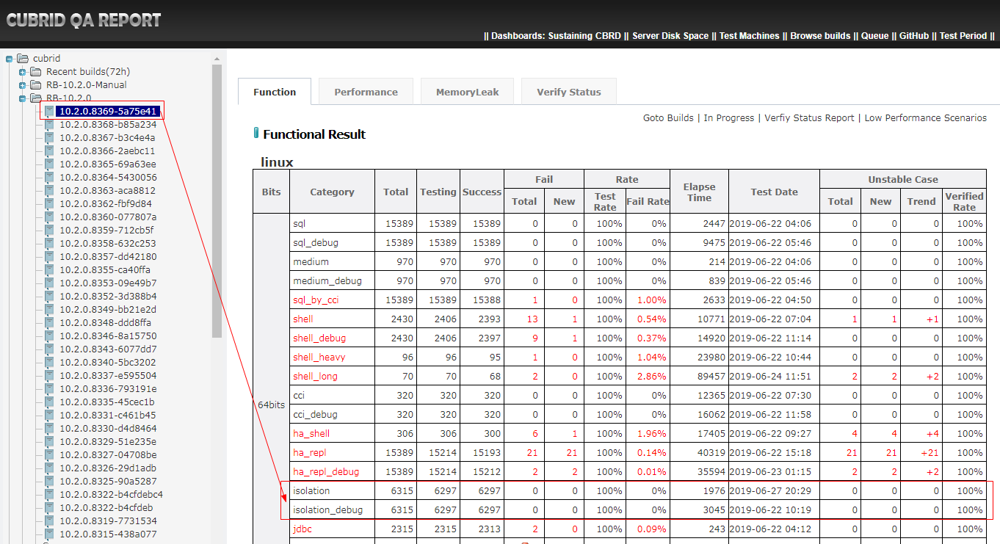
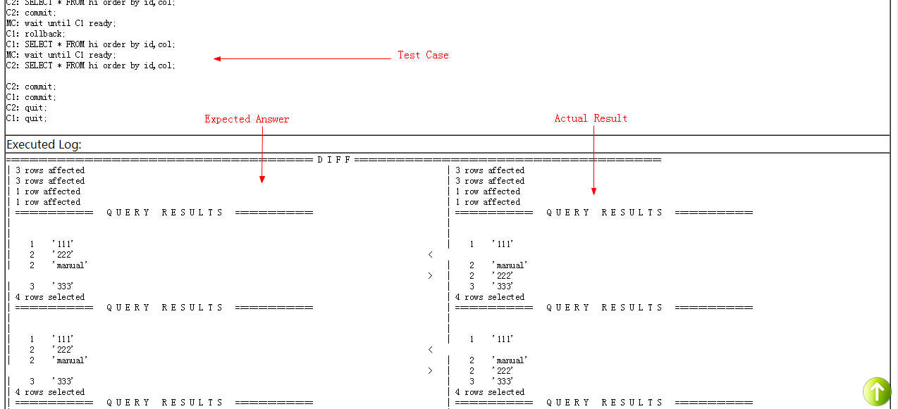

# 1. Test Objective
Isolation test is aimed to test MVCC(Multiversion Concurrency Control). We can write an isolation test case to simulate the multi-user operations and control its execution order. 

# 2. Execute Isolation Test
To perform the isolation test, we need to install CTP first.    

## 2.1 Install CTP
You can get the latest version of CTP from https://github.com/CUBRID/cubrid-testtools/tree/develop/CTP.  
1. Checkout from git repository  
    ```bash
    cd ~
    git clone https://github.com/CUBRID/cubrid-testtools.git
    cd ~/cubrid-testtools 
    git checkout develop
    cp -rf CTP ~/
    ```
2. Configurations  
* touch and configure `~/CTP/conf/common.conf`  
    ```bash
    grepo_service_url=rmi://192.168.1.91:11099
    ```
* Add below settings to `~/.bash_profile` and source it.
    ```bash
    export CTP_HOME=~/CTP
    export init_path=$CTP_HOME/shell/init_path
    # CTP_SKIP_UPDATE 0:update 1:skip 
    export CTP_SKIP_UPDATE=0
    export CTP_BRANCH_NAME=develop
    export PATH=$CTP_HOME/bin:$CTP_HOME/common/script:$PATH:$HOME/.local/bin:$HOME/bin
    . ~/.cubrid.sh
    ```
3. Make sure that CTP is installed successfully.  
    ```bash
    $ ctp.sh -h
    Welcome to use CUBRID Test Program (CTP)
    usage: ctp.sh <sql|medium|shell|ha_repl|isolation|jdbc|unittest> -c
                  <config_file>
     -c,--config <arg>   provide a configuration file
     -h,--help           show help
        --interactive    interactive mode to run single test case or cases in
                         a folder
     -v,--version        show version
    
    utility: ctp.sh webconsole <start|stop>
    
    For example: 
            ctp.sh sql -c conf/sql.conf
            ctp.sh medium -c conf/medium.conf
            ctp.sh shell -c conf/shell.conf
            ctp.sh ha_repl -c conf/ha_repl.conf
            ctp.sh isolation -c conf/isolation.conf
            ctp.sh jdbc -c conf/jdbc.conf
            ctp.sh sql              #use default configuration file: /home/memory1/CTP/conf/sql.conf
            ctp.sh medium           #use default configuration file: /home/memory1/CTP/conf/medium.conf
            ctp.sh shell            #use default configuration file: /home/memory1/CTP/conf/shell.conf
            ctp.sh ha_repl          #use default configuration file: /home/memory1/CTP/conf/ha_repl.conf
            ctp.sh isolation                #use default configuration file: /home/memory1/CTP/conf/isolation.conf
            ctp.sh jdbc             #use default configuration file: /home/memory1/CTP/conf/jdbc.conf
            ctp.sh unittest #use default configuration file: /home/memory1/CTP/conf/unittest.conf
            ctp.sh sql medium       #run both sql and medium with default configuration
            ctp.sh medium medium    #execute medium twice
            ctp.sh webconsole start #start web console to view sql test results
    ```
    For more instructions to CTP, please see  https://github.com/CUBRID/cubrid-testtools/blob/develop/CTP/README.md.   

## 2.2 Checkout Isolation Test Cases
You can checkout isolation test cases from https://github.com/CUBRID/cubrid-testcases/tree/develop/isolation.   
```bash
$ git clone https://github.com/CUBRID/cubrid-testcases.git
$ cd cubrid-testcases/isolation
$ ls
_01_ReadCommitted  _02_RepeatableRead  _04_RepeatableRead_ReadCommitted  _05_ReadCommitted_RepeatableRead  config
```

## 2.3 Quick Start
1. Install CUBRID  
    ```bash
    run_cubrid_install http://192.168.1.91:8080/REPO_ROOT/store_01/10.2.0.8368-b85a234/drop/CUBRID-10.2.0.8368-b85a234-Linux.x86_64-debug.sh
    ```
2. Configure a config file  
Touch an empty file `isolation_quick_start.conf`, set `scenario` path. `scenario` should be a path to a folder but not a file.   
    ```
    scenario=${HOME}/cubrid-testcases/isolation/_01_ReadCommitted/authorization/method/
    ```
3. Run   
    ```bash
    ctp.sh isolation -c ./isolation_quick_start.conf
    ```
    Screen output:
    Druing the test, CTP prints testing information like test configs, deploy status, test results, execution time and so on.  
    ```
    $ ctp.sh isolation -c ./isolation_quick_start.conf                                            
    
    ====================================== ISOLATION ==========================================
    [ISOLATION] TEST STARTED (Tue Jun 25 16:47:00 KST 2019)
    
    [ISOLATION] CONFIG FILE: /home/may/isolation_quick_start.conf
    
    scenario=${HOME}/cubrid-testcases/isolation/_01_ReadCommitted/authorization/method/
    
    
    ----------END OF FILE----------
    Available Env: [local]
    Build Id: 10.2.0.8368-b85a234
    Build Bits: 64bits
    java.runtime.name=Java(TM) SE Runtime Environment
    ...
    ...
    ============= FETCH TEST CASES ==================
    The category:isolation
    The Number of Test Cases: 10 (macro skipped: 0, bug skipped: 0)
    The Number of Test Case : 10
    ============= DEPLOY ==================
    DONE
    ============= TEST ==================
    STARTED
    [ENV START] local
    [TESTCASE] cubrid-testcases/isolation/_01_ReadCommitted/authorization/method/add_user_01.ctl EnvId=local [OK]
    [TESTCASE] cubrid-testcases/isolation/_01_ReadCommitted/authorization/method/add_user_02.ctl EnvId=local [OK]
    [TESTCASE] cubrid-testcases/isolation/_01_ReadCommitted/authorization/method/changing_owner_01.ctl EnvId=local [OK]
    [TESTCASE] cubrid-testcases/isolation/_01_ReadCommitted/authorization/method/changing_owner_02.ctl EnvId=local [OK]
    [TESTCASE] cubrid-testcases/isolation/_01_ReadCommitted/authorization/method/changing_owner_03.ctl EnvId=local [OK]
    [TESTCASE] cubrid-testcases/isolation/_01_ReadCommitted/authorization/method/drop_user_01.ctl EnvId=local [OK]
    [TESTCASE] cubrid-testcases/isolation/_01_ReadCommitted/authorization/method/drop_user_02.ctl EnvId=local [OK]
    [TESTCASE] cubrid-testcases/isolation/_01_ReadCommitted/authorization/method/find_user_01.ctl EnvId=local [OK]
    [TESTCASE] cubrid-testcases/isolation/_01_ReadCommitted/authorization/method/find_user_02.ctl EnvId=local [OK]
    [TESTCASE] cubrid-testcases/isolation/_01_ReadCommitted/authorization/method/login_01.ctl EnvId=local [OK]
    [ENV STOP] local
    ============= PRINT SUMMARY ==================
    Test Category:isolation
    Total Case:10
    Total Execution Case:10
    Total Success Case:10
    Total Fail Case:0
    Total Skip Case:0
    
    TEST COMPLETE
    [ISOLATION] TEST END (Tue Jun 25 16:47:24 KST 2019)
    [ISOLATION] ELAPSE TIME: 24 seconds
    ```
4. Test logs  
During the test, the test logs are generated to `CTP/result/isolation/current_runtime_logs`, after test finish, current_runtime_logs will be backuped as a `.tar.gz` file.   
    ```bash
    $ cd ~/CTP/result/isolation/
    $ ls
    current_runtime_logs  isolation_result_10.2.0.8368-b85a234_64bits_0_2019.6.25_6.32.56.tar.gz
    $ ls -l current_runtime_logs/                
    total 108
    -rw-rw-r--. 1 may may   571 Jun 25 18:32 check_local.log
    -rw-rw-r--. 1 may may   839 Jun 25 18:32 dispatch_tc_ALL.txt
    -rw-rw-r--. 1 may may   839 Jun 25 18:32 dispatch_tc_FIN_local.txt
    -rw-rw-r--. 1 may may  1537 Jun 25 18:32 feedback.log
    -rw-rw-r--. 1 may may  2479 Jun 25 18:32 main_snapshot.properties
    -rw-rw-r--. 1 may may 83236 Jun 25 18:32 test_local.log
    -rw-rw-r--. 1 may may   157 Jun 25 18:32 test_status.data
    $ tar tvf isolation_result_10.2.0.8368-b85a234_64bits_0_2019.6.25_6.32.56.tar.gz 
    drwxrwxr-x may/may           0 2019-06-25 18:32 ./
    -rw-rw-r-- may/may        2479 2019-06-25 18:32 ./main_snapshot.properties
    -rw-rw-r-- may/may         571 2019-06-25 18:32 ./check_local.log
    -rw-rw-r-- may/may        1537 2019-06-25 18:32 ./feedback.log
    -rw-rw-r-- may/may         839 2019-06-25 18:32 ./dispatch_tc_ALL.txt
    -rw-rw-r-- may/may         839 2019-06-25 18:32 ./dispatch_tc_FIN_local.txt
    -rw-rw-r-- may/may         157 2019-06-25 18:32 ./test_status.data
    -rw-rw-r-- may/may       83236 2019-06-25 18:32 ./test_local.log
    ```
5. Test Result  
The results of each test case are generated to the same path with test cases.   
    ```
    $ cd cubrid-testcases/isolation/_01_ReadCommitted/authorization/method/
    $ ll
    total 88
    -rw-rw-r--. 1 may may 1830 Jun 19 12:31 add_user_01.ctl
    -rw-rw-r--. 1 may may   16 Jun 26 17:12 add_user_01.result
    -rw-rw-r--. 1 may may 1733 Jun 19 12:31 add_user_02.ctl
    -rw-rw-r--. 1 may may   16 Jun 25 18:32 add_user_02.result
    drwxrwxr-x. 2 may may 4096 Jun 26 17:12 answer
    -rw-rw-r--. 1 may may 2067 Jun 19 12:31 changing_owner_01.ctl
    -rw-rw-r--. 1 may may   22 Jun 25 18:32 changing_owner_01.result
    -rw-rw-r--. 1 may may 2210 Jun 19 12:31 changing_owner_02.ctl
    -rw-rw-r--. 1 may may   22 Jun 25 18:32 changing_owner_02.result
    -rw-rw-r--. 1 may may 2209 Jun 19 12:31 changing_owner_03.ctl
    -rw-rw-r--. 1 may may   22 Jun 25 18:32 changing_owner_03.result
    -rw-rw-r--. 1 may may 1851 Jun 19 12:31 drop_user_01.ctl
    -rw-rw-r--. 1 may may   17 Jun 25 18:32 drop_user_01.result
    -rw-rw-r--. 1 may may 1834 Jun 19 12:31 drop_user_02.ctl
    -rw-rw-r--. 1 may may   17 Jun 25 18:32 drop_user_02.result
    -rw-rw-r--. 1 may may 1897 Jun 19 12:31 find_user_01.ctl
    -rw-rw-r--. 1 may may   17 Jun 25 18:32 find_user_01.result
    -rw-rw-r--. 1 may may 1755 Jun 19 12:31 find_user_02.ctl
    -rw-rw-r--. 1 may may   17 Jun 25 18:32 find_user_02.result
    -rw-rw-r--. 1 may may 1645 Jun 19 12:31 login_01.ctl
    -rw-rw-r--. 1 may may   13 Jun 25 18:32 login_01.result
    drwxrwxr-x. 2 may may 4096 Jun 26 17:12 result
    $ ll answer/
    total 40
    -rw-rw-r--. 1 may may 844 Jun 26 17:12 add_user_01.answer
    -rw-rw-r--. 1 may may 708 Jun 19 12:31 add_user_02.answer
    -rw-rw-r--. 1 may may 637 Jun 19 12:31 changing_owner_01.answer
    -rw-rw-r--. 1 may may 556 Jun 19 12:31 changing_owner_02.answer
    -rw-rw-r--. 1 may may 556 Jun 19 12:31 changing_owner_03.answer
    -rw-rw-r--. 1 may may 694 Jun 19 12:31 drop_user_01.answer
    -rw-rw-r--. 1 may may 725 Jun 19 12:31 drop_user_02.answer
    -rw-rw-r--. 1 may may 947 Jun 19 12:31 find_user_01.answer
    -rw-rw-r--. 1 may may 672 Jun 19 12:31 find_user_02.answer
    -rw-rw-r--. 1 may may 927 Jun 19 12:31 login_01.answer
    $ ll result/
    total 160
    -rw-rw-r--. 1 may may   844 Jun 26 17:12 add_user_01.log
    -rw-rw-r--. 1 may may  9251 Jun 26 17:12 add_user_01.result
    -rw-rw-r--. 1 may may   708 Jun 25 18:32 add_user_02.log
    -rw-rw-r--. 1 may may  8523 Jun 25 18:32 add_user_02.result
    -rw-rw-r--. 1 may may   637 Jun 25 18:32 changing_owner_01.log
    -rw-rw-r--. 1 may may 10666 Jun 25 18:32 changing_owner_01.result
    -rw-rw-r--. 1 may may   556 Jun 25 18:32 changing_owner_02.log
    -rw-rw-r--. 1 may may 11333 Jun 25 18:32 changing_owner_02.result
    -rw-rw-r--. 1 may may   556 Jun 25 18:32 changing_owner_03.log
    -rw-rw-r--. 1 may may 11333 Jun 25 18:32 changing_owner_03.result
    -rw-rw-r--. 1 may may   694 Jun 25 18:32 drop_user_01.log
    -rw-rw-r--. 1 may may  9081 Jun 25 18:32 drop_user_01.result
    -rw-rw-r--. 1 may may   725 Jun 25 18:32 drop_user_02.log
    -rw-rw-r--. 1 may may  9039 Jun 25 18:32 drop_user_02.result
    -rw-rw-r--. 1 may may   947 Jun 25 18:32 find_user_01.log
    -rw-rw-r--. 1 may may  9643 Jun 25 18:32 find_user_01.result
    -rw-rw-r--. 1 may may   672 Jun 25 18:32 find_user_02.log
    -rw-rw-r--. 1 may may  8266 Jun 25 18:32 find_user_02.result
    -rw-rw-r--. 1 may may   927 Jun 25 18:32 login_01.log
    -rw-rw-r--. 1 may may  8237 Jun 25 18:32 login_01.result
    $ 
    ```
* The files end with `.result` in the same directory as test case record the success or failure of the test cases.   
    ```bash
    $ cat add_user_01.result 
    add_user_01:OK.
    ```
* The files end with `.result` in the `result` directory are the detailed log of the test cases execution. 
    ```bash
    $ cat result/add_user_01.result 
    MC: Attempting to restart master client.
    INFO! Setting up 3 clients.
    C1 output (Transaction index = 2):
    | Client 1 (Transaction index =    2) is ready.
    
    C2 output (Transaction index = 3):
    | Client 2 (Transaction index =    3) is ready.
    
    C3 output (Transaction index = 4):
    | Client 3 (Transaction index =    4) is ready.
    
    QACTL 0 line: 25 statement: (MC: setup NUM_CLIENTS = 3;)
    MC to C1: login as 'dba';
    C1 output (Transaction index = 2):
    | Ope_no =    1, Client_no = 1
    | login as 'dba';
    
    ...
    
    QACTL 0 line: 75 statement: (MC: wait until C3 ready;)
    C3 output (Transaction index = 4):
    | Client 3 (Transaction index =    4) is ready.
    
    MC to C3: quit;
    C3 output (Transaction index = 4):
    | Ope_no =    8, Client_no = 3
    | quit;
    
    C3 output (Transaction index = 4):
    | This client shutting down as commanded.
    ```
* The files end with `.log` in the `result` directory are the actual result of test case.   
    ```bash
    $ cat result/add_user_01.log 
    | ERROR RETURNED: Operation "add_user" can only be performed by the DBA or a DBA group member. 
    |    on statement number: 10
    | =================   Q U E R Y   R E S U L T S   =================
    | 
    | 
    |    'COMPANY'  
    |    'DBA'  
    |    'DESIGN'  
    |    'PUBLIC'  
    | 4 rows selected
    | =================   Q U E R Y   R E S U L T S   =================
    | 
    | 
    |    'COMPANY'  
    |    'DBA'  
    |    'DESIGN'  
    |    'JONES'  
    |    'PUBLIC'  
    | 5 rows selected
    | =================   Q U E R Y   R E S U L T S   =================
    | 
    | 
    |    NULL  
    | 1 row affected
    | =================   Q U E R Y   R E S U L T S   =================
    | 
    | 
    |    'COMPANY'  
    |    'DBA'  
    |    'DESIGN'  
    |    'JONES'  
    |    'PUBLIC'  
    | 5 rows selected
    | ERROR RETURNED: Semantic: SELECT is not authorized on t1. select t1.id, t1.phone from t1 t1 
    |    on statement number: 10
    ```
* The success or failure of the test case is obtained by comparing the `.answer` file in the `answer` directory with the `.log` file in the `result` directory.  
    ```bash
    $ diff answer/add_user_01.answer result/add_user_01.log  -y
    | ERROR RETURNED: Operation "add_user" can only be performed    | ERROR RETURNED: Operation "add_user" can only be performed 
    |    on statement number: 10                                    |    on statement number: 10
    | =================   Q U E R Y   R E S U L T S   ===========   | =================   Q U E R Y   R E S U L T S   ===========
    |                                                               | 
    |                                                               | 
    |    'COMPANY'                                                  |    'COMPANY'  
    |    'DBA'                                                      |    'DBA'  
    |    'DESIGN'                                                   |    'DESIGN'  
    |    'PUBLIC'                                                   |    'PUBLIC'  
    | 4 rows selected                                               | 4 rows selected
    | =================   Q U E R Y   R E S U L T S   ===========   | =================   Q U E R Y   R E S U L T S   ===========
    |                                                               | 
    |                                                               | 
    |    'COMPANY'                                                  |    'COMPANY'  
    |    'DBA'                                                      |    'DBA'  
    |    'DESIGN'                                                   |    'DESIGN'  
    |    'JONES'                                                    |    'JONES'  
    |    'PUBLIC'                                                   |    'PUBLIC'  
    | 5 rows selected                                               | 5 rows selected
    | =================   Q U E R Y   R E S U L T S   ===========   | =================   Q U E R Y   R E S U L T S   ===========
    |                                                               | 
    |                                                               | 
    |    NULL                                                       |    NULL  
    | 1 row affected                                                | 1 row affected
    | =================   Q U E R Y   R E S U L T S   ===========   | =================   Q U E R Y   R E S U L T S   ===========
    |                                                               | 
    |                                                               | 
    |    'COMPANY'                                                  |    'COMPANY'  
    |    'DBA'                                                      |    'DBA'  
    |    'DESIGN'                                                   |    'DESIGN'  
    |    'JONES'                                                    |    'JONES'  
    |    'PUBLIC'                                                   |    'PUBLIC'  
    | 5 rows selected                                               | 5 rows selected
    | ERROR RETURNED: Semantic: SELECT is not authorized on t1. s   | ERROR RETURNED: Semantic: SELECT is not authorized on t1. s
    |    on statement number: 10                                    |    on statement number: 10
    $ echo $?
    0
    ```
    If the `.log` file is different from `.answer`file, the result turns out `NOK`. 
## 2.4 Execute test on multiple nodes
Since we have thousands of isolation test cases, it takes a long time to finish. So we need to execute the test cases in parallel. CTP supports multi-node execution of test cases.  
1. CTP and CUBRID should be installed and cubrid-testcases should be checked out on each test node.   
2. Configure a config file    
    Touch an empty file `isolation_multi_node.conf`, then define test nodes.  
    ```
    scenario=${HOME}/cubrid-testcases/isolation/_01_ReadCommitted/authorization/managing_user/
    
    env.instance1.ssh.host=192.168.1.118
    env.instance1.ssh.port=22
    env.instance1.ssh.user=may
    env.instance1.ssh.pwd=PASSWORD
    
    env.instance2.ssh.host=192.168.1.124
    env.instance2.ssh.port=22
    env.instance2.ssh.user=may
    env.instance2.ssh.pwd=PASSWORD
    ```
    To know more about the configurations, see https://github.com/CUBRID/cubrid-testtools/blob/develop/CTP/conf/isolation.conf.   
3. Run    
    ```bash
    ctp.sh isolation -c isolation_multi_node.conf
    ```
    Screen output:
    ```
    $ ctp.sh isolation -c isolation_multi_node.conf
    
    ====================================== ISOLATION ==========================================
    [ISOLATION] TEST STARTED (Tue Jun 25 18:51:03 KST 2019)
    
    [ISOLATION] CONFIG FILE: /home/may/isolation_multi_node.conf
    
    scenario=${HOME}/cubrid-testcases/isolation/_01_ReadCommitted/authorization/managing_user
    env.instance2.ssh.user=may
    env.instance1.ssh.pwd=PASSWORD
    env.instance2.ssh.pwd=PASSWORD
    env.instance1.ssh.user=may
    env.instance1.ssh.host=192.168.1.118
    env.instance2.ssh.port=22
    env.instance2.ssh.host=192.168.1.124
    env.instance1.ssh.port=22
    
    
    ----------END OF FILE----------
    Available Env: [instance1, instance2]
    Build Id: 10.2.0.8368-b85a234
    Build Bits: 64bits
    ...
    BEGIN TO CHECK: 
    =================== Check may@192.168.1.118:22============================
    ==> Check ssh connection ...... PASS
    ==> Check variable 'JAVA_HOME' ...... PASS
    ==> Check variable 'CTP_HOME' ...... PASS
    ==> Check variable 'CUBRID' ...... PASS
    ==> Check command 'java' ...... PASS
    ==> Check command 'diff' ...... PASS
    ==> Check command 'wget' ...... PASS
    ==> Check command 'find' ...... PASS
    ==> Check command 'cat' ...... PASS
    ==> Check directory 'cubrid-testcases/isolation/_01_ReadCommitted/authorization/managing_user' ...... PASS
    ==> Check directory '${CTP_HOME}/isolation/ctltool' ...... PASS
    
    =================== Check may@192.168.1.124:22============================
    ==> Check ssh connection ...... PASS
    ==> Check variable 'JAVA_HOME' ...... PASS
    ==> Check variable 'CTP_HOME' ...... PASS
    ==> Check variable 'CUBRID' ...... PASS
    ==> Check command 'java' ...... PASS
    ==> Check command 'diff' ...... PASS
    ==> Check command 'wget' ...... PASS
    ==> Check command 'find' ...... PASS
    ==> Check command 'cat' ...... PASS
    ==> Check directory 'cubrid-testcases/isolation/_01_ReadCommitted/authorization/managing_user' ...... PASS
    ==> Check directory '${CTP_HOME}/isolation/ctltool' ...... PASS
    
    CHECK RESULT: PASS
    ============= UPDATE TEST CASES ==================
    [INFO] START (Tue Jun 25 18:51:09 KST 2019)
    grepo_service_url: rmi://192.168.1.91:11099/repoService
    [INFO] begin to fetch ... 
            REPO:           cubrid-testtools
            BRANCH:         develop
            PATH:           CTP
            CLIENT SHA1:    55c34777593040342116dc769a3c16e40f058eee
    [INFO] fetch done: NO CHANGE
    [INFO] got package file: /home/may/CTP/.dailyqa/cubrid-testtools_develop_CTP.zip
    [INFO] begin to expand files ... 
    [INFO] expand done
    [INFO] DONE Tue Jun 25 18:51:09 KST 2019
    DONE
    Above EnvId is instance1
    SKIP TEST CASE UPDATE!
    [INFO] START (Tue Jun 25 18:51:10 KST 2019)
    grepo_service_url: rmi://192.168.1.91:11099/repoService
    [INFO] begin to fetch ... 
            REPO:           cubrid-testtools
            BRANCH:         develop
            PATH:           CTP
            CLIENT SHA1:    55c34777593040342116dc769a3c16e40f058eee
    [INFO] fetch done: NO CHANGE
    [INFO] got package file: /home/may/CTP/.dailyqa/cubrid-testtools_develop_CTP.zip
    [INFO] begin to expand files ... 
    [INFO] expand done
    [INFO] DONE Tue Jun 25 18:51:14 KST 2019
    DONE
    Above EnvId is instance2
    SKIP TEST CASE UPDATE!
    DONE
    ============= FETCH TEST CASES ==================
    The category:isolation
    The Number of Test Cases: 12 (macro skipped: 0, bug skipped: 0)
    The Number of Test Case : 12
    ============= DEPLOY ==================
    DONE
    ============= TEST ==================
    [ENV START] instance1
    STARTED
    [ENV START] instance2
    [TESTCASE] cubrid-testcases/isolation/_01_ReadCommitted/authorization/managing_user/bug_bts_13384.ctl EnvId=instance1 [OK]
    [TESTCASE] cubrid-testcases/isolation/_01_ReadCommitted/authorization/managing_user/create_create_01.ctl EnvId=instance1 [OK]
    [TESTCASE] cubrid-testcases/isolation/_01_ReadCommitted/authorization/managing_user/create_create_02.ctl EnvId=instance1 [OK]
    [TESTCASE] cubrid-testcases/isolation/_01_ReadCommitted/authorization/managing_user/create_create_03.ctl EnvId=instance1 [OK]
    [TESTCASE] cubrid-testcases/isolation/_01_ReadCommitted/authorization/managing_user/create_create_04.ctl EnvId=instance1 [OK]
    [TESTCASE] cubrid-testcases/isolation/_01_ReadCommitted/authorization/managing_user/group_member_01.ctl EnvId=instance1 [OK]
    [TESTCASE] cubrid-testcases/isolation/_01_ReadCommitted/authorization/managing_user/group_member_02.ctl EnvId=instance1 [OK]
    [TESTCASE] cubrid-testcases/isolation/_01_ReadCommitted/authorization/managing_user/group_member_03.ctl EnvId=instance1 [OK]
    [TESTCASE] cubrid-testcases/isolation/_01_ReadCommitted/authorization/managing_user/bug_bts_13467.ctl EnvId=instance2 [OK]
    [TESTCASE] cubrid-testcases/isolation/_01_ReadCommitted/authorization/managing_user/group_member_04.ctl EnvId=instance1 [OK]
    [TESTCASE] cubrid-testcases/isolation/_01_ReadCommitted/authorization/managing_user/group_member_06.ctl EnvId=instance1 [OK]
    [ENV STOP] instance1
    [TESTCASE] cubrid-testcases/isolation/_01_ReadCommitted/authorization/managing_user/group_member_05.ctl EnvId=instance2 [OK]
    [ENV STOP] instance2
    ============= PRINT SUMMARY ==================
    Test Category:isolation
    Total Case:12
    Total Execution Case:12
    Total Success Case:12
    Total Fail Case:0
    Total Skip Case:0
    
    TEST COMPLETE
    [ISOLATION] TEST END (Tue Jun 25 18:51:51 KST 2019)
    [ISOLATION] ELAPSE TIME: 47 seconds
    ```
4. Test logs   
    Test logs on each test nodes saved with a suffix which are named by instance name.   
    ```
    $ cd ~/CTP/result/isolation/current_runtime_logs
    $ ll
    total 144
    -rw-rw-r--. 1 may may   593 Jun 25 18:51 check_instance1.log
    -rw-rw-r--. 1 may may   593 Jun 25 18:51 check_instance2.log
    -rw-rw-r--. 1 may may  1116 Jun 25 18:51 dispatch_tc_ALL.txt
    -rw-rw-r--. 1 may may   932 Jun 25 18:51 dispatch_tc_FIN_instance1.txt
    -rw-rw-r--. 1 may may   184 Jun 25 18:51 dispatch_tc_FIN_instance2.txt
    -rw-rw-r--. 1 may may  2106 Jun 25 18:51 feedback.log
    -rw-rw-r--. 1 may may  2730 Jun 25 18:51 main_snapshot.properties
    -rw-rw-r--. 1 may may 87025 Jun 25 18:51 test_instance1.log
    -rw-rw-r--. 1 may may 24240 Jun 25 18:51 test_instance2.log
    -rw-rw-r--. 1 may may   157 Jun 25 18:51 test_status.data
    ```
## 2.5 Execute one isolation test case
If you want to execute only one test case but not a test cases folder, you can use `CTP/isolation/ctltool/runone.sh`.   
```
Usage: sh runone.sh <case path> <timeout time> 
```
For example,
```bash
$ cd CTP/isolation/ctltool/
$ sh CTP/isolation/ctltool/runone.sh  ~/cubrid-testcases/isolation/_01_ReadCommitted/authorization/method/add_user_01.ctl 300
Testing cubrid-testcases/isolation/_01_ReadCommitted/authorization/method/add_user_01.ctl (retry count: 0)
flag: OK
```
By this way, the result will be generated in the test case directory, CTP will not generate logs under `CTP/result/isolation/current_runtime_logs`.   

You can define an alias to use this script easily.
```
alias runone="sh $CTP_HOME/isolation/ctltool/runone.sh "
```
Then you can execute test as 
```
cd ~/cubrid-testcases/isolation/_01_ReadCommitted/authorization/method/
runone add_user_01.ctl 300
```

# 3. Deploy and Execute Regression Tests
## 3.1 Test Machines
In the current daily regression test, we are using one controller node and twelve test nodes.

No.  |Role  |User Name  |IP  |Hostname
 --|--|--|--|--
0  |Controller node|  controller|  192.168.1.83  |func08
1  |Test node  |isolation  |192.168.1.83  |func08
2  |Test node  |isolation  |192.168.1.84  |func09
3  |Test node  |isolation  |192.168.1.85  |func10
4  |Test node  |isolation  |192.168.1.87  |func12
5  |Test node  |isolation  |192.168.1.88  |func13
6  |Test node  |isolation  |192.168.1.89  |func14
7  |Test node  |isolation  |192.168.1.92  |func17
8  |Test node  |isolation  |192.168.1.93  |func18
9  |Test node  |isolation  |192.168.1.94  |func19
10  |Test node  |isolation  |192.168.1.95  |func20
11  |Test node  |isolation  |192.168.1.96  |func21
12  |Test node  |isolation  |192.168.1.97  |func22

 **Controller node** listens to test messages and starts a test when there is a test message. It will distribute test cases to each test node for execution.   
 **Test nodes** execute test cases in parallel.   

## 3.2 Deploy Regression Tests Environment
### On Controller node
1. Install CTP  
Follow [the guide to install CTP](#21-install-ctp) first, then configure `CTP/conf/common.conf` as below.
    ```
    # git user information, used to checkout the latest test cases.
    git_user=cubridqa
    git_pwd=PASSWORD
    git_email=<DL email address>
    
    # default values of ssh connection.
    default_ssh_pwd=PASSWORD
    default_ssh_port=22
    
    # this service provides the latest test tool.
    grepo_service_url=rmi://192.168.1.91:11099
    coverage_controller_pwd=PASSWORD
    
    # QA hompeage server and db information, used to update testing info and test results.
    qahome_db_driver=cubrid.jdbc.driver.CUBRIDDriver
    qahome_db_url=jdbc:cubrid:192.168.1.86:33080:qaresu:dba::
    qahome_db_user=dba
    qahome_db_pwd=
    
    qahome_server_host=192.168.1.86
    qahome_server_port=22
    qahome_server_user=qahome
    qahome_server_pwd=PASSWORD
    
    # activemq information, used to managing test messages.
    activemq_user=admin
    activemq_pwd=admin
    activemq_url=failover:tcp://192.168.1.91:61616?wireFormat.maxInactivityDurationInitalDelay=30000
    
    # email address to recieve notification.
    mail_from_nickname=CUBRIDQA_BJ
    mail_from_address=<DL email address>
    ```
2. Configure test settings  
Create a config file named `$CTP_HOME/conf/isolation_template.conf` to configure daily regression test.  
Here is the config file that we use for current daily regression test.
    ```bash
    $ cat $CTP_HOME/conf/isolation_template.conf
    #setup test nodes
    env.mvcc83.ssh.host=192.168.1.83
    env.mvcc84.ssh.host=192.168.1.84
    env.mvcc85.ssh.host=192.168.1.85
    env.mvcc87.ssh.host=192.168.1.87
    env.mvcc88.ssh.host=192.168.1.88
    env.mvcc89.ssh.host=192.168.1.89
    env.mvcc92.ssh.host=192.168.1.92
    env.mvcc93.ssh.host=192.168.1.93
    env.mvcc94.ssh.host=192.168.1.94
    env.mvcc95.ssh.host=192.168.1.95
    env.mvcc96.ssh.host=192.168.1.96
    env.mvcc97.ssh.host=192.168.1.97
    
    #default value of ssh connection
    default.ssh.port=22
    default.ssh.user=isolation
    default.ssh.pwd=PASSWORD
    
    #set $CUBRID/conf/cubrid.conf
    default.cubrid.cubrid_port_id = 1570

    #set $CUBRID/conf/cubrid_broker.conf
    default.broker1.BROKER_PORT = 30070
    default.broker1.APPL_SERVER_SHM_ID=30070
    default.broker2.BROKER_PORT = 33071
    default.broker2.APPL_SERVER_SHM_ID=33071

    #set $CUBRID/conf/cubrid_ha.conf
    default.ha.ha_port_id = 59900
    
    #The test case path, the test cases must be located in the same path on all test nodes.
    scenario=$HOME/cubrid-testcases/isolation/
    testcase_git_branch=develop
    testcase_exclude_from_file=$HOME/cubrid-testcases/isolation/config/daily_regression_test_excluded_list_linux.conf
    
	#timeout seconds.If a test case has been executed for more than 300 seconds, stop it and proceed to the next test case. Prevent the test hangs on.
    testcase_timeout_in_secs=300
	
	#update test case from git repository
    testcase_update_yn=true
    testcase_retry_num=3
    
	#qa homepage database info to update test result.
    feedback_type=database
    feedback_db_host=192.168.1.86
    feedback_db_port=33080
    feedback_db_name=qaresu
    feedback_db_user=dba
    feedback_db_pwd=
    feedback_notice_qahome_url=http://192.168.1.86:8080/qaresult/shellImportAction.nhn?main_id=<MAINID>
    ```
3. Create and Start Consumer  
A consumer is used to listening to a test message. It requires a queue name and a script name to run.
* Create a script file `~/start_test.sh`. 
    ```bash
    $ cd ~
    $ touch start_test.sh
    $ cat start_test.sh
    nohup start_consumer.sh -q QUEUE_CUBRID_QA_CC_BASIC -exec run_isolation &
    ```
    **QUEUE_CUBRID_QA_CC_BASIC** is queue name    
    **run_isolation** is the script name, it will execute the script `run_isolation.sh` in `CTP/common/ext/`    
* Start consumer  
    ```bash
    $ sh start_test.sh 
    $ tail -f nohup.out
    + startAgent QUEUE_CUBRID_QA_SHELL_HA_LINUX
    + rm -rf /home/controller/CTP/common/sched/result/consumerMsg.info
    + queueName=QUEUE_CUBRID_QA_SHELL_HA_LINUX
    + cd /home/controller/CTP/common/sched
    + /usr/local/cubridqa/jdk1.8.0_201/bin/java -cp ./lib/cubridqa-scheduler.jar com.navercorp.cubridqa.scheduler.consumer.ConsumerAgent QUEUE_CUBRID_QA_SHELL_HA_LINUX
    log4j:WARN No appenders could be found for logger (org.apache.activemq.thread.TaskRunnerFactory).
    log4j:WARN Please initialize the log4j system properly.
    log4j:WARN See http://logging.apache.org/log4j/1.2/faq.html#noconfig for more info.
    ++ cat /home/controller/CTP/common/sched/result/consumerMsg.info
    ++ grep MSG_ID
    ++ awk -F : '{print $2}'
    + msgId=
    + hasTestBuild
    + analyzeMessageInfo /home/controller/CTP/common/sched/result/consumerMsg.info
    + result=/home/controller/CTP/common/sched/result/consumerMsg.info
    ++ cat /home/controller/CTP/common/sched/result/consumerMsg.info
    ++ awk /BUILD_ID/
    ++ cut -d : -f2
    + build_no=
    ++ cat /home/controller/CTP/common/sched/result/consumerMsg.info
    ++ awk /BUILD_SVN_BRANCH/
    ++ cut -d : -f2
    ++ tr -d ' '
    + branch=
    ++ cat /home/controller/CTP/common/sched/result/consumerMsg.info
    ++ awk /BUILD_BIT/
    ++ cut -d : -f2
    ++ tr -d ' '
    + bit=
    ++ cat /home/controller/CTP/common/sched/result/consumerMsg.info
    ++ awk /BUILD_SCENARIOS/
    ++ cut -d : -f2
    ++ tr -d ' '
    + scenario=
    ++ cat /home/controller/CTP/common/sched/result/consumerMsg.info
    ++ awk /BUILD_IS_FROM_GIT/
    ++ cut -d : -f2
    ++ tr -d ' '
    + build_is_from_git=
    ++ cat /home/controller/CTP/common/sched/result/consumerMsg.info
    ++ grep BUILD_URLS:
    + url_cn=
    ++ cat /home/controller/CTP/common/sched/result/consumerMsg.info
    ++ grep BUILD_URLS_KR:
    + url_kr=
    + url_cn_1=
    + url_kr_1=
    ++ cat /home/controller/CTP/common/sched/result/consumerMsg.info
    ++ awk /BUILD_STORE_ID/
    ++ cut -d : -f2
    ++ tr -d ' '
    + store_branch=
    + '[' china == china ']'
    + url=
    + fn=
    + fexe=
    + '[' '' == zip ']'
    + '[' '' ']'
    + hasBuild=false
    + '[' '' == --debug ']'
    + '[' false == true ']'
    + echo 'No build'
    No build
    + let count=count+1
    + '[' -f /home/controller/CTP/common/sched/status/STATUS.TXT ']'
    + sleep 5
    ```
	It will check if there is a test message every five seconds.
4. Stop Consumer  
When you're investigating a problem, you may need to stop consumer to avoid it starts a new test. You can execute the `stop_consumer.sh` to stop it.  
* Check the process  
    ```bash
    $ ps -u $USER f|tee
      PID TTY      STAT   TIME COMMAND
    32464 ?        S      0:00 sshd: controller@pts/1
    32465 pts/1    Ss     0:00  \_ -bash
    21192 pts/1    R+     0:00      \_ ps -u controller f
    21193 pts/1    S+     0:00      \_ tee
    19130 pts/1    S      0:00 /bin/bash /home/controller/CTP/common/script/start_consumer.sh -q QUEUE_CUBRID_QA_CC_BASIC,QUEUE_CUBRID_QA_SHELL_HA_LINUX -exec run_isolation,run_shell
    21152 pts/1    S      0:00  \_ sleep 5
    ```
* Stop Consumer
    ```bash
    $ stop_consumer.sh 
    /home/controller/CTP/common/script/stop_consumer.sh: line 34: kill: (27873) - No such process
	````
	There is no start_consumer.sh process anymore.
	```bash
    $ ps -u $USER f|tee
      PID TTY      STAT   TIME COMMAND
    32464 ?        S      0:00 sshd: controller@pts/1
    32465 pts/1    Ss     0:00  \_ -bash
    27950 pts/1    R+     0:00      \_ ps -u controller f
    27951 pts/1    S+     0:00      \_ tee
    ```

### On Test nodes   
1. Install CTP   
Install CTP as it [on controller node](#on-controller-node).  
2. Checkout test cases    
Checkout test cases as [2.2 Checkout Isolation Test Cases](#22-checkout-isolation-test-cases) on each test node. The `cubrid-testcases` should be at the same path on each test node.   
3. Install CUBRID on each test node   
    ```bash
    run_cubrid_install http://192.168.1.91:8080/REPO_ROOT/store_01/10.2.0.8368-b85a234/drop/CUBRID-10.2.0.8368-b85a234-Linux.x86_64-debug.sh
    ```

# 4. Regression Tests
We perform isolation/isolation_debug for daily (actually is for each build) and perform code coverage test of isolation for monthly. `isolation_debug` is executing isolation test cases with a debug build.   
## 4.1 Daily regression test
To execute the isolation/isolation_debug test, you only need to send a testing message.
1. Login to the message server: `message@192.168.1.91`
2. Send test message
    * To execute an isolation test with release build
    ```bash
    sender.sh QUEUE_CUBRID_QA_CC_BASIC http://192.168.1.91:8080/REPO_ROOT/store_01/10.2.0.8369-5a75e41/drop/CUBRID-10.2.0.8369-5a75e41-Linux.x86_64.sh isolation default
    ```
    * To execute an isolation_debug test with debug build
    ```bash 
    sender.sh QUEUE_CUBRID_QA_CC_BASIC http://192.168.1.91:8080/REPO_ROOT/store_01/10.2.0.8369-5a75e41/drop/CUBRID-10.2.0.8369-5a75e41-Linux.x86_64-debug.sh isolation_debug default
    ```
    For example, run an isolation test on 10.2.0.8369-5a75e41 build, you need to send a message like below.
    ```bash
    $ sender.sh QUEUE_CUBRID_QA_CC_BASIC http://192.168.1.91:8080/REPO_ROOT/store_01/10.2.0.8369-5a75e41/drop/CUBRID-10.2.0.8369-5a75e41-Linux.x86_64.sh isolation default
    
    Message: 
    
    Message Content: Test for build 10.2.0.8369-5a75e41 by CUBRID QA Team, China
    MSG_ID = 190627-195624-685-000001
    MSG_PRIORITY = 4
    BUILD_ABSOLUTE_PATH=/home/ci_build/REPO_ROOT/store_01/10.2.0.8369-5a75e41/drop
    BUILD_BIT=0
    BUILD_CREATE_TIME=1561143743000
    BUILD_GENERATE_MSG_WAY=MANUAL
    BUILD_ID=10.2.0.8369-5a75e41
    BUILD_IS_FROM_GIT=1
    BUILD_PACKAGE_PATTERN=CUBRID-{1}-Linux.x86_64.sh
    BUILD_SCENARIOS=isolation
    BUILD_SCENARIO_BRANCH_GIT=develop
    BUILD_SEND_DELAY=489241
    BUILD_SEND_TIME=1561632984684
    BUILD_STORE_ID=store_01
    BUILD_SVN_BRANCH=RB-10.2.0
    BUILD_SVN_BRANCH_NEW=RB-10.2.0
    BUILD_TYPE=general
    BUILD_URLS=http://192.168.1.91:8080/REPO_ROOT/store_01/10.2.0.8369-5a75e41/drop/CUBRID-10.2.0.8369-5a75e41-Linux.x86_64.sh
    BUILD_URLS_CNT=1
    BUILD_URLS_KR=http://192.168.1.91:8080/REPO_ROOT/store_01/10.2.0.8369-5a75e41/drop/CUBRID-10.2.0.8369-5a75e41-Linux.x86_64.sh
    
    
    Do you accept above message [Y/N]:
    Y
    log4j:WARN No appenders could be found for logger (org.apache.activemq.thread.TaskRunnerFactory).
    log4j:WARN Please initialize the log4j system properly.
    log4j:WARN See http://logging.apache.org/log4j/1.2/faq.html#noconfig for more info.
    ```

3. Monitoring the execution log   
When you sent a test message, the consumer will catch the test massage and starts the test. You can go to the `controller node` to see the execution log.   
    ```bash
    $ tail -f nohup.out
    ++ cat /home/controller/CTP/common/sched/result/consumerMsg.info
    ++ grep MSG_ID
    ++ awk -F : '{print $2}'
    + msgId=190627-195624-685-000001
    + hasTestBuild
    + analyzeMessageInfo /home/controller/CTP/common/sched/result/consumerMsg.info
    + result=/home/controller/CTP/common/sched/result/consumerMsg.info
    ++ cat /home/controller/CTP/common/sched/result/consumerMsg.info
    ++ awk /BUILD_ID/
    ++ cut -d : -f2
    + build_no=10.2.0.8369-5a75e41
    ++ cat /home/controller/CTP/common/sched/result/consumerMsg.info
    ++ awk /BUILD_SVN_BRANCH/
    ++ cut -d : -f2
    ++ tr -d ' '
    + branch='RB-10.2.0
    RB-10.2.0'
    ++ cat /home/controller/CTP/common/sched/result/consumerMsg.info
    ++ awk /BUILD_BIT/
    ++ cut -d : -f2
    ++ tr -d ' '
    + bit=0
    ++ cat /home/controller/CTP/common/sched/result/consumerMsg.info
    ++ awk /BUILD_SCENARIOS/
    ++ cut -d : -f2
    ++ tr -d ' '
    + scenario=isolation
    ++ cat /home/controller/CTP/common/sched/result/consumerMsg.info
    ++ awk /BUILD_IS_FROM_GIT/
    ++ cut -d : -f2
    ++ tr -d ' '
    + build_is_from_git=1
    ++ cat /home/controller/CTP/common/sched/result/consumerMsg.info
    ++ grep BUILD_URLS:
    + url_cn=BUILD_URLS:http://192.168.1.91:8080/REPO_ROOT/store_01/10.2.0.8369-5a75e41/drop/CUBRID-10.2.0.8369-5a75e41-Linux.x86_64.sh
    ++ cat /home/controller/CTP/common/sched/result/consumerMsg.info
    ++ grep BUILD_URLS_KR:
    + url_kr=BUILD_URLS_KR:http://192.168.1.91:8080/REPO_ROOT/store_01/10.2.0.8369-5a75e41/drop/CUBRID-10.2.0.8369-5a75e41-Linux.x86_64.sh
    + url_cn_1=http://192.168.1.91:8080/REPO_ROOT/store_01/10.2.0.8369-5a75e41/drop/CUBRID-10.2.0.8369-5a75e41-Linux.x86_64.sh
    + url_kr_1=http://192.168.1.91:8080/REPO_ROOT/store_01/10.2.0.8369-5a75e41/drop/CUBRID-10.2.0.8369-5a75e41-Linux.x86_64.sh
    ++ cat /home/controller/CTP/common/sched/result/consumerMsg.info
    ++ awk /BUILD_STORE_ID/
    ++ cut -d : -f2
    ++ tr -d ' '
    + store_branch=store_01
    + '[' china == china ']'
    + url=http://192.168.1.91:8080/REPO_ROOT/store_01/10.2.0.8369-5a75e41/drop/CUBRID-10.2.0.8369-5a75e41-Linux.x86_64.sh
    + fn=CUBRID-10.2.0.8369-5a75e41-Linux.x86_64.sh
    + fexe=sh
    ...
    Log msg id into queue file!
    + echo MSG_ID:190627-195624-685-000001
    + echo BUILD_IS_FROM_GIT:1
    + echo 'START_TIME:2019-06-27 19:56:26 KST'
    + echo
    
    + consumerTimer 190627-195624-685-000001 start
    + msgId=190627-195624-685-000001
    + typeName=start
    ++ getTimeStamp
    +++ date '+%Y-%m-%d %H:%M:%S %Z'
    ++ timeStamp='2019-06-27 19:56:26 KST'
    ++ echo 2019-06-27 19:56:26 KST
    + timeStamp='2019-06-27 19:56:26 KST'
    + echo '++++++++ Message-190627-195624-685-000001 start at 2019-06-27 19:56:26 KST ++++++++'
    ++++++++ Message-190627-195624-685-000001 start at 2019-06-27 19:56:26 KST ++++++++
    + cd /home/controller/CTP/common/sched
    + /usr/local/cubridqa/jdk1.8.0_201/bin/java -cp ./lib/cubridqa-scheduler.jar com.navercorp.cubridqa.scheduler.consumer.ConsumerTimer 190627-195624-685-000001
     start
    + cd /home/controller/CTP
    + source /home/controller/CTP/common/sched/init.sh china
    ...
    The Number of Test Case : 6297
    ============= DEPLOY ==================
    DEPLAY START: EnvId=mvcc96[isolation@192.168.1.96:22]
    DEPLAY START: EnvId=mvcc92[isolation@192.168.1.92:22]
    DEPLAY START: EnvId=mvcc94[isolation@192.168.1.94:22]
    DEPLAY START: EnvId=mvcc89[isolation@192.168.1.89:22]
    DEPLAY START: EnvId=mvcc83[isolation@192.168.1.83:22]
    ...
    DEPLAY STOP: EnvId=mvcc94[isolation@192.168.1.94:22]
    DEPLAY STOP: EnvId=mvcc97[isolation@192.168.1.97:22]
    DEPLAY STOP: EnvId=mvcc87[isolation@192.168.1.87:22]
    DONE
    ============= TEST ==================
    [ENV START] mvcc92
    [ENV START] mvcc94
    [ENV START] mvcc96
    [ENV START] mvcc83
    [ENV START] mvcc85
    ...
    [ENV START] mvcc97
    [ENV START] mvcc84
    STARTED
    [ENV START] mvcc88
    [TESTCASE] cubrid-testcases/isolation/_01_ReadCommitted/authorization/granting_authorization/granting_authorization_02.ctl EnvId=mvcc88 [OK]
    [TESTCASE] cubrid-testcases/isolation/_01_ReadCommitted/authorization/granting_authorization/granting_authorization_03.ctl EnvId=mvcc88 [OK]
    [TESTCASE] cubrid-testcases/isolation/_01_ReadCommitted/authorization/granting_authorization/granting_authorization_01.ctl EnvId=mvcc84 [OK]
    [TESTCASE] cubrid-testcases/isolation/_01_ReadCommitted/authorization/changing_owner/changing_owner_05.ctl EnvId=mvcc85 [OK]
    [TESTCASE] cubrid-testcases/isolation/_01_ReadCommitted/authorization/changing_owner/changing_owner_04.ctl EnvId=mvcc83 [OK]
    [TESTCASE] cubrid-testcases/isolation/_01_ReadCommitted/authorization/changing_owner/changing_owner_07.ctl EnvId=mvcc89 [OK]
    [TESTCASE] cubrid-testcases/isolation/_01_ReadCommitted/authorization/granting_authorization/granting_authorization_04.ctl EnvId=mvcc88 [OK]
    [TESTCASE] cubrid-testcases/isolation/_01_ReadCommitted/authorization/granting_authorization/granting_authorization_05.ctl EnvId=mvcc84 [OK]
    [TESTCASE] cubrid-testcases/isolation/_01_ReadCommitted/authorization/granting_authorization/revoke_authorization_01.ctl EnvId=mvcc85 [OK]
    ...
    ```
    You can find the detailed logs of each node in the `$CTP_HOME/result/isolation/current_runtime_logs`.
    ```bash
    $ cd CTP/result/isolation/current_runtime_logs
    $ ls
    check_mvcc83.log  check_mvcc92.log  current_task_id             dispatch_tc_FIN_mvcc88.txt  dispatch_tc_FIN_mvcc96.txt  test_mvcc87.log  test_mvcc95.log
    check_mvcc84.log  check_mvcc93.log  dispatch_tc_ALL.txt         dispatch_tc_FIN_mvcc89.txt  dispatch_tc_FIN_mvcc97.txt  test_mvcc88.log  test_mvcc96.log
    check_mvcc85.log  check_mvcc94.log  dispatch_tc_FIN_mvcc83.txt  dispatch_tc_FIN_mvcc92.txt  main_snapshot.properties    test_mvcc89.log  test_mvcc97.log
    check_mvcc87.log  check_mvcc95.log  dispatch_tc_FIN_mvcc84.txt  dispatch_tc_FIN_mvcc93.txt  test_mvcc83.log             test_mvcc92.log
    check_mvcc88.log  check_mvcc96.log  dispatch_tc_FIN_mvcc85.txt  dispatch_tc_FIN_mvcc94.txt  test_mvcc84.log             test_mvcc93.log
    check_mvcc89.log  check_mvcc97.log  dispatch_tc_FIN_mvcc87.txt  dispatch_tc_FIN_mvcc95.txt  test_mvcc85.log             test_mvcc94.log
    $ 
    ```
4. See the testing progress in the QA homepage.   
Click the build number, find the isolation/isolation_debug category, you can see the related information from the table.   
In this picture, current test rate is 21.5%, no failied test case yet.   
   
When the test finished, you can see the test rate is 100%.   
   
## 3.4 Execute code coverage test of isolation
To execute code coverage test of isolation, you also need to send a testing message.   
1. Login to the message server: `message@192.168.1.91`.   
2. Send code coverage test message   
    ```bash
    cd manual/
    sh sender_code_coverage_testing_message.sh QUEUE_CUBRID_QA_CC_BASIC http://192.168.1.91:8080/REPO_ROOT/store_01/10.2.0.8362-fbf9d84/drop/CUBRID-10.2.0.8362-fbf9d84-gcov-Linux.x86_64.tar.gz http://192.168.1.91:8080/REPO_ROOT/store_01/10.2.0.8362-fbf9d84/drop/cubrid-10.2.0.8362-fbf9d84-gcov-src-Linux.x86_64.tar.gz isolation
    ```
	* the first url is a build for testing code coverage.
	* the sconde url is the source code of the build.
	
    For example, to execute the isolation code coverage test on 10.2.0.8362-fbf9d84 build, you need to send a test message like below. 
    ```bash
    $ cd ~/manual/
    $ sh sender_code_coverage_testing_message.sh QUEUE_CUBRID_QA_CC_BASIC http://192.168.1.91:8080/REPO_ROOT/store_01/10.2.0.8362-fbf9d84/drop/CUBRID-10.2.0.8362-fbf9d84-gcov-Linux.x86_64.tar.gz http://192.168.1.91:8080/REPO_ROOT/store_01/10.2.0.8362-fbf9d84/drop/cubrid-10.2.0.8362-fbf9d84-gcov-src-Linux.x86_64.tar.gz isolation
    Queue:QUEUE_CUBRID_QA_CC_BASIC
    Build URL:http://192.168.1.91:8080/REPO_ROOT/store_01/10.2.0.8362-fbf9d84/drop/CUBRID-10.2.0.8362-fbf9d84-gcov-Linux.x86_64.tar.gz
    Source URL:http://192.168.1.91:8080/REPO_ROOT/store_01/10.2.0.8362-fbf9d84/drop/cubrid-10.2.0.8362-fbf9d84-gcov-src-Linux.x86_64.tar.gz
    Category:isolation
    
    Message: 
    
    Message Content: Test for build 10.2.0.8362-fbf9d84 by CUBRID QA Team, China
    MSG_ID = 190627-201922-425-000001
    MSG_PRIORITY = 4
    BUILD_ABSOLUTE_PATH=/home/ci_build/REPO_ROOT/store_01/10.2.0.8362-fbf9d84/drop
    BUILD_BIT=0
    BUILD_CREATE_TIME=1558747605000
    BUILD_GENERATE_MSG_WAY=MANUAL
    BUILD_ID=10.2.0.8362-fbf9d84
    BUILD_IS_FROM_GIT=1
    BUILD_PACKAGE_PATTERN=CUBRID-{1}-gcov-Linux.x86_64.tar.gz
    BUILD_SCENARIOS=isolation
    BUILD_SCENARIO_BRANCH_GIT=develop
    BUILD_SEND_DELAY=2886757
    BUILD_SEND_TIME=1561634362424
    BUILD_STORE_ID=store_01
    BUILD_SVN_BRANCH=RB-10.2.0
    BUILD_SVN_BRANCH_NEW=RB-10.2.0
    BUILD_TYPE=coverage
    BUILD_URLS=http://192.168.1.91:8080/REPO_ROOT/store_01/10.2.0.8362-fbf9d84/drop/CUBRID-10.2.0.8362-fbf9d84-gcov-Linux.x86_64.tar.gz
    BUILD_URLS_1=http://192.168.1.91:8080/REPO_ROOT/store_01/10.2.0.8362-fbf9d84/drop/cubrid-10.2.0.8362-fbf9d84-gcov-src-Linux.x86_64.tar.gz
    BUILD_URLS_CNT=2
    BUILD_URLS_KR=http://192.168.1.91:8080/REPO_ROOT/store_01/10.2.0.8362-fbf9d84/drop/CUBRID-10.2.0.8362-fbf9d84-gcov-Linux.x86_64.tar.gz
    BUILD_URLS_KR_1=http://192.168.1.91:8080/REPO_ROOT/store_01/10.2.0.8362-fbf9d84/drop/cubrid-10.2.0.8362-fbf9d84-gcov-src-Linux.x86_64.tar.gz
    MKEY_COVERAGE_UPLOAD_DIR=/home/codecov/cc4c/result
    MKEY_COVERAGE_UPLOAD_IP=192.168.1.98
    MKEY_COVERAGE_UPLOAD_PWD=PASSWORD
    MKEY_COVERAGE_UPLOAD_USER=codecov
    
    
    Do you accept above message [Y/N]:
    ```
    For code coverage test, it doesn't show the progress in the QA homepage.  You can log in to the controller node to see the execution log and the detailed logs of each node in the `$CTP_HOME/result/isolation/current_runtime_logs`. After the test finished, you can find the result in the `code coverage` node. See [4.2 verify code coverage testing result](#42-verify-code-coverage-testing-result) for detail.   
    
# 4. Verification
## 4.1 Verify isolation/isolation_debug test result  
Go to QA homepage and click the CI build, wait for the `Function` page loading, then check if there are `isolation` and `isolation_debug` results.  
  
    **Total column:** The number of test cases, it counts all the `.ctl` files in the `scenario` path.  
    **Testing column:** The number of test cases that should be executed. It excepts the test cases that defined in `~/cubrid-testcases/isolation/config/daily_regression_test_excluded_list_linux.conf`.  
### Check if there is a result
If there shows 'NO RESULT (OR RUNNING)'as bellow, you need to find the reason.  
  
Sometimes the CI build comes late, so that the test started late; or there is another test like manual build or ha_shell tests executed before the CI build. In this case, just wait for the test finish and then verify the results.  
### Test Rate should be 100%
It means the `Testing` is equal to the sum of `Success` and `Fail(Total)`.
### Verified Rate should be 100%
If there is a failed test case, you need to verify it.  
    
Click the failed number `1`, it shows the list of failed test cases.   
    
Click the test case, it shows the test case, answer, and result.   
    
Analyze the failure, then fix/revise the test case and verify it.   
    

If you want to reproduce the failure by csql, you can refer to [Execute isolation test case by csql](#54-execute-isolation-test-case-by-csql).     
You can refer to the test case modification history for changes to the unstable test case and revise required.     
https://github.com/CUBRID/cubrid-testcases/commits/develop/isolation     

## 4.2 Verify code coverage testing result   
Go to QA homepage and find the 'code coverage' node in the left area, click the link of latest result.   
    
Click the isolation link.    
    
There is a coverage rate of lines. Its coverage rate of lines is usually in 38%~39%. You can see the expected rate from http://jira.cubrid.org/browse/CUBRIDQA-851.   
     
If the coverage does not meet expectation, you need to determine the cause and re-execute the test.   
## 4.3 Report issues
Here are the issues that you can refer to.   
* Regression issue: http://jira.cubrid.org/browse/CBRD-22630
* Compile issue: http://jira.cubrid.org/browse/CBRD-22717
## 4.4 Excluded List
If there is a test case always failed because of a bug, but due to some reason, the bug can't be fixed within a period of time, we can add test cases to the exclusion list. So that we don't need to test and verify the test case until the bug is fixed.
* You can find the exclude list from https://github.com/CUBRID/cubrid-testcases/blob/develop/isolation/config/daily_regression_test_excluded_list_linux.conf.
* If you want to add a test case to exclude list, you need to follow these rules:
    * Comment the issue number before the test case. 
    * Approved by developer.
    * Delete from list when the issue fixed.
    
# 5. Isolation Test Case   
## 5.1 Directory Structure and Naming rule   
* The current isolation test case is located in the https://github.com/CUBRID/cubrid-testcases repository.
* In the isolation directory, test cases are stored in four different combination of isolation levels. 
    ```
    $ cd cubrid-testcases/isolation
    $ ls
    _01_ReadCommitted  _02_RepeatableRead  _04_RepeatableRead_ReadCommitted  _05_ReadCommitted_RepeatableRead  config
    $ 
	```
* Each isolation level directory is further divided into multiple catalogs according to the purpose of the test. 
    ```
    $ ls cubrid-testcases/isolation/* 
    _01_ReadCommitted:
    authorization  cbrd_21506                    dml_ddl             function      issues           not_null         primary_key_column  template  view
    catalog        cbrd_22202_invisible_indexes  foreign_key_column  index_column  no_index_column  partition_table  serial              trigger
    
    _02_RepeatableRead:
    catalog  dml_ddl  foreign_key_column  function  index_column  issues  no_index_column  partition_table  primary_key_column  serial  trigger
    
    _04_RepeatableRead_ReadCommitted:
    dml_ddl  index_column  no_index_column  not_null  partition_table  primary_key_column  serial  trigger
    
    _05_ReadCommitted_RepeatableRead:
    dml_ddl  function  index_column  issues  no_index_column  partition_table  primary_key_column  serial  trigger
    
    config:
    daily_regression_test_excluded_list_linux.conf
    ``` 
* The suffix of an isolation test case is `.ctl`. The expected answer file has the same name as the test case and the suffix is `.answer[id]`. The answer files should be in the `answer` folder, and the `answer` folder and test cases are in the same path.    
   ```bash
   $ cd _01_ReadCommitted/authorization/method
   $ ls 
   add_user_01.ctl  add_user_02.ctl  answer  changing_owner_01.ctl  changing_owner_02.ctl  changing_owner_03.ctl  drop_user_01.ctl  drop_user_02.ctl  find_user_01.ctl  find_user_02.ctl  login_01.ctl
   $ ls answer/
   add_user_01.answer  changing_owner_01.answer  changing_owner_03.answer  drop_user_02.answer  find_user_02.answer
   add_user_02.answer  changing_owner_02.answer  drop_user_01.answer       find_user_01.answer  login_01.answer
   ```
* A test case can have multiple answer files, distinguished by `id` of `.answer[id]` like [insert_update_07_1.answer](https://github.com/CUBRID/cubrid-testcases/blob/develop/isolation/_01_ReadCommitted/index_column/common_index/basic_sql/answer/insert_update_07_1.answer) and [insert_update_07_1.answer1](https://github.com/CUBRID/cubrid-testcases/blob/develop/isolation/_01_ReadCommitted/index_column/common_index/basic_sql/answer/insert_update_07_1.answer1). Because in some cases, we don't know which transaction gets the lock first so we save both results as answer if they are expected.   

## 5.2 Convention Rules
An isolation test case usually consist of four parts: initialization, preparation, testing, and exit. We still take [cbrd_21900.ctl](https://github.com/CUBRID/cubrid-testcases/blob/develop/isolation/_01_ReadCommitted/issues/_18_1h/cbrd_21900.ctl) as an example.
1. Initialization  
Define the number of clients and set isolation level and lock timeout for each client.  
    ```bash
    MC: setup NUM_CLIENTS = 2;
    
    C1: set transaction lock timeout INFINITE;
    C1: set transaction isolation level read committed;
    
    C2: set transaction lock timeout 5;
    C2: set transaction isolation level read committed;
    ```
	* `MC: setup NUM_CLIENTS = 2;` means there are 2 clients used. You can define up to ten clients.
	* `C1` and `C2` represent each client. The query is executed on the corresponding client.
2. Preparation  
Create table, insert data, create indexes and so on. `commit` is required to save the transaction in this part. 
	```
    /* preparation */
    C1: DROP TABLE IF EXISTS xoo;
    C1: create table xoo (a int primary key);
    C1: insert into xoo values(5);
    C1: commit;
    ```    
3. Testing  
Perform the transaction mix scenario. 
	```
    C1: update xoo set a=a where a=5;
    MC: wait until C1 ready;
    
    C2: select * from xoo where a=5;
    MC: wait until C2 ready;
    
    C2: update xoo set a=a where a=5;
    MC: wait until C2 blocked;
    
    /*
     * C1 does not commit. C2 will be timed out.
    C1: commit;
    MC: wait until C1 ready;
     */
    
    C2: select * from xoo where a=5;
    C2: COMMIT;
    MC: wait until C2 ready; 
    ```  
	The `MC` actions here can verify the behavior and also can control the execution order.
	* `MC` action generally follows a client, it can verify the behavior of the client.
	* `MC: wait until C1 ready;`, It means you expect C1 processed normally. If C1 is blocked, the test case will fail. Other clients will be executed after C1 ready. 
    In above test case, `C1: update xoo set a=a where a=5;` and `C2: select * from xoo where a=5;`, if there is no `MC: wait until C1 ready;`, the 'C2 select' may executed before 'C1 update', that's not our expectation.  
	* `MC: wait until C2 blocked;`, It means you expected C2 is blocked. If C2 didn't blocked, then the test case will fail.
	* Isolation test cases are executed in no-auto-commit mode. So you need to execute `commit;` or `rollback;` to end a transaction.
	* The annotations in the isolation test are a pair of `/*` and `*'/`. The content between `/*` and `*'/` doesn't executed.
4. Exit  
Quit all clients at the end of test case.
    ```
    C1: quit;
    C2: quit;
    ```
## 5.3 Create an isolation test case   
Suppose we are adding a test case for http://jira.cubrid.org/browse/CBRD-21900?focusedCommentId=4748985&page=com.atlassian.jira.plugin.system.issuetabpanels:comment-tabpanel#comment-4748985.
1. Go to `_01_ReadCommitted/issues/_18_1h/` directory, create a test case file named `cbrd_21900.ctl` and an empty answer file `./answer/cbrd_21900.answer`. 
    ```bash
    $ cd ~/cubrid-testcases/isolation/_01_ReadCommitted/issues/_18_1h
    $ tree -f
    .
    +-- ./answer
     +-- ./answer/cbrd_21900.answer
    +-- ./cbrd_21900.ctl
    
    1 directory, 2 files
    ```
2. Save reproduce scenario to `cbrd_21900.ctl`.    
    ```bash
    $ cat cbrd_21900.ctl 
    MC: setup NUM_CLIENTS = 2;
    
    C1: set transaction lock timeout INFINITE;
    C1: set transaction isolation level read committed;
    
    C2: set transaction lock timeout 5;
    C2: set transaction isolation level read committed;
    
    /* preparation */
    C1: DROP TABLE IF EXISTS xoo;
    C1: create table xoo (a int primary key);
    C1: insert into xoo values(5);
    C1: commit;
    
    C1: update xoo set a=a where a=5;
    MC: wait until C1 ready;
    
    C2: select * from xoo where a=5;
    MC: wait until C2 ready;
    
    C2: update xoo set a=a where a=5;
    MC: wait until C2 blocked;
    
    /*
     * C1 does not commit. C2 will be timed out.
    C1: commit;
    MC: wait until C1 ready;
     */
    
    C2: select * from xoo where a=5;
    C2: COMMIT;
    MC: wait until C2 ready;
    
    C1: quit;
    C2: quit;
    ```
    When writing a test case please note to make it stable. Such as drop table before create, add `order by` caulse when select.
3. Execute test case
    ```bash
    $ runone cbrd_21900.ctl 300
    Testing cbrd_21900.ctl (retry count: 0)
    Testing cbrd_21900.ctl (retry count: 0)
    elapse: 5533
    0a1,14
    > | 1 row affected
    > | 1 row affected
    > | =================   Q U E R Y   R E S U L T S   =================
    > | 
    > | 
    > |    5  
    > | 1 row selected
    > | ERROR RETURNED: Your transaction (index ?, PUBLIC@localhost|?) timed out waiting on    X_LOCK lock on instance ?|?|? of class xoo. You are waiting for user(s) PUBLIC@localhost|qacsql(?) to finish. 
    > |    on statement number: 4
    > | =================   Q U E R Y   R E S U L T S   =================
    > | 
    > | 
    > |    5  
    > | 1 row selected
    flag: NOK 
    dbtype: qacsql
    ```
    After execute a test case, there will generate `result` folder which has a `.log` file and `.result` file. 
    ```bash
    $ runone cbrd_21900.ctl 300
    flag: OK
    $ tree -f
    .
    +-- ./answer
     +-- ./answer/cbrd_21900.answer          // Expected answer
    +-- ./cbrd_21900.ctl                        // Test case     
    +-- ./cbrd_21900.result                     // Executin result, log 'OK' or 'NOK'
    +-- ./csql.err                              // csql error log
    +-- ./result                                // Result folder
     +-- ./result/cbrd_21900.log             // Actural result of test case
     +-- ./result/cbrd_21900.result          // Detailed execution log of each client and MC actions
    +-- ./runone.log                            // Execution time in milliseconds
    
    2 directories, 7 files
    ```
4. Check the `./result/cbrd_21900.log` to see if the result is correct.
    ```bash
    $ cat result/cbrd_21900.log
    | 1 row affected
    | 1 row affected
    | =================   Q U E R Y   R E S U L T S   =================
    | 
    | 
    |    5  
    | 1 row selected
    | ERROR RETURNED: Your transaction (index ?, PUBLIC@localhost|?) timed out waiting on    X_LOCK lock on instance ?|?|? of class xoo. You are waiting for user(s) PUBLIC@localhost|qacsql(?) to finish. 
    |    on statement number: 4
    | =================   Q U E R Y   R E S U L T S   =================
    | 
    | 
    |    5  
    | 1 row selected
    ```
5. If result is correct then save `result/cbrd_21900.log` as `answer/cbrd_21900.answer`.
    ```bash
    $ cp result/cbrd_21900.log answer/cbrd_21900.answer 
    ```
    If result is not correct, then you need to investigate the reason. DO NOT save incorrect result as answer.   
6. Execute the test again, confirm test case executed successfully.
    ```bash
    $ runone cbrd_21900.ctl 300
    Testing cbrd_21900.ctl (retry count: 0)
    flag: OK
    ```
7. Add and commit `cbrd_21900.ctl` and `answer/cbrd_21900.answer` to repository.
    ```bash
    $ git add cbrd_21900.ctl answer/cbrd_21900.answer 
    $ git commit -m "[CBRD-21900] add test case for deadlock detection."
    8. Then open a pull request to merge the test case.
    ```

## 5.4 Execute isolation test case by csql
Sometimes, to understand the test case, you may need to reproduce it by csql manually.  
Take [cbrd_21900.ctl](https://github.com/CUBRID/cubrid-testcases/blob/develop/isolation/_01_ReadCommitted/issues/_18_1h/cbrd_21900.ctl) as an example.
1. Create and start a database.
    ```
    cubrid createdb ctldb1 en_US
    cubrid server start ctldb1
    ```
2. Login csql **public user** on  **no-auto-commit mode**. One csql session is one client.  
In cbrd_21900.ctl,`MC: setup NUM_CLIENTS = 2;`, so open two csql. 
    > MC: setup NUM_CLIENTS = 2;
    
    1. on client 1  
    ```
    csql ctldb1 --no-auto-commit
    ```
    2. on client 2
    ```
    csql ctldb1 --no-auto-commit
    ```
3. Execute each command on each consoel. 
    >C1: set transaction lock timeout INFINITE;  
    >C1: set transaction isolation level read committed;  
    1. on client 1
    ```
    csql> set transaction lock timeout INFINITE;
    Execute OK. (0.001374 sec) 
    
    1 command(s) successfully processed.
    csql> set transaction isolation level read committed;
    Execute OK. (0.000045 sec) 
    
    1 command(s) successfully processed.
    csql> 
    ```
	
    >C2: set transaction lock timeout 5;  
    >C2: set transaction isolation level read committed;  
    2. on client 2
    ```
    csql> set transaction lock timeout 5;
    Execute OK. (0.000739 sec) 
    
    1 command(s) successfully processed.
    csql> set transaction isolation level read committed;
    Execute OK. (0.000037 sec) 
    
    1 command(s) successfully processed.
    csql> 
    ```
    >/* preparation */  
    >C1: DROP TABLE IF EXISTS xoo;  
    >C1: create table xoo (a int primary key);  
    >C1: insert into xoo values(5);  
    >C1: commit;  
     3. on client 1   
    ```
    csql> DROP TABLE IF EXISTS xoo;
    Execute OK. (0.001576 sec) 
    
    1 command(s) successfully processed.
    csql> create table xoo (a int primary key);
    Execute OK. (0.015276 sec) 
    
    1 command(s) successfully processed.
    csql> insert into xoo values(5);
    1 row affected. (0.005699 sec) 
    
    1 command(s) successfully processed.
    csql> commit;
    Execute OK. (0.001922 sec) 
    
    1 command(s) successfully processed.
    csql> 
    ```
    >C1: update xoo set a=a where a=5;  
    >MC: wait until C1 ready;  
    4. on client 1  
    ```
    csql> update xoo set a=a where a=5;
    1 row affected. (0.006018 sec) 
    
    1 command(s) successfully processed.
    csql> 
    ```
    When execute test case by csql, the MC actions are confirmed by you. The `MC: wait until C1 ready;` means check the query has been processed here.  
	
    >C2: select * from xoo where a=5;  
    >MC: wait until C2 ready;  
    5. on client 2    
    ```
    csql> select * from xoo where a=5;
    
    === <Result of SELECT Command in Line 1> ===
    
                a
    =============
                5
    
    1 row selected. (0.013211 sec) 
    
    1 command(s) successfully processed.
    csql> 
    ```
    >C2: update xoo set a=a where a=5;  
    >MC: wait until C2 blocked;  
    6. on client 2  
    ```
    csql> update xoo set a=a where a=5;
    
    ```
    `MC: wait until C2 blocked;` means we expect C2 is blocked here, so the console doesn't print a result. But after 5 seconds, it will return ERROR like below. It is expected. Because we set `C2: set transaction lock timeout 5;` in the beginning.
	```
    	
    In the command from line 1,
    
    ERROR: Your transaction (index 2, PUBLIC@func43|7401) timed out waiting on    X_LOCK lock on instance 0|3585|1 of class xoo. You are waiting for user(s) PUBLIC@func43|csql(7373) to finish.
    
    
    0 command(s) successfully processed.
    csql> 
    ```
    >/*  
    > \* C1 does not commit. C2 will be timedout.  
    >C1: commit;  
    >MC: wait until C1 ready;  
    >*/
	
    Thess are comments, we don't need to execute them.
    >C2: select * from xoo where a=5;  
    >C2: COMMIT;  
    >MC: wait until C2 ready;  
	7. on client 2
    ```
	csql> select * from xoo where a=5;
    
    === <Result of SELECT Command in Line 1> ===
    
                a
    =============
                5
    
    1 row selected. (0.010001 sec) 
    
    1 command(s) successfully processed.
    csql> COMMIT;
    Execute OK. (0.001018 sec) 
    
    1 command(s) successfully processed.
    csql> 
    ```
	Test has finished here.  
4. Exit clients.
    >C1: quit;
    >C2: quit;
	1. on client 1
	```
	csql> ;ex
    There have been updates. Do you want to commit ? (`Y' or `N') Y
    ```
    2. on client 2
    ```
    csql> ;ex
    ```
You can see the [cbrd_21900.answer](https://github.com/CUBRID/cubrid-testcases/blob/develop/isolation/_01_ReadCommitted/issues/_18_1h/answer/cbrd_21900.answer) to check if the result is same as expectaion.

# 6. Appendix
## 6.1 Common Errors of using CTP
* No CUBRID 
```bash
$ bin/ctp.sh isolation -c conf/isolation.conf    

====================================== ISOLATION ==========================================
[ISOLATION] TEST STARTED (Wed Jun 19 15:03:07 KST 2019)

[ISOLATION] CONFIG FILE: /home/may/CTP/conf/isolation.conf
scenario=${HOME}/cubrid-testcases/isolation


----------END OF FILE----------
Available Env: [local]
[ERROR]: Please confirm your build installation for local test!
QUIT
[may@func43 CTP]$
```
* Wrong config file path
```bash
$ bin/ctp.sh isolation -c CTP/conf/isolation.conf      

====================================== ISOLATION ==========================================
[ISOLATION] TEST STARTED (Wed Jun 19 15:03:00 KST 2019)

java.io.FileNotFoundException: Not found configuration file
        at com.navercorp.cubridqa.ctp.CTP.getConfigData(Unknown Source)
        at com.navercorp.cubridqa.ctp.CTP.main(Unknown Source)
[ISOLATION] ERROR: Not found configuration file
```
* Scenario is a file
```bash
[may@func43 ~]$ ctp.sh isolation -c ./isolation_quick_start.conf

====================================== ISOLATION ==========================================
[ISOLATION] TEST STARTED (Tue Jun 25 16:46:31 KST 2019)

[ISOLATION] CONFIG FILE: /home/may/isolation_quick_start.conf

scenario=${HOME}/cubrid-testcases/isolation/_01_ReadCommitted/authorization/method/add_user_01.ctl


----------END OF FILE----------
Available Env: [local]
[ERROR]The directory in 'scenario' does not exist. Please check it again at local.
[ISOLATION] TEST END (Tue Jun 25 16:46:32 KST 2019)
[ISOLATION] ELAPSE TIME: 0 seconds
```
