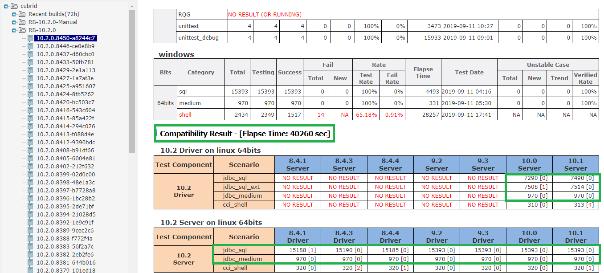
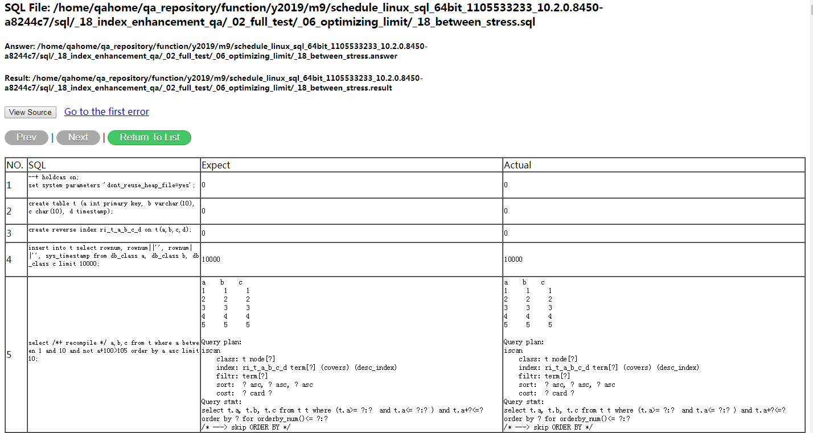

# JDBC Compatibility Test Guide

# 1. Test Objective
JDBC compatibility test is aimed to test CUBRID compatibility with different version's JDBC driver and server. Actually the test cases are the same with SQL/MEDIUM test.

# 2. JDBC Compatibility Test via CTP    
The JDBC compatibility test only supports the Linux platform. It includes sql cases and medium cases. There is a difference in CUBRID installation with the SQL/MEDIUM test.    
For example:        
we test 10.2's server with 8.4.1's driver, install CUBRID as below:     
```bash    
run_cubrid_install -s http://192.168.1.91:8080/REPO_ROOT/store_01/10.2.0.8396-1bc28b2/drop/CUBRID-10.2.0.8396-1bc28b2-Linux.x86_64.sh http://192.168.1.91:8080/REPO_ROOT/store_03/8.4.1.35001/drop/CUBRID-8.4.1.35001-linux.x86_64.sh   
```
we test 10.2's driver with 8.4.1's server, install CUBRID as below:     
```bash    
run_cubrid_install -d http://192.168.1.91:8080/REPO_ROOT/store_01/10.2.0.8396-1bc28b2/drop/CUBRID-10.2.0.8396-1bc28b2-Linux.x86_64.sh http://192.168.1.91:8080/REPO_ROOT/store_03/8.4.1.35001/drop/CUBRID-8.4.1.35001-linux.x86_64.sh   
```

## 2.1 SQL Test
Please refer to [this guide](https://github.com/CUBRID/cubrid-testtools/blob/develop/doc/sql_guide.md#21-sql-test) to run test and examine test result.

## 2.2 MEDIUM Test
Please refer to [this guide](https://github.com/CUBRID/cubrid-testtools/blob/develop/doc/sql_guide.md#22-medium-test) to run test and examine test result.

## 2.3 Execute Test with interactive mode
Please refer to [this guide](https://github.com/CUBRID/cubrid-testtools/blob/develop/doc/sql_guide.md#25-execute-test-with-interactive-mode) to run test and examine test result.  
  
# 3. Regression Test Deployment

## 3.1 Test Machines  
For current daily regression test, there are 4 test instances in parallel. The whole test for a test instance is deployed under a system user environment.

No|Role	| User |	IP	| Hostname	| 
-|-|-|-|-
1 |Test instance 1	 |jcompat1| 192.168.1.79 | func04 | 
2 |Test instance 2	 |jcompat2| 192.168.1.79 | func04 | 
3 |Test instance 3	 |jcompat3| 192.168.1.79 | func04 | 
4 |Test instance 4	 |jcompat4| 192.168.1.79 | func04 | 

## 3.2 Deploy Test Environment
* ### Install CTP 

  Please follow [the guide](ctp_install_guide.md#3-install-ctp-as-regression-test-platform) to install CTP into directory `$HOME/CTP`.     Create configuration file CTP/conf/sql_template.conf.  
  
  On instance 1:
  
    ```
    [sql/cubrid.conf]
    ha_mode = yes
    cubrid_port_id = 6413
    max_plan_cache_entries = 1000
    unicode_input_normalization = no
    java_stored_procedure = yes
    lock_timeout = 10sec
    test_mode = yes

    # SQL cubrid_ha.conf section - a section for ha related configuration
    [sql/cubrid_ha.conf]
    ha_mode = yes
    ha_port_id = 59901
    ha_apply_max_mem_size = 300

    # SQL cubrid_broker.conf query editor section - a section to change parameters under query_editor
    [sql/cubrid_broker.conf/%query_editor]
    # To close one service to avoid port conflict and reduce configuration complexity
    SERVICE = OFF

    # SQL cubrid_broker.conf broker1 section - a section to change parameters under broker1
    [sql/cubrid_broker.conf/%BROKER1]
    # To change broker port to avoid port conflict
    BROKER_PORT = 31122
    # To change ID of shared memory used by CAS
    APPL_SERVER_SHM_ID = 31122
    #To avoid cas restart,make the case 'set system parameters' not work
    APPL_SERVER_MAX_SIZE = 1024
    # CUBRIDSUS-13713 block jdbc compatibility test
    MAX_PREPARED_STMT_COUNT = 10000

    # SQL cubrid_broker.conf broker section - a section to configure parameters under broker section
    [sql/cubrid_broker.conf/broker]
    # To change the identifier of shared memory to avoid conflict to cause server start fail
    MASTER_SHM_ID = 30022
    # CUBRIDSUS-13713 block jdbc compatibility test
    MAX_PREPARED_STMT_COUNT = 10000
    ```
    On instance 2, change to use different ports:
    ```
    cubrid_port_id = 6414
    ha_port_id = 59902
    BROKER_PORT = 31123
    APPL_SERVER_SHM_ID = 31123
    MASTER_SHM_ID = 30023
    
    ```

    On instance 3, be same as above:
    ```
    cubrid_port_id = 6415
    ha_port_id = 59903
    BROKER_PORT = 31124
    APPL_SERVER_SHM_ID = 31124
    MASTER_SHM_ID = 30024
    ```

    On instance 4, be same as above:
    ```
    cubrid_port_id = 6416
    ha_port_id = 59904
    BROKER_PORT = 31125
    APPL_SERVER_SHM_ID = 31125
    MASTER_SHM_ID = 30025
    ```
 
* ### Create quick start script 
  File `~/start_test.sh`
    ```bash
    #!/bin/sh
    cd $HOME/CTP/common/script
    sh upgrade.sh
    cd $HOME
    stop_consumer.sh 
    rm -f nohup.out
    nohup start_consumer.sh -q QUEUE_CUBRID_QA_COMPAT_JDBC_SQL_SERVER_64,QUEUE_CUBRID_QA_COMPAT_JDBC_SQL_DRIVER -exec run_compat_jdbc,run_compat_jdbc -s china &
    ```
* ### Check out test cases        
    ```bash
    cd ~
    git clone https://github.com/CUBRID/cubrid-testcases.git 
    git clone https://github.com/CUBRID/cubrid-testcases-private.git 
    ```

* ### Configure .bash_profile    
    ```
    export DEFAULT_BRANCH_NAME=develop
    export CTP_HOME=$HOME/CTP
    export CTP_BRANCH_NAME=develop
    export CTP_SKIP_UPDATE=0
    export init_path=$HOME/CTP/shell/init_path

    ulimit -c unlimited
    export LC_ALL=en_US
    export PATH=$CTP_HOME/bin:$CTP_HOME/common/script:$JAVA_HOME/bin:/usr/local/bin:/bin:/usr/bin:$PATH
    . $HOME/.cubrid.sh

    ```
* ### Job configuration

    Log into message@192.168.0.91, configure job configuration related to JDBC compatibility test.
    
  * CTP/conf/job.conf 
  
        ...
        job_compat.service=ON
        job_compat.crontab=0/5 * * * * ?
        job_compat.listenfile=CUBRID-{1}-linux.x86_64.sh
        job_compat.acceptversions=10.0.*.0~8999,10.1.*,10.2.*
        #job_compat.denyversions=
        job_compat.package_bits=64
        job_compat.package_type=general

        job_compat.test.1.scenario=compat_jdbc_D
        job_compat.test.1.queue=QUEUE_CUBRID_QA_COMPAT_JDBC_SQL_DRIVER
        job_compat.test.1.ext_config=compat.conf
        job_compat.test.1.ext_keys=jdbc_compatibility_for_{version}_D

        job_compat.test.2.scenario=compat_jdbc_S64
        job_compat.test.2.queue=QUEUE_CUBRID_QA_COMPAT_JDBC_SQL_SERVER_64
        job_compat.test.2.ext_config=compat.conf
        job_compat.test.2.ext_keys=jdbc_compatibility_for_{version}_S64
        ...

   * CTP/conf/compat.conf
       ```
 
        EXT_KEY_FOR_FIX_MAX=COMPAT_BUILD_ID
        EXT_KEY_FOR_FIX_MAX_FOLLOW=COMPAT_BUILD_URLS
        EXT_KEY_FOR_FIX_MAX_FOLLOW_KR=COMPAT_BUILD_URLS_KR
        EXT_KEY_FOR_TEST_CATAGORY=COMPAT_TEST_CATAGORY
         
        jdbc_compatibility_for_10.2.0_D=jdbc_sql_10.1_S64.msg,jdbc_sql_ext_10.1_S64.msg,jdbc_medium_10.1_S64.msg,jdbc_sql_10.0_S64.msg,jdbc_sql_ext_10.0_S64.msg,jdbc_medium_10.0_S64.msg

        jdbc_compatibility_for_10.1.0_D=jdbc_sql_10.2_S64.msg,jdbc_medium_10.2_S64.msg,jdbc_sql_10.0_S64.msg,jdbc_sql_ext_10.0_S64.msg,jdbc_medium_10.0_S64.msg

        jdbc_compatibility_for_10.0.0_D=jdbc_sql_10.2_S64.msg,jdbc_medium_10.2_S64.msg,jdbc_sql_10.1_S64.msg,jdbc_sql_ext_10.1_S64.msg,jdbc_medium_10.1_S64.msg

        jdbc_compatibility_for_10.2.0_S64=jdbc_sql_10.1_D.msg,jdbc_sql_ext_10.1_D.msg,jdbc_medium_10.1_D.msg,jdbc_sql_10.0_D.msg,jdbc_sql_ext_10.0_D.msg,jdbc_medium_10.0_D.msg,jdbc_sql_9.3_D.msg,jdbc_sql_ext_9.3_D.msg,jdbc_medium_9.3_D.msg,jdbc_sql_9.2_D.msg,jdbc_sql_ext_9.2_D.msg,jdbc_medium_9.2_D.msg,jdbc_sql_8.4.4_D.msg,jdbc_sql_ext_8.4.4_D.msg,jdbc_medium_8.4.4_D.msg,jdbc_sql_8.4.3_D.msg,jdbc_sql_ext_8.4.3_D.msg,jdbc_medium_8.4.3_D.msg,jdbc_sql_8.4.1_D.msg,jdbc_sql_ext_8.4.1_D.msg,jdbc_medium_8.4.1_D.msg,

        jdbc_compatibility_for_10.1.0_S64=jdbc_sql_10.2_D.msg,jdbc_sql_ext_10.2_D.msg,jdbc_medium_10.2_D.msg,jdbc_sql_10.0_D.msg,jdbc_sql_ext_10.0_D.msg,jdbc_medium_10.0_D.msg,jdbc_sql_9.3_D.msg,jdbc_sql_ext_9.3_D.msg,jdbc_medium_9.3_D.msg,jdbc_sql_9.2_D.msg,jdbc_sql_ext_9.2_D.msg,jdbc_medium_9.2_D.msg,jdbc_sql_8.4.4_D.msg,jdbc_sql_ext_8.4.4_D.msg,jdbc_medium_8.4.4_D.msg,jdbc_sql_8.4.3_D.msg,jdbc_sql_ext_8.4.3_D.msg,jdbc_medium_8.4.3_D.msg,jdbc_sql_8.4.1_D.msg,jdbc_sql_ext_8.4.1_D.msg,jdbc_medium_8.4.1_D.msg,

        jdbc_compatibility_for_10.0.0_S64=jdbc_sql_10.2_D.msg,jdbc_sql_ext_10.2_D.msg,jdbc_medium_10.2_D.msg,jdbc_sql_10.1_D.msg,jdbc_sql_ext_10.1_D.msg,jdbc_medium_10.1_D.msg,jdbc_sql_9.3_D.msg,jdbc_sql_ext_9.3_D.msg,jdbc_medium_9.3_D.msg,jdbc_sql_9.2_D.msg,jdbc_sql_ext_9.2_D.msg,jdbc_medium_9.2_D.msg,jdbc_sql_8.4.4_D.msg,jdbc_sql_ext_8.4.4_D.msg,jdbc_medium_8.4.4_D.msg,jdbc_sql_8.4.3_D.msg,jdbc_sql_ext_8.4.3_D.msg,jdbc_medium_8.4.3_D.msg,jdbc_sql_8.4.1_D.msg,jdbc_sql_ext_8.4.1_D.msg,jdbc_medium_8.4.1_D.msg,
        ...
        ```

   *  Detail compat configuration
        ```
      
        ~/CTP/conf/compat/jdbc_sql_8.4.3_D.msg
        COMPAT_BUILD_ID=8.4.3.{max}
        COMPAT_BUILD_URLS=CUBRID-{BUILD_ID}-linux.x86_64.sh
        COMPAT_BUILD_BIT=64
        COMPAT_BUILD_TYPE=general
        COMPAT_BUILD_SCENARIOS=sql

        ~/CTP/conf/compat/jdbc_sql_10.0_S64.msg  
        COMPAT_BUILD_ID=10.0.{dmax}
        COMPAT_BUILD_URLS=CUBRID-{BUILD_ID}-linux.x86_64.sh
        COMPAT_BUILD_BIT=64
        COMPAT_BUILD_TYPE=general
        COMPAT_BUILD_SVN_BRANCH=unknown
        COMPAT_BUILD_SCENARIOS=sql
        COMPAT_BUILD_SCENARIO_BRANCH_GIT=release/10.0

        ~/CTP/conf/compat/cci_shell_10.1_D64.msg
        COMPAT_BUILD_ID=10.1.{dmax}
        COMPAT_BUILD_URLS=CUBRID-{BUILD_ID}-Linux.x86_64.sh
        COMPAT_BUILD_BIT=64
        COMPAT_BUILD_TYPE=general

        ~/CTP/conf/compat/jdbc_sql_10.2_D.msg 
        COMPAT_BUILD_ID=10.2.{dmax}
        COMPAT_BUILD_URLS=CUBRID-{BUILD_ID}-Linux.x86_64.sh
        COMPAT_BUILD_BIT=64
        COMPAT_BUILD_TYPE=general
        COMPAT_BUILD_SCENARIOS=sql

        ~/CTP/conf/compat/jdbc_sql_9.1_D.msg 
        COMPAT_BUILD_ID=9.1.{dmax}
        COMPAT_BUILD_URLS=CUBRID-{BUILD_ID}-linux.x86_64.sh
        COMPAT_BUILD_BIT=64
        COMPAT_BUILD_TYPE=general

        ~/CTP/conf/compat/jdbc_sql_9.2_D.msg
        COMPAT_BUILD_ID=9.2.{dmax}
        COMPAT_BUILD_URLS=CUBRID-{BUILD_ID}-linux.x86_64.sh
        COMPAT_BUILD_BIT=64
        COMPAT_BUILD_TYPE=general
        COMPAT_BUILD_SCENARIOS=sql

        ~/CTP/conf/compat/jdbc_sql_10.1_S64.msg 
        COMPAT_BUILD_ID=10.1.{dmax}
        COMPAT_BUILD_URLS=CUBRID-{BUILD_ID}-Linux.x86_64.sh
        COMPAT_BUILD_BIT=64
        COMPAT_BUILD_TYPE=general
        COMPAT_BUILD_SVN_BRANCH=unknown
        COMPAT_BUILD_SCENARIOS=sql
        COMPAT_BUILD_SCENARIO_BRANCH_GIT=release/10.1

        ~/CTP/conf/compat/jdbc_sql_8.4.1_D.msg 
        COMPAT_BUILD_ID=8.4.1.{max}
        COMPAT_BUILD_URLS=CUBRID-{BUILD_ID}-linux.x86_64.sh
        COMPAT_BUILD_BIT=64
        COMPAT_BUILD_TYPE=general
        COMPAT_BUILD_SCENARIOS=sql

        ~/CTP/conf/compat/jdbc_medium_8.4.4_D.msg 
        COMPAT_BUILD_ID=8.4.4.{max}
        COMPAT_BUILD_URLS=CUBRID-{BUILD_ID}-linux.x86_64.sh
        COMPAT_BUILD_BIT=64
        COMPAT_BUILD_TYPE=general
        COMPAT_BUILD_SCENARIOS=medium

        ~/CTP/conf/compat/jdbc_sql_ext_10.0_D.msg
        COMPAT_BUILD_ID=10.0.{dmax}
        COMPAT_BUILD_URLS=CUBRID-{BUILD_ID}-linux.x86_64.sh
        COMPAT_BUILD_BIT=64
        COMPAT_BUILD_TYPE=general
        COMPAT_BUILD_SCENARIOS=sql_ext
        ...

        ```

      >Note: There are many  
      jdbc_sql_10.0_D.msg - it means test current build's server with 10.0's driver.       
      jdbc_sql_10.0_S64.msg - it means test current build's driver with 10.0's server.      
      jdbc_sql_8.4.1_D.msg - it means test current build's server with 8.4.1's driver.           


# 4. Regression Test Sustaining

We perform JDBC compatibility test for each build as regression policy.     

## 4.1 Start the listener

When a new build comes, the test will start. We just need to make sure that test environment has no problem and listener has been started.
```

    $ cd ~
    $ sh start_test.sh &
    $ tail -f nohup.out
```

## 4.2 Send test messages

Sometimes, in order to investigate or correct a test, we need to send messages manually.
 
* ### Send test messages for server test by manual  
    
    For current server test, we use queue `"QUEUE_CUBRID_QA_COMPAT_JDBC_SQL_SERVER_64"`, and select driver configurations in `"~/CTP/conf/compat"`. 
    
    For example, login message@192.168.1.91. Then send message for 10.2 server and 8.4.1 driver:   
    
    ```bash
    sender.sh QUEUE_CUBRID_QA_COMPAT_JDBC_SQL_SERVER_64 http://192.168.1.91:8080/REPO_ROOT/store_01/10.2.0.8369-5a75e41/drop/CUBRID-10.2.0.8369-5a75e41-Linux.x86_64.sh compat_jdbc default ~/CTP/conf/compat/jdbc_sql_8.4.1_D.msg
    
    Message: 

    Message Content: Test for build 10.2.0.8369-5a75e41 by CUBRID QA Team, China
    MSG_ID = 190912-173201-344-000001
    MSG_PRIORITY = 4
    BUILD_ABSOLUTE_PATH=/home/ci_build/REPO_ROOT/store_01/10.2.0.8369-5a75e41/drop
    BUILD_BIT=0
    BUILD_CREATE_TIME=1561143743000
    BUILD_GENERATE_MSG_WAY=MANUAL
    BUILD_ID=10.2.0.8369-5a75e41
    BUILD_IS_FROM_GIT=1
    BUILD_PACKAGE_PATTERN=CUBRID-{1}-Linux.x86_64.sh
    BUILD_SCENARIOS=compat_jdbc
    BUILD_SCENARIO_BRANCH_GIT=develop
    BUILD_SEND_DELAY=7133378
    BUILD_SEND_TIME=1568277121342
    BUILD_STORE_ID=store_01
    BUILD_SVN_BRANCH=RB-10.2.0
    BUILD_SVN_BRANCH_NEW=RB-10.2.0
    BUILD_TYPE=general
    BUILD_URLS=http://192.168.1.91:8080/REPO_ROOT/store_01/10.2.0.8369-5a75e41/drop/CUBRID-10.2.0.8369-5a75e41-Linux.x86_64.sh
    BUILD_URLS_CNT=1
    BUILD_URLS_KR=http://192.168.1.91:8080/REPO_ROOT/store_01/10.2.0.8369-5a75e41/drop/CUBRID-10.2.0.8369-5a75e41-Linux.x86_64.sh
    COMPAT_BUILD_BIT=64
    COMPAT_BUILD_ID=8.4.1.35001
    COMPAT_BUILD_SCENARIOS=sql
    COMPAT_BUILD_TYPE=general
    COMPAT_BUILD_URLS=http://192.168.1.91:8080/REPO_ROOT/store_03/8.4.1.35001/drop/CUBRID-8.4.1.35001-linux.x86_64.sh
    COMPAT_BUILD_URLS_KR=null/8.4.1.35001/drop/CUBRID-8.4.1.35001-linux.x86_64.sh
    COMPAT_TEST_CATAGORY=jdbc_sql_8.4.1_D
    MSG_FILEID=jdbc_sql_8.4.1_D


    Do you accept above message [Y/N]: Y
    
    ```
    
    >Note: you just need to select the message configuration file corresponding to the driver version   
    > 8.4.1 driver -> jdbc_sql_8.4.1_D.msg   
    > 8.4.3 driver -> jdbc_sql_8.4.1_D.msg    
    > 8.4.4 driver -> jdbc_sql_8.4.1_D.msg   
    > 9.2.x driver -> jdbc_sql_9.2_D.msg    
    > 9.3.x driver -> jdbc_sql_9.3_D.msg   
    > 10.0 driver -> jdbc_sql_10.0_D.msg   
    > 10.1 driver -> jdbc_sql_10.1_D.msg   

    **Example to send all messages for different driver:**    
    ``` 
    sender.sh QUEUE_CUBRID_QA_COMPAT_JDBC_SQL_SERVER_64 http://192.168.1.91:8080/REPO_ROOT/store_01/10.2.0.8429-2e1a113/drop/CUBRID-10.2.0.8429-2e1a113-Linux.x86_64.sh compat_jdbc default -compatALL
    ```


* ### Send test messages for driver test by manual  

    For current driver test, we use queue `"QUEUE_CUBRID_QA_COMPAT_JDBC_SQL_DRIVER"`, and select server configurations in `"~/CTP/conf/compat"`.    
    
    For example, login message@192.168.1.91. Then send message for 10.2 driver and 9.2 server:
    
    ```bash
    sender.sh QUEUE_CUBRID_QA_COMPAT_JDBC_SQL_DRIVER http://192.168.1.91:8080/REPO_ROOT/store_01/10.2.0.8369-5a75e41/drop/CUBRID-10.2.0.8369-5a75e41-Linux.x86_64.sh compat_jdbc default ~/CTP/conf/compat/jdbc_sql_10.1_S64.msg

    Message: 

    Message Content: Test for build 10.2.0.8369-5a75e41 by CUBRID QA Team, China
    MSG_ID = 190917-151008-172-000001
    MSG_PRIORITY = 4
    BUILD_ABSOLUTE_PATH=/home/ci_build/REPO_ROOT/store_01/10.2.0.8369-5a75e41/drop
    BUILD_BIT=0
    BUILD_CREATE_TIME=1561143743000
    BUILD_GENERATE_MSG_WAY=MANUAL
    BUILD_ID=10.2.0.8369-5a75e41
    BUILD_IS_FROM_GIT=1
    BUILD_PACKAGE_PATTERN=CUBRID-{1}-Linux.x86_64.sh
    BUILD_SCENARIOS=compat_jdbc
    BUILD_SCENARIO_BRANCH_GIT=develop
    BUILD_SEND_DELAY=7556865
    BUILD_SEND_TIME=1568700608170
    BUILD_STORE_ID=store_01
    BUILD_SVN_BRANCH=RB-10.2.0
    BUILD_SVN_BRANCH_NEW=RB-10.2.0
    BUILD_TYPE=general
    BUILD_URLS=http://192.168.1.91:8080/REPO_ROOT/store_01/10.2.0.8369-5a75e41/drop/CUBRID-10.2.0.8369-5a75e41-Linux.x86_64.sh
    BUILD_URLS_CNT=1
    BUILD_URLS_KR=http://192.168.1.91:8080/REPO_ROOT/store_01/10.2.0.8369-5a75e41/drop/CUBRID-10.2.0.8369-5a75e41-Linux.x86_64.sh
    COMPAT_BUILD_BIT=64
    COMPAT_BUILD_ID=10.1.3.7765-265e708
    COMPAT_BUILD_SCENARIOS=sql
    COMPAT_BUILD_SCENARIO_BRANCH_GIT=release/10.1
    COMPAT_BUILD_SVN_BRANCH=unknown
    COMPAT_BUILD_TYPE=general
    COMPAT_BUILD_URLS=http://192.168.1.91:8080/REPO_ROOT/store_01/10.1.3.7765-265e708/drop/CUBRID-10.1.3.7765-265e708-Linux.x86_64.sh
    COMPAT_BUILD_URLS_KR=null/10.1.3.7765-265e708/drop/CUBRID-10.1.3.7765-265e708-Linux.x86_64.sh
    COMPAT_TEST_CATAGORY=jdbc_sql_10.1_S64
    MSG_FILEID=jdbc_sql_10.1_S64


    Do you accept above message [Y/N]:    
    ```
    
    >Note: you just need to select the message configuration file corresponding to the server version    
    > 10.0 server -> jdbc_sql_10.0_S64.msg    
    > 10.1 server -> jdbc_sql_10.1_S64.msg     
    > 10.2 server -> jdbc_sql_10.2_S64.msg     

        
## 4.2 Check running status 

There are two ways. One is to check nohup.out log on the controller node. The other way is to check jdbc compatibility items on QA homepage monitor page.

## 4.3 Verify test Results

To verify JDBC compatibility test results is similar to general SQL/MEDIUM test. Please refer to [general SQL test guide](https://github.com/CUBRID/cubrid-testtools/blob/develop/doc/sql_guide.md#42-verify-test-results). But we can not get `Verified Rate` and `core alert` information in QA Homepage.


* step1: Find difference between actual result and expect answer.    


* Step2: Check the reason of case fail
  * Unstable - It leaks `order by` , includes `current_timestamp` and others. 
  * Bugs  - The results of DDL/DML operationsis are not correct.  
  * Revise required - Existed answer files did meet CUBRID SPEC no longer, we need modify answer files. 
  * Case  - When SQL/MEDIUM test have updated their test cases, but it does not update JDBC Compatibility patch files (server version is different from driver, some features can not support low version's driver, we need apply patch on current server's answers). 

# 5. JDBC Compatibility Test Case Specification
## 5.1 Choose matched test cases

JDBC compatibility test seperates different CUBRID on Server and Driver. When perform a combination to test, we need choose matched test cases. That is to say, which branch does test cases come. This answer is just that test case branch should follow the CUBRID as Server role. Let's example it.

JDBC Driver | CUBRID Server | Expected Test Case Branch|
-|-|-
10.2 JDBC Driver| 10.1 Server | [10.1 SQL Test Cases](https://github.com/CUBRID/cubrid-testcases/tree/release/10.1/sql)  and [10.1 MEDIUM Test Cases](https://github.com/CUBRID/cubrid-testcases/tree//release/10.1/medium)
10.2 JDBC Driver| 10.0 Server | [10.0 SQL Test Cases](https://github.com/CUBRID/cubrid-testcases/tree/release/10.0/sql)  and [10.0 MEDIUM Test Cases](https://github.com/CUBRID/cubrid-testcases/tree/release/10.0/medium)
8.4.4 JDBC Driver| 10.2 Server | [10.2 SQL Test Cases](https://github.com/CUBRID/cubrid-testcases/tree/develop/sql)  and [10.2 MEDIUM Test Cases](https://github.com/CUBRID/cubrid-testcases/tree/develop/medium)
9.3 JDBC Driver| 10.2 Server | [10.2 SQL Test Cases](https://github.com/CUBRID/cubrid-testcases/tree/develop/sql) and [10.2 MEDIUM Test Cases](https://github.com/CUBRID/cubrid-testcases/tree/develop/medium)

## 5.2 Test Case Specification
Please follow these sections in SQL guide: [How to make a SQL test case](sql_guide.md#5-how-to-make-a-sql-test-case) and [Test Case Specification](sql_guide.md#6-test-case-specification). They are same.

## 5.3 Patch Files and Exclude Files
Patch files are located in https://github.com/CUBRID/cubrid-testcases/tree/develop/sql/config/daily_regression_test_exclude_list_compatibility/patch_files

* ### How to generate patch files
    They are named with as below:
    ```
    jdbc_sql_8.4.1_D_patch
    jdbc_sql_8.4.3_D_patch
    jdbc_sql_8.4.4_D_patch
    jdbc_sql_8.4.5_D_patch
    jdbc_sql_9.2.0_D_patch
    jdbc_sql_9.3.0_D_patch
    ```
    See a part content of jdbc_sql_9.3.0_D_patch file in develop branch
    ```
    Index: _13_issues/_15_1h/answers/bug_bts_17430.answer
    ===================================================================
    --- _13_issues/_15_1h/answers/bug_bts_17430.answer      (revision 61825)
    +++ _13_issues/_15_1h/answers/bug_bts_17430.answer      (working copy)
    @@ -34,15 +34,15 @@
    0
    ===================================================
    col1    date_add(col1, INTERVAL @a := @a+1 MINUTE)
    -1995-01-01 01:10:01.0 +09:00     1995-01-01 01:12:01.0 +09:00     
    -1995-01-01 01:10:02.0 +09:00     1995-01-01 01:13:02.0 +09:00     
    +1995-01-01 01:10:01.0     1995-01-01 01:12:01.0     
    +1995-01-01 01:10:02.0     1995-01-01 01:13:02.0     

    ===================================================
    0
    ===================================================
    col1    date_add(col1, INTERVAL @a := @a+1 MINUTE)
    -1995-01-01 01:10:01.0 +09:00     1995-01-01 01:12:01.0 +09:00     
    -1995-01-01 01:10:02.0 +09:00     1995-01-01 01:13:02.0 +09:00     
    +1995-01-01 01:10:01.0     1995-01-01 01:12:01.0     
    +1995-01-01 01:10:02.0     1995-01-01 01:13:02.0     

    ===================================================
    0
    @@ -56,15 +56,15 @@
    0
    ===================================================
    col1    date_add(col1, INTERVAL @a := @a+1 MINUTE)
    -1995-01-01 01:10:01.0 Asia/Seoul KST     1995-01-01 01:12:01.0 Asia/Seoul KST     
    -1995-01-01 01:10:02.0 Asia/Seoul KST     1995-01-01 01:13:02.0 Asia/Seoul KST     
    +1995-01-01 01:10:01.0     1995-01-01 01:12:01.0     
    +1995-01-01 01:10:02.0     1995-01-01 01:13:02.0     

    ===================================================
    0
    ===================================================
    col1    date_add(col1, INTERVAL @a := @a+1 MINUTE)
    -1995-01-01 01:10:01.0 Asia/Seoul KST     1995-01-01 01:12:01.0 Asia/Seoul KST     
    -1995-01-01 01:10:02.0 Asia/Seoul KST     1995-01-01 01:13:02.0 Asia/Seoul KST     
    +1995-01-01 01:10:01.0     1995-01-01 01:12:01.0     
    +1995-01-01 01:10:02.0     1995-01-01 01:13:02.0     

    ===================================================
    0
    @@ -100,15 +100,15 @@
    0
    ===================================================
    col1    date_add(col1, INTERVAL @a := @a+1 MINUTE)
    -1995-01-01 01:10:01.0 +09:00     1995-01-01 01:12:01.0 +09:00     
    -1995-01-01 01:10:02.0 +09:00     1995-01-01 01:13:02.0 +09:00     
    +1995-01-01 01:10:01.0     1995-01-01 01:12:01.0     
    +1995-01-01 01:10:02.0     1995-01-01 01:13:02.0     

    ===================================================
    0
    ===================================================
    col1    date_add(col1, INTERVAL @a := @a+1 MINUTE)
    -1995-01-01 01:10:01.0 +09:00     1995-01-01 01:12:01.0 +09:00     
    -1995-01-01 01:10:02.0 +09:00     1995-01-01 01:13:02.0 +09:00     
    +1995-01-01 01:10:01.0     1995-01-01 01:12:01.0     
    +1995-01-01 01:10:02.0     1995-01-01 01:13:02.0     

    ===================================================
    0
    @@ -122,15 +122,15 @@
    0
    ===================================================
    col1    date_add(col1, INTERVAL @a := @a+1 MINUTE)
    -1995-01-01 01:10:01.0 Asia/Seoul KST     1995-01-01 01:12:01.0 Asia/Seoul KST     
    -1995-01-01 01:10:02.0 Asia/Seoul KST     1995-01-01 01:13:02.0 Asia/Seoul KST     
    +1995-01-01 01:10:01.0     1995-01-01 01:12:01.0     
    +1995-01-01 01:10:02.0     1995-01-01 01:13:02.0     

    ===================================================
    0
    ===================================================
    col1    date_add(col1, INTERVAL @a := @a+1 MINUTE)
    -1995-01-01 01:10:01.0 Asia/Seoul KST     1995-01-01 01:12:01.0 Asia/Seoul KST     
    -1995-01-01 01:10:02.0 Asia/Seoul KST     1995-01-01 01:13:02.0 Asia/Seoul KST     
    +1995-01-01 01:10:01.0     1995-01-01 01:12:01.0     
    +1995-01-01 01:10:02.0     1995-01-01 01:13:02.0     

    ===================================================
    0
    ```

    Run diff command to get above content , for example: 
    ```
    diff _13_issues/_15_1h/cases/bug_bts_17430.result _13_issues/_15_1h/answers/bug_bts_17430.answer >> jdbc_sql_9.3.0_D_patch
    ```
    bug_bts_17430.result - the result of 10.2 server and 9.3.0 driver, you can get the result via CTP
    bug_bts_17430.answer - the result of 10.2 server and 10.2 driver (current develop branch is 10.2)

* ### How to apply patch files
    CTP will find matched patch files to apply based on driver version, the mainly code is as below
    ```
    $ cd ~/cubrid-testcases/sql
    $ patch -p0 -p< /PATH/jdbc_sql_9.3.0_D_patch
    ```

Exclude files are located in https://github.com/CUBRID/cubrid-testcases/tree/develop/sql/config/daily_regression_test_exclude_list_compatibility.  
They are named with as below:
```
jdbc_sql_10.0.0_D_excluded_list
jdbc_sql_10.0.0_S64_excluded_list
jdbc_sql_8.4.1_D_excluded_list
jdbc_sql_8.4.1_S64_excluded_list
jdbc_sql_8.4.3_D_excluded_list
jdbc_sql_8.4.3_S64_excluded_list
jdbc_sql_8.4.4_D_excluded_list
jdbc_sql_8.4.4_S64_excluded_list
jdbc_sql_8.4.5_D_excluded_list
jdbc_sql_8.4.5_S64_excluded_list
jdbc_sql_9.0.0_D_excluded_list
jdbc_sql_9.0.0_S64_excluded_list
jdbc_sql_9.1.0_D_excluded_list
jdbc_sql_9.1.0_S64_excluded_list
jdbc_sql_9.2.0_D_excluded_list
jdbc_sql_9.2.0_S64_excluded_list
jdbc_sql_9.2.3_S64_excluded_list
jdbc_sql_9.2.7_D_excluded_list
jdbc_sql_9.2.7_S64_excluded_list
jdbc_sql_9.3.0_D_excluded_list
jdbc_sql_9.3.0_S64_excluded_list
jdbc_sql_9.4.0_D_excluded_list
```

See a part content of `jdbc_sql_8.4.1_D_excluded_list` on develop branch
```
# Error Codes are different:
sql/_04_operator_function/_01_all_types/_004_cast_op/cases/1045.sql
sql/_04_operator_function/_01_all_types/_004_cast_op/cases/1078.sql
sql/_04_operator_function/_01_all_types/_004_cast_op/cases/1087.sql
sql/_04_operator_function/_01_all_types/_004_cast_op/cases/1114.sql
sql/_04_operator_function/_01_all_types/_004_cast_op/cases/1126.sql
sql/_07_misc/_02_prameter_bind/cases/CUBRID210-1.sql
sql/_09_64bit/_01_datetime/cases/1010.sql
sql/_13_issues/_10_1h/cases/bug_2880.sql
sql/_13_issues/_10_2h/cases/bug_4220.sql
sql/_13_issues/_12_1h/cases/bug_bts_7597.sql
sql/_13_issues/_12_1h/cases/bug_bts_7668_1.sql
sql/_13_issues/_12_1h/cases/bug_bts_7668_2.sql
sql/_13_issues/_12_1h/cases/bug_bts_7668_3.sql
sql/_13_issues/_12_1h/cases/bug_bts_7668_4.sql
sql/_13_issues/_12_1h/cases/bug_bts_7751_1.sql
sql/_13_issues/_12_1h/cases/bug_bts_7751_2.sql
sql/_13_issues/_12_1h/cases/bug_bts_7846.sql
sql/_13_issues/_12_2h/cases/bug_bts_10115.sql
sql/_13_issues/_12_2h/cases/bug_bts_10141.sql
sql/_13_issues/_12_2h/cases/bug_bts_10154.sql
sql/_13_issues/_12_2h/cases/bug_bts_7598.sql
sql/_13_issues/_12_2h/cases/bug_bts_7598_01.sql
sql/_13_issues/_12_2h/cases/bug_bts_7598_02.sql
sql/_13_issues/_12_2h/cases/bug_bts_8228.sql
sql/_13_issues/_12_2h/cases/bug_bts_8444.sql
sql/_13_issues/_12_2h/cases/bug_bts_8446.sql
sql/_13_issues/_12_2h/cases/bug_bts_8503.sql
sql/_13_issues/_12_2h/cases/bug_bts_8659.sql
sql/_13_issues/_12_2h/cases/bug_bts_8659_01.sql
sql/_13_issues/_12_2h/cases/bug_bts_9943.sql
sql/_13_issues/_13_1h/cases/bug_bts_10387.sql
sql/_13_issues/_13_1h/cases/bug_bts_10388.sql
sql/_13_issues/_13_1h/cases/bug_bts_10566.sql
sql/_13_issues/_13_1h/cases/bug_bts_10586.sql
sql/_13_issues/_13_1h/cases/bug_bts_10841.sql
sql/_13_issues/_11_2h/cases/bug_bts_6247.sql
...
```

These sql files which have been listed in exclude file will not be executed in regression test.


