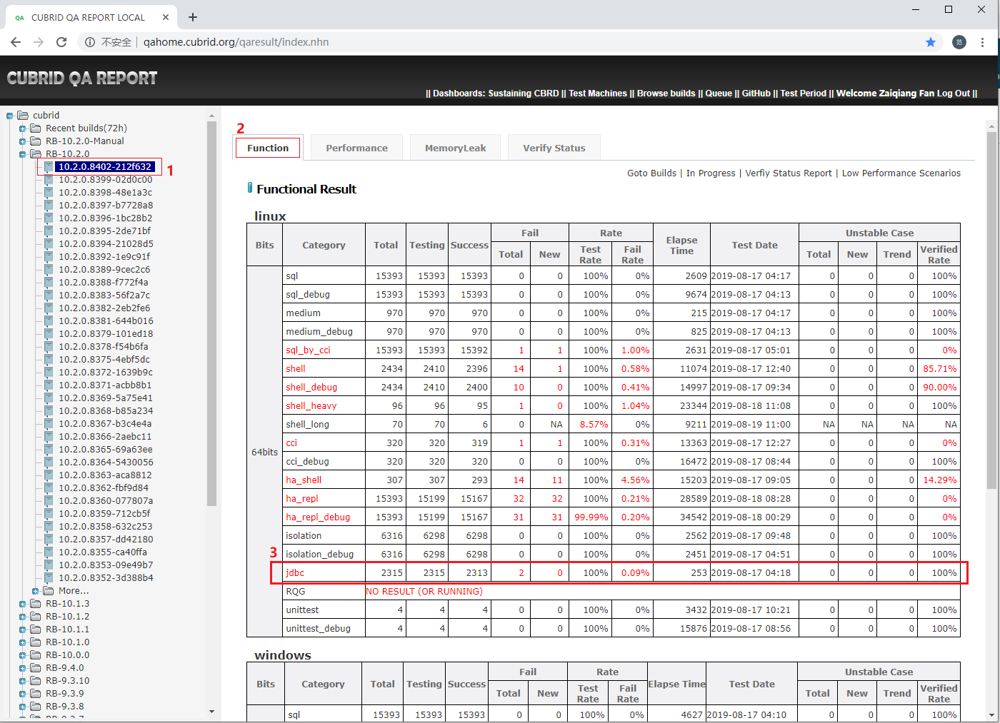
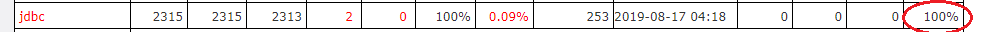
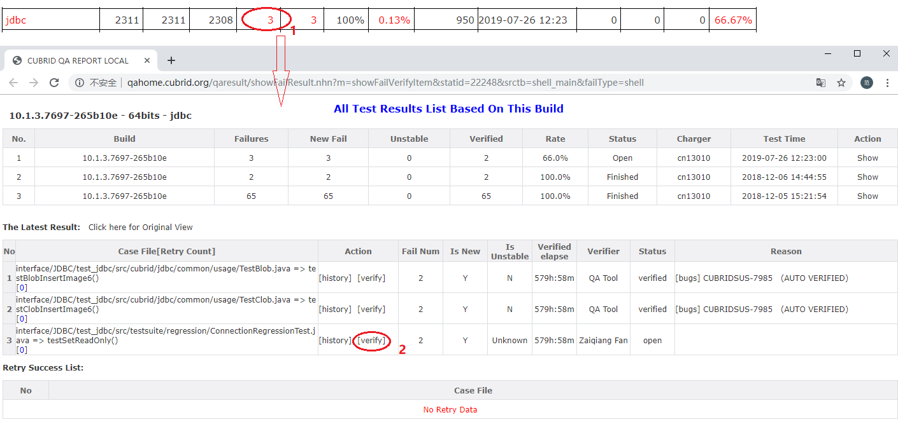
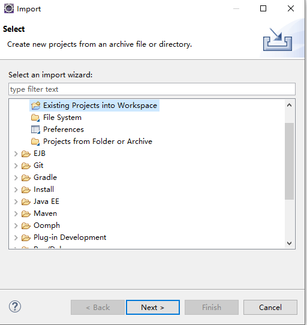
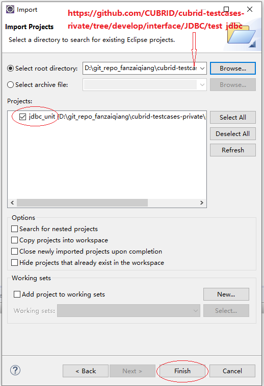
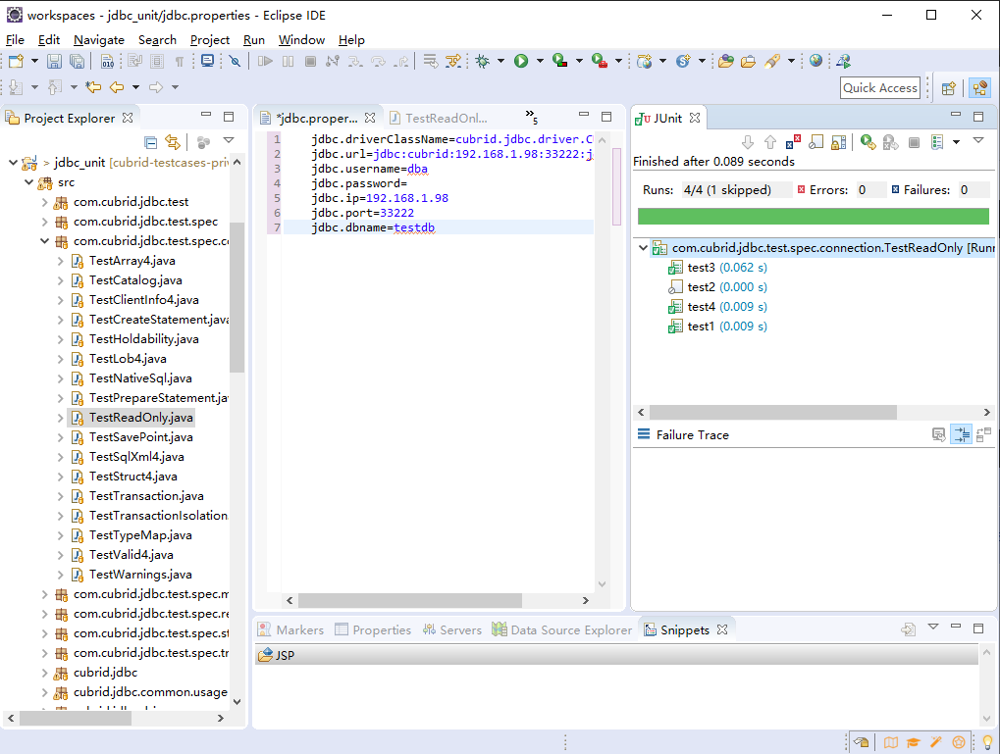

# 1. Test Objective

JDBC test is used to verify CUBRID JDBC driver. It focuses on verification of standard JDBC API implementation by CUBRID. It also verifies its native methods.
CTP as test tool can be used to execute CUBRID jdbc test cases which are located in https://github.com/CUBRID/cubrid-testcases-private/tree/develop/interface/JDBC/test_jdbc.

# 2. JDBC Test Usage

## 2.1 Quick Start

Let's show an example that how to execute jdbc test via CTP.

### Step 1: Prepare for tested database

Suppose that you have already installed CUBRID. Then, let's create a database that we plan to test.

    cubrid createdb jdbcdb en_US
    cubrid server start jdbcdb
    cubrid broker start    

### Step 2: Prepare for jdbc test cases

    cd ~/
    git clone https://github.com/CUBRID/cubrid-testcases-private.git
    git checkout develop  

### Step 3: Install CTP

Please follow [the guide to install CTP](ctp_install_guide.md).

### Step 4: Prepare for test configuration

File CTP/conf/jdbc.conf:

    [common]
    # Define the path of test cases we just check out.
    scenario = ${HOME}/cubrid-testcases/interface/JDBC/test_jdbc

    [jdbc/cubrid.conf]
    cubrid_port_id = 1822

    [jdbc/cubrid_broker.conf/%query_editor]
    SERVICE = OFF

    [jdbc/cubrid_broker.conf/%BROKER1]
    BROKER_PORT = 33120
    APPL_SERVER_SHM_ID = 33120

    [jdbc/cubrid_broker.conf/broker]
    MASTER_SHM_ID = 33122
    
### Step 5: Execute jdbc test

    cd CTP
    sh ctp.sh jdbc -c ./conf/jdbc.conf

### Step 6: Examine the results

When the test is completed, you can find the results and from directory as below:

File CTP/result/jdbc/current_runtime_logs/run_case_details.log:

    [INFO]: Test Start!
    [INFO]: Total Case:2315
    [INFO]: TEST BUILD:10.2.0.8398-48e1a3c
    [TESTCASE]: /home/jdbc/cubrid-testcases-private/interface/JDBC/test_jdbc/src/com/cubrid/jdbc/test/spec/connection/TestCatalog.java => test1() => OK
    [ELAPSE TIME(ms)]: 57
    ===================================================
    [TESTCASE]: /home/jdbc/cubrid-testcases-private/interface/JDBC/test_jdbc/src/com/cubrid/jdbc/test/spec/connection/TestClientInfo4.java => test1() => OK
    [ELAPSE TIME(ms)]: 1
    ===================================================
    [TESTCASE]: /home/jdbc/cubrid-testcases-private/interface/JDBC/test_jdbc/src/com/cubrid/jdbc/test/spec/connection/TestClientInfo4.java => test2() => OK
    [ELAPSE TIME(ms)]: 0

    ......
    ......
    
    [TESTCASE]: /home/jdbc/cubrid-testcases-private/interface/JDBC/test_jdbc/src/testsuite/BaseTestCase.java => runMultiHostTests() => OK
    [ELAPSE TIME(ms)]: 0
    ===================================================
    [INFO]: Test Finished!
    ==================== Test Summary ====================
    [INFO]: Total Case:2315
    [INFO]: Success Case:2313
    [INFO]: Fail Case:2

## 2.2 Completed configuration parameters

CTP ships an example configuration file under CTP/conf/jdbc.conf. You may change it as your requirement or create your own configuration file. Here is full parameters used:
    
    [common]
    # Define the location of your testing scenario
    scenario = ${HOME}/cubrid-testcases-private/interface/JDBC/test_jdbc
    
    # test result will be categoried with specific defination in QA homepage
    test_platform = linux
    test_category = jdbc
    build_bits = 64bits
    owner_email = fan.zaiqiang@navercorp.com
    
    # feedback type: 'database' or 'file'. 
    # 'database': test result will be stored to database. 'file': test result will save as local files.
    feedback_type = database
    # Defined QA homepage database. The parameters are only enabled when feedback_type is configured as 'database'. 
    feedback_db_host = 192.168.1.86
    feedback_db_port = 33080
    feedback_db_name = qaresu
    feedback_db_user = dba
    feedback_db_pwd = ********
    
    # Notice test completion event to QA homepage once test has been done.
    feedback_notice_qahome_url = http://192.168.1.86:6060/qaresult/shellImportAction.nhn?main_id=<MAINID>

    [jdbc/cubrid.conf]
    # All parameters in this section will be set to cubrid.conf
    cubrid_port_id = 1822

    [jdbc/cubrid_broker.conf/%query_editor]
    # All parameters in this section will be set to section '%query_editor' in cubrid_broker.conf.
    SERVICE = OFF

    [jdbc/cubrid_broker.conf/%BROKER1]
    # All parameters in this section will be set to section '%BROKER1' in cubrid_broker.conf.
    BROKER_PORT = 33120
    APPL_SERVER_SHM_ID = 33120

    [jdbc/cubrid_broker.conf/broker]
    # All parameters in this section will be set to section 'broker' in cubrid_broker.conf.    
    MASTER_SHM_ID = 33122
    
## 2.3 Test cases introduction

Test cases locate in https://github.com/CUBRID/cubrid-testcases-private/tree/develop/interface/JDBC/test_jdbc.

    [jdbc@func23 test_jdbc]$ pwd
    /home/jdbc/cubrid-testcases-private/interface/JDBC/test_jdbc
    [jdbc@func23 test_jdbc]$ ls -l
    total 32
    -rw-rw-r--. 1 jdbc jdbc  1666 Mar  6 16:19 build.xml
    -rw-rw-r--  1 jdbc jdbc   185 Aug 15 17:16 jdbc.properties
    drwxrwxr-x. 2 jdbc jdbc  4096 Aug 15 17:16 lib
    drwxrwxr-x. 8 jdbc jdbc    84 Mar  6 16:19 src
    [jdbc@func23 test_jdbc]$ 
    
All test cases are written in Java program language under jUnit framework.

File `jdbc.properties` configures JDBC connection parameters. 

    jdbc.driverClassName=cubrid.jdbc.driver.CUBRIDDriver
    jdbc.url=jdbc:cubrid:localhost:33000:tdb:::
    jdbc.username=dba
    jdbc.password=
    jdbc.ip=localhost
    jdbc.port=33000
    jdbc.dbname=tdb
    
# 3. JDBC Test Case Specification

* ### Example a jdbc test case

  Source: https://github.com/CUBRID/cubrid-testcases-private/blob/develop/interface/JDBC/test_jdbc/src/com/cubrid/jdbc/test/spec/connection/TestReadOnly.java

        package com.cubrid.jdbc.test.spec.connection;

        import java.sql.DatabaseMetaData;
        import java.sql.SQLException;

        import org.junit.Assert;
        import org.junit.Ignore;
        import org.junit.Test;

        import com.cubrid.jdbc.test.spec.GeneralTestCase;

        public class TestReadOnly extends GeneralTestCase {

            @Test
            public void test1() throws SQLException {
                conn().setReadOnly(false);
                Assert.assertEquals(false, conn().isReadOnly());
            }

            @Ignore
            @Test
            public void test2() throws SQLException {
                conn().setReadOnly(true);
                Assert.assertEquals(true, conn().isReadOnly());
            }

            @Test
            public void test3() throws SQLException {
                DatabaseMetaData dmd = conn().getMetaData();

                if (dmd.isReadOnly()) {
                    Assert.assertEquals(true, conn().isReadOnly());
                } else {
                    Assert.assertEquals(false, conn().isReadOnly());
                }
            }

            @Test
            public void test4() throws SQLException {
                DatabaseMetaData dmd = conn().getMetaData();
                Assert.assertEquals(false, dmd.isReadOnly());
            }
        }

* ###  Annotation `@Test` declares a test case

        @Test
        public void test1() throws SQLException {
            conn().setReadOnly(false);
            Assert.assertEquals(false, conn().isReadOnly());
        }

* ###  Annotation `@Ignore` declares test case will be ignored during runtime

        @Ignore
        @Test
        public void test2() throws SQLException {
            conn().setReadOnly(true);
            Assert.assertEquals(true, conn().isReadOnly());
        }

* ###  Test cases follow jUnit framework

    jUnit version: junit-4.8.2
    
    Many assertions can be used in test cases.    

# 4. Regression Test Deployment

## 4.1 Deployment overview

<table>
<tr>
<th>Description</th>
<th>User Name</th>
<th>IP</th>
<th>Hostname</th>
<th>Tools to deploy</th>
</tr>
<tr class="even">
<td>Test node</td>
<td>jdbc</td>
<td>192.168.1.98</td>
<td>func23</td>
<td> CUBRID  
 CTP  
 cubrid_testcases_private  
 </td>
</tr>
</table>

## 4.2 Installation

* ### Install CTP as regression test

    Please follow guide below to install CTP to `$HOME/CTP`:
    https://github.com/CUBRID/cubrid-testtools/blob/develop/doc/ctp_install_guide.md#2-install-ctp-as-regression-test-in-linux-platform

* ### Configure jdbc test

    File $HOME/CTP/conf/jdbc_template.conf

        [common]
        # Define the location of your testing scenario
        scenario = ${HOME}/cubrid-testcases-private/interface/JDBC/test_jdbc
        git_user = <git user>
        git_pwd = <git password>
        git_email = <git email address>
        test_platform = linux
        test_category = jdbc
        build_bits = 64bits
        owner_email = fan.zaiqiang@navercorp.com
        feedback_type = database
        feedback_db_host = 192.168.1.86
        feedback_db_port = 33080
        feedback_db_name = qaresu
        feedback_db_user = dba
        feedback_db_pwd = ********
        feedback_notice_qahome_url = http://192.168.1.86:6060/qaresult/shellImportAction.nhn?main_id=<MAINID>

        # JDBC cubrid.conf section - a section for cubrid.conf configuration
        [jdbc/cubrid.conf]
        # To change port of cubrid_port_id to avoid port conflict
        cubrid_port_id = 1822

        # JDBC cubrid_broker.conf query editor section - a section to change parameters under query_editor
        [jdbc/cubrid_broker.conf/%query_editor]
        # To close one service to avoid port conflict and reduce configuration complexity
        SERVICE = OFF

        # JDBC cubrid_broker.conf broker1 section - a section to change parameters under broker1
        [jdbc/cubrid_broker.conf/%BROKER1]
        # To change broker port to avoid port conflict, if you are sure the port will not conflict, just ignore.
        BROKER_PORT = 33120
        # To change ID of shared memory used by CAS, if you are sure the port will not conflict, just ignore.
        APPL_SERVER_SHM_ID = 33120

        # JDBC cubrid_broker.conf broker section - a section to configure parameters under broker section
        [jdbc/cubrid_broker.conf/broker]
        # To change the identifier of shared memory to avoid conflict to cause server start fail
        MASTER_SHM_ID = 33122

* ### Check out test cases

        cd $HOME
        git clone https://github.com/CUBRID/cubrid-testcases-private.git

* ### Modify .bash_profile

        [jdbc@func23 ~]$ cat .bash_profile 

        # .bash_profile

        # Get the aliases and functions
        if [ -f ~/.bashrc ]; then
                . ~/.bashrc
        fi

        # User specific environment and startup programs
        export CTP_HOME=$HOME/CTP
        export CTP_SKIP_UPDATE=0
        export CTP_BRANCH_NAME=develop
        export JAVA_HOME=$HOME/jdk1.6.0_22
        export PATH=$JAVA_HOME/bin:$CTP_HOME/bin:$CTP_HOME/common/script:$PATH:$HOME/.local/bin:$HOME/bin
        export LD_LIBRARY_PATH=$HOME/CUBRID/bin:$LD_LIBRARY_PATH        

        . ~/.cubrid.sh
        
* ### Add quick start script file

    File ~/start_test.sh
    
        start_consumer.sh -q QUEUE_CUBRID_QA_JDBC_UNITTEST_LINUX_GIT -exec run_jdbc    

# 5. Regression Test Sustaining

## 5.1 How to start test?

*  ### Start test daemon process:

    Log into test server, keep daemon process for start_test.sh:

        nohup sh start_test.sh &

    After startup, it will keep listening for new test messages. Once come, it will fire the test immediately. Except CI test messages which were generated automatically, you may send test message by manual.
  
* ### Send test message same as daily configuration:

    Log into message server (message@192.168.1.91) first.

        [message@qa03 ~]$ sender.sh QUEUE_CUBRID_QA_JDBC_UNITTEST_LINUX_GIT http://192.168.1.91:8080/REPO_ROOT/store_01/10.2.0.8396-1bc28b2/drop/CUBRID-10.2.0.8396-1bc28b2-Linux.x86_64.sh jdbc default

        Message: 

        Message Content: Test for build 10.2.0.8396-1bc28b2 by CUBRID QA Team, China
        MSG_ID = 190816-190515-440-000001
        MSG_PRIORITY = 4
        BUILD_ABSOLUTE_PATH=/home/ci_build/REPO_ROOT/store_01/10.2.0.8396-1bc28b2/drop
        BUILD_BIT=0
        BUILD_CREATE_TIME=1565376350000
        BUILD_GENERATE_MSG_WAY=MANUAL
        BUILD_ID=10.2.0.8396-1bc28b2
        BUILD_IS_FROM_GIT=1
        BUILD_PACKAGE_PATTERN=CUBRID-{1}-Linux.x86_64.sh
        BUILD_SCENARIOS=jdbc
        BUILD_SCENARIO_BRANCH_GIT=develop
        BUILD_SEND_DELAY=573565
        BUILD_SEND_TIME=1565949915439
        BUILD_STORE_ID=store_01
        BUILD_SVN_BRANCH=RB-10.2.0
        BUILD_SVN_BRANCH_NEW=RB-10.2.0
        BUILD_TYPE=general
        BUILD_URLS=http://192.168.1.91:8080/REPO_ROOT/store_01/10.2.0.8396-1bc28b2/drop/CUBRID-10.2.0.8396-1bc28b2-Linux.x86_64.sh
        BUILD_URLS_CNT=1
        BUILD_URLS_KR=http://192.168.1.91:8080/REPO_ROOT/store_01/10.2.0.8396-1bc28b2/drop/CUBRID-10.2.0.8396-1bc28b2-Linux.x86_64.sh

        Do you accept above message [Y/N]: Y

    After test, related test result will be shown in QA homepage.
  
## 5.2 Verify test Results  

* ### Check if there is JDBC test result

    Open QA home (http://qahome.cubrid.org), navigate to find JDBC test result as below. If there is no any result, you need to find the reason out.
    
    
* ### Test Rate should be 100%

    It means the `Testing` is equal to the sum of `Success` and `Fail(Total)`.
    
    
* ### Verified Rate should be 100%    

    The verified rate should be 100% as below.
    
    
    If there is a failed test case, you need to verify it following below:
    
    
    Note: 
    
    New issues : It is link to a jira issue which reported by this case
    
    Revise required issues: It is link to a jira issue which lead to change in test case and answer
    
## 5.3 How to verify a failure?
  
  We usually verify failures via eclipse. Please follow guide below to verify a failure.
  
  **Step 1:** In eclipse, import https://github.com/CUBRID/cubrid-testcases-private/tree/develop/interface/JDBC/test_jdbc as java project.
  
  Open eclipse -> File Menu -> Import:   
  
  
  
  Then
  
  
  
  **Step 2:** Configure jdbc parameters:

  File jdbc.properties:

    jdbc.driverClassName=cubrid.jdbc.driver.CUBRIDDriver
    jdbc.url=jdbc:cubrid:192.168.1.98:33222:jdbcdb:::
    jdbc.username=dba
    jdbc.password=
    jdbc.ip=192.168.1.98
    jdbc.port=33222
    jdbc.dbname=testdb  

  **Step 3:** Update cubrid_jdbc.jar with tested build
  
  Replace test_jdbc/lib/cubrid_jdbc.jar with CUBRID/jdbc/cubrid_jdbc.jar.

  **Step 4:** Execute with jUnit:
  
  Examine test case and identify failure reason.
  
    
    
  
    
