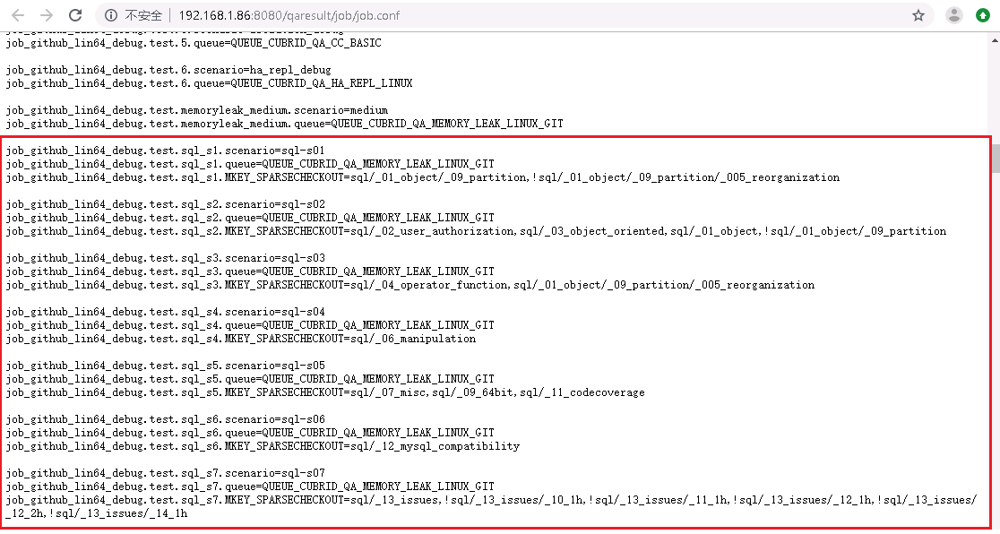
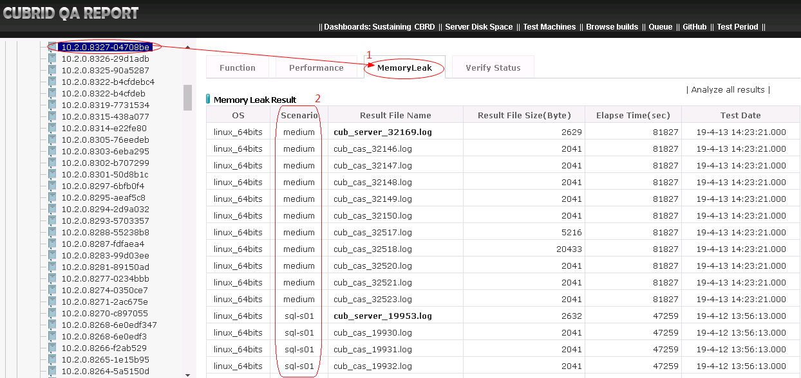
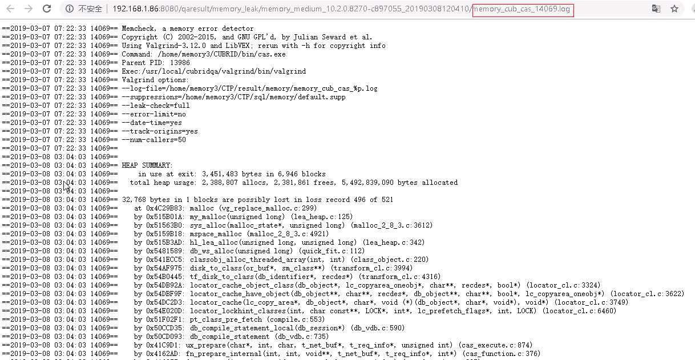
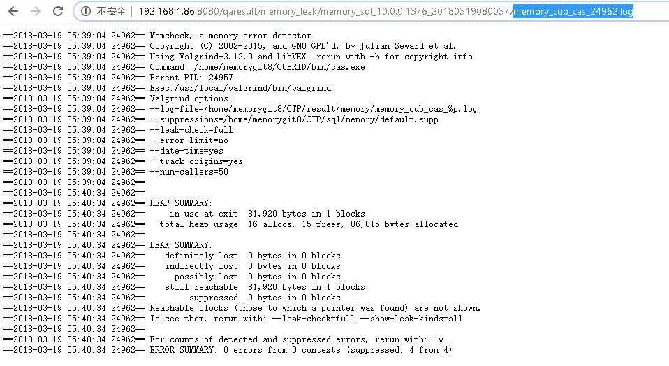
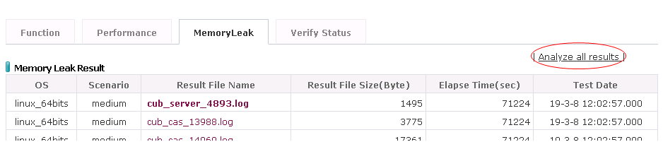
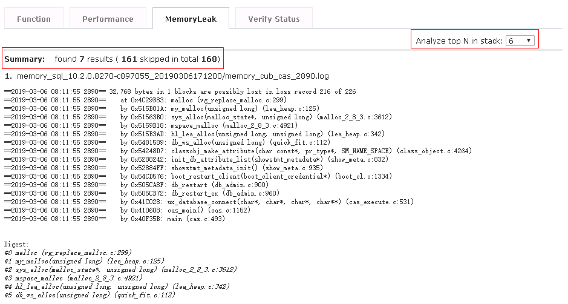
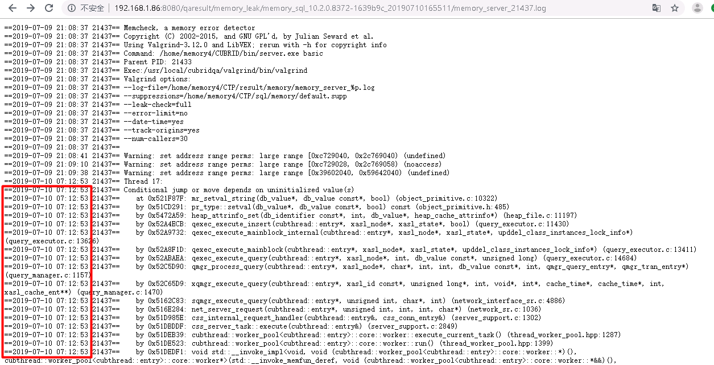
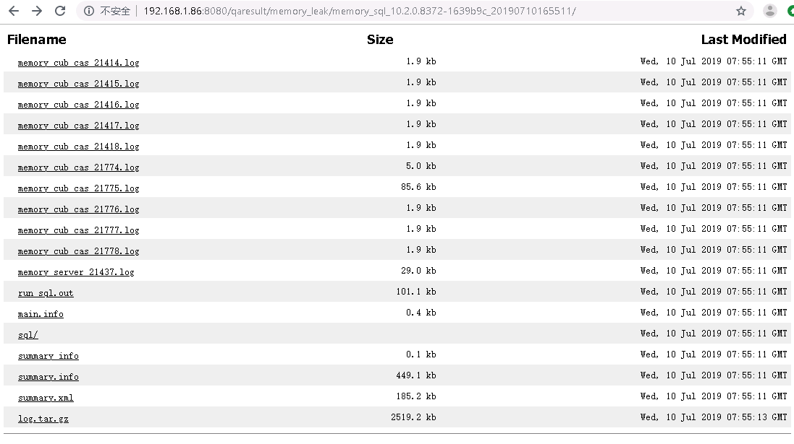
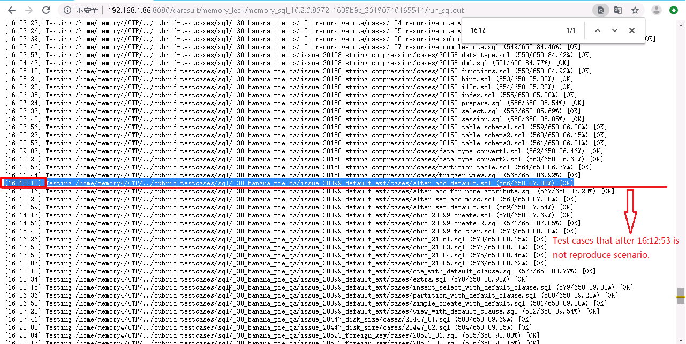

# 1. Test Objective
`MemoryLeak` test is aimed to detect memory error in CUBRID. It runs the [sql](https://github.com/CUBRID/cubrid-testcases/tree/develop/sql) and [medium](https://github.com/CUBRID/cubrid-testcases/tree/develop/medium) test cases with [Memcheck](http://valgrind.org/docs/manual/mc-manual.html) tool of [Valgrind](http://valgrind.org/).


# 2. Deploy Regression Test Environment 
## 2.1 Test Machines
We deployed ten test instances on two test machines for MemoryLeak daily regression test.  

|No. | Hostname|IP|User Name| Deployment
|--|--|--|--|--
|  | func40 | 192.168.1.115|root | Valgrind
|  | func41 | 192.168.1.116|root | Valgrind
|1 | func40 | 192.168.1.115|memory1 |CTP, cubrid-testcases, CUBRID
|2 | func40 | 192.168.1.115|memory2 |CTP, cubrid-testcases, CUBRID
|3 | func40 | 192.168.1.115|memory3 |CTP, cubrid-testcases, CUBRID
|4 | func40 | 192.168.1.115|memory4 |CTP, cubrid-testcases, CUBRID
|5 | func40 | 192.168.1.115|memory5 |CTP, cubrid-testcases, CUBRID
|6 | func41 | 192.168.1.116|memory1 |CTP, cubrid-testcases, CUBRID
|7 | func41 | 192.168.1.116|memory2 |CTP, cubrid-testcases, CUBRID
|8 | func41 | 192.168.1.116|memory3 |CTP, cubrid-testcases, CUBRID
|9 | func41 | 192.168.1.116|memory4 |CTP, cubrid-testcases, CUBRID
|10 | func41 | 192.168.1.116|memory5 |CTP, cubrid-testcases, CUBRID

## 2.2 Install Valgrind
Install Valgrind to each machine.
1. Login as `root` user  
2. Checkout Valgrind source code from the repository    
For ease of use, we did some changes bases on Valgrind 3.12.0. You can see the changes from https://github.com/CUBRID/cubrid-testtools-internal/commits/develop/valgrind and get source code from https://github.com/CUBRID/cubrid-testtools-internal/tree/develop/valgrind.  
    ```bash
    git clone https://github.com/CUBRID/cubrid-testtools-internal.git
    cd cubrid-testtools-internal/
    git checkout develop
    ```
3. Compile  
    ```bash
    mkdir -p /usr/local/cubridqa/valgrind

    cd cubrid-testtools-internal/valgrind
    ./configure --prefix=/usr/local/cubridqa/valgrind
    make
    make install
    ```
4. Add to PATH  
    ```bash
    vi /etc/profile
    export VALGRIND_HOME=/usr/local/cubridqa/valgrind
    export PATH=$VALGRIND_HOME/bin:$PATH
    ```
5. Check  
    Check whether the Valgrind is installed successfully.
    ```
    $ valgrind --version
    valgrind-3.12.0
    ```
## 2.3 Install CTP
Install CTP to all ten instances.
1. Checkout git repository  
    ```bash
    cd ~
    git clone https://github.com/CUBRID/cubrid-testtools.git
    cd ~/cubrid-testtools 
    git checkout develop
    cp -rf CTP ~/
    ```
2. Configure `common.conf`  
    Create a file `~/CTP/conf/common.conf`, then add following contents to it.  
    ```
    git_user=cubridqa
    git_pwd=PASSWORD
    git_email=dl_cubridqa_bj_internal@navercorp.com
    default_ssh_pwd=PASSWORD
    default_ssh_port=22

    grepo_service_url=rmi://192.168.1.91:11099
    coverage_controller_pwd=PASSWORD

    qahome_db_driver=cubrid.jdbc.driver.CUBRIDDriver
    qahome_db_url=jdbc:cubrid:192.168.1.86:33080:qaresu:dba::
    qahome_db_user=dba
    qahome_db_pwd=

    qahome_server_host=192.168.1.86
    qahome_server_port=22
    qahome_server_user=qahome
    qahome_server_pwd=PASSWORD

    activemq_user=admin
    activemq_pwd=PASSWORD
    activemq_url=failover:tcp://192.168.1.91:61616?wireFormat.maxInactivityDurationInitalDelay=30000

    mail_from_nickname=CUBRIDQA_BJ
    mail_from_address=dl_cubridqa_bj_internal@navercorp.com
    ```
3. Configure `~/.bash_profile`  
    Add following settings to `~/.bash_profile`, then source it.
    ```bash
    export CTP_HOME=~/CTP
    # CTP_SKIP_UPDATE 0:update 1:skip 
    export CTP_SKIP_UPDATE=0
    export CTP_BRANCH_NAME=develop
    export PATH=$CTP_HOME/bin:$CTP_HOME/common/script:$PATH:$HOME/.local/bin:$HOME/bin
    . ~/.cubrid.sh
    ```
4. Set the `CTP/conf/sql_local.conf` file.   
The config settings are almost same as its on sql/medium test. The difference is, `MemoryLeak` test need to set **`enable_memory_leak=yes`**, **`java_stored_procedure=no`**, and **`log_compress=false`**.   
Set different numbers to `cubrid_port_id`,`ha_port_id`,`BROKER_PORT`,`APPL_SERVER_SHM_ID`, and `MASTER_SHM_ID` in different users on the same machine.
    ```
    [sql]
    # Use valgrind to run the test.
    enable_memory_leak=yes    

    # The location of your testing scenario
    scenario=${HOME}/cubrid-testcases

    # Configure an alias name for testing result
    test_category=sql

    # Configuration file for JDBC connection initialization, just ignore it when executing SQL_BY_CCI
    jdbc_config_file=test_default.xml

    # Configure database charset for db creation
    db_charset=en_US

    # If test need do make locale or not
    need_make_locale=yes

    # SQL cubrid.conf section - a section for cubrid.conf configuration
    [sql/cubrid.conf]
    # Set log_compress=false when executes memoryleak tests. Otherwise there will be a lot of memoryleak errors that we don't intrested in.
    log_compress=false

    # To decide if the Java store procedure will be used when testing. It should be set as no when executes memoryleak test.
    java_stored_procedure=no

    # Allow scenario to change database system parameter
    test_mode=yes

    # To increase the speed of execution
    max_plan_cache_entries=1000

    # To increase the speed of execution
    unicode_input_normalization=no

    # To change port of cubrid_port_id to avoid port conflict
    cubrid_port_id=1850

    # To simulate the scenario customer use
    ha_mode=yes

    # To reduce the lock wait time to fast testing execution
    lock_timeout=10sec


    # SQL cubrid_ha.conf section - a section for ha related configuration
    [sql/cubrid_ha.conf]

    # Once ha_mode=yes is configured in cubrid.conf, you will require to configure cubrid_ha.conf except ha_db_list 
    ha_mode=yes

    # To reduce memory use
    ha_apply_max_mem_size=300

    # To set what port will be used for ha_port_id
    ha_port_id=59961


    # SQL cubrid_broker.conf query editor section - a section to change parameters under query_editor
    [sql/cubrid_broker.conf/%query_editor]

    # To close one service to avoid port conflict and reduce configuration complexity
    SERVICE=OFF

    # SQL cubrid_broker.conf broker1 section - a section to change parameters under broker1
    [sql/cubrid_broker.conf/%BROKER1]

    # To change broker port to avoid port conflict
    BROKER_PORT=33561

    # To change the ID of shared memory used by CAS
    APPL_SERVER_SHM_ID=33561


    # SQL cubrid_broker.conf broker section - a section to configure parameters under broker section
    [sql/cubrid_broker.conf/broker]

    # To change the identifier of shared memory to avoid conflict to cause server start fail
    MASTER_SHM_ID=35612
    ```
    
    
## 2.4 Checkout test cases
Checkout test cases to all instances.  
```bash
cd ~
git clone https://github.com/CUBRID/cubrid-testcases.git
cd ~/cubrid-testcases
ls 
isolation  LICENSE.md  medium  sql
```
## 2.5 Install CUBRID
Install CUBRID to all instances.  
```bash
run_cubrid_install http://192.168.1.91:8080/REPO_ROOT/store_01/10.2.0.8336-793191e/drop/CUBRID-10.2.0.8336-793191e-Linux.x86_64-debug.sh 
```
## 2.6 Start Consumer
Create a script named `start_test.sh` in the `$HOME/` like below:
```bash
nohup start_consumer.sh -q QUEUE_CUBRID_QA_MEMORY_LEAK_LINUX_GIT -exec run_sql & 
```
Then execute `start_test.sh`. 
```
sh start_test.sh 
```
```
$ ps -u $USER f
  PID TTY      STAT   TIME COMMAND
14270 ?        S      0:00 sshd: memory1@pts/0
14383 pts/0    Ss     0:01  \_ -bash
11933 pts/0    R+     0:00      \_ ps -u memory1 f
 9431 pts/0    S      0:00 /bin/bash /home/memory1/CTP/common/script/start_consumer.sh -q QUEUE_CUBRID_QA_MEMORY_LEAK_LINUX_GIT -exec run_s
11890 pts/0    S      0:00  \_ sleep 5
```
>Note: You can execute `stop_consumer.sh` to stop the consumer process. 

# 3. Daily Regression
We are using debug build to run the `MemoryLeak` test in daily QA. The message queue is `QUEUE_CUBRID_QA_MEMORY_LEAK_LINUX_GIT`.
## 3.1 Send a test message
1. login `message@192.168.1.91`  
2. use `~/manual/sender_memory_sql.sh` to send `MemoryLeak` test message.  
    ```
    cd  ~/manual/
    sh sender_memory_sql.sh <build id> <medium|sql|sql_ext>
    ```
    For example, send a message to run a sql memoryleak test:
    ```
    $ cd  ~/manual/
    $ sh sender_memory_sql.sh 10.2.0.8270-c897055 sql        
    [NOTE]job config file: /home/message/CTP/conf/job_manual_memory.conf
    [NOTE]send message: generate_build_test.sh job_manual_memory.conf 10.2.0.8270-c897055
    FRESH BUILD: /home/ci_build/REPO_ROOT/store_01/10.2.0.8270-c897055
    =======================================================================================================
    queue: QUEUE_CUBRID_QA_MEMORY_LEAK_LINUX_GIT
    send date: Thu Jul 18 08:33:57 KST 2019
    delay: 0 millisecond(s)
    Message Content: Test for build 10.2.0.8270-c897055 by CUBRID QA Team, China
    MSG_ID = 190718-083357-596-000001
    MSG_PRIORITY = 4
    BUILD_ABSOLUTE_PATH=/home/ci_build/REPO_ROOT/store_01/10.2.0.8270-c897055/drop
    BUILD_BIT=64
    BUILD_CREATE_TIME=1551852857000
    BUILD_GENERATE_MSG_WAY=AUTO
    BUILD_ID=10.2.0.8270-c897055
    BUILD_IS_FROM_GIT=1
    BUILD_PACKAGE_PATTERN=CUBRID-{1}-linux.x86_64-debug.sh
    BUILD_SCENARIOS=sql-s06
    BUILD_SCENARIO_BRANCH_GIT=develop
    BUILD_SEND_DELAY=11553580
    BUILD_SEND_TIME=1563406437595
    BUILD_STORE_ID=store_01
    BUILD_SVN_BRANCH=RB-10.2.0
    BUILD_SVN_BRANCH_NEW=RB-10.2.0
    BUILD_TYPE=general
    BUILD_URLS=http://192.168.1.91:8080/REPO_ROOT/store_01/10.2.0.8270-c897055/drop/CUBRID-10.2.0.8270-c897055-Linux.x86_64-debug.sh
    BUILD_URLS_CNT=0
    BUILD_URLS_KR=http://192.168.1.91:8080/REPO_ROOT/store_01/10.2.0.8270-c897055/drop/CUBRID-10.2.0.8270-c897055-Linux.x86_64-debug.sh
    MKEY_SPARSECHECKOUT=sql/_12_mysql_compatibility

    log4j:WARN No appenders could be found for logger (org.apache.activemq.thread.TaskRunnerFactory).
    log4j:WARN Please initialize the log4j system properly.
    log4j:WARN See http://logging.apache.org/log4j/1.2/faq.html#noconfig for more info.
    FRESH BUILD: /home/ci_build/REPO_ROOT/store_01/10.2.0.8270-c897055
    =======================================================================================================
    ...

    FRESH BUILD: /home/ci_build/REPO_ROOT/store_01/10.2.0.8270-c897055
    =======================================================================================================
    queue: QUEUE_CUBRID_QA_MEMORY_LEAK_LINUX_GIT
    send date: Thu Jul 18 08:33:58 KST 2019
    delay: 0 millisecond(s)
    Message Content: Test for build 10.2.0.8270-c897055 by CUBRID QA Team, China
    MSG_ID = 190718-083358-656-000021
    MSG_PRIORITY = 4
    BUILD_ABSOLUTE_PATH=/home/ci_build/REPO_ROOT/store_01/10.2.0.8270-c897055/drop
    BUILD_BIT=64
    BUILD_CREATE_TIME=1551852857000
    BUILD_GENERATE_MSG_WAY=AUTO
    BUILD_ID=10.2.0.8270-c897055
    BUILD_IS_FROM_GIT=1
    BUILD_PACKAGE_PATTERN=CUBRID-{1}-linux.x86_64-debug.sh
    BUILD_SCENARIOS=sql-s20
    BUILD_SCENARIO_BRANCH_GIT=develop
    BUILD_SEND_DELAY=11553581
    BUILD_SEND_TIME=1563406438656
    BUILD_STORE_ID=store_01
    BUILD_SVN_BRANCH=RB-10.2.0
    BUILD_SVN_BRANCH_NEW=RB-10.2.0
    BUILD_TYPE=general
    BUILD_URLS=http://192.168.1.91:8080/REPO_ROOT/store_01/10.2.0.8270-c897055/drop/CUBRID-10.2.0.8270-c897055-Linux.x86_64-debug.sh
    BUILD_URLS_CNT=0
    BUILD_URLS_KR=http://192.168.1.91:8080/REPO_ROOT/store_01/10.2.0.8270-c897055/drop/CUBRID-10.2.0.8270-c897055-Linux.x86_64-debug.sh
    MKEY_SPARSECHECKOUT=sql/_27_banana_qa/issue_5765_timezone_support/_00_dev_cases
    ```
    You can see it will generate 21 test messages. 

## 3.2 Separated SQL test cases
Because the `MemoryLeak` test costs a lot of time to execute, we separated the SQL test cases into 21 groups and execute them in parallel(see [CUBRIDQA-147](http://jira.cubrid.org/browse/CUBRIDQA-147)). You can set them in the `$CTP_HOME/conf/job.conf` file at message server `message@192.168.1.91`.   
You can click the `Test perid` link in the QA homepage,   
   
it links to the `job.conf`.
   
```
# Define test name 
job_github_lin64_debug.test.sql_s1.scenario=sql-s01

# QUEUE name
job_github_lin64_debug.test.sql_s1.queue=QUEUE_CUBRID_QA_MEMORY_LEAK_LINUX_GIT

# Set the test cases included in sql-s01 group. 
job_github_lin64_debug.test.sql_s1.MKEY_SPARSECHECKOUT=sql/_01_object/_09_partition,!sql/_01_object/_09_partition/_005_reorganization
```
Add a `!` before the path means do not include the folder. For example, below setting means in sql-s01, we execute `sql/_01_object/_09_partition` but doesn't execute the `sql/_01_object/_09_partition/_005_reorganization` folder. 
You can find `sql/_01_object/_09_partition/_005_reorganization` is included in `sql-s03` as below.
```
job_github_lin64_debug.test.sql_s3.scenario=sql-s03
job_github_lin64_debug.test.sql_s3.queue=QUEUE_CUBRID_QA_MEMORY_LEAK_LINUX_GIT
job_github_lin64_debug.test.sql_s3.MKEY_SPARSECHECKOUT=sql/_04_operator_function,sql/_01_object/_09_partition/_005_reorganization
```
## 3.2 Verify test Results
### Check all tests are finished
1. Click the build number, then click the `MemoryLeak` tab.   
   
2. Go throuth the `Scenario` column, check whether there are `medium` and all the  `sql-01` to `sql-s21last` results exists.   
If there are some scenarios don't show the result, you need to check the reason. Usually, they are in progress or tests are in the queue. You can see the status of `QUEUE_CUBRID_QA_MEMORY_LEAK_LINUX_GIT` queue from http://192.168.1.86:8080/qaresult/monitor/checkQueue.nhn.
### Check whether there is a new Memoryleak detected  
Click each result files to see the Valgrind logs. See `memory_cub_cas_14069.log` as below:  
  
 If the `Result File Size(Byte)` is small than 3000, the result file has no detected error. See `memory_cub_cas_24962.log` as below:
  

But in this way, there are too many files need to check and it's hard to check all the call stacks by manually. So we add the `Analyze all results` function to show the distinct call stacks from all of the result files. 
1. Click the `Analyze all results` in the `MemoryLeak` tab page.  
  
By default, it analyzes the top 6 lines in the call stack and shows the distinct call statics. In the following picture, there are 7 different stacks. If you want to compare more lines, you can choose from the drop-down box.
  
2. Check each call stack to judge whether it is a new error.  
Some of them are known issues like:  
http://jira.cubrid.org/browse/CBRD-21934  
http://jira.cubrid.org/browse/CBRD-21184  
http://jira.cubrid.org/browse/CBRD-21379    
So you need to search from JIRA to confirm whether there is an issue already reported.  
If it is a new memory leak, then [open a bug issue](#33-report-an-issue). 

## 3.3 Report an issue
Open a `MemoryLeak` issue, there are some rules you need to follow. 
1. The summary should start with `[Memoryleak]`.
2. `Test BUild`, `Test OS`, and `Call Stack` are required in the Description.
3. Add the corresponding result link in the comment.   

Here are some issues you can refer to:
* http://jira.cubrid.org/browse/CBRD-22922
* http://jira.cubrid.org/browse/CBRD-22877
* http://jira.cubrid.org/browse/CBRD-22728

More issues: http://jira.cubrid.org/issues/?jql=project%20%3D%20CBRD%20AND%20status%20in%20(Resolved%2C%20Closed)%20AND%20text%20~%20%22memoryleak%22%20ORDER%20BY%20created%20DESC

## 3.4 Find a Reproduce Scenario
Some times the developer will ask QA to find a reproduce scenario like: 
* http://jira.cubrid.org/browse/CBRD-22877?focusedCommentId=4754042&page=com.atlassian.jira.plugin.system.issuetabpanels:comment-tabpanel#comment-4754042  
* http://jira.cubrid.org/browse/CBRD-23045?focusedCommentId=4754819&page=com.atlassian.jira.plugin.system.issuetabpanels:comment-tabpanel#comment-4754819  

then you need to execute the specific scenarios by manually.  

Take http://jira.cubrid.org/browse/CBRD-23045 as an example.   
### 3.4.1 Find the corresponding test cases
1. Open the result file:   
http://192.168.1.86:8080/qaresult/memory_leak/memory_sql_10.2.0.8372-1639b9c_20190710165511/memory_server_21437.log  
You can see the memoryleak records at `==2019-07-10 07:12:53 21437==`. 
  
    >Note: The Valgrind records UTC in the Valgrind log on the test machines in Korea. See http://jira.cubrid.org/browse/CUBRIDQA-897. So the actual executed time is needed to add nine hours. 
2. Modify the link to the result folder:  
http://192.168.1.86:8080/qaresult/memory_leak/memory_sql_10.2.0.8372-1639b9c_20190710165511/  
  
3. Open the `run_sql.out` file:  
http://192.168.1.86:8080/qaresult/memory_leak/memory_sql_10.2.0.8372-1639b9c_20190710165511/run_sql.out  
Find the test cases executed before `2019-07-10 16:12:53`. 
  
4. Refer to the date-time, you can filter out the test cases that may lead to memoryleak. Then you can narrow down the scope run the test cases until you find the smallest set that can reproduce the memory leak.    
### 3.4.2 Run memoryleak test
1. copy a config file from `CTP/conf/sql_local.conf`, name it as `test.conf`.  
`CTP/conf/sql_local.conf` is the file that we've set in [2.3 Install CTP](#23-install-ctp).   
Note: 
    * `enable_memory_leak=yes`, `java_stored_procedure=no`, and `log_compress=false` must be set.
    * If run the medium test cases, `data_file=${CTP_HOME}/../cubrid-testcases/medium/files` must be set. You can get the data file from  https://github.com/CUBRID/cubrid-testcases/tree/develop/medium/files. 
    * Change `need_make_locale=<yes|no>` as you need. Set it to 'no' saves time.

2. modify the `scenario` path in the `test.conf`.        
    ```
    scenario=${HOME}/cubrid-testcases/sql/_30_banana_pie_qa/issue_20399_default_ext/cases/alter_add_default.sql
    ```
    A scenario can be a file or a folder. 
3. Run test. 
    ```
    ctp.sh <sql|medium> -c ./test.conf
    ```
    output:
    ```
    $ ctp.sh sql -c ./test.conf
    ...
    ---------------execute begin--------------------
    [20:11:57] Testing /home/memory1/cubrid-testcases/sql/_30_banana_pie_qa/issue_20399_default_ext/cases/alter_add_default.sql (1/1 100.00%) [OK]
    ---------------execute end  --------------------

    -----------------------
    Fail:0
    Success:1
    Total:1
    Elapse Time:56729
    Test Log:/home/memory1/CTP/sql/log/sql_10.2.0.8270-c897055_1563448031.log
    Test Result Directory:/home/memory1/CTP/sql/result/y2019/m7/schedule_linux_sql_64bit_1820115318_10.2.0.8270-c897055
    -----------------------

    stop database basic
    delete database basic
    -----------------------
    Testing End!
    -----------------------
    ...
    /home/memory1/CTP/result
    =======================
    Test Build:10.2.0.8270-c897055
    Memory Result:/home/memory1/CTP/result/memory_sql_10.2.0.8270-c897055_20190718201400
    =======================
    [SQL] TEST END (Thu Jul 18 20:14:00 KST 2019)
    [SQL] ELAPSE TIME: 409 seconds
    ```
4. Check valgind logs.  
    Go to `Memory Result` folder. The files name like `memory_*.log` are valgrind logs, check the logs to see whethere the memoryleak is reproduced.  
    ```
    $ cd /home/memory1/CTP/result/memory_sql_10.2.0.8270-c897055_20190718201400
    $ ls
    log.tar.gz  memory_cub_cas_17908.log  memory_cub_cas_18499.log  memory_cub_cas_18683.log  memory_cub_cas_5621.log  memory_cub_cas_5628.log  memory_server_6420.log  sql           summary.info
    main.info   memory_cub_cas_18211.log  memory_cub_cas_18669.log  memory_cub_cas_5395.log   memory_cub_cas_5622.log  memory_cub_cas_6024.log  run_sql.out  
    ```
    In this test, the memoryleak reproduced, you can see it from `memory_server_6420.log`.
    ```
    $ cat memory_server_6420.log
    ==2019-07-18 11:09:49 6420== Memcheck, a memory error detector
    ==2019-07-18 11:09:49 6420== Copyright (C) 2002-2015, and GNU GPL'd, by Julian Seward et al.
    ==2019-07-18 11:09:49 6420== Using Valgrind-3.12.0 and LibVEX; rerun with -h for copyright info
    ==2019-07-18 11:09:49 6420== Command: /home/memory1/CUBRID/bin/server.exe basic
    ==2019-07-18 11:09:49 6420== Parent PID: 6410
    ==2019-07-18 11:09:49 6420== Exec:/usr/local/cubridqa/valgrind/bin/valgrind
    ==2019-07-18 11:09:49 6420== Valgrind options:
    ==2019-07-18 11:09:49 6420== --log-file=/home/memory1/CTP/result/memory/memory_server_%p.log
    ==2019-07-18 11:09:49 6420== --suppressions=/home/memory1/CTP/sql/memory/default.supp
    ==2019-07-18 11:09:49 6420== --leak-check=full
    ==2019-07-18 11:09:49 6420== --error-limit=no
    ==2019-07-18 11:09:49 6420== --date-time=yes
    ==2019-07-18 11:09:49 6420== --track-origins=yes
    ==2019-07-18 11:09:49 6420== --num-callers=30
    ==2019-07-18 11:09:49 6420== 
    ==2019-07-18 11:09:51 6420== Warning: set address range perms: large range [0xc6cc040, 0x2c70c040) (undefined)
    ==2019-07-18 11:10:30 6420== Warning: set address range perms: large range [0xc6cc028, 0x2c70c058) (noaccess)
    ==2019-07-18 11:10:55 6420== Warning: set address range perms: large range [0x39602040, 0x59642040) (undefined)
    ==2019-07-18 11:12:41 6420== Thread 31:
    ==2019-07-18 11:12:41 6420== Conditional jump or move depends on uninitialised value(s)
    ==2019-07-18 11:12:41 6420==    at 0x51FE96F: mr_setval_string(db_value*, db_value const*, bool) (object_primitive.c:10322)
    ==2019-07-18 11:12:41 6420==    by 0x51ABD61: pr_type::setval(db_value*, db_value const*, bool) const (object_primitive.h:485)
    ==2019-07-18 11:12:41 6420==    by 0x5458435: heap_attrinfo_set(db_identifier const*, int, db_value*, heap_cache_attrinfo*) (heap_file.c:11207)
    ==2019-07-18 11:12:41 6420==    by 0x52849DD: qexec_execute_insert(cubthread::entry*, xasl_node*, xasl_state*, bool) (query_executor.c:11510)
    ==2019-07-18 11:12:41 6420==    by 0x528907C: qexec_execute_mainblock_internal(cubthread::entry*, xasl_node*, xasl_state*, upddel_class_instances_lock_info*) (query_executor.c:13678)
    ==2019-07-18 11:12:41 6420==    by 0x5288866: qexec_execute_mainblock(cubthread::entry*, xasl_node*, xasl_state*, upddel_class_instances_lock_info*) (query_executor.c:13463)
    ==2019-07-18 11:12:41 6420==    by 0x528B45D: qexec_execute_query(cubthread::entry*, xasl_node*, int, db_value const*, unsigned long) (query_executor.c:14736)
    ==2019-07-18 11:12:41 6420==    by 0x52A3012: qmgr_process_query(cubthread::entry*, xasl_node*, char*, int, int, db_value const*, int, qmgr_query_entry*, qmgr_tran_entry*) (query_manager.c:1155)
    ==2019-07-18 11:12:41 6420==    by 0x52A3895: xqmgr_execute_query(cubthread::entry*, xasl_id const*, unsigned long*, int, void*, int*, cache_time*, cache_time*, int, xasl_cache_ent**) (query_manager.c:1470)
    ...
    ```
    So, `cubrid-testcases/sql/_30_banana_pie_qa/issue_20399_default_ext/cases/alter_add_default.sql` is a repro scenario. But some memory leak erros are not reproduced every time, so you'd better to run again to confirm the test case can reproduce the error everytime.

# 4. Writing suppression file 
The suppression file we use in memoryleak test is [CTP/sql/memory/default.supp](https://github.com/CUBRID/cubrid-testtools/blob/develop/CTP/sql/memory/default.supp)  
Some errors reported by Valgrind are not an issue, then we need to suppress it. For example, http://jira.cubrid.org/browse/CBRD-22235 is the issue that not a bug and we added it to the suppression file. 
1. find the reproduce scenario.
2. add `--gen-suppressions=all` option to `CTP/sql/memory/cub_server.c` and `CTP/sql/memory/cub_cas.c` files
    ```c
    diff --git a/CTP/sql/memory/cub_server.c b/CTP/sql/memory/cub_server.c
    index 0181cbe..cdee257 100644
    --- a/CTP/sql/memory/cub_server.c
    +++ b/CTP/sql/memory/cub_server.c
    @@ -75,6 +75,7 @@ main (int argc, char *argv[])
    //const char *option4 = "--expensive-definedness-checks=yes";
    const char *option5 = "--track-origins=yes";
    const char *option6 = "--num-callers=30"; 
    +  const char *option7 = "--gen-suppressions=all";
    char *option4 = NULL;
    option4 = getenv ("TIME_OPTION");
    if (option4 == NULL)
    @@ -100,7 +101,7 @@ main (int argc, char *argv[])
        return -1;
    
    sprintf (server_exe_path, "%s/bin/server.exe", p);
    -  execl (valgrind_path, valgrind_path, log_file, default_sup, option2, option3, option4, option5, option6, server_exe_path, argv[1], NULL);
    +  execl (valgrind_path, valgrind_path, log_file, default_sup, option2, option3, option4, option5, option6, option7, server_exe_path, argv[1], NULL);
    
    if (valgrind_out_dir != NULL)
        free (valgrind_out_dir);
    ```
    ```c
    diff --git a/CTP/sql/memory/cub_cas.c b/CTP/sql/memory/cub_cas.c
    index cbab274..1cf918a 100644
    --- a/CTP/sql/memory/cub_cas.c
    +++ b/CTP/sql/memory/cub_cas.c
    @@ -72,6 +72,7 @@ main (int argc, char *argv[])
    //const char *option4 = "--expensive-definedness-checks=yes";
    const char *option5 = "--track-origins=yes";
    const char *option6 = "--num-callers=50"; 
    +  const char *option7 = "--gen-suppressions=all"; 
    char *option4 = NULL;
    option4 = getenv ("TIME_OPTION");
    if (option4 == NULL)
    @@ -99,7 +100,7 @@ main (int argc, char *argv[])
        return -1;
    
    sprintf (server_exe_path, "%s/bin/cas.exe", p);
    -  execl (valgrind_path, valgrind_path, log_file, default_sup, option2, option3, option4, option5, option6, server_exe_path, argv[1], NULL);
    +  execl (valgrind_path, valgrind_path, log_file, default_sup, option2, option3, option4, option5, option6, option7, server_exe_path, argv[1], NULL);
    
    if (valgrind_out_dir != NULL)
        free (valgrind_out_dir);
    ```
    >Note: Please remove the  `--gen-suppressions=all` option when you finish the test. We don't use this option in daily QA test. 
3. run the memoryleak test  
Run the test as [3.4.2 Run memoryleak test](#342-run-memoryleak-test).
    ```
    $ ctp.sh sql -c test.conf
    ...
    =======================
    Test Build:10.2.0.8270-c897055
    Memory Result:/home/meihua/CTP/result/memory_sql_10.2.0.8270-c897055_20190719163915
    =======================
    [SQL] TEST END (Fri Jul 19 16:39:15 KST 2019)
    [SQL] ELAPSE TIME: 201 seconds
    ```
    See the valgrind logs
    ```
    $ cd /home/meihua/CTP/result/memory_sql_10.2.0.8270-c897055_20190719163915
    $ ls 
    log.tar.gz                memory_cub_cas_24031.log  memory_cub_cas_24034.log  memory_cub_cas_24362.log  memory_server_24053.log  summary_info
    main.info                 memory_cub_cas_24032.log  memory_cub_cas_24360.log  memory_cub_cas_24363.log  run_sql.out              summary.info
    memory_cub_cas_24030.log  memory_cub_cas_24033.log  memory_cub_cas_24361.log  memory_cub_cas_24364.log  sql                      summary.xml
    ```
    You can find the suppression like below.  
    ``` 
    $ vi memory_server_24053.log
    {
    <insert_a_suppression_name_here>
    Memcheck:Cond
    fun:_ZL16mr_setval_stringP8db_valuePKS_b
    fun:_ZNK7pr_type6setvalEP8db_valuePKS0_b
    fun:_Z17heap_attrinfo_setPK13db_identifieriP8db_valueP19heap_cache_attrinfo
    fun:_ZL20qexec_execute_insertPN9cubthread5entryEP9xasl_nodeP10xasl_stateb
    fun:_ZL32qexec_execute_mainblock_internalPN9cubthread5entryEP9xasl_nodeP10xasl_stateP32upddel_class_instances_lock_info
    fun:_Z23qexec_execute_mainblockPN9cubthread5entryEP9xasl_nodeP10xasl_stateP32upddel_class_instances_lock_info
    fun:_Z19qexec_execute_queryPN9cubthread5entryEP9xasl_nodeiPK8db_valuem
    fun:_ZL18qmgr_process_queryPN9cubthread5entryEP9xasl_nodePciiPK8db_valueiP16qmgr_query_entryP15qmgr_tran_entry
    fun:_Z19xqmgr_execute_queryPN9cubthread5entryEPK7xasl_idPmiPvPiP10cache_timeS9_iPP14xasl_cache_ent
    fun:_Z19sqmgr_execute_queryPN9cubthread5entryEjPci
    fun:_ZL18net_server_requestPN9cubthread5entryEjiiPc
    fun:_ZL28css_internal_request_handlerRN9cubthread5entryER14css_conn_entry
    fun:_ZN15css_server_task7executeERN9cubthread5entryE
    fun:_ZN9cubthread11worker_poolINS_5entryEE4core6worker20execute_current_taskEv
    fun:_ZN9cubthread11worker_poolINS_5entryEE4core6worker3runEv
    fun:_ZSt13__invoke_implIvRKMN9cubthread11worker_poolINS0_5entryEE4core6workerEFvvEPS5_JEET_St21__invoke_memfun_derefOT0_OT1_DpOT2_
    fun:_ZSt8__invokeIRKMN9cubthread11worker_poolINS0_5entryEE4core6workerEFvvEJPS5_EENSt9result_ofIFOT_DpOT0_EE4typeESD_SG_
    fun:_ZNKSt12_Mem_fn_baseIMN9cubthread11worker_poolINS0_5entryEE4core6workerEFvvELb1EEclIJPS5_EEEDTcl8__invokedtdefpT6_M_pmfspcl7forwardIT_Efp_EEEDpOSB_
    fun:_ZNSt12_Bind_simpleIFSt7_Mem_fnIMN9cubthread11worker_poolINS1_5entryEE4core6workerEFvvEEPS6_EE9_M_invokeIJLm0EEEEvSt12_Index_tupleIJXspT_EEE
    fun:_ZNSt12_Bind_simpleIFSt7_Mem_fnIMN9cubthread11worker_poolINS1_5entryEE4core6workerEFvvEEPS6_EEclEv
    fun:_ZNSt6thread11_State_implISt12_Bind_simpleIFSt7_Mem_fnIMN9cubthread11worker_poolINS3_5entryEE4core6workerEFvvEEPS8_EEE6_M_runEv
    fun:execute_native_thread_routine
    fun:start_thread
    fun:clone
    }
    ...
    ```
    >Note: The suppression in this case is just to give an example, this error already fixed in [CBRD-23045](http://jira.cubrid.org/browse/CBRD-23045). We don't need to add it to [suppression file](https://github.com/CUBRID/cubrid-testtools/blob/develop/CTP/sql/memory/default.supp).   
4. Copy the suppression to `CTP/sql/memory/default.supp` like below, then tun test again to check if it works.
    ```
    ## CBRD-22235, CBRD-22023 not a bug
    {
    filter_out_update_crc32
    Memcheck:Value8
    fun:update_crc32
    fun:crc32_write
    fun:md_write
    fun:_gcry_md_hash_buffer
    fun:gcry_md_hash_buffer
    fun:_Z*
    ...
    fun:_Z*
    fun:execute_native_thread_routine
    fun:start_thread
    fun:clone
    }
    ```    
    For the suppression rule, please refer to http://valgrind.org/docs/manual/manual-core.html#manual-core.suppress. 
5. Commit the `CTP/sql/memory/default.supp` to repository.   
You can refer to the commit history: https://github.com/CUBRID/cubrid-testtools/commits/develop/CTP/sql/memory/default.supp


