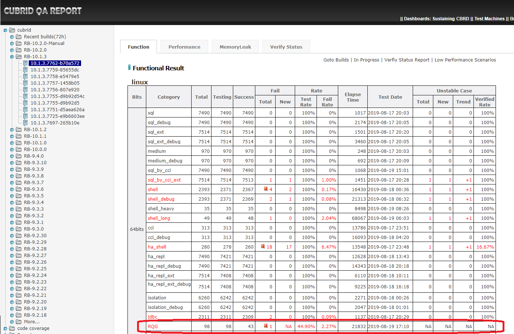

# 1. Test Objective
This guide is to introduce RQG test. The RQG test is amed to test CUBRID stability especially in terms of server crash. It randomly generates various of querys (UPDATE/DELETE/INSERT/SELECT and others) automatically based on grammar files and executes these queries with many threads.     

# 2. RQG Test Usage
The RQG test can be regarded as an extension of SHELL test. Like SHELL test, RQG test is also executed via CTP.
## 2.1 Install CTP
Please refer to [CTP installation guide](https://github.com/CUBRID/cubrid-testtools/blob/develop/doc/ctp_install_guide.md) to install CTP.
## 2.2 Install CUBRID 
```bash
 run_cubrid_install http://192.168.1.91:8080/REPO_ROOT/store_01/10.2.0.8294-2d9a032/drop/CUBRID-10.2.0.8294-2d9a032-Linux.x86_64-debug.sh
```
## 2.3 Install perl
* ### Install dependent packages according to your actual situation     
 ```bash
  yum install ncurses-devel ncurses
  yum -y install gcc+ gcc-c++
 ```
* ### Install perl-5.26.1     
  We generally need install perl with our expected version for better compatibility. CPAN will be integrated as one of requirements.
   ```bash
    mkdir ~/opt
    cd ~/opt
    tar zxvf perl-5.26.1.tar.gz
    cd perl-5.26.1
    ./Configure -Dprefix=~/opt/perl-526 -d
    make 
    make test
    make install
   ```

* ### Install DBI, DBD:CUBRID through CPAN
 ```bash
  perl -MCPAN -e shell (test whether CPAN  install)
  cpan>yes
  perl -MCPAN -e "install DBI"
  perl -MCPAN -e shell
 cpan> install DBD::cubrid
 ```
* ### Configure to support CUBRID driver
  Open `~/opt/perl-526/lib/site_perl/5.26.1/x86_64-linux/DBI.pm`, add the following codes into $dbd_prefix_registry  
  ```
  cubrid_      => { class => 'DBD::cubrid',         },
  ```

  ```bash
  my $dbd_prefix_registry = {
    ad_          => { class => 'DBD::AnyData',        },
    ad2_         => { class => 'DBD::AnyData2',       },
    ado_         => { class => 'DBD::ADO',            },
    amzn_        => { class => 'DBD::Amazon',         },
    best_        => { class => 'DBD::BestWins',       },
    csv_         => { class => 'DBD::CSV',            },
    cubrid_      => { class => 'DBD::cubrid',         },
    db2_         => { class => 'DBD::DB2',            },
    dbi_         => { class => 'DBI',                 },
    dbm_         => { class => 'DBD::DBM',            },
    df_          => { class => 'DBD::DF',             },
    examplep_    => { class => 'DBD::ExampleP',       },
    f_           => { class => 'DBD::File',           },
    file_        => { class => 'DBD::TextFile',       },
    go_          => { class => 'DBD::Gofer',          },
    ib_          => { class => 'DBD::InterBase',      },
    ing_         => { class => 'DBD::Ingres',         },
    ix_          => { class => 'DBD::Informix',       },
    jdbc_        => { class => 'DBD::JDBC',           },
    mariadb_     => { class => 'DBD::MariaDB',        },
    mem_         => { class => 'DBD::Mem',            },
    mo_          => { class => 'DBD::MO',             },
    monetdb_     => { class => 'DBD::monetdb',        },
     msql_        => { class => 'DBD::mSQL',           },
    mvsftp_      => { class => 'DBD::MVS_FTPSQL',     },
    mysql_       => { class => 'DBD::mysql',          },
    multi_       => { class => 'DBD::Multi'           },
    mx_          => { class => 'DBD::Multiplex',      },
    neo_         => { class => 'DBD::Neo4p',          },
    nullp_       => { class => 'DBD::NullP',          },
    odbc_        => { class => 'DBD::ODBC',           },
    ora_         => { class => 'DBD::Oracle',         },
    pg_          => { class => 'DBD::Pg',             },
    pgpp_        => { class => 'DBD::PgPP',           },
    plb_         => { class => 'DBD::Plibdata',       },
    po_          => { class => 'DBD::PO',             },
    proxy_       => { class => 'DBD::Proxy',          },
    ram_         => { class => 'DBD::RAM',            },
    rdb_         => { class => 'DBD::RDB',            },
    sapdb_       => { class => 'DBD::SAP_DB',         },
    snmp_        => { class => 'DBD::SNMP',           },
    solid_       => { class => 'DBD::Solid',          },
    spatialite_  => { class => 'DBD::Spatialite',     },
    sponge_      => { class => 'DBD::Sponge',         },
    sql_         => { class => 'DBI::DBD::SqlEngine', },
    sqlite_      => { class => 'DBD::SQLite',         },
    syb_         => { class => 'DBD::Sybase',         },
    sys_         => { class => 'DBD::Sys',            },
    tdat_        => { class => 'DBD::Teradata',       },
    tmpl_        => { class => 'DBD::Template',       },
    tmplss_      => { class => 'DBD::TemplateSS',     },
    tree_        => { class => 'DBD::TreeData',       },
    tuber_       => { class => 'DBD::Tuber',          },
    uni_         => { class => 'DBD::Unify',          },
    vt_          => { class => 'DBD::Vt',             },
    wmi_         => { class => 'DBD::WMI',            },
    x_           => { }, # for private use
    xbase_       => { class => 'DBD::XBase',          },
    xmlsimple_   => { class => 'DBD::XMLSimple',      },
    xl_          => { class => 'DBD::Excel',          },
    yaswi_       => { class => 'DBD::Yaswi',          },
    cubrid_      => { class => 'DBD::cubrid',         },
  };
  ```

* ### Configure `~/.bash_profile`   
  ```bash
  PATH=$PATH:$HOME/.local/bin:$HOME/bin

  export PATH

  export DEFAULT_BRANCH_NAME=develop
  export CTP_HOME=$HOME/CTP
  export CTP_BRANCH_NAME=develop
  export CTP_SKIP_UPDATE=0

  unset USERNAME
  export PATH=$CTP_HOME/bin:$CTP_HOME/common/script:$HOME/opt/perl-526:$HOME/opt/perl-526/bin:$PATH
  export init_path=$CTP_HOME/shell/init_path
  export RQG_HOME=/home/perl/random_query_generator

  ulimit -c unlimited

  #-------------------------------------------------------------------------------
  # set CUBRID environment variables
  #-------------------------------------------------------------------------------
  . /home/perl/.cubrid.sh
  ulimit -c unlimited
  ```

## 2.4 Install `random_query_generator`
The `Random_query_generator` is an external software that we need deploy it in each test node. Test case can find it via `RQG_HOME` environmental variable. We mainly directly execute `gendata.pl` and `gentest.pl` scripts.   

`gendata.pl`: generate tables and data   
`gentest.pl`: execute random queries   

**Step 1: check out random_query_generator**   
  ```bash
  cd ~
  git clone https://github.com/CUBRID/cubrid-testtools-internal.git
  cd ~/cubrid-testtools-internal
  git checkout develop
  cp random_query_generator ~/
  ```
**Step 2: configuration**      
Modify `~/random_query_generator/lib/GenTest/Properties.pm` as below to solve the porblem "Can't use 'defined(@array)'".     
```
   my $message;
    $message .= "The following properties are not legal: ".
        join(", ", map {"'--".$_."'"} sort @illegal). ". " if @illegal;

    $message .= "The following required properties  are missing: ".
        join(", ", map {"'--".$_."'"} sort @missing). ". " if @missing;

    if ($message) {
        $props->_help();
        croak($message);
    }
 
```

## 2.5 Check out test cases
Check out test codes with `'develop'` branch and store to `~/cubrid-testcases-private`.

```bash
cd ~
git clone https://github.com/CUBRID/cubrid-testcases-private.git
cd ~/cubrid-testcases-private
git checkout develop
```

## 2.6 Execute test

For example,
```bash
cd random_query_generator/_03_mvcc/vacuum/vacuum_correctness_01/cases/
sh vacuum_correctness_01.sh 
```
**Output:**
```
$ sh vacuum_correctness_01.sh 
++ begin_time=0
++ end_time=0
++ need_count_time=0
++ cubrid_major=
++ cubrid_minor=
++ IGNORE_TEST_PERFORMANCE=
++ '[' '!' -n '' ']'
++ CUBRID_CHARSET=en_US
+++ get_os
++++ uname
+++ osname=Linux
+++ case "$osname" in
+++ echo Linux
++ export OS=Linux
++ OS=Linux
++ '[' Linux = Windows_NT ']'
++ source /home/perl/CTP/shell/init_path/shell_utils.sh
+ . /home/perl/CTP/shell/init_path/rqg_init.sh
+++ pwd
++ cur_case_path=/home/perl/cubrid-testcases-private/random_query_generator/_03_mvcc/vacuum/vacuum_correctness_01/cases
+++ search_in_upper_path /home/perl/cubrid-testcases-private/random_query_generator/_03_mvcc/vacuum/vacuum_correctness_01/cases config
+++ curr_path=/home/perl/cubrid-testcases-private/random_query_generator/_03_mvcc/vacuum/vacuum_correctness_01/cases
+++ dest_name=config
+++ '[' -f /home/perl/cubrid-testcases-private/random_query_generator/_03_mvcc/vacuum/vacuum_correctness_01/cases/config ']'
+++ '[' -d /home/perl/cubrid-testcases-private/random_query_generator/_03_mvcc/vacuum/vacuum_correctness_01/cases/config ']'
++++ cd /home/perl/cubrid-testcases-private/random_query_generator/_03_mvcc/vacuum/vacuum_correctness_01/cases/..
++++ pwd
+++ '[' /home/perl/cubrid-testcases-private/random_query_generator/_03_mvcc/vacuum/vacuum_correctness_01 == / ']'
+++ search_in_upper_path /home/perl/cubrid-testcases-private/random_query_generator/_03_mvcc/vacuum/vacuum_correctness_01/cases/.. config
+++ curr_path=/home/perl/cubrid-testcases-private/random_query_generator/_03_mvcc/vacuum/vacuum_correctness_01/cases/..
+++ dest_name=config
+++ '[' -f /home/perl/cubrid-testcases-private/random_query_generator/_03_mvcc/vacuum/vacuum_correctness_01/cases/../config ']'
+++ '[' -d /home/perl/cubrid-testcases-private/random_query_generator/_03_mvcc/vacuum/vacuum_correctness_01/cases/../config ']'
++++ cd /home/perl/cubrid-testcases-private/random_query_generator/_03_mvcc/vacuum/vacuum_correctness_01/cases/../..
++++ pwd
+++ '[' /home/perl/cubrid-testcases-private/random_query_generator/_03_mvcc/vacuum == / ']'
+++ search_in_upper_path /home/perl/cubrid-testcases-private/random_query_generator/_03_mvcc/vacuum/vacuum_correctness_01/cases/../.. config
+++ curr_path=/home/perl/cubrid-testcases-private/random_query_generator/_03_mvcc/vacuum/vacuum_correctness_01/cases/../..
+++ dest_name=config
+++ '[' -f /home/perl/cubrid-testcases-private/random_query_generator/_03_mvcc/vacuum/vacuum_correctness_01/cases/../../config ']'
+++ '[' -d /home/perl/cubrid-testcases-private/random_query_generator/_03_mvcc/vacuum/vacuum_correctness_01/cases/../../config ']'
++++ cd /home/perl/cubrid-testcases-private/random_query_generator/_03_mvcc/vacuum/vacuum_correctness_01/cases/../../..
++++ pwd
+++ '[' /home/perl/cubrid-testcases-private/random_query_generator/_03_mvcc == / ']'
+++ search_in_upper_path /home/perl/cubrid-testcases-private/random_query_generator/_03_mvcc/vacuum/vacuum_correctness_01/cases/../../.. config
+++ curr_path=/home/perl/cubrid-testcases-private/random_query_generator/_03_mvcc/vacuum/vacuum_correctness_01/cases/../../..
+++ dest_name=config
+++ '[' -f /home/perl/cubrid-testcases-private/random_query_generator/_03_mvcc/vacuum/vacuum_correctness_01/cases/../../../config ']'
+++ '[' -d /home/perl/cubrid-testcases-private/random_query_generator/_03_mvcc/vacuum/vacuum_correctness_01/cases/../../../config ']'
++++ cd /home/perl/cubrid-testcases-private/random_query_generator/_03_mvcc/vacuum/vacuum_correctness_01/cases/../../../..
++++ pwd
+++ '[' /home/perl/cubrid-testcases-private/random_query_generator == / ']'
+++ search_in_upper_path /home/perl/cubrid-testcases-private/random_query_generator/_03_mvcc/vacuum/vacuum_correctness_01/cases/../../../.. config
+++ curr_path=/home/perl/cubrid-testcases-private/random_query_generator/_03_mvcc/vacuum/vacuum_correctness_01/cases/../../../..
+++ dest_name=config
+++ '[' -f /home/perl/cubrid-testcases-private/random_query_generator/_03_mvcc/vacuum/vacuum_correctness_01/cases/../../../../config ']'
+++ '[' -d /home/perl/cubrid-testcases-private/random_query_generator/_03_mvcc/vacuum/vacuum_correctness_01/cases/../../../../config ']'
++++ cd /home/perl/cubrid-testcases-private/random_query_generator/_03_mvcc/vacuum/vacuum_correctness_01/cases/../../../../config
++++ pwd
+++ echo /home/perl/cubrid-testcases-private/random_query_generator/config
++ export TESTCASE_HOME=/home/perl/cubrid-testcases-private/random_query_generator/config/..
++ TESTCASE_HOME=/home/perl/cubrid-testcases-private/random_query_generator/config/..
+ set -x
+ init test
++ date
+ echo '[INFO] TEST START (Fri Aug 16 16:10:28 KST 2019)'
[INFO] TEST START (Fri Aug 16 16:10:28 KST 2019)
+ '[' 0 -eq 1 ']'
++ pwd
+ cur_path=/home/perl/cubrid-testcases-private/random_query_generator/_03_mvcc/vacuum/vacuum_correctness_01/cases
+ cd /home/perl/cubrid-testcases-private/random_query_generator/_03_mvcc/vacuum/vacuum_correctness_01/cases
+ case_no=1
+ full_name=vacuum_correctness_01.sh
+ answer_no=1
+ mode=test
+ '[' Linux = Windows_NT ']'
+ export REAL_INIT_PATH=/home/perl/CTP/shell/init_path
+ REAL_INIT_PATH=/home/perl/CTP/shell/init_path
++ cubrid_rel
++ grep 32bit
++ wc -l
+ is_cubrid_32bits=0
+ '[' 0 == 1 ']'
+ CUBRID_BITS=64
+ export CUBRID_BITS
+ rm /home/perl/CUBRID/log/broker /home/perl/CUBRID/log/cub_client.err /home/perl/CUBRID/log/cubrid_utility.log /home/perl/CUBRID/log/cub_server.access /home/perl/CUBRID/log/cub_server.err /home/perl/CUBRID/log/fmdev063.nhncorp.cn_master.err /home/perl/CUBRID/log/manager /home/perl/CUBRID/log/server /home/perl/CUBRID/log/test_checkdb.access /home/perl/CUBRID/log/test_checkdb.err /home/perl/CUBRID/log/test_createdb.access /home/perl/CUBRID/log/test_createdb.err /home/perl/CUBRID/log/test_deletedb.access /home/perl/CUBRID/log/test_deletedb.err
+ '[' Linux = AIX ']'
+ objext=_objects
+ schext=_schema
+ idxext=_indexes
+ trgext=_trigger
+ PATH=/home/perl/CTP/shell/init_path/../../bin:/home/perl/CTP/shell/init_path/../../common/script:/home/perl/CTP/bin:/home/perl/CTP/common/script:/home/perl/opt/valgrind-312/bin:/home/perl/opt/jdk1.6.0_22/bin:/home/perl/core_analyzer:/home/perl/opt/cmake/bin:/home/perl/opt/mysql/bin:/home/perl/opt/perl-514:/home/perl/opt/perl-514/bin:/home/perl/CUBRID/bin:/home/perl/CUBRID/cubridmanager:/home/perl/opt/lcov-1.11/bin:/home/perl/cubrid_common:/home/perl/opt/local_valgrind/bin:/usr/jdk1.6.0_25/bin:/usr/kerberos/bin:/usr/jdk1.6.0_25/bin:/usr/local/bin:/bin:/usr/bin:/home/perl/bin
+ '[' Linux = Windows_NT ']'
+ CLASSPATH=/home/perl/CUBRID/jdbc/cubrid_jdbc.jar:/home/perl/CTP/shell/init_path/commonforjdbc.jar:.
+ LD_LIBRARY_PATH=/home/perl/CTP/shell/init_path/commonforc/lib:/home/perl/CUBRID/lib
+ rm /home/perl/CUBRID/log/server/test_20190816_1606.err /home/perl/CUBRID/log/server/test_latest.err
+ cubrid service stop
++ cubrid service is not running.
+ pkill cub
+ chmod u+x /home/perl/CTP/shell/init_path/cubrid
+ PATH=/home/perl/CTP/shell/init_path:/home/perl/opt/jdk1.6.0_22/bin:/home/perl/CTP/shell/init_path/../../bin:/home/perl/CTP/shell/init_path/../../common/script:/home/perl/CTP/bin:/home/perl/CTP/common/script:/home/perl/opt/valgrind-312/bin:/home/perl/opt/jdk1.6.0_22/bin:/home/perl/core_analyzer:/home/perl/opt/cmake/bin:/home/perl/opt/mysql/bin:/home/perl/opt/perl-514:/home/perl/opt/perl-514/bin:/home/perl/CUBRID/bin:/home/perl/CUBRID/cubridmanager:/home/perl/opt/lcov-1.11/bin:/home/perl/cubrid_common:/home/perl/opt/local_valgrind/bin:/usr/jdk1.6.0_25/bin:/usr/kerberos/bin:/usr/jdk1.6.0_25/bin:/usr/local/bin:/bin:/usr/bin:/home/perl/bin
+ export PATH
+ export CLASSPATH
+ export LD_LIBRARY_PATH
+ export LIBRARY_PATH
++ ini.sh -s %BROKER1 /home/perl/CUBRID/conf/cubrid_broker.conf SERVICE
++ grep -iw ON
++ grep -v grep
++ wc -l
+ isAvailableServiceForBroker1=1
+ '[' 1 -ne 0 ']'
++ ini.sh -s %BROKER1 /home/perl/CUBRID/conf/cubrid_broker.conf BROKER_PORT
+ broker_port=33037
+ sed -i 's@<port>[0-9]*</port>@<port>33037</port>@g' /home/perl/CTP/shell/init_path/shell_config.xml
+ '[' test = test ']'
+ run_mode=1
++ echo vacuum_correctness_01
+ case_name=vacuum_correctness_01
+ result_file=vacuum_correctness_01.result
+ '[' -f vacuum_correctness_01.tar ']'
+ '[' 1 -eq 1 ']'
+ '[' -f vacuum_correctness_01.result ']'
+ rm vacuum_correctness_01.result
+ touch vacuum_correctness_01.result
+ export OS
+ db_name=test
++ get_broker_port_from_shell_config
+++ awk '/<port>/' /home/perl/CTP/shell/init_path/shell_config.xml
++ port='  <port>33037</port>'
++ port='33037</port>'
++ port=33037
++ echo 33037
+ port=33037
++ get_dsn_url_with_autocommit_on test 33037
++ local db_name=test
++ port=33037
++ host_name=
++ '[' -z '' ']'
++ host_name=localhost
++ echo 'dbi:cubrid:database=test;host=localhost;port=33037;autocommit=on'
+ dsn='dbi:cubrid:database=test;host=localhost;port=33037;autocommit=on'
+ rqg_cubrid_createdb test
+ local db_name=test
+ param_count=1
+ '[' 1 -eq 0 ']'
++ cat /home/perl/CUBRID/databases/databases.txt
++ grep test
++ wc -l
+ is_exists_db=0
+ '[' 0 -a 0 -ne 0 ']'
+ '[' test ']'
+ cubrid_createdb test
+ parse_build_version
++ cubrid_rel
++ grep CUBRID
++ awk -F '(' '{print $2}'
++ sed 's/)//g'
+ build_ver='10.2.0.8294-2d9a032 '
+ cubrid_major=10
++ echo 10.2.0.8294-2d9a032
++ awk -F . '{print $2}'
+ cubrid_minor=2
++ cubrid_rel
++ grep debug
++ wc -l
+ isDebug=1
+ '[' 1 -eq 1 ']'
+ IGNORE_TEST_PERFORMANCE=TRUE
+ '[' 10 -ge 9 -a 2 -gt 1 ']'
+ cubrid createdb test en_US
Creating database with 512.0M size using locale en_US. The total amount of disk space needed is 1.5G.

CUBRID 10.2 (10.2.0.8294) (64 debug build)

+ rqg_cubrid_start_server test
+ local db_name=test
+ '[' '!' test ']'
+ retry_count=
+ '[' '!' '' ']'
+ retry_count=1
++ ps -u perl -o pid,comm
++ grep -v grep
++ grep cub_server
++ wc -l
+ isRunning=0
+ '[' 0 -ne 0 ']'
+ (( r=0 ))
+ (( r<1 ))
+ cubrid server start test
+ '[' 0 -eq 0 ']'
+ break
+ rqg_cubrid_start_broker
+ cubrid broker start
@ cubrid broker start
++ cubrid broker start: success
+ casedir=/home/perl/cubrid-testcases-private/random_query_generator/config/../_03_mvcc/common_yy_zz
++ pwd
+ curdir=/home/perl/cubrid-testcases-private/random_query_generator/_03_mvcc/vacuum/vacuum_correctness_01/cases
+ run_gendata '--dsn=dbi:cubrid:database=test;host=localhost;port=33037;autocommit=on' --spec=/home/perl/cubrid-testcases-private/random_query_generator/config/../_03_mvcc/common_yy_zz/outer_join.zz --rows=1000
+ param_options='--dsn=dbi:cubrid:database=test;host=localhost;port=33037;autocommit=on --spec=/home/perl/cubrid-testcases-private/random_query_generator/config/../_03_mvcc/common_yy_zz/outer_join.zz --rows=1000'
+ perl /home/perl/random_query_generator/gendata.pl '--dsn=dbi:cubrid:database=test;host=localhost;port=33037;autocommit=on' --spec=/home/perl/cubrid-testcases-private/random_query_generator/config/../_03_mvcc/common_yy_zz/outer_join.zz --rows=1000
# 16:10:40 Default schema: PUBLIC
# 16:10:40 Executor initialized, id GenTest::Executor::Cubrid 10.2.0.8294 ()
# 16:10:40 # Creating Cubrid table A .
# 16:10:40 # Creating Cubrid table B .
# 16:10:41 # Creating Cubrid table C .
# 16:10:41 # Creating Cubrid table D .
+ '[' 0 -ne 0 ']'
+ (( i=0 ))
+ (( i<5 ))
+ echo 'select * from A;'
select * from A;
+ sleep 2000000
+ echo 'select * from B;'
select * from B;
+ sleep 2000000
+ echo 'select * from C;'
+ run_gentest_without_check '--dsn=dbi:cubrid:database=test;host=localhost;port=33037;autocommit=on' --grammar=/home/perl/cubrid-testcases-private/random_query_generator/config/../_03_mvcc/common_yy_zz/outer_join_dml.yy --queries=1000 --threads=10
select * from C;
+ sleep 2000000
+ echo 'select * from D;'
select * from D;
+ sleep 2000000
+ ps xu
+ grep csql
+ grep -v grep
+ awk '{print $2}'
+ xargs -i kill -9 '{}'
+ run_gentest '--dsn=dbi:cubrid:database=test;host=localhost;port=33037;autocommit=on' --grammar=/home/perl/cubrid-testcases-private/random_query_generator/config/../_03_mvcc/common_yy_zz/outer_join.yy --queries=10 --threads=10 --validator=SelectStability
+ '[' 0 -ne 0 ']'
+ ps xu
+ grep gentest.pl
+ grep -v grep
+ awk '{print $2}'
+ xargs -i kill -9 '{}'
+ ps xu
+ grep 'sleep 2000000'
+ grep -v grep
+ awk '{print $2}'
+ xargs -i kill -9 '{}'
vacuum_correctness_01.sh: line 47:   816 Killed                  sleep 2000000
vacuum_correctness_01.sh: line 47:   817 Killed                  sleep 2000000
vacuum_correctness_01.sh: line 47:   818 Killed                  sleep 2000000
vacuum_correctness_01.sh: line 47:   819 Killed                  sleep 2000000
vacuum_correctness_01.sh: line 47: 32068 Killed                  sleep 2000000
vacuum_correctness_01.sh: line 47: 32069 Killed                  sleep 2000000
vacuum_correctness_01.sh: line 47: 32070 Killed                  sleep 2000000
+ (( i++ ))
+ (( i<5 ))
vacuum_correctness_01.sh: line 47: 32071 Killed                  sleep 2000000
+ echo 'select * from A;'
select * from A;
+ sleep 2000000
+ echo 'select * from B;'
select * from B;
+ sleep 2000000
+ echo 'select * from C;'
select * from C;
+ run_gentest_without_check '--dsn=dbi:cubrid:database=test;host=localhost;port=33037;autocommit=on' --grammar=/home/perl/cubrid-testcases-private/random_query_generator/config/../_03_mvcc/common_yy_zz/outer_join_dml.yy --queries=1000 --threads=10
+ sleep 2000000
+ echo 'select * from D;'
select * from D;
+ sleep 2000000
+ ps xu
+ grep csql
+ grep -v grep
+ awk '{print $2}'
+ xargs -i kill -9 '{}'
+ run_gentest '--dsn=dbi:cubrid:database=test;host=localhost;port=33037;autocommit=on' --grammar=/home/perl/cubrid-testcases-private/random_query_generator/config/../_03_mvcc/common_yy_zz/outer_join.yy --queries=10 --threads=10 --validator=SelectStability
+ '[' 0 -ne 0 ']'
+ ps xu
+ grep gentest.pl
+ grep -v grep
+ awk '{print $2}'
+ xargs -i kill -9 '{}'
+ ps xu
+ grep 'sleep 2000000'
+ grep -v grep
+ awk '{print $2}'
+ xargs -i kill -9 '{}'
vacuum_correctness_01.sh: line 47:   951 Killed                  sleep 2000000
vacuum_correctness_01.sh: line 47:   952 Killed                  sleep 2000000
vacuum_correctness_01.sh: line 47:   953 Killed                  sleep 2000000
+ (( i++ ))
+ (( i<5 ))
vacuum_correctness_01.sh: line 47:   954 Killed                  sleep 2000000
+ echo 'select * from A;'
select * from A;
+ sleep 2000000
+ echo 'select * from B;'
select * from B;
+ sleep 2000000
+ echo 'select * from C;'
select * from C;
+ sleep 2000000
+ run_gentest_without_check '--dsn=dbi:cubrid:database=test;host=localhost;port=33037;autocommit=on' --grammar=/home/perl/cubrid-testcases-private/random_query_generator/config/../_03_mvcc/common_yy_zz/outer_join_dml.yy --queries=1000 --threads=10
+ echo 'select * from D;'
select * from D;
+ sleep 2000000
+ ps xu
+ grep csql
+ grep -v grep
+ awk '{print $2}'
+ xargs -i kill -9 '{}'
+ run_gentest '--dsn=dbi:cubrid:database=test;host=localhost;port=33037;autocommit=on' --grammar=/home/perl/cubrid-testcases-private/random_query_generator/config/../_03_mvcc/common_yy_zz/outer_join.yy --queries=10 --threads=10 --validator=SelectStability
+ '[' 0 -ne 0 ']'
+ ps xu
+ grep gentest.pl
+ grep -v grep
+ awk '{print $2}'
+ xargs -i kill -9 '{}'
+ ps xu
+ grep 'sleep 2000000'
+ grep -v grep
+ awk '{print $2}'
+ xargs -i kill -9 '{}'
vacuum_correctness_01.sh: line 47:  1149 Killed                  sleep 2000000
vacuum_correctness_01.sh: line 47:  1150 Killed                  sleep 2000000
vacuum_correctness_01.sh: line 47:  1151 Killed                  sleep 2000000
+ (( i++ ))
+ (( i<5 ))
vacuum_correctness_01.sh: line 47:  1152 Killed                  sleep 2000000
+ echo 'select * from A;'
select * from A;
+ sleep 2000000
+ echo 'select * from B;'
select * from B;
+ sleep 2000000
+ echo 'select * from C;'
select * from C;
+ run_gentest_without_check '--dsn=dbi:cubrid:database=test;host=localhost;port=33037;autocommit=on' --grammar=/home/perl/cubrid-testcases-private/random_query_generator/config/../_03_mvcc/common_yy_zz/outer_join_dml.yy --queries=1000 --threads=10
+ sleep 2000000
+ echo 'select * from D;'
select * from D;
+ sleep 2000000
+ ps xu
+ grep csql
+ grep -v grep
+ awk '{print $2}'
+ xargs -i kill -9 '{}'
+ run_gentest '--dsn=dbi:cubrid:database=test;host=localhost;port=33037;autocommit=on' --grammar=/home/perl/cubrid-testcases-private/random_query_generator/config/../_03_mvcc/common_yy_zz/outer_join.yy --queries=10 --threads=10 --validator=SelectStability
+ '[' 0 -ne 0 ']'
+ ps xu
+ grep gentest.pl
+ grep -v grep
+ awk '{print $2}'
+ xargs -i kill -9 '{}'
+ ps xu
+ grep 'sleep 2000000'
+ grep -v grep
+ awk '{print $2}'
+ xargs -i kill -9 '{}'
vacuum_correctness_01.sh: line 47:  1368 Killed                  sleep 2000000
vacuum_correctness_01.sh: line 47:  1369 Killed                  sleep 2000000
vacuum_correctness_01.sh: line 47:  1370 Killed                  sleep 2000000
+ (( i++ ))
+ (( i<5 ))
vacuum_correctness_01.sh: line 47:  1371 Killed                  sleep 2000000
+ echo 'select * from A;'
select * from A;
+ sleep 2000000
+ echo 'select * from B;'
select * from B;
+ sleep 2000000
+ echo 'select * from C;'
select * from C;
+ run_gentest_without_check '--dsn=dbi:cubrid:database=test;host=localhost;port=33037;autocommit=on' --grammar=/home/perl/cubrid-testcases-private/random_query_generator/config/../_03_mvcc/common_yy_zz/outer_join_dml.yy --queries=1000 --threads=10
+ sleep 2000000
+ echo 'select * from D;'
select * from D;
+ sleep 2000000
+ ps xu
+ grep csql
+ grep -v grep
+ awk '{print $2}'
+ xargs -i kill -9 '{}'
+ run_gentest '--dsn=dbi:cubrid:database=test;host=localhost;port=33037;autocommit=on' --grammar=/home/perl/cubrid-testcases-private/random_query_generator/config/../_03_mvcc/common_yy_zz/outer_join.yy --queries=10 --threads=10 --validator=SelectStability
+ '[' 0 -ne 0 ']'
+ ps xu
+ grep gentest.pl
+ grep -v grep
+ awk '{print $2}'
+ xargs -i kill -9 '{}'
+ ps xu
+ grep 'sleep 2000000'
+ grep -v grep
+ awk '{print $2}'
+ xargs -i kill -9 '{}'
vacuum_correctness_01.sh: line 47:  1667 Killed                  sleep 2000000
vacuum_correctness_01.sh: line 47:  1668 Killed                  sleep 2000000
vacuum_correctness_01.sh: line 47:  1669 Killed                  sleep 2000000
+ (( i++ ))
+ (( i<5 ))
vacuum_correctness_01.sh: line 47:  1670 Killed                  sleep 2000000
+ rqg_cubrid_checkdb test
+ checkdb_options=test
+ '[' '!' test ']'
+ checkdb_options=test
+ cubrid service stop
@ cubrid broker stop
++ cubrid broker stop: success
@ cubrid master stop
++ cubrid master stop: success
+ sleep 2
+ cubrid checkdb -S test
+ '[' 0 -ne 0 ']'
+ write_ok
+ '[' -z '' ']'
+ echo '----------------- 6 : OK'
----------------- 6 : OK
+ echo 'vacuum_correctness_01-6 : OK'
+ let 'case_no = case_no + 1'
+ rqg_cubrid_cleandb
+ local db_name=
+ param_count=0
+ '[' 0 -eq 0 ']'
+ db_name=test
+ cubrid server stop test
@ cubrid server stop: test
++ cubrid server 'test' is not running.
+ cubrid deletedb test
+ finish
+ rm -f 'userver.err.*'
+ rm -f 'uclient.err.*'
+ rm -f 'client.err.*'
+ rm -rf ./lob
+ cubrid service stop
++ cubrid service is not running.
+ pkill cub
+ '[' 0 -eq 1 ']'
+ release_broker_sharedmemory
+ '[' Linux == Linux -o Linux == AIX ']'
++ ipcs
++ grep perl
++ awk '{print $2}'
+ broker_sid=
+ '[' -n '' ']'
+ delete_ini
+ '[' Linux = Windows_NT ']'
+ cp /home/perl/CUBRID/conf/cubrid.conf.org /home/perl/CUBRID/conf/cubrid.conf
cp: cannot stat ‘/home/perl/CUBRID/conf/cubrid.conf.org’: No such file or directory
+ restore_all_conf
+ restore_db_conf
+ '[' -f /home/perl/CUBRID/conf/cubrid.conf.org ']'
+ restore_broker_conf
+ '[' -f /home/perl/CUBRID/conf/cubrid_broker.conf.org ']'
+ restore_ha_conf
+ '[' -f /home/perl/CUBRID/conf/cubrid_ha.conf.org ']'
++ date
+ echo '[INFO] TEST STOP (Fri Aug 16 16:27:42 KST 2019)'
[INFO] TEST STOP (Fri Aug 16 16:27:42 KST 2019)
```


# 3. RQG Rgression Test Deployment 
## 3.1 Test Machines
In the current daily regression test, we are using one controller node and five test nodes.   

No.  |Role  |OS User |IP  |Hostname
 --|--|--|--|--
0  |Controller node|  controller|  192.168.1.99  |func24
1  |Test node  |perl  |192.168.1.99  |func24
2  |Test node  |perl  |192.168.1.100  |func25
3  |Test node  |perl  |192.168.1.101  |func26
4  |Test node  |perl  |192.168.1.102  |func27
5  |Test node  |perl  |192.168.1.103  |func28

**Controller node** listens to test messages and starts a test when there is a test message. It will distribute test cases to each test node for execution.    
**Test nodes** execute test cases in parallel.      

## 3.2 Deployment

### On Controller node
 * Install CTP  
 Please follow [CTP installation guide](ctp_install_guide.md#3-install-ctp-as-regression-test-platform) to install CTP.
 Then create test configuration file `~/CTP/conf/shell_template_for_RQG.conf` as below.   
    ```bash
    default.cubrid.cubrid_port_id=1567
    default.broker1.BROKER_PORT=30070
    default.broker1.APPL_SERVER_SHM_ID=30070
    default.broker2.BROKER_PORT=33071
    default.broker2.APPL_SERVER_SHM_ID=33071
    default.ha.ha_port_id=57707

    env.99.ssh.host=192.168.1.99
    env.99.ssh.port=22
    env.99.ssh.user=perl
    env.99.ssh.pwd=******

    env.100.ssh.host=192.168.1.100
    env.100.ssh.port=22
    env.100.ssh.user=perl
    env.100.ssh.pwd=******

    env.101.ssh.host=192.168.1.101
    env.101.ssh.port=22
    env.101.ssh.user=perl
    env.101.ssh.pwd=******

    env.102.ssh.host=192.168.1.102
    env.102.ssh.port=22
    env.102.ssh.user=perl
    env.102.ssh.pwd=******

    env.103.ssh.host=192.168.1.103
    env.103.ssh.port=22
    env.103.ssh.user=perl
    env.103.ssh.pwd=******

    main.mode.continue=false
    scenario=$HOME/cubrid-testcases-private/random_query_generator/_03_mvcc
    test_continue_yn=false
    cubrid_download_url=http://127.0.0.1/REPO_ROOT/store_02/10.1.0.6876-f9026f8/drop/CUBRID-10.1.0.6876-f9026f8-Linux.x86_64.sh
    testcase_exclude_from_file=/home/perl/cubrid-testcases-private/random_query_generator/config/daily_regression_test_exclude_list_RQG.conf
    testcase_update_yn=true
    testcase_git_branch=develop
    #testcase_timeout_in_secs=604800
    testcase_timeout_in_secs=36000
    test_platform=linux
    test_category=RQG
    testcase_exclude_by_macro=LINUX_NOT_SUPPORTED
    testcase_retry_num=0
    delete_testcase_after_each_execution_yn=false
    enable_check_disk_space_yn=true

    feedback_type=database
    feedback_notice_qahome_url=http://192.168.1.86:6060/qaresult/shellImportAction.nhn?main_id=<MAINID>

    owner_email=<owner e-mail>
    cc_email=<cc e-mail>

    git_user=<git user>
    git_email=<git e-mail>
    git_pwd=********

    feedback_db_host=192.168.1.86
    feedback_db_port=33080
    feedback_db_name=qaresu
    feedback_db_user=dba
    feedback_db_pwd=*********
    ```
    >Note: parameters desciption refer to [SHELL test guide](shell_guide.md).
    
 * Create quick start script used to start listener  
  File `~/start_test.sh`:   
  
    ```bash
    # If only need to listen the rqg test messages
    # nohup start_consumer.sh -q QUEUE_CUBRID_QA_RQG -exec run_shell &

    # We use one controllar to listen shell_heavy,shell_long and rqg test messages in daily QA.
    nohup start_consumer.sh -q QUEUE_CUBRID_QA_SHELL_HEAVY_LINUX,QUEUE_CUBRID_QA_RQG,QUEUE_CUBRID_QA_SHELL_LONG_LINUX -exec run_shell,run_shell,run_shell  &
    ```
    
### On every Test node

* Install CTP    
  Please refer to [2.1 Install CTP](#21-install-ctp)   
 * Install CUBRID          
  Please refer to [2.2 Install CUBRID](#22-install-cubrid)    
 * Install self perl evn      
  Please refer to [2.3 Install perl](#23-install-perl)    
 * Install random_query_generator     
  Please refer to [2.4 Install random_query_generator](#24-install-random_query_generator)         
 * Check out test cases     
  Please refer to [2.5 Chec kout Test Cases](#25-check-out-test-cases)    
 

# 4. RQG Regresion Test Sustaining

We perform RQG regression test for twice a week.  

## 4.1 Job Configuration

Log into `message@192.168.1.91`, open `~/CTP/conf/job.conf`, you will see RQG job configuration as below:
```
job_rqg.service=ON
job_rqg.crontab=* 0 2 ? * SAT,WED
job_rqg.listenfile=CUBRID-{1}-linux.x86_64-debug.sh
job_rqg.acceptversions=10.0.*.0~8999,10.1.*,10.2.*
job_rqg.package_bits=64
job_rqg.package_type=general
job_rqg.test.1.scenario=RQG
job_rqg.test.1.queue=QUEUE_CUBRID_QA_RQG
```
## 4.2 Test Startup

* ### Start the listener and keep as daemon process
```bash
cd ~
sh start_test.sh &
```

* ### Send test message by manual
For example, 
```bash
$ sender.sh QUEUE_CUBRID_QA_RQG http://192.168.1.91:8080/REPO_ROOT/store_01/10.1.3.7762-b70a572/drop/CUBRID-10.1.3.7762-b70a572-Linux.x86_64-debug.sh RQG default
Message: 

Message Content: Test for build 10.1.3.7762-b70a572 by CUBRID QA Team, China
MSG_ID = 190819-110540-387-000001
MSG_PRIORITY = 4
BUILD_ABSOLUTE_PATH=/home/ci_build/REPO_ROOT/store_01/10.1.3.7762-b70a572/drop
BUILD_BIT=0
BUILD_CREATE_TIME=1566039570000
BUILD_GENERATE_MSG_WAY=MANUAL
BUILD_ID=10.1.3.7762-b70a572
BUILD_IS_FROM_GIT=1
BUILD_PACKAGE_PATTERN=CUBRID-{1}-Linux.x86_64-debug.sh
BUILD_SCENARIOS=RQG
BUILD_SCENARIO_BRANCH_GIT=release/10.1
BUILD_SEND_DELAY=140770
BUILD_SEND_TIME=1566180340386
BUILD_STORE_ID=store_01
BUILD_SVN_BRANCH=RB-10.1.3
BUILD_SVN_BRANCH_NEW=RB-10.1.0
BUILD_TYPE=debug
BUILD_URLS=http://192.168.1.91:8080/REPO_ROOT/store_01/10.1.3.7762-b70a572/drop/CUBRID-10.1.3.7762-b70a572-Linux.x86_64-debug.sh
BUILD_URLS_CNT=1
BUILD_URLS_KR=http://192.168.1.91:8080/REPO_ROOT/store_01/10.1.3.7762-b70a572/drop/CUBRID-10.1.3.7762-b70a572-Linux.x86_64-debug.sh


Do you accept above message [Y/N]: Y
```

# 4.3 Verify Test Result
Open [QA homepage](http://qahome.cubrid.org) -> Select `build` ->select `Function`, find RQG item    
     

**Test Rate** is 44.90%, indicating that the test is not completed. (Expected value is 100%)   
**Fail Rate** is 2.27%, indicating that there are failures. (Expected value is 0)  
**Fail**  include two values, one is "Total" ,the other is "New".   
**Total** is 98, it is the number of whole RQG test cases     
**Testing** is 98, it is the same with **Total**, indicating that RQG test doesn't use execlude file    
**Success** is 43, indicating that the test is not completed or in progress. (Expected value of **Success** plus **Total of Fail** is 98)      
**Total of Fail** is 1, indicating that one test case has been failed. It is linked to detail page of failed cases,such as http://qahome.cubrid.org/qaresult/viewShellTestResult.nhn?shellTestId=22536&resultType=NOK    

## 1. server crash failures    
### step1: check core alert icon    
    
### step2: report crash issue aumatically   
#### click [core alert icon](http://qahome.cubrid.org/qaresult/viewShellTestResult.nhn?shellTestId=22684&srctb=shell_main&resultType=NOK)    
    
#### fill in **Jira User/Pwd** ->click **Analyze Failure** -> click **Submit To Jira**   
   

## 2. normal failures    
### step1: check total failures   
    
### step2: click [3](http://qahome.cubrid.org/qaresult/showFailResult.nhn?m=showFailVerifyItem&statid=22684&srctb=shell_main&failType=shell)
fail list:   
   

fail detail of single case:   
   

Please check running log to find fail reason, sometimes you need to reproduce it again.     
For above case:   
such log told us that fail is caused by checkdb   
```
+ cubrid checkdb -S test
/home/perl/CTP/shell/init_path/rqg_init.sh: line 564: 30715 Killed                  cubrid checkdb -S $checkdb_options > _checkdb.log 2>&1
+ '[' 137 -ne 0 ']'
+ sed -i 'a\Fail to execute checkdb utility with the standalone mode!\n' _checkdb.log
+ write_nok _checkdb.log
+ '[' -z _checkdb.log ']'
+ '[' -f _checkdb.log ']'
+ echo 'dead_data_02_big_record-2 : NOK'
+ cat _checkdb.log
```
## 3. reproduce issue   
for [CBRD-23163](http://jira.cubrid.org/browse/CBRD-23163)   
```
cd ~/cubrid-testcases-private/random_query_generator/_03_mvcc/recovery/rollback_uncommit_commit/rollback_uncommit_commit_dml_reuseoid/cases
nohup ~/CTP/shell/init_path/run_shell.sh --enable-report --report-cron='0 50 9,14,17 * * ?' --issue=http://jira.cubrid.org/browse/CBRD-23163 --mailto=lanlan.zhan@navercorp.com --mailcc=dl_cubridqa_bj_internal@navercorp.com --loop --update-build --prompt-continue=yes &
```
It will send test state email as your appointed times, like below:   


# 5. Test Case Specification  
* ## Follow with SHELL codes convention  
  Please refer to [SHELL case standard](shell_guide.md#5-shell-case-standards).

* ## Source common functions and variables

  Each test case should source like below to import more common functions and variables.

      . $init_path/rqg_init.sh

  **Variable:**
    `TESTCASE_HOME`: the directory to test suite root.

* ## Example one RQG test case 
  ```bash
  ##################################################################################
  # Test Case: big record
  # Priority: 1
  # Reference case:
  # Author: xxx
  #
  # Test Point:
  # execute dml of big_recored, then do a couple of checking 
  ##################################################################################

  #!/bin/sh
  . $init_path/init.sh
  . $init_path/rqg_init.sh
  set -x 
  init test

  # get dsn
  db_name="test"
  port=`get_broker_port_from_shell_config`
  dsn=`get_dsn_url_with_autocommit_on $db_name $port`

  # change db or broker parametes
  # change_db_parameter "checkpoint_every_size=1T" 
  # change_broker_parameter "MAX_NUM_APPL_SERVER     =50"
  change_db_parameter ...
  change_broker_parameter ...

  # create db, start server, and start broker
  rqg_cubrid_createdb $db_name
  rqg_cubrid_start_server $db_name
  rqg_cubrid_start_broker

  # set the path of yy and zz files
  casedir=${TESTCASE_HOME}/_03_mvcc/common_yy_zz

  # generate data and execute querys
  run_gendata ...
  run_gentest ...


  # server recovery
  rqg_kill_all_cub_process
  rqg_cubrid_start_server $db_name

  # check whether there are core files
  # execute cubrid checkdb
  # execute cubrid vacuumdb
  do_check_more_errors $cur_path 
  rqg_cubrid_checkdb $db_name 
  rqg_cubrid_vacuumdb

  # clear db
  rqg_cubrid_cleandb
  finish
  ```

* ## Function: get_dsn_url_with_autocommit_on  
  It is used to get dsn (the url connect to database and set autocommit on).    
  Usage:   
  ```
  dsn=`get_dsn_url_with_autocommit_on $db_name $port`
  ```

* ## Function: get_dsn_url_with_autocommit_off    
  It is used to get dsn (the url connect to database and set autocommit off).    
  Usage:   
  ```
  dsn=`get_dsn_url_with_autocommit_off $db_name $port`
  ```

* ## Function: rqg_cubrid_createdb   
  It is used to create database.   
  Usage:   
  ```
  rqg_cubrid_createdb $db_name
  ```
* ## Function: rqg_cubrid_start_server   
  It is used to start cubrid server.   
  Usage:   
  ```
  rqg_cubrid_start_server $db_name
  ```
  or
  ```
  rqg_cubrid_start_server
  ```
  >Note: If we don't transfer db_name to rqg_cubrid_start_server,it will use default database name `test`

* ## Function: rqg_cubrid_start_broker   
  It is used to start cubrid broker.   
  Usage:   
  ```
  rqg_cubrid_start_broker
  ```

* ## Function: run_gendata**     
  It equals to `perl $RQG_HOME/gendata.pl`, and is used to generate tables and data.    
  Usage:   
  ```
  casedir=${TESTCASE_HOME}/_03_mvcc/common_yy_zz
  run_gendata --dsn=${dsn} --spec=${casedir}/big_record.zz --rows=100000
  run_gendata --dsn=${dsn} --spec=${casedir}/big_record.zz --rows=100000
  run_gendata --dsn=${dsn} --spec=${casedir}/delete_range_where.zz --rows=100000
  run_gendata --dsn=${dsn} --spec=${casedir}/delete_range_where.zz --rows=100000
  run_gendata --dsn=${dsn} --spec=${casedir}/delete_range_where.zz --rows=100000
  run_gendata --dsn=${dsn} --spec=${casedir}/dml.zz --rows=1000
  run_gendata --dsn=${dsn} --spec=${casedir}/dml_ddl.zz --rows=100000
  run_gendata --dsn=${dsn} --spec=${casedir}/dml.zz --rows=1000
  run_gendata --dsn=${dsn} --spec=${casedir}/large_key.zz --rows=100000
  run_gendata --dsn=${dsn} --spec=${casedir}/large_key.zz --rows=1000
  run_gendata --dsn=${dsn} --spec=${casedir}/partitions_ddl.zz --rows=100000
  ```

* ## Function: run_gendata_without_check     
  It is similiar with `run_gendata`, but it doesn't check returned value。    
  Usage:   
  ```
  run_gendata_without_check --dsn=${dsn} --spec=${casedir}/partitions_ddl.zz --rows=100000
  ``` 

* ## Function: run_gentest    
  It equals to `perl $RQG_HOME/gentest.pl`, and is used to execute queries in parallel.    
  Usage:   
  ```
  run_gentest --dsn=${dsn} --grammar=${casedir}/big_record.yy  --queries=100000 --threads=50 1>${curdir}/result.log 2<&1
  run_gentest --dsn=${dsn} --grammar=${casedir}/big_record.yy  --queries=100000 --threads=10 1>${curdir}/result.log 2<&1
  run_gentest --dsn=${dsn} --grammar=${casedir}/dml.yy  --queries=100000 --threads=10 1>${curdir}/${log} 2<&1
  run_gentest --dsn=${dsn} --grammar=${casedir}/dml_ddl.yy  --queries=100000 --threads=50 1>${curdir}/${log} 2<&1
  run_gentest --dsn=${dsn} --grammar=${casedir}/dml.yy  --queries=100000 --threads=10 1>${curdir}/${log} 2<&1
  run_gentest --dsn=${dsn} --grammar=${casedir}/large_key.yy  --queries=100000 --threads=50 1>>${curdir}/${log} 2<&1
  run_gentest --dsn=${dsn} --grammar=${casedir}/partitions_ddl.yy  --queries=100000 --threads=50 1>${curdir}/${log} 2<&1 
  ```
  
* ## Function:run_gentest_without_check    
  It is similiar with `run_gentest`,but it doesn't check the returned value.    
  Usage:   
    ```
    run_gentest_without_check --dsn=${dsn} --grammar=${casedir}/delete_in_where.yy  --queries=100000 --threads=50 1>${curdir}/${log} 2<&1
    run_gentest_without_check --dsn=${dsn} --grammar=${casedir}/delete_in_where.yy  --queries=100000 --threads=50 1>${curdir}/${log} 2<&1
    run_gentest_without_check --dsn=${dsn} --grammar=${casedir}/delete_range_where.yy  --queries=100000 --threads=10 1>${curdir}/${log} 2<&1
    run_gentest_without_check --dsn=${dsn} --grammar=${casedir}/large_key.yy  --queries=100000 --threads=10 1>>${curdir}/${log} 2<&1
    ``` 

* ## Function: rqg_kill_all_cub_process    
  It is used to kill all processes named with cub_broker, cub_server, cub_cas, and cub_master.    
  Usage:   
  ```
  rqg_kill_all_cub_process
  ```
* ## do_check_more_errors    
  It is used to check fatal error, server crash and cas crash. Actually it is the function porvided by shell in $init_path/init.sh   
  Usage:    
  ```
  do_check_more_errors $cur_path 
  ```

* ## Function: rqg_cubrid_checkdb:   
  It is used to execute `cubrid checkdb` to check whether consistency or not.   
  Usage:   
  ```
  rqg_cubrid_checkdb $db_name 
  ```
  or
  ```
  rqg_cubrid_checkdb
  ```
  >Note: If we don't provide db_name option to `rqg_cubrid_checkdb`, the default name `'test'` will be used.

* ## Function: rqg_cubrid_vacuumdb:   
  It is used to execute `cubrid vacuumdb`.   
  Usage:   
  ```
  rqg_cubrid_vacuumdb $db_name
  ```
  or   
  ```
  rqg_cubrid_vacuumdb
  ```
  >Note: If we don't provide db_name option to `rqg_cubrid_checkdb`, the default name `'test'` will be used.

* ## Function: rqg_cubrid_cleandb
  It is used to delete database.   
  Usage:   
  ```
  rqg_cubrid_cleandb $db_name
  ```

* ## Function: rqg_do_backup_db  
  It is always used to save current database's data.   
  Usage:   
  ```
  rqg_do_backup_db $db_name $dest_db_name
  ```
  or 
  ```
  rqg_do_backup_db $db_name
  ```
  `rqg_do_backup_db $db_name $dest_db_name`: load data from current database(db_name) to another database (dest_db_name)   

  `rqg_do_backup_db $db_name` : run `cubrid backupdb $db_name`   

# 6 Appendix

## 6.1 Basic Usage for random_query_generator
* ### How to generate tables and data   
  * #### Configuration
     Suffix of configuration files is `.zz`. For example, there is `example.zz` as below:

         $tables = {
                 rows => [10000, 1000, 10000, 10000],
                # partitions => [ undef , 'KEY (pk) PARTITIONS 2' ]
         };
         $fields = {
                 types => [ 'int', 'char', 'enum', 'set(varchar(100))' ],
                 indexes => [undef, 'key' ],
                 null => [undef],
                 default => [undef, 'default null'],
                 #sign => [undef, 'unsigned'],
         #        charsets => ['utf8', 'latin1']
         };

         $data = {
                 numbers => [ 'digit', 'null', undef ],
                 strings => [ 'letter', 'english' ],
                 blobs => [ 'data' ],
                 temporals => ['date', 'year', 'null', undef ]
         }

   * #### Prepare a database to be tested.
        Let's create a database with CUBRID, then start CUBRID server and broker.  
     ```bash
     $ cubrid createdb test en_US
     Creating database with 512.0M size using locale en_us. The total amount of disk space needed is 1.5G.

     CUBRID 10.2 (10.2.0.8294) (64 debug build)

     $ cubrid server start test
     @ cubrid master start
     ++ cubrid master start: success
     @ cubrid server start: test

     This may take a long time depending on the amount of recovery works to do.

     CUBRID 10.2 (10.2.0.8294) (64 debug build)

     ++ cubrid server start: success
     $ cubrid broker start
     @ cubrid broker start
     ++ cubrid broker start: success
     $ cubrid broker status -b
     @ cubrid broker status
       NAME                   PID  PORT    AS   JQ                  TPS                  QPS   SELECT   INSERT   UPDATE   DELETE   OTHERS     LONG-T     LONG-Q         ERR-Q  UNIQUE-ERR-Q  #CONNECT   #REJECT 
     ===========================================================================================================================================================================================================
     * query_editor         OFF
     * broker1               5546 33037     5    0                    0                    0        0        0        0        0        0     0/60.0     0/60.0             0             0         0         0 
     $ 
     ```

   * #### Start to run
     Let's run with `example.zz` to generate tables and data.   

     ```bash
     $ cd ~/random_query_generator/
     $ perl ./gendata.pl "--dsn=dbi:cubrid:database=test;host=localhost;port=33037" --spec=/home/perl/random_query_generator/ok_conf/example.zz --rows=10
     # 17:18:31 Default schema: PUBLIC
     # 17:18:31 Executor initialized, id GenTest::Executor::Cubrid 10.2.0.8294 ()
     # 17:18:31 # Creating Cubrid table table10000_int_autoinc .
     # 17:18:47 # Progress: loaded 10000 out of 10000 rows
     # 17:18:47 # Creating Cubrid table table1000_int_autoinc .
     # 17:18:49 # Creating Cubrid table table10000_int_autoinc .
     # 17:19:05 # Progress: loaded 10000 out of 10000 rows
     # 17:19:05 # Creating Cubrid table table10000_int_autoinc .
     # 17:19:23 # Progress: loaded 10000 out of 10000 rows
     ```

   * #### Check results that tables and data populated

     ```bash
     $ csql -u dba  test

             CUBRID SQL Interpreter


     Type `;help' for help messages.

     csql> show tables;

     === <Result of SELECT Command in Line 1> ===

       Tables_in_test      
     ======================
       'table10000_int_autoinc'
       'table1000_int_autoinc'

     2 rows selected. (0.037355 sec) Committed.

     1 command(s) successfully processed.
     csql> select * from table10000_int_autoinc limit 5;

     === <Result of SELECT Command in Line 1> ===

       col_char_key          col_enum_key          col_char              col_enum              col_set_varchar_100_key      col_int           pk  
     col_set_varchar_100   col_int_key
     =============================================================================================================================================
     ==============================
       'z'                   NULL                  'o'                   NULL                  {'{r,d,m,z,i,n,e,q,e}'}         NULL         9643  
     {'{v,c,z,v,l,e,f}'}     698155008
       'k'                   'w'                   'b'                   'i'                   {'{b,q,a,c,q,b}'}       888406016         9644  {'{
     n,o,i,i}'}          -287768576
       'm'                   'r'                   'o'                   'q'                   {'{q,h,i,h,i}'}       -1230503936         9645  {'{
     i}'}                     -1245
       'j'                   NULL                  'd'                   'm'                   {'{y,z,k,j,f}'}        -602603520         9646  {'{
     n,y,o,v,z,s,a,j}'}    934477824
       'p'                   NULL                  'h'                   'f'                   {NULL}                      -1489         9647  {'{
     x,q,h,g,a,a}'}       739573760

     5 rows selected. (0.010582 sec) Committed.

     1 command(s) successfully processed.
     csql> select * from table1000_int_autoinc limit 5; 

     === <Result of SELECT Command in Line 1> ===

       col_int_key  col_enum              col_char_key                   pk  col_set_varchar_100_key      col_int  col_char              col_set_v
     archar_100   col_enum_key        
     =============================================================================================================================================
     ==============================
         274268160  'w'                   'x'                             1  {'{v,c,p,x,m,y,r}'}    1383923712  'g'                   {'{f,y,n,w,d
     }'}       NULL                
       -1116012544  'b'                   'p'                             2  {'{r,r,w,d,c,y,f}'}         26039  'z'                   {'{j,c,s,a,b
     ,v,h,v}'}  'c'                 
       -1219231744  'y'                   'u'                             3  {'{t,d}'}              -588251136  'w'                   {'{i,j,g,o}'
     }         'j'                 
            -15885  'c'                   't'                             4  {'{w,r,v,b}'}         -1587806208  'l'                   {'{i,c,x,f,q
     }'}       'l'                 
          38404096  NULL                  's'                             5  {'{g,h,j,i,t,z}'}           26571  'o'                   {NULL}      
               NULL                

     5 rows selected. (0.009555 sec) Committed.

     1 command(s) successfully processed.
     csql> 
     ```
     
     ```bash
     csql> ;sc table10000_int_autoinc

     === <Help: Schema of a Class> ===


      <Class Name> 

          table10000_int_autoinc

      <Attributes> 

          col_char_key         CHARACTER(1)
          col_enum_key         ENUM('a', 'b', 'c', 'd', 'e', 'f', 'g', 'h', 'i', 'j', 'k', 'l', 'm', 'n', 'o', 'p', 'q', 'r', 's', 't', 'u', 'v', 
     'w', 'x', 'y', 'z')
          col_char             CHARACTER(1)
          col_enum             ENUM('a', 'b', 'c', 'd', 'e', 'f', 'g', 'h', 'i', 'j', 'k', 'l', 'm', 'n', 'o', 'p', 'q', 'r', 's', 't', 'u', 'v', 
     'w', 'x', 'y', 'z')
          col_set_varchar_100_key SET OF CHARACTER VARYING(100)
          col_int              INTEGER
          pk                   INTEGER AUTO_INCREMENT  NOT NULL
          col_set_varchar_100  SET OF CHARACTER VARYING(100)
          col_int_key          INTEGER

      <Constraints> 

          PRIMARY KEY pk_table10000_int_autoinc_pk ON table10000_int_autoinc (pk)
          INDEX idx_table10000_int_autoinc_col_char_key_asc ON table10000_int_autoinc (col_char_key)
          INDEX idx_table10000_int_autoinc_col_enum_key_desc ON table10000_int_autoinc (col_enum_key DESC)
          INDEX idx_table10000_int_autoinc_col_int_key_asc ON table10000_int_autoinc (col_int_key, col_enum_key)


     Committed.
     csql> 
     ```

     ```bash
     csql> ;sc table1000_int_autoinc 

     === <Help: Schema of a Class> ===


      <Class Name> 

          table1000_int_autoinc

      <Attributes> 

          col_int_key          INTEGER
          col_enum             ENUM('a', 'b', 'c', 'd', 'e', 'f', 'g', 'h', 'i', 'j', 'k', 'l', 'm', 'n', 'o', 'p', 'q', 'r', 's', 't', 'u', 'v', 
     'w', 'x', 'y', 'z')
          col_char_key         CHARACTER(1)
          pk                   INTEGER AUTO_INCREMENT  NOT NULL
          col_set_varchar_100_key SET OF CHARACTER VARYING(100)
          col_int              INTEGER
          col_char             CHARACTER(1)
          col_set_varchar_100  SET OF CHARACTER VARYING(100)
          col_enum_key         ENUM('a', 'b', 'c', 'd', 'e', 'f', 'g', 'h', 'i', 'j', 'k', 'l', 'm', 'n', 'o', 'p', 'q', 'r', 's', 't', 'u', 'v', 
     'w', 'x', 'y', 'z')

      <Constraints> 

          PRIMARY KEY pk_table1000_int_autoinc_pk ON table1000_int_autoinc (pk)
          INDEX idx_table1000_int_autoinc_col_int_key_asc ON table1000_int_autoinc (col_int_key)
          INDEX idx_table1000_int_autoinc_col_char_key_desc ON table1000_int_autoinc (col_char_key DESC)
          INDEX idx_table1000_int_autoinc_col_enum_key_asc ON table1000_int_autoinc (col_enum_key, col_char_key)


     Committed.
     csql> 
     ```

* ### How to generate random queries  
  * #### Configuration
    Suffix of configuration files is `.yy`. For example, there is `example.yy` as below:
    ```bash
    query:
            update | insert | delete ;

    update:
            UPDATE _table SET int_field = digit WHERE condition LIMIT _digit ;

    delete:
            DELETE FROM _table WHERE condition;

    insert:
            INSERT INTO _table ( int_field ) VALUES ( _digit ) ;

    condition:
            int_field < digit | int_field = _digit ;
    int_field:
            col_int|col_int_key;
    ```

   * #### Start to run
     Let's run with `example.yy`. It should be executed after population of `example.zz` in above steps.  

     ```bash
     $ cd ~/random_query_generator/
     $ perl ./gentest.pl "--dsn=dbi:cubrid:database=test;host=localhost;port=33037"  --queries=10 --threads=10 --grammar=/home/perl/random_query_generator/ok_conf/example.yy        
     defined(@array) is deprecated at /home/perl/random_query_generator/lib/GenTest/Properties.pm line 168.
             (Maybe you should just omit the defined()?)
     defined(@array) is deprecated at /home/perl/random_query_generator/lib/GenTest/Properties.pm line 171.
             (Maybe you should just omit the defined()?)
     # 17:36:05 Starting 
     # 17:36:05  ./gentest.pl \ 
     # 17:36:05  --dsn=dbi:cubrid:database=test;host=localhost;port=33037 \ 
     # 17:36:05  --queries=10 \ 
     # 17:36:05  --threads=10 \ 
     # 17:36:05  --grammar=/home/perl/random_query_generator/ok_conf/example.yy
     # 17:36:05 -------------------------------
     # 17:36:05 Configuration
     # 17:36:05   dsn => ['dbi:cubrid:database=test;host=localhost;port=33037']
     # 17:36:05   duration => 3600
     # 17:36:05   grammar => /home/perl/random_query_generator/ok_conf/example.yy
     # 17:36:05   queries => 10
     # 17:36:05   reporters => ['']
     # 17:36:05   seed => 1
     # 17:36:05   threads => 10
     # 17:36:05   validators => ['']
     # 17:36:05 Reporters: (none)
     # 17:36:05 Validators: (none)
     # 17:36:05 Starting 10 processes, 10 queries each, duration 3600 seconds.
     # 17:36:05 GenTest::ErrorFilter(6650) started
     # 17:36:05 Default schema: PUBLIC
     # 17:36:05 Executor initialized, id GenTest::Executor::Cubrid 10.2.0.8294 ()
     # 17:36:05 Caching metadata for dbi:cubrid:database=test;host=localhost;port=33037
     # 17:36:05 Default schema: PUBLIC
     # 17:36:05 Executor initialized, id GenTest::Executor::Cubrid 10.2.0.8294 ()
     # 17:36:05 Caching metadata for dbi:cubrid:database=test;host=localhost;port=33037
     # 17:36:05 Default schema: PUBLIC
     # 17:36:05 Executor initialized, id GenTest::Executor::Cubrid 10.2.0.8294 ()
     # 17:36:05 Caching metadata for dbi:cubrid:database=test;host=localhost;port=33037
     # 17:36:05 Default schema: PUBLIC
     # 17:36:05 Executor initialized, id GenTest::Executor::Cubrid 10.2.0.8294 ()
     # 17:36:05 Caching metadata for dbi:cubrid:database=test;host=localhost;port=33037
     # 17:36:05 Default schema: PUBLIC
     # 17:36:05 Executor initialized, id GenTest::Executor::Cubrid 10.2.0.8294 ()
     # 17:36:05 Caching metadata for dbi:cubrid:database=test;host=localhost;port=33037
     # 17:36:06 Default schema: PUBLIC
     # 17:36:06 Executor initialized, id GenTest::Executor::Cubrid 10.2.0.8294 ()
     # 17:36:06 Caching metadata for dbi:cubrid:database=test;host=localhost;port=33037
     # 17:36:06 Default schema: PUBLIC
     # 17:36:06 Executor initialized, id GenTest::Executor::Cubrid 10.2.0.8294 ()
     # 17:36:06 Caching metadata for dbi:cubrid:database=test;host=localhost;port=33037
     # 17:36:06 Default schema: PUBLIC
     # 17:36:06 Executor initialized, id GenTest::Executor::Cubrid 10.2.0.8294 ()
     # 17:36:06 Caching metadata for dbi:cubrid:database=test;host=localhost;port=33037
     # 17:36:06 Default schema: PUBLIC
     # 17:36:06 Executor initialized, id GenTest::Executor::Cubrid 10.2.0.8294 ()
     # 17:36:06 Caching metadata for dbi:cubrid:database=test;host=localhost;port=33037
     # 17:36:06 Default schema: PUBLIC
     # 17:36:06 Executor initialized, id GenTest::Executor::Cubrid 10.2.0.8294 ()
     # 17:36:06 Caching metadata for dbi:cubrid:database=test;host=localhost;port=33037
     # 17:36:06 Started periodic reporting process...
     # 17:36:07 Child process completed successfully.
     # 17:36:07 Child process completed successfully.
     # 17:36:07 Child process completed successfully.
     # 17:36:07 Child process completed successfully.


     DELETE FROM "table10000_int_autoinc" WHERE col_int_key < 3
     CUBRID DBMS Error : (-968) Your transaction (index 2, PUBLIC@fmdev063.nhncorp.cn|5548) timed out waiting on    X_LOCK lock on instance 0|3394|260 of class table10000_int_autoinc because of deadlock. You are waiting for user(s) PUBLIC@fmdev063.nhncorp.cn|broker1_cub_cas_5(5551) to finish.[CAS INFO - 127.0.0.1:33037, 2, 5548].

     # 17:36:08 Child process completed successfully.


     DELETE FROM "table10000_int_autoinc" WHERE col_int_key < 4
     CUBRID DBMS Error : (-968) Your transaction (index 6, PUBLIC@fmdev063.nhncorp.cn|6674) timed out waiting on    X_LOCK lock on instance 0|3395|317 of class table10000_int_autoinc because of deadlock. You are waiting for user(s) PUBLIC@fmdev063.nhncorp.cn|broker1_cub_cas_5(5551) to finish.[CAS INFO - 127.0.0.1:33037, 6, 6674].

     # 17:36:08 Child process completed successfully.


     UPDATE "table10000_int_autoinc" SET col_int = 1 WHERE col_int = 7 LIMIT 5
     CUBRID DBMS Error : (-968) Your transaction (index 9, PUBLIC@fmdev063.nhncorp.cn|6689) timed out waiting on    X_LOCK lock on instance 0|3455|222 of class table10000_int_autoinc because of deadlock. You are waiting for user(s) PUBLIC@fmdev063.nhncorp.cn|broker1_cub_cas_7(6679), PUBLIC@fmdev063.nhncorp.cn|broker1_cub_cas_2(5548) to finish.[CAS INFO - 127.0.0.1:33037, 9, 6689].

     # 17:36:09 Child process completed successfully.
     # 17:36:12 Child process completed successfully.
     # 17:36:13 Child process completed successfully.
     # 17:36:14 Child process completed successfully.
     # 17:36:15 Killing periodic reporting process with pid 6651...
     # 17:36:15 Kill GenTest::ErrorFilter(6650)
     # 17:36:15 Test completed successfully.
     ```
     
   * #### Check running status

        During test running, we may use `cubrid broker status` to get what qureies are executing.

     ```bash
     $ cubrid broker status
     @ cubrid broker status
     % query_editor OFF

     % broker1
     ----------------------------------------------------------------------
             ID   PID                  QPS        LQS   PSIZE STATUS       
     ----------------------------------------------------------------------
              1  5547                 1852          0   92468 BUSY         
     SQL: execute DELETE FROM "table10000_int_autoinc" WHERE col_int < 2
              2  5548                 1260          0   85748 BUSY         
     SQL: execute DELETE FROM "table10000_int_autoinc" WHERE col_int < 4
              3  5549                 1250          0   85748 BUSY         
     SQL: execute UPDATE "table10000_int_autoinc" SET col_int_key = 6 WHERE col_int < 3 LIMIT 0
              4  5550                 1176          0   85748 BUSY         
     SQL: execute UPDATE "table1000_int_autoinc" SET col_int_key = 8 WHERE col_int = 6 LIMIT 3
              5  5551                 1292          0   85744 BUSY         
     SQL: execute DELETE FROM "table10000_int_autoinc" WHERE col_int < 6
              6  6674                 1142          0   85744 BUSY         
     SQL: execute UPDATE "table10000_int_autoinc" SET col_int = 8 WHERE col_int_key < 8 LIMIT 7
              7  6679                 1210          0   85740 BUSY         
     SQL: execute DELETE FROM "table10000_int_autoinc" WHERE col_int = 9
              8  6684                 1179          0   85744 BUSY         
     SQL: execute DELETE FROM "table10000_int_autoinc" WHERE col_int = 2
              9  6689                 1270          0   85740 BUSY         
     SQL: execute DELETE FROM "table10000_int_autoinc" WHERE col_int < 4
             10  6694                 1274          0   85740 BUSY         
     SQL: execute DELETE FROM "table10000_int_autoinc" WHERE col_int < 2
     ```


## 6.2 Detail Usage for `random_query_generator`

Good RQG cases mainly relate to .yy and .zz configuration files. We need to design `.yy` and `.zz` files to try to cover test points.

* ### Configure the Data Generator
  The Data Generator is driven by a configuration file which may look as follows:

  ```
  $tables = {
          names => ['A','B'],
          rows => [ '10000' , '1000' ],
          partitions => [ undef , 'hash (pk) PARTITIONS 2' ],
          pk => [ 'int auto_increment' ]
  };

  $fields = {
          types => [ 'int', 'char(16000)', 'float', 'numeric' ],
          indexes => [ undef, 'key' ],
          default => [undef, 'default null' ],
  };

  $data = {
          strings => [ 'english' ],
          float => [ 'digit', 'smallint', 'smallint'  ],
          numeric => [ 'digit', 'smallint', 'smallint'  ],
          int => [ 'digit', 'smallint', 'smallint'  ]
  };
  ```

  #### Configure the Tables
  The `$tables` section describes the sizes and the other attributes of the tables. The example above will create 4 tables, one for each combination of partitions and table size. This section accepts the following parameters:   
  * names - tables names that are used for the generated tables. If there are more tables (i.e. combinations of size, partitions, etc.) than there are names, default names will be used when the supply of user-defined names has run out. See below for details on the structure of default table names.

      For example:
      ```
      names => ['A','B'],
      ```
      **generate tables like below:**   
      ```bash
      $ perl ~/random_query_generator/gendata.pl --dsn=${dsn} --spec=big_record.zz
      # 18:38:13 Default schema: PUBLIC
      # 18:38:13 Executor initialized, id GenTest::Executor::Cubrid 10.2.0.8294 ()
      # 18:38:13 # Creating Cubrid table A .
      # 18:38:43 # Progress: loaded 10000 out of 10000 rows
      # 18:38:43 # Creating Cubrid table B .
      # 18:39:21 # Progress: loaded 10000 out of 10000 rows
      # 18:39:21 # Creating Cubrid table table1000_int_autoinc .
      # 18:39:23 # Creating Cubrid table table1000_hash_pk_parts_2_int_autoinc .
      ```
      **generated tables with partitions or not, have 10000 rows or 1000 rows:**
      ```
      csql> show tables;

      === <Result of SELECT Command in Line 1> ===

      Tables_in_test      
      ======================
      'a'                 
      'b'                 
      'b__p__p0'          
      'b__p__p1'          
      'table1000_hash_pk_parts_2_int_autoinc'
      'table1000_hash_pk_parts_2_int_autoinc__p__p0'
      'table1000_hash_pk_parts_2_int_autoinc__p__p1'
      'table1000_int_autoinc'

      8 rows selected. (0.045157 sec) Committed.

      1 command(s) successfully processed.
      csql> 
      ```
      > Note: Tables names are set according to the properties of the generated tables, and/or according to the names parameter if set. If the names parameter is not set, or if there are not enough names specified, the following approximate name structure is used:    
      > `table<rows>_[charset]_[collation]_[partition]_<pk>_<row-format>`        
      > Resulting in table names like:      
      >```
      >table0_int_autoinc
      >table1000_int_autoinc
      >table100_hash_pk_parts_2_int_autoinc
      >```

  * rows - the sizes of the tables that will be created. The default is 0, 1, 2, 10, 100
      ```
      rows => [ '10000' , '1000' ],
      ```

      **all tables just with 10000 or 1000 rows,such as:**
      ```
      csql> select count(*) from a;

      === <Result of SELECT Command in Line 1> ===

          count(*)
      =============
              10000

      1 row selected. (0.847494 sec) Committed.

      1 command(s) successfully processed.
      csql> select count(*) from b;

      === <Result of SELECT Command in Line 1> ===

          count(*)
      =============
              10000

      1 row selected. (0.883741 sec) Committed.

      1 command(s) successfully processed.
      csql> select count(*) from table1000_int_autoinc;

      === <Result of SELECT Command in Line 1> ===

          count(*)
      =============
              1000

      1 row selected. (0.109506 sec) Committed.

      1 command(s) successfully processed.
      csql> select count(*) from table1000_hash_pk_parts_2_int_autoinc; 

      === <Result of SELECT Command in Line 1> ===

          count(*)
      =============
              1000

      1 row selected. (0.108839 sec) Committed.

      1 command(s) successfully processed.
      csql> 
      ```
  * partitions - the partitioning clause to be used. To create some unpartitioned tables, use undef as an element in the array.
      ```
      partitions => [ undef , 'hash (pk) PARTITIONS 2' ],
      ```
     **It generate two kinds of tables, partition table or non-partition table, such as:**
      ```
      csql> ;sc A

      === <Help: Schema of a Class> ===


      <Class Name> 

          a

      <Attributes> 

          col_int              INTEGER
          col_numeric          NUMERIC(15,0)
          col_int_key          INTEGER
          col_char_16000       CHARACTER(16000)
          pk                   INTEGER AUTO_INCREMENT  NOT NULL
          col_char_16000_key   CHARACTER(16000)
          col_float            FLOAT
          col_float_key        FLOAT
          col_numeric_key      NUMERIC(15,0)

      <Constraints> 

          PRIMARY KEY pk_a_pk ON a (pk)
          INDEX idx_a_col_int_key_asc ON a (col_int_key)
          INDEX idx_a_col_char_16000_key_desc ON a (col_char_16000_key DESC)
          INDEX idx_a_col_float_key_asc ON a (col_float_key, col_char_16000_key)
          INDEX idx_a_col_numeric_key_desc ON a (col_numeric_key, col_float_key DESC)


      Committed.
      csql> 
      ```

      ```
      csql> ;sc B

      === <Help: Schema of a Class> ===


      <Class Name> 

          b

      <Sub Classes> 

          b__p__p0
          b__p__p1

      <Attributes> 

          col_numeric          NUMERIC(15,0)
          pk                   INTEGER AUTO_INCREMENT  NOT NULL
          col_numeric_key      NUMERIC(15,0)
          col_char_16000       CHARACTER(16000)
          col_float_key        FLOAT
          col_int              INTEGER
          col_char_16000_key   CHARACTER(16000)
          col_float            FLOAT
          col_int_key          INTEGER

      <Constraints> 

          PRIMARY KEY pk_b_pk ON b (pk)
          INDEX idx_b_col_numeric_key_asc ON b (col_numeric_key)
          INDEX idx_b_col_float_key_desc ON b (col_float_key DESC)
          INDEX idx_b_col_char_16000_key_asc ON b (col_char_16000_key, col_float_key)
          INDEX idx_b_col_int_key_desc ON b (col_int_key, col_char_16000_key DESC)

      <Partitions>

          PARTITION BY HASH ([pk]) PARTITIONS 2
          PARTITION p0
          PARTITION p1


      Committed.
      csql> 
      ```


  * pk - Specify the primary keys to be used. Valid values are undef for no primary key, or any integer-based PK definition. If auto_increment is specified, the script will insert NULLs in that column. If not, then a sequence of increasing integers will be used. Generation of non-integer primary keys is not yet supported.
      ```
      pk => [ 'int auto_increment' ]
      ```
      
  #### Configure the Fields
  The `$fields` section describes the fields and the indexes to be created in each table. One field will be created for each combination of values. For example, the resulting table will have a field int_unique and the corresponding key UNIQUE (int_unique).

  The order of the fields within each table is pseudo-random, which may help trigger bugs which are dependent on the physical placement of the fields. Each table also has a PRIMARY KEY named, appropriately, pk.

  * type - specifies a list of CUBRID types to be used. Any CUBRID type name or alias can be used here. Length modifiers, e.g. char (50) are also allowed. If no length is specified, char columns are created as char (1). set and enum fields will be created to accept every letter from A to Z, unless you specify otherwise. This is so that they can then be populated with random letters. The default for this option is int,varchar,date,time,datetime.
      ```
      $fields = {
              indexes => [ undef, 'key' ],
      };
      ```

      ```
      csql> ;sc c

      === <Help: Schema of a Class> ===


      <Class Name> 

          c

      <Attributes> 

          col_int              INTEGER
          col_varchar          CHARACTER VARYING(1)
          pk                   INTEGER AUTO_INCREMENT  NOT NULL
          col_varchar_key      CHARACTER VARYING(1)
          col_int_key          INTEGER
          col_datetime         DATETIME
          col_time             TIME
          col_datetime_key     DATETIME
          col_date             DATE
          col_time_key         TIME
          col_date_key         DATE

      <Constraints> 

          PRIMARY KEY pk_c_pk ON c (pk)
          INDEX idx_c_col_varchar_key_asc ON c (col_varchar_key)
          INDEX idx_c_col_int_key_desc ON c (col_int_key DESC)
          INDEX idx_c_col_datetime_key_asc ON c (col_datetime_key, col_int_key)
          INDEX idx_c_col_time_key_desc ON c (col_time_key, col_datetime_key DESC)
          INDEX idx_c_col_date_key_asc ON c (col_date_key)


      Committed.
      ```

  * indexes - for all field types, specifies whether the field will have an index over it. 'undef' means no index, 'key' means a standard index and unique  means unique index. The default is undef, key, meaning that each field will be created in both indexed and non-indexed variants. 
      ```
      $fields = {

      };
      ```

      ```
      csql> ;sc g

      === <Help: Schema of a Class> ===


      <Class Name> 

          g

      <Attributes> 

          col_int              INTEGER
          col_varchar          CHARACTER VARYING(1)
          pk                   INTEGER AUTO_INCREMENT  NOT NULL
          col_varchar_key      CHARACTER VARYING(1)
          col_int_key          INTEGER
          col_datetime         DATETIME
          col_time             TIME
          col_datetime_key     DATETIME
          col_date             DATE
          col_time_key         TIME
          col_date_key         DATE

      <Constraints> 

          PRIMARY KEY pk_g_pk ON g (pk)
          INDEX idx_g_col_varchar_key_asc ON g (col_varchar_key)
          INDEX idx_g_col_int_key_desc ON g (col_int_key DESC)
          INDEX idx_g_col_datetime_key_asc ON g (col_datetime_key, col_int_key)
          INDEX idx_g_col_time_key_desc ON g (col_time_key, col_datetime_key DESC)
          INDEX idx_g_col_date_key_asc ON g (col_date_key)


      Committed.
      ```

  * charsets - specify the character sets
  * collations - specify the collations to be used. Note that a table will be created for each combination of character set and collation, which may not always be valid.

  #### Configure the Data
  The `$data` section from the configuration file describes what data will be inserted into each field type:

  * numbers/int/float/numberic- this describes how to generate values for all integer and float field types. Valid values are:
    * null - a NULL value if the column can accept it;
    * digit - a single random digit from 0 to 9;
      set:
      ```
      int => [ 'digit' ],
      ```
      result:
      ```
      csql> select * from f;

      === <Result of SELECT Command in Line 1> ===

          col_int           pk  col_int_key
      =======================================
                  1            1            4
                  9            2            3
                  5            3            1
                  7            4            7
                  3            5            7

      5 rows selected. (0.014756 sec) Committed.

      1 command(s) successfully processed.
      csql> 
      ```
    * undef
      set:
      ```
      float => [ 'tinyint', undef  ],
      ```
      result:
      ```
      $ csql -u dba test -c "select * from g"                                      

      === <Result of SELECT Command in Line 1> ===

          col_float           pk  col_float_key
      ===========================================
      0.000000e+00            1   0.000000e+00
      0.000000e+00            2   0.000000e+00
      -2.800000e+01            3  -3.300000e+01

      3 rows selected. (0.008899 sec) Committed.
      ```
    * boolean - random 0 or 1 .
      set:
      ```
      int => [ 'boolean' ],
      ```
      result:
      ```
      csql> select * from f;

      === <Result of SELECT Command in Line 1> ===

          col_int           pk  col_int_key
      =======================================
                  1            1            0
                  0            2            0
                  0            3            0

      3 rows selected. (0.014286 sec) Committed.

      1 command(s) successfully processed.
      csql> 
      ```
    * tinyint, mediumint and smallint - generate a random value that will fit in this particular type.
      set float: 
      ```
      float => [ 'tinyint', 'smallint', 'mediumint'  ],
      ```
      result:
      ```
      $ csql -u dba test -c "select * from g"

      === <Result of SELECT Command in Line 1> ===

          col_float           pk  col_float_key
      ===========================================
      2.263000e+03            1  -8.400000e+01
      -1.792900e+04            2  -2.459500e+04
      -1.851648e+06            3  -3.300000e+01

      3 rows selected. (0.009530 sec) Committed.
      ```

      set int:
      ```
      int => ['tinyint]
      ```
      result:
      ```
      $ csql -u dba test -c "select * from f"

      === <Result of SELECT Command in Line 1> ===

          col_int           pk  col_int_key
      =======================================
                  8            1          -84
              -70            2          -96
              -28            3          -33

      3 rows selected. (0.011549 sec) Committed.
      ```
      set int:
      ```
      int => [ 'mediumint' ],
      ```
      result:
      ```
      $ csql -u dba test -c "select * from f"

      === <Result of SELECT Command in Line 1> ===

          col_int           pk  col_int_key
      =======================================
          579328            1     -5507584
          -4589824            2     -6296320
          -1851648            3     -2213632

      3 rows selected. (0.012849 sec) Committed.
      ```

      set numeric:
      ```
      numeric => [ 'smallint' ],
      ```
      result:
      ```
      $ csql -u dba test -c "select * from f"

      === <Result of SELECT Command in Line 1> ===

      col_numeric                    pk  col_numeric_key     
      =========================================================
      2263                            1  -21514              
      -17929                          2  -24595              
      -7233                           3  -8647               

      3 rows selected. (0.013850 sec) Committed.
      ```
  * strings - it describes how to generate values for all string columns (char, varchar, string and so on). Valid values are:
    * null & empty - which generates 'NULL' and ' '   
    * letter- which generates a random letter from A to Z   
    * english- which picks a random word from a list of 100 most common words in English.     
      For example:    
      for `english`   
      ```
      strings => [ 'english' ],
      ```
      result: 
      ```
      $ csql -u dba test -c "select * from f"

      === <Result of SELECT Command in Line 1> ===

      col_string                     pk  col_string_key      
      =========================================================
      'her'                           1  'no'                
      'if'                            2  'that'              
      'his'                           3  'from'              

      3 rows selected. (0.012999 sec) Committed.
      ```
      for `letter`:
      ```
      strings => [ 'letter' ],
      ```
      result:
      ```
      $ csql -u dba test -c "select * from f"

      === <Result of SELECT Command in Line 1> ===

      col_string                     pk  col_string_key      
      =========================================================
      'j'                             1  'w'                 
      't'                             2  'j'                 
      'd'                             3  't'                 

      3 rows selected. (0.013491 sec) Committed.
      ```
      for `null`:
      ```
      strings => [ 'letter','null' ],
      ```
      result:
      ```
      $ csql -u dba test -c "select * from f"  

      === <Result of SELECT Command in Line 1> ===

      col_string                     pk  col_string_key      
      =========================================================
      NULL                            1  NULL                
      NULL                            2  'b'                 
      NULL                            3  NULL                

      3 rows selected. (0.012823 sec) Committed.
      ```
      for `empty`:
      ```
      strings => [ 'empty' ],
      ```
      result:
      ```
      $ csql -u dba test -c "select * from f"

      === <Result of SELECT Command in Line 1> ===

      col_string                     pk  col_string_key      
      =========================================================
      ''                              1  ''                  
      ''                              2  ''                  
      ''                              3  ''                  

      3 rows selected. (0.013325 sec) Committed.
      ```

  #### Examples
  **1. b.zz**    
  ```
  $ cat b.zz 
  $tables = {
          names => ['E','F'],
          rows  => [5],
          pk => [ 'int auto_increment' ]
  };

  $fields = {
          types => [ 'int','char(5)' ],
          indexes => [ undef, 'index' ],
  };

  $data = {
          strings => [ 'english' ],
          float => [ 'digit', 'smallint', 'smallint'  ],
          numeric => [ 'digit', 'smallint', 'smallint'  ],
          int => [ 'digit', 'smallint', 'smallint'  ]
  };
  ```
  **generate data logs:**     
  ```
  $ perl ~/random_query_generator/gendata.pl --dsn=${dsn} --spec=b.zz        
  # 19:57:24 Default schema: PUBLIC
  # 19:57:24 Executor initialized, id GenTest::Executor::Cubrid 10.2.0.8294 ()
  # 19:57:24 # Creating Cubrid table E 
  ```

  **check tables:**
  ```
  csql> ;sc E

  === <Help: Schema of a Class> ===


   <Class Name> 

       e

   <Attributes> 

       col_int              INTEGER
       col_char_5           CHARACTER(5)
       col_char_5_index     CHARACTER(5)
       pk                   INTEGER AUTO_INCREMENT  NOT NULL
       col_int_index        INTEGER

   <Constraints> 

       PRIMARY KEY pk_e_pk ON e (pk)


  Committed.
  ```

  **check data:**
  ```
  csql> select * from E;

  === <Result of SELECT Command in Line 1> ===

        col_int  col_char_5            col_char_5_index               pk  col_int_index
  =====================================================================================
              4  'if   '               'that '                         1          -7233
              1  'we   '               'she  '                         2          18365
         -22811  'going'               'been '                         3              0
          18704  'but  '               'at   '                         4           5366
              6  'with '               'the  '                         5              6

  5 rows selected. (0.009201 sec) Committed.

  1 command(s) successfully processed.
  csql> 
  ```

  **2. a.zz**    
  ```
  $tables = {
          names => ['C','D'],
          pk => [ 'int auto_increment' ]
  };

  $fields = {
          types => [ 'int','char(5)' ],
          indexes => [ undef, 'unique' ],
  };

  $data = {
          strings => [ 'english' ],
          float => [ 'digit', 'smallint', 'smallint'  ],
          numeric => [ 'digit', 'smallint', 'smallint'  ],
          int => [ 'digit', 'smallint', 'smallint'  ]
  };
  ```

  **generate data logs:**    
  ```
  # 19:27:37 Default schema: PUBLIC
  # 19:27:37 Executor initialized, id GenTest::Executor::Cubrid 10.2.0.8294 ()
  # 19:27:37 # Creating Cubrid table C .
  # 19:27:37 # Creating Cubrid table D .
  # 19:27:37 # Creating Cubrid table table2_int_autoinc .
  # 19:27:37 # Creating Cubrid table table10_int_autoinc .


  INSERT INTO table10_int_autoinc VALUES  ('the', 6, 3, 'back', DEFAULT) ,  ('some', -30927, 16838, 'how', DEFAULT) ,  ('no', -28878, 27198, 'what', DEFAULT) ,  ('don''t', 4, -6155, 'to', DEFAULT) ,  ('he', 4, 12883, 'some', DEFAULT) ,  ('I', 2, 8, 'are', DEFAULT) ,  ('going', 15242, -17480, 'we', DEFAULT) ,  ('this', 20274, 3, 'his', DEFAULT) ,  ('her', -13462, -18420, 'you''re', DEFAULT) ,  ('some', 0, 1, 'you', DEFAULT) 
  CUBRID DBMS Error : (-670) Operation would have caused one or more unique constraint violations. INDEX idx_table10_int_autoinc_col_int_unique_desc(B+tree: 0|4800|4801) ON CLASS table10_int_autoinc(CLASS_OID: 0|204|20). key: 4(OID: 0|3790|933).[CAS INFO - 127.0.0.1:33037, 1, 5742].

  # 19:27:37 # Creating Cubrid table table100_int_autoinc .


  INSERT INTO table100_int_autoinc VALUES  ('for', DEFAULT, 9, -2958, 'say') ,  ('about', DEFAULT, 29163, 31993, 'because') ,  ('my', DEFAULT, 1763, 2, 'yeah') ,  ('yeah', DEFAULT, 4, 9, 'can') ,  ('are', DEFAULT, -20454, -14234, 'yes') ,  ('going', DEFAULT, -3636, -792, 'now') ,  ('then', DEFAULT, 5, -7992, 'see') ,  ('what', DEFAULT, -1597, 7551, 'now') ,  ('okay', DEFAULT, 1, 6210, 'going') ,  ('now', DEFAULT, -25776, 1, 'one') ,  ('about', DEFAULT, 6, -7854, 'mean') ,  ('I', DEFAULT, 9, 15263, 'now') ,  ('here', DEFAULT, 11185, 18935, 'go') ,  ('she', DEFAULT, 9445, -13019, 'what') ,  ('look', DEFAULT, 9, -9298, 'time') ,  ('tell', DEFAULT, -30583, 1, 'how') ,  ('think', DEFAULT, 15037, 31605, 'or') ,  ('there', DEFAULT, 15612, 15699, 'go') ,  ('are', DEFAULT, -25195, 9, 'could') ,  ('was', DEFAULT, -20788, -11017, 'want') ,  ('well', DEFAULT, -29217, 4, 'was') ,  ('go', DEFAULT, 5, -23178, 'if') ,  ('ok', DEFAULT, 27500, 8, 'ok') ,  ('say', DEFAULT, 2, -26610, 'could') ,  ('could', DEFAULT, 9607, -4724, 'do') ,  ('she', DEFAULT, 4, 6, 'not') ,  ('are', DEFAULT, 6913, 262, 'in') ,  ('have', DEFAULT, 6, 25090, 'were') ,  ('my', DEFAULT, -1499, 517, 'got') ,  ('for', DEFAULT, 3, -31398, 'all') ,  ('her', DEFAULT, 7, -10746, 'you') ,  ('out', DEFAULT, 8781, 7, 'oh') ,  ('her', DEFAULT, 5, -16890, 'as') ,  ('something', DEFAULT, -18644, -8965, 'think') ,  ('at', DEFAULT, -5852, 6, 'at') ,  ('do', DEFAULT, -9257, 7, 'could') ,  ('just', DEFAULT, 1, -10367, 'be') ,  ('and', DEFAULT, 9, -5038, 'her') ,  ('of', DEFAULT, 5, 13430, 'his') ,  ('one', DEFAULT, 5, -8085, 'your') ,  ('here', DEFAULT, 8738, -17308, 'for') ,  ('didn''t', DEFAULT, 9, 3, 'want') ,  ('not', DEFAULT, 5, 0, 'with') ,  ('so', DEFAULT, 2, 21811, 'good') ,  ('come', DEFAULT, -264, 9, 'ok') ,  ('right', DEFAULT, 10387, 5, 'good') ,  ('one', DEFAULT, 9, -6037, 'her') ,  ('want', DEFAULT, -7249, -20345, 'tell') ,  ('is', DEFAULT, 31475, 2, 'in') ,  ('there', DEFAULT, 4, 1, 'time') 
  CUBRID DBMS Error : (-670) Operation would have caused one or more unique constraint violations. INDEX idx_table100_int_autoinc_col_char_5_unique_desc(B+tree: 0|5056|5057) ON CLASS table100_int_autoinc(CLASS_OID: 0|204|21). key: 'now  '(OID: 0|4364|1828).[CAS INFO - 127.0.0.1:33037, 1, 5742].


  INSERT INTO table100_int_autoinc VALUES  ('can', DEFAULT, 4, 23118, 'well') ,  ('good', DEFAULT, 22401, 9, 'you''re') ,  ('there', DEFAULT, 24196, 17124, 'here') ,  ('well', DEFAULT, 6354, 5, 'because') ,  ('yeah', DEFAULT, -8808, -7837, 'want') ,  ('yeah', DEFAULT, -31748, -3433, 'like') ,  ('yeah', DEFAULT, 27163, 202, 'there') ,  ('get', DEFAULT, 2, 22122, 'they') ,  ('are', DEFAULT, 8, 10136, 'have') ,  ('here', DEFAULT, 17297, 4402, 'well') ,  ('but', DEFAULT, 4, 4, 'just') ,  ('okay', DEFAULT, -25448, -14675, 'I') ,  ('no', DEFAULT, 12750, -28962, 'who') ,  ('yeah', DEFAULT, 26799, 2, 'yeah') ,  ('he''s', DEFAULT, -11493, 26067, 'go') ,  ('oh', DEFAULT, 7, -21963, 'was') ,  ('why', DEFAULT, 3805, 12581, 'if') ,  ('yeah', DEFAULT, -16952, -18114, 'just') ,  ('see', DEFAULT, -30365, 4, 'why') ,  ('you''re', DEFAULT, 18277, 17651, 'good') ,  ('yes', DEFAULT, 5, -8099, 'look') ,  ('so', DEFAULT, 1355, -13680, 'we') ,  ('I''m', DEFAULT, 2, 14015, 'something') ,  ('up', DEFAULT, 7, -27947, 'can''t') ,  ('for', DEFAULT, 6, 9846, 'see') ,  ('hey', DEFAULT, 3, -28161, 'oh') ,  ('you''re', DEFAULT, 7094, 11650, 'you''re') ,  ('got', DEFAULT, 8, 18380, 'this') ,  ('think', DEFAULT, 0, 17760, 'would') ,  ('oh', DEFAULT, 7, -24710, 'don''t') ,  ('one', DEFAULT, 8353, -15602, 'then') ,  ('tell', DEFAULT, 22639, -12344, 'a') ,  ('yeah', DEFAULT, 8455, 14090, 'we') ,  ('for', DEFAULT, -21843, 15090, 'but') ,  ('look', DEFAULT, -20319, 19795, 'could') ,  ('right', DEFAULT, -8170, 0, 'see') ,  ('good', DEFAULT, 4, -21146, 'what') ,  ('it''s', DEFAULT, 8, 25687, 'yes') ,  ('not', DEFAULT, 19495, -9663, 'for') ,  ('oh', DEFAULT, -7649, 4, 'the') ,  ('one', DEFAULT, -31185, 4706, 'now') ,  ('tell', DEFAULT, 3, -11367, 'now') ,  ('and', DEFAULT, 27555, 0, 'how') ,  ('you', DEFAULT, 29946, 22840, 'time') ,  ('got', DEFAULT, -13744, -30737, 'he''s') ,  ('have', DEFAULT, 11657, 8, 'no') ,  ('what', DEFAULT, 2, -13353, 'is') ,  ('because', DEFAULT, 7, 6, 'your') ,  ('did', DEFAULT, 0, -6147, 'the') ,  ('yeah', DEFAULT, -17871, -1164, 'but') 
  CUBRID DBMS Error : (-670) Operation would have caused one or more unique constraint violations. INDEX idx_table100_int_autoinc_col_char_5_unique_desc(B+tree: 0|5056|5057) ON CLASS table100_int_autoinc(CLASS_OID: 0|204|21). key: 'well '(OID: 0|4364|1830).[CAS INFO - 127.0.0.1:33037, 1, 5742].
  ```

  > Note: Above show us that inserting data into table10_int_autoinc and table100_int_autoinc failed for violating the unique constraint.

  **check tables:**     
  fields int and char(5) can generate 4 fields: col_int, col_int_unique, col_char_5, col_char_5_unique
  ```
  csql> ;sc table10_int_autoinc 

  === <Help: Schema of a Class> ===


   <Class Name> 

       table10_int_autoinc

   <Attributes> 

       col_char_5_unique    CHARACTER(5)
       col_int_unique       INTEGER
       col_int              INTEGER
       col_char_5           CHARACTER(5)
       pk                   INTEGER AUTO_INCREMENT  NOT NULL

   <Constraints> 

       PRIMARY KEY pk_table10_int_autoinc_pk ON table10_int_autoinc (pk)
       UNIQUE idx_table10_int_autoinc_col_char_5_unique_asc ON table10_int_autoinc (col_char_5_unique)
       UNIQUE idx_table10_int_autoinc_col_int_unique_desc ON table10_int_autoinc (col_int_unique DESC)


  Committed.
  csql> ;sc table100_int_autoinc  

  === <Help: Schema of a Class> ===


   <Class Name> 

       table100_int_autoinc

   <Attributes> 

       col_char_5           CHARACTER(5)
       pk                   INTEGER AUTO_INCREMENT  NOT NULL
       col_int_unique       INTEGER
       col_int              INTEGER
       col_char_5_unique    CHARACTER(5)

   <Constraints> 

       PRIMARY KEY pk_table100_int_autoinc_pk ON table100_int_autoinc (pk)
       UNIQUE idx_table100_int_autoinc_col_int_unique_asc ON table100_int_autoinc (col_int_unique)
       UNIQUE idx_table100_int_autoinc_col_char_5_unique_desc ON table100_int_autoinc (col_char_5_unique DESC)


  Committed.
  ```
  **check data:**    
  ```
  csql> select * from c;

  === <Result of SELECT Command in Line 1> ===

  There are no results.
  0 row selected. (0.015496 sec) Committed.

  1 command(s) successfully processed.
  csql> select * from d;

  === <Result of SELECT Command in Line 1> ===

        col_int           pk  col_int_unique  col_char_5            col_char_5_unique   
  ======================================================================================
         -24595            1           -7233  'from '               'we   '             

  1 row selected. (0.009092 sec) Committed.

  1 command(s) successfully processed.
  csql> select * from table2_int_autoinc;

  === <Result of SELECT Command in Line 1> ===

        col_int  col_char_5            col_int_unique  col_char_5_unique              pk
  ======================================================================================
         -22811  'going'                            9  'who  '                         1
          18704  'but  '                        11437  'him  '                         2

  2 rows selected. (0.009287 sec) Committed.

  1 command(s) successfully processed.
  csql> select * from table10_int_autoinc; 

  === <Result of SELECT Command in Line 1> ===

  There are no results.
  0 row selected. (0.009403 sec) Committed.

  1 command(s) successfully processed.
  csql> select * from table100_int_autoinc;

  === <Result of SELECT Command in Line 1> ===

  There are no results.
  0 row selected. (0.008498 sec) Committed.

  1 command(s) successfully processed.
  csql> 
  ```
  **3. c.zz**    
  ```
  $ cat c.zz 
  $tables = {
          names => ['C','D'],
          pk => [ 'int auto_increment' ]
  };

  $fields = {
          indexes => [ undef, 'key' ],
  };

  $data = {
          strings => [ 'english' ],
          float => [ 'digit', 'smallint', 'smallint'  ],
          numeric => [ 'digit', 'smallint', 'smallint'  ],
          int => [ 'digit', 'smallint', 'smallint'  ]
  };
  ```

  **generate data logs:**    
  ```
  $ perl ~/random_query_generator/gendata.pl --dsn=${dsn} --spec=c.zz
  # 20:57:10 Default schema: PUBLIC
  # 20:57:10 Executor initialized, id GenTest::Executor::Cubrid 10.2.0.8294 ()
  # 20:57:10 # Creating Cubrid table C .
  # 20:57:10 # Creating Cubrid table D .
  # 20:57:10 # Creating Cubrid table table2_int_autoinc .
  # 20:57:11 # Creating Cubrid table table10_int_autoinc .
  # 20:57:11 # Creating Cubrid table table100_int_autoinc .
  ```

  **check tables:**     
  ```
  csql> show tables;

  === <Result of SELECT Command in Line 1> ===

    Tables_in_test      
  ======================
    'c'                 
    'd'                 
    'table100_int_autoinc'
    'table10_int_autoinc'
    'table2_int_autoinc'

  5 rows selected. (0.042812 sec) Committed.

  1 command(s) successfully processed.
  csql> 
  ```

  **check data:**    
  ```
  csql> select * from c;

  === <Result of SELECT Command in Line 1> ===

  There are no results.
  0 row selected. (0.017124 sec) Committed.

  1 command(s) successfully processed.
  csql> select * from d;

  === <Result of SELECT Command in Line 1> ===

        col_int  col_varchar           col_datetime                   col_varchar_key       col_date             pk  col_time_key  col_int_key 
   col_time     col_date_key  col_datetime_key             
  =============================================================================================================================================
  =========================================================
         -22811  'g'                   NULL                           'o'                   05/09/2011            1  04:45:22 AM         -7259 
   06:13:16 PM  07/20/2000    08:46:24.000 AM 08/22/2009   

  1 row selected. (0.011752 sec) Committed.

  1 command(s) successfully processed.
  csql> select * from table2_int_autoinc;

  === <Result of SELECT Command in Line 1> ===

             pk  col_varchar_key           col_int  col_time     col_int_key  col_time_key  col_datetime                   col_varchar         
    col_datetime_key               col_date_key  col_date  
  =============================================================================================================================================
  =========================================================
              1  'y'                         -1510  01:09:24 AM        12883  03:12:21 AM   11:41:10.000 AM 04/02/2015     'w'                 
    05:02:24.000 PM 05/28/2007     08/25/2006    03/26/2008
              2  'y'                             0  NULL               -4444  03:59:13 PM   04:25:11.000 PM 06/02/2000     'o'                 
    10:31:09.000 AM 03/04/2013     12/16/2002    11/18/2015

  2 rows selected. (0.012511 sec) Committed.

  1 command(s) successfully processed.
  csql> select * from table10_int_autoinc; 

  === <Result of SELECT Command in Line 1> ===

    col_time     col_date    col_datetime_key               col_date_key  col_int_key      col_int           pk  col_varchar           col_time
  _key  col_varchar_key       col_datetime                 
  =============================================================================================================================================
  =========================================================
    12:13:27 PM  NULL        10:46:04.000 PM 05/25/2006     08/04/2013          24389            1            1  't'                   07:23:13
   AM   'w'                   02:00:54.000 PM 10/16/2004   
    11:14:24 AM  NULL        08:31:15.000 PM 10/02/2004     07/21/2015          25558        19699            2  'c'                   03:48:42
   AM   'w'                   03:19:25.000 PM 01/02/2008   
    01:11:16 PM  11/10/2008  08:53:47.000 PM 08/24/2011     08/20/2006         -30124         6488            3  'b'                   11:31:59
   AM   't'                   12:29:24.000 PM 12/03/2006   
    NULL         10/08/2006  06:58:28.000 AM 04/14/2008     05/03/2007           9897            2            4  'o'                   04:15:01
   AM   'y'                   NULL                         
    06:06:38 AM  08/23/2004  09:06:44.000 AM 12/21/2013     07/23/2015            517        -9543            5  'f'                   05:16:50
   AM   'a'                   11:02:36.000 AM 01/16/2001   
    NULL         NULL        03:57:16.000 AM 06/01/2001     04/06/2013          23268            6            6  's'                   09:07:36
   PM   'g'                   NULL                         
    11:39:10 PM  02/15/2015  07:08:21.000 PM 06/06/2006     03/15/2000          17970       -16707            7  'y'                   11:58:23
   PM   'h'                   NULL                         
    10:58:11 PM  11/18/2016  04:24:19.000 PM 01/20/2006     NULL                 4509            3            8  't'                   06:00:19
   AM   'h'                   03:02:04.000 AM 01/12/2003   
    09:29:06 PM  01/09/2014  12:29:01.000 AM 08/28/2004     12/27/2003           6200        -1968            9  'w'                   12:01:58
   AM   'h'                   11:06:14.000 PM 09/25/2009   
    10:33:12 PM  NULL        NULL                           10/09/2019          24191         9937           10  'w'                   12:08:32
   PM   'h'                   06:35:49.000 AM 02/07/2007   

  10 rows selected. (0.014405 sec) Committed.

  1 command(s) successfully processed.
  csql> select * from table100_int_autoinc;

  === <Result of SELECT Command in Line 1> ===

    col_date_key  col_time_key  col_varchar_key           col_int  col_datetime_key               col_date    col_time     col_varchar         
    col_datetime                   col_int_key           pk
  =============================================================================================================================================
  =========================================================
    10/26/2013    05:06:27 AM   'r'                             1  03:22:55.000 AM 11/14/2004     05/09/2011  NULL         'g'                 
    06:18:35.000 PM 05/17/2002          -10238           92
    12/16/2008    07:41:40 AM   'l'                        -10471  02:29:48.000 AM 06/28/2006     09/06/2003  06:40:10 AM  'n'                 
    09:58:38.000 PM 06/19/2015           22075           93
    02/06/2000    NULL          'a'                        -18488  01:56:29.000 PM 08/15/2014     04/11/2019  12:23:26 AM  'y'                 
    NULL                                -18835           94
    09/15/2006    NULL          'w'                         15951  05:42:22.000 AM 02/04/2000     05/22/2001  11:34:38 AM  'o'                 
    05:25:07.000 PM 02/18/2002               9           95
    07/21/2012    09:45:53 PM   't'                         27032  11:18:53.000 AM 07/04/2004     05/05/2017  NULL         'l'                 
    09:28:42.000 AM 05/14/2008          -24446           96
    12/02/2013    NULL          'n'                             3  09:19:04.000 PM 08/14/2001     10/09/2006  02:36:07 PM  'b'                 
    04:37:59.000 PM 07/02/2003               2           97
    07/16/2009    NULL          'r'                             1  08:08:33.000 AM 06/09/2003     02/04/2007  06:08:06 PM  'n'                 
    NULL                                 11490           98
    09/17/2000    04:03:06 PM   'u'                        -25797  07:14:58.000 PM 12/10/2019     11/01/2020  01:21:38 PM  'h'                 
    07:12:32.000 PM 04/06/2004               4           99
    03/02/2018    05:36:54 PM   'w'                         11031  08:08:02.000 PM 09/03/2008     07/07/2002  05:14:59 AM  'I'                 
    NULL                                -24015          100
    01/07/2014    05:47:06 PM   'h'                             2  10:21:52.000 AM 08/24/2002     NULL        11:56:07 PM  'h'                 
    04:53:10.000 PM 05/23/2013           17297            1
    07/18/2000    NULL          'h'                         24377  01:33:04.000 PM 08/13/2007     NULL        NULL         's'                 
    06:51:55.000 PM 03/28/2005           26799            2
    NULL          05:23:35 PM   'h'                         15858  04:05:20.000 PM 07/06/2006     NULL        02:49:12 PM  'w'                 
    02:30:25.000 PM 01/01/2001               6            3
    07/01/2003    07:39:04 PM   'y'                             5  02:10:47.000 AM 12/05/2015     09/06/2016  06:38:43 PM  's'                 
    01:21:30.000 AM 01/24/2019            7368            4
    03/06/2006    NULL          's'                             2  NULL                           12/05/2011  11:17:10 AM  'w'                 
    07:20:18.000 AM 05/26/2005               0            5
    10/23/2002    06:05:19 AM   'f'                        -15602  08:27:56.000 AM 12/20/2017     NULL        NULL         'I'                 
    10:11:27.000 AM 04/22/2007          -20848            6
    11/07/2005    03:59:35 AM   'r'                         -8170  01:24:42.000 AM 12/03/2000     NULL        06:57:08 AM  'i'                 
    NULL                                     0            7
    09/02/2013    05:54:20 PM   'o'                         -7649  08:19:41.000 PM 09/14/2004     11/18/2017  07:55:41 PM  'n'                 
    09:00:33.000 PM 09/12/2002           23391            8
    NULL          11:40:17 AM   'h'                         24734  04:59:25.000 PM 02/25/2003     09/15/2008  05:33:48 PM  'b'                 
    04:37:21.000 PM 12/19/2006           10418            9
  ...
  100 rows selected. (1.744066 sec) Committed.

  1 command(s) successfully processed.
  csql> 
  ```

* ### Configure the Query Generator
  #### Prepare data
  ```
  $ cat f.zz 
  $tables = {
          names => ['g'],
          rows  => [8]
  };

  $fields = {
         types => ['char(3)','int']
  };

  $data = {
          int => [ 'tinyint' ],
          strings => ['english','letter']
  };
  $ perl ~/random_query_generator/gendata.pl --dsn=${dsn} --spec=f.zz 
  # 16:29:28 Default schema: PUBLIC
  # 16:29:28 Executor initialized, id GenTest::Executor::Cubrid 10.2.0.8294 ()
  # 16:29:28 # Creating Cubrid table g .
  $ csql -u dba test -c "select * from g"

  === <Result of SELECT Command in Line 1> ===

    col_char_3                col_int  col_int_key           pk  col_char_3_key      
  ===================================================================================
    'w  '                         -70          -96            1  'his'               
    'fro'                           9           37            2  'r  '               
    'oka'                         -47          106            3  'who'               
    'tha'                          94           44            4  'him'               
    'k  '                          83           -9            5  'wer'               
    'x  '                         -23           66            6  'v  '               
    'a  '                          22          116            7  'who'               
    'see'                         -97          -63            8  'com'               

  8 rows selected. (0.009968 sec) Committed.
  ```
  #### Configuration
  ```
  $ cat g.yy
   query:
          select | update;
   select:
          SELECT _field FROM _table WHERE condition ;
   update:
          UPDATE _table SET _field = integer WHERE condition ;
   condition:
          _field > integer | _field < integer | _field = integer ;
  ```


  #### Run
  ```
  $ perl ~/random_query_generator/gentest.pl --dsn=${dsn} --grammar=g.yy --queries=20 --threads=2
  defined(@array) is deprecated at /home/perl/random_query_generator/lib/GenTest/Properties.pm line 168.
          (Maybe you should just omit the defined()?)
  defined(@array) is deprecated at /home/perl/random_query_generator/lib/GenTest/Properties.pm line 171.
          (Maybe you should just omit the defined()?)
  # 17:01:12 Starting 
  # 17:01:12  /home/perl/random_query_generator/gentest.pl \ 
  # 17:01:12  --dsn=dbi:cubrid:database=test;host=127.0.0.1;port=33037;autocommit=on \ 
  # 17:01:12  --grammar=g.yy \ 
  # 17:01:12  --queries=20 \ 
  # 17:01:12  --threads=2
  # 17:01:12 -------------------------------
  # 17:01:12 Configuration
  # 17:01:12   dsn => ['dbi:cubrid:database=test;host=127.0.0.1;port=33037;autocommit=on']
  # 17:01:12   duration => 3600
  # 17:01:12   grammar => g.yy
  # 17:01:12   queries => 20
  # 17:01:12   reporters => ['']
  # 17:01:12   seed => 1
  # 17:01:12   threads => 2
  # 17:01:12   validators => ['']
  # 17:01:12 Reporters: (none)
  # 17:01:12 Validators: (none)
  # 17:01:12 Starting 2 processes, 20 queries each, duration 3600 seconds.
  # 17:01:12 GenTest::ErrorFilter(31159) started
  # 17:01:13 Default schema: PUBLIC
  # 17:01:13 Executor initialized, id GenTest::Executor::Cubrid 10.2.0.8294 ()
  # 17:01:13 Caching metadata for dbi:cubrid:database=test;host=127.0.0.1;port=33037;autocommit=on
  # 17:01:13 Default schema: PUBLIC
  # 17:01:13 Executor initialized, id GenTest::Executor::Cubrid 10.2.0.8294 ()
  # 17:01:13 Caching metadata for dbi:cubrid:database=test;host=127.0.0.1;port=33037;autocommit=on
  # 17:01:13 Started periodic reporting process...


  UPDATE "g" SET "pk" = 1403977728 WHERE "col_int" < 1504903168
  CUBRID DBMS Error : (-670) Operation would have caused one or more unique constraint violations. INDEX pk_g_pk(B+tree: 0|4160|4161) ON CLASS g(CLASS_OID: 0|204|55). key: 1403977728(OID: 0|3744|2641).[CAS INFO - 127.0.0.1:33037, 4, 7535].


  UPDATE "g" SET "pk" = 636420096 WHERE "pk" > -60620800
  CUBRID DBMS Error : (-670) Operation would have caused one or more unique constraint violations. INDEX pk_g_pk(B+tree: 0|4160|4161) ON CLASS g(CLASS_OID: 0|204|55). key: 636420096(OID: 0|3744|2641).[CAS INFO - 127.0.0.1:33037, 4, 7535].

  # 17:01:14 Child process completed successfully.
  # 17:01:14 Child process completed successfully.
  # 17:01:15 Killing periodic reporting process with pid 31160...
  # 17:01:15 Kill GenTest::ErrorFilter(31159)
  # 17:01:15 Test completed successfully.
  ```
  #### Check 
  ```
  $ csql -u dba test -c "select * from g"                                                        

  === <Result of SELECT Command in Line 1> ===

    col_char_3                col_int  col_int_key           pk  col_char_3_key      
  ===================================================================================
    'w  '                         -70  -1145831424            1  'his'               
    'fro'                           9  -1145831424            2  'r  '               
    'oka'                         -47  -1145831424            3  'who'               
    'tha'                          94  -1145831424            4  'him'               
    'k  '                          83  -1145831424            5  'wer'               
    'x  '                         -23  -1145831424            6  'v  '               
    'a  '                          22  -1145831424            7  'who'               
    'see'                         -97  -1145831424            8  'com'               

  8 rows selected. (0.013101 sec) Committed.
  ```
  #### Configuration Grammar 
  please refer to [grammer elements](https://github.com/RQG/RQG-Documentation/wiki/RandomQueryGeneratorGrammar#grammar-elements)

  * _int, _tinyint, _smallint, _mediumint, _bigint - returns an integer that will fit in the specified type. _unsigned may also be used, such as _int_unsigned
  * _char(N), _varchar(N) - returns a random character string of the desired size, containing lowercase letters a to z. If no N is specified, e.g. just _char, 1 character is generated
  * _digit - returns a random digit from 0 to 9.

  * _digit[invariant] , _field[invariant], _table[invariant], _letter[invariant], etc. returns for this variable the same value throughout the query. For example:
      ```
      select:
          SELECT _field[invariant] FROM _table[invariant] WHERE _table[invariant]._field[invariant] BETWEEN _digit[invariant] AND _digit[invariant] + _digit;

      update:
          UPDATE _table[invariant] SET _field = _digit;
      ```
      This will generate two queries, both operating on the same table. In the first SELECT, the field being selected will be the same field that is used in the WHERE. In the BETWEEN, the same digit will appear before and after the AND, so that the second argument to BETWEEN is always larger than the first one.

  * _bit(N) -a binary value of length N
  * _bool, _boolean - a value of 0 or 1;
  * _date - a valid date in the range from 2000 to 2010
  * _year - a year in the range 2000 to 2010
  * _timestamp - a date+time value in the MySQL format 20000101000000
  * _set - a comma-separated set of letters, suitable for insertion into SET columns.
  * _english a quoted English word from a list of 100 most common words. With certain queries, this is more useful than using _varchar(5), since there is a greater chance that two generated values will match. 
  * _letter - an unquoted capital letter from A to Z. This is useful for generating database object names:
      ```
      CREATE TABLE _letter SELECT * FROM _table ;
      ```
  * _table - returns the quoted name of a random table from the current database (e.g. test) .
    >Note : for performance reasons, the list of table names is cached at the start of the test, so any tables you create (or drop) during the test will not be selected;
  * _field - returns the quoted name of a random field. If _table was previously used, the field will be from that table. Otherwise, it will be taken from the first table of the current database
  * _field_indexed - returns a field that has an index on it.
  * _field_no_pk - returns a field that is not a Primary Key. This is useful for creating valid UPDATE statements that will not cause duplicate key errors:
      ```
      UPDATE _table SET _field_no_pk = _digit WHERE _field = _digit; 
      ```
      ```
      $ cat h.yy
      query:
              select | update;
      select:
              SELECT _field FROM _table WHERE condition ;
      update:
              UPDATE _table SET _field_no_pk = +digit WHERE condition ;
      condition:
              _field[invariant] between  _digit and _digit+50  ;
      ```
      result:
      ```
      $ perl ~/random_query_generator/gentest.pl --dsn=${dsn} --grammar=h.yy --queries=8 --threads=2
      defined(@array) is deprecated at /home/perl/random_query_generator/lib/GenTest/Properties.pm line 168.
              (Maybe you should just omit the defined()?)
      defined(@array) is deprecated at /home/perl/random_query_generator/lib/GenTest/Properties.pm line 171.
              (Maybe you should just omit the defined()?)
      # 17:41:58 Starting 
      # 17:41:58  /home/perl/random_query_generator/gentest.pl \ 
      # 17:41:58  --dsn=dbi:cubrid:database=test;host=127.0.0.1;port=33037;autocommit=on \ 
      # 17:41:58  --grammar=h.yy \ 
      # 17:41:58  --queries=8 \ 
      # 17:41:58  --threads=2
      # 17:41:58 -------------------------------
      # 17:41:58 Configuration
      # 17:41:58   dsn => ['dbi:cubrid:database=test;host=127.0.0.1;port=33037;autocommit=on']
      # 17:41:58   duration => 3600
      # 17:41:58   grammar => h.yy
      # 17:41:58   queries => 8
      # 17:41:58   reporters => ['']
      # 17:41:58   seed => 1
      # 17:41:58   threads => 2
      # 17:41:58   validators => ['']
      # 17:41:58 Reporters: (none)
      # 17:41:58 Validators: (none)
      # 17:41:58 Starting 2 processes, 8 queries each, duration 3600 seconds.
      # 17:41:58 GenTest::ErrorFilter(898) started
      # 17:41:58 Default schema: PUBLIC
      # 17:41:58 Executor initialized, id GenTest::Executor::Cubrid 10.2.0.8294 ()
      # 17:41:58 Caching metadata for dbi:cubrid:database=test;host=127.0.0.1;port=33037;autocommit=on
      # 17:41:58 Default schema: PUBLIC
      # 17:41:58 Executor initialized, id GenTest::Executor::Cubrid 10.2.0.8294 ()
      # 17:41:58 Caching metadata for dbi:cubrid:database=test;host=127.0.0.1;port=33037;autocommit=on
      # 17:41:58 Started periodic reporting process...
      # 17:41:59 Child process completed successfully.
      # 17:41:59 Child process completed successfully.
      # 17:42:00 Killing periodic reporting process with pid 899...
      # 17:42:00 Kill GenTest::ErrorFilter(898)
      # 17:42:00 Test completed successfully.
      $ csql -u dba test -c "select * from g;"

      === <Result of SELECT Command in Line 1> ===

      col_char_3                col_int  col_int_key           pk  col_char_3_key      
      ===================================================================================
      'w  '                         -70          -96            1  'his'               
      'fro'                           1           37            2  'r  '               
      'oka'                         -47          106            3  'who'               
      'tha'                          94           44            4  'him'               
      'k  '                          83           -9            5  '7  '               
      'x  '                         -23           66            6  '7  '               
      'a  '                           1          116            7  '7  '               
      'see'                         -97          -63            8  '7  '               

      8 rows selected. (0.013345 sec) Committed.
     ```

  * _field_list - returns a comma-separated list of all fields. For example:
      ```
      INSERT INTO _table SELECT _field_list FROM _table;
      ```
  * _field_count - returns the total count of fields. e.g.:
      ```
      SELECT * FROM _table ORDER BY _field_count - 1;
      ```
