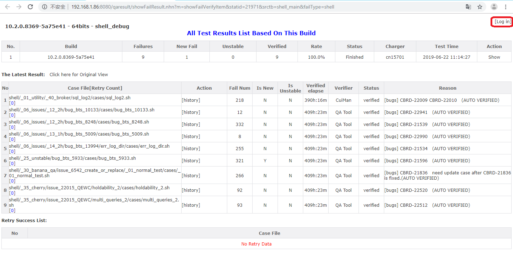

# Shell Test Guide

# 1 Test Objective
Shell test suite is used to execute CUBRID functional test in a very flexible way. Shell test cases are written in Linux shell programing language. It can easily integrate other programing languages, like Java, C, Perl. With shell test cases, almost all features and performance which cannot be tested by SQL test or other test suites can be tested and automated. For examples:
* check whether a cubrid utility works well  
* check whether the error message of a sql statement is expected  
* check a specific cubrid parameter works

Shell test case path is located in [https://github.com/CUBRID/cubrid-testcases-private-ex/tree/develop/shell](https://github.com/CUBRID/cubrid-testcases-private-ex/tree/develop/shell).
Shell test is contained by daily regression test. The test cases are run on both Linux platform and Windows platform. This guide will introduce linux shell test in detail. Additionally, shell test is also an important part of code coverage test. 


# 2 Shell Test via CTP
CTP is the only test tool which is used to execute shell test cases.   
Source URL: [https://github.com/CUBRID/cubrid-testtools](https://github.com/CUBRID/cubrid-testtools)  
## 2.1 Quick Start
**1. Install CUBRID**  
Please follow CUBRID installation guide to install CUBRID. Suppose that we install CUBRID at `$HOME/CUBRID`. Then add this line `'source .cubrid.sh'` in `~/.bash_profile`:  
```
source .cubrid.sh
```


**2. Check out shell cases**  
```bash
cd ~
git clone https://github.com/CUBRID/cubrid-testcases-private-ex.git
cd ~/cubrid-testcases-private-ex 
git checkout develop
```
**3. Install CTP**  
Please refer to ["CTP Installation Guide"](ctp_install_guide.md#1-install-ctp-in-linux-platform) to install CTP. Then create configuration file as below:

`~/CTP/conf/shell.conf`:
```
# These parameters are used to set cubrid.conf, cubrid_broker.conf and cubrid_ha.conf
# We can add the parameters as needed.
# For example, if we need change set 'error_log_size = 800000000', just need add line 'default.cubrid.error_log_size = 800000000' here.
default.cubrid.cubrid_port_id=1568
default.broker1.BROKER_PORT=10090
default.broker1.APPL_SERVER_SHM_ID=10090
default.broker2.BROKER_PORT=13091
default.broker2.APPL_SERVER_SHM_ID=13091
default.ha.ha_port_id=19909

# Specify the case path and exclude list file
# We can also specify a sub path under the test case path to run a sub set of the test cases.
scenario=${HOME}/cubrid-testcases-private-ex/shell
testcase_exclude_from_file=${HOME}/cubrid-testcases-private-ex/shell/config/daily_regression_test_excluded_list_linux.conf

# When the test is interrupted and started again, we can choose whether to run it continuously or re-run it.
test_continue_yn=false

testcase_timeout_in_secs=604800

# If the macro is included in the case, it will be excluded from the test.
# For example, if 'LINUX_NOT_SUPPORTED' is included in the case, it will not be run in linux shell test.
testcase_exclude_by_macro=LINUX_NOT_SUPPORTED

# When the case is failed, we can re-run it. This paramter specify the max time we want to re-run the failed case.
testcase_retry_num=0

# Some times there is not enough disk space on the test machine, so we need to delete all the files under the test case path after the case is run.
delete_testcase_after_each_execution_yn=false
enable_check_disk_space_yn=true
owner_email=cui.man@navercorp.com

# set test result feed back type: file or database
feedback_type=file
```
**4. Start test**
```
cd ~/CTP/bin
nohup ./ctp.sh shell -c ~/CTP/conf/shell.conf &
```

## 2.2 CTP Usage Introduction 
* ### Parameters Introduction

  `~/CTP/conf/shell.conf`: 
  ```
  # These parameters are used to set cubrid.conf, cubrid_broker.conf and cubrid_ha.conf
  # We can add the parameters as needed.
  # For example, if we need change set 'error_log_size = 800000000', just need add line 'default.cubrid.error_log_size = 800000000' here.
  default.cubrid.cubrid_port_id=1568
  default.broker1.BROKER_PORT=10090
  default.broker1.APPL_SERVER_SHM_ID=10090
  default.broker2.BROKER_PORT=13091
  default.broker2.APPL_SERVER_SHM_ID=13091
  default.ha.ha_port_id=19909

  # Set the worker nodes
  # This is used when we run the shell test remotely.
  # We can add or delete the worker nodes randomly, even when the test is running.
  # In this example, two worker nodes are used. 
  # If no worker nodes are specified, the test will be run on current user of local machine (the controller node is used as worker node).
  env.104.ssh.host=192.168.1.104
  env.104.ssh.port=22
  env.104.ssh.user=shell
  env.104.ssh.pwd=PASSWORD

  env.105.ssh.host=192.168.1.105
  env.105.ssh.port=22
  env.105.ssh.user=shell
  env.105.ssh.pwd=PASSWORD

  # Specify the case path and exclude list file
  # We can also specify a sub path under the test case path to run a sub set of the test cases.
  scenario=${HOME}/cubrid-testcases-private-ex/shell
  testcase_exclude_from_file=${HOME}/cubrid-testcases-private-ex/shell/config/daily_regression_test_excluded_list_linux.conf

  # Specify the build url
  cubrid_download_url=http://192.168.1.91:8080/REPO_ROOT/store_02/10.1.0.6876-f9026f8/drop/CUBRID-10.1.0.6876-f9026f8-Linux.x86_64.sh

  # When the test is interrupted and started again, we can choose whether to run it continuously or re-run it.
  test_continue_yn=false

  #Whether update test cases before test
  testcase_update_yn=true
  testcase_git_branch=develop
  testcase_timeout_in_secs=604800

  test_platform=linux
  test_category=shell

  # If the macro is included in the case, it will be excluded from the test.
  # For example, if 'LINUX_NOT_SUPPORTED' is included in the case, it will not be run in linux shell test.
  testcase_exclude_by_macro=LINUX_NOT_SUPPORTED

  # When the case is failed, we can re-run it. This paramter specify the max time we want to re-run the failed case.
  testcase_retry_num=0

  # Some times there is not enough disk space on the test machine, so we need to delete all the files under the test case path after the case is run.
  delete_testcase_after_each_execution_yn=false

  # Check disk space before test.
  # If there is not enough disk space, the test tool will send an email to the owner.
  # The owner should clean the disk when he receives this email.
  # The test will continue untill the free disk space reaches the expected amount.
  enable_check_disk_space_yn=true
  owner_email=cui.man@navercorp.com

  # set test result feed back type: file or database
  feedback_type=file
  feedback_notice_qahome_url=http://192.168.1.86:8080/qaresult/shellImportAction.nhn?main_id=<MAINID>

  git_user=cubridqa
  git_email=dl_cubridqa_bj_internal@navercorp.com
  git_pwd=GITPASSWORD

  #these parameters are used when feedback_type=database
  feedback_db_host=192.168.1.86
  feedback_db_port=33080
  feedback_db_name=qaresu
  feedback_db_user=dba
  feedback_db_pwd=
  ```
* ### Excluded List  
  The cases in the excluded list will not be run in the test.  
  If the case will block the test (e.g., it hangs in regression test and the issue will not be fixed recently), we should add the case to the excluded list. For shell test, we have two excluded list files:
  ```
  shell/config/daily_regression_test_excluded_list_linux.conf
  shell/config/daily_regression_test_excluded_list_windows.conf
  ```
  For example, if we need add case `'shell/_06_issues/_18_1h/bug_bts_12583'` in linux excluded list, we should add these lines in file `'shell/config/daily_regression_test_excluded_list_linux.conf'`.  
  ```
  #CBRD-21358 (add comment in this line to record the reason of adding this case in the exclude list)
  shell/_06_issues/_18_1h/bug_bts_12583
  ```

* ### Execute Shell Test
  Login controller node and run CTP:
  ```
  cd ~/CTP/bin
  nohup ./ctp.sh shell -c ~/CTP/conf/shell.conf &
  ```

* ### Check Test Results
  Test results can be found in these ways:
  1. the console output (or file nohup.out)
  2. feedback.log
  3. [QA homepage](http://qahome.cubrid.org)

  #### feedback_type=file
  If we set `feedback_type=file`, we can use file `'feedback.log'` to check the test results.  

  #### feedback_type=database 
  If we set `feedback_type=database`, we need check the test results on qahome page. For details, please refer to ['4.1 Verify regression test results'](#41-verify-regression-test-results).  
  This is the way we used in regression test.

  #### Log File Introduction
  |feedback_type=file|feedback_type=database|description|
  |---|---|---|
  |feedback.log|NA|Records the test result for each case, and the result summary. This file dose not exist if feedback_type=database.|
  |test_status.data|NA|Records the current test status, such as total_case_count, total_fail_case_count. This file dose not exist if feedback_type=database.|
  |main_snapshot.properties|main_snapshot.properties|Records the snapshot of all the parameters used in this test.|
  |check_local.log<br>or<br>check_106.log|check_local.log<br>or<br>check_106.log|Records the log of checking the environment.|
  |current_task_id|current_task_id|Records the main_id of this test. This is used when feedback_type=database. If feedback_type=file, '0' is written in this file.|
  |dispatch_tc_ALL.txt|dispatch_tc_ALL.txt|Records all the cases that are needed to be tested this time.|
  |dispatch_tc_FIN_local.txt<br>or<br>dispatch_tc_FIN_106.txt|dispatch_tc_FIN_local.txt<br>or<br>dispatch_tc_FIN_106.txt|Records the cases that have been finished on this machine by now.|
  |monitor_local.log<br>or<br>monitor_106.log|monitor_local.log<br>or<br>monitor_106.log|Records the monitor logs, such as memory, disk space, processes, CUBRID logs, database, CUBRID conf files, netstat. This kind of file is only used when we set enable_status_trace_yn=true in configuration file.|
  |test_local.log<br>or<br>test_106.log|test_local.log<br>or<br>test_106.log|Records the screen output of CTP tool. It contains the sceen output of each test case.|


## 2.3 Execute A Single Test Case  
Before execute a single case, we need export the environment variable `init_path`. Usually, we add it in `~/.bash_profile` file:    
```
export init_path=$HOME/CTP/shell/init_path
```
To execute a single test case, we just need to login a test machine, go to the case path, and then execute shell command:  
```bash
cd /path/to/test case/
sh case_name.sh
 ```


# 3 Regression Test Deployment
## 3.1 Test Machines
|Role|User|IP|Hostname|
|---|---|---|---|
|controller node|shell_ctrl|192.168.1.104|func29|
|worker node|shell|192.168.1.104|func29|
|worker node|shell|192.168.1.105|func30|
|worker node|shell|192.168.1.106|func31|
|worker node|shell|192.168.1.107|func32|
|worker node|shell|192.168.1.108|func33|
|worker node|shell|192.168.1.109|func34|
|worker node|shell|192.168.1.110|func35|
|worker node|shell|192.168.1.111|func36|
|worker node|shell|192.168.1.112|func37|
|worker node|shell|192.168.1.113|func38|
|worker node|shell|192.168.1.114|func39|

## 3.2 Create and Set Users  
### Controller Node
We need create a new user `'shell_ctrl'`.  
Then login root user and execute:  
```
sudo useradd shell_ctrl
```
Set password as our common password for user shell_ctrl.  
```
sudo passwd shell_ctrl
```
 Set the user's password to never expire.  
 ```
 sudo chage -E 2999-1-1 -m 0 -M 99999 shell_ctrl
 ```
 
### Worker Nodes
We need create a new user `'shell'`.  
Login root user and execute:  
```
sudo useradd shell
```
Set password as our common password for user shell.  
```
sudo passwd shell
```
 Set user's password to never expire.  
 ```
 sudo chage -E 2999-1-1 -m 0 -M 99999 shell
 ```
## 3.3 Install Software Packages
Required software packages:    

|software|version|usage|  
|---|---|---|  
|jdk|1.8.0 (need larger than 1.6)|run CTP, run shell test case|  
|lcov|lcov-1.11|run code coverage test|  
|bc|latest version|run shell test case|  


## 3.4 Deploy Controller Node
1. Install CTP   
Please refer to ["CTP Installation Guide"](ctp_install_guide.md#3-install-ctp-as-regression-test-platform)

2. Set shell configure file  
`~/CTP/conf/shell_template.conf`:  
```
default.cubrid.cubrid_port_id=1568
default.broker1.BROKER_PORT=10090
default.broker1.APPL_SERVER_SHM_ID=10090
default.broker2.BROKER_PORT=13091
default.broker2.APPL_SERVER_SHM_ID=13091
default.ha.ha_port_id=19909

env.104.ssh.host=192.168.1.104
env.104.ssh.port=22
env.104.ssh.user=shell
env.104.ssh.pwd=PASSWORD

env.105.ssh.host=192.168.1.105
env.105.ssh.port=22
env.105.ssh.user=shell
env.105.ssh.pwd=PASSWORD

env.106.ssh.host=192.168.1.106
env.106.ssh.port=22
env.106.ssh.user=shell
env.106.ssh.pwd=PASSWORD

env.107.ssh.host=192.168.1.107
env.107.ssh.port=22
env.107.ssh.user=shell
env.107.ssh.pwd=PASSWORD

env.108.ssh.host=192.168.1.108
env.108.ssh.port=22
env.108.ssh.user=shell
env.108.ssh.pwd=PASSWORD

env.109.ssh.host=192.168.1.109
env.109.ssh.port=22
env.109.ssh.user=shell
env.109.ssh.pwd=PASSWORD

env.110.ssh.host=192.168.1.110
env.110.ssh.port=22
env.110.ssh.user=shell
env.110.ssh.pwd=PASSWORD

env.111.ssh.host=192.168.1.111
env.111.ssh.port=22
env.111.ssh.user=shell
env.111.ssh.pwd=PASSWORD

env.112.ssh.host=192.168.1.112
env.112.ssh.port=22
env.112.ssh.user=shell
env.112.ssh.pwd=PASSWORD

env.113.ssh.host=192.168.1.113
env.113.ssh.port=22
env.113.ssh.user=shell
env.113.ssh.pwd=PASSWORD

env.114.ssh.host=192.168.1.114
env.114.ssh.port=22
env.114.ssh.user=shell
env.114.ssh.pwd=PASSWORD

scenario=${HOME}/cubrid-testcases-private-ex/shell
test_continue_yn=false
cubrid_download_url=http://127.0.0.1/REPO_ROOT/store_02/10.1.0.6876-f9026f8/drop/CUBRID-10.1.0.6876-f9026f8-Linux.x86_64.sh
testcase_exclude_from_file=${HOME}/cubrid-testcases-private-ex/shell/config/daily_regression_test_excluded_list_linux.conf
testcase_update_yn=true
testcase_git_branch=develop
testcase_timeout_in_secs=604800
test_platform=linux
test_category=shell
testcase_exclude_by_macro=LINUX_NOT_SUPPORTED
testcase_retry_num=0
delete_testcase_after_each_execution_yn=false
enable_check_disk_space_yn=true

owner_email=Mandy<cui.man@navercorp.com>

git_user=cubridqa
git_email=dl_cubridqa_bj_internal@navercorp.com
git_pwd=**********

feedback_type=database

feedback_db_host=192.168.1.86
feedback_db_port=33080
feedback_db_name=qaresu
feedback_db_user=dba
feedback_db_pwd=

feedback_notice_qahome_url=http://192.168.1.86:8080/qaresult/shellImportAction.nhn?main_id=<MAINID>
```
shell_template.conf will be copied to \~/CTP/conf/shell_runtime.conf when test is started.  

3. Set `~/.bash_profile`  
Set `~/.bash_profile` like this:  
```
# .bash_profile

# Get the aliases and functions
if [ -f ~/.bashrc ]; then
        . ~/.bashrc
fi

# User specific environment and startup programs

PATH=$JAVA_HOME/bin:$HOME/CTP/common/script:$PATH:$HOME/.local/bin:$HOME/bin

export PATH

export CTP_BRANCH_NAME="develop"
export CTP_SKIP_UPDATE=0
```

4. Create a script to start consumer
~/start_test.sh
```
nohup start_consumer.sh -q QUEUE_CUBRID_QA_SHELL_LINUX -exec run_shell &
```


## 3.5 Deploy Worker Nodes  
1. Install CTP
Please refer to ["CTP Installation Guide"](ctp_install_guide.md#3-install-ctp-as-regression-test-platform)

2. Set `~/.bash_profile`  
Set `~/.bash_profile` like this:  
```
# .bash_profile

# Get the aliases and functions
if [ -f ~/.bashrc ]; then
        . ~/.bashrc
fi

# User specific environment and startup programs

PATH=$PATH:$HOME/.local/bin:$HOME/bin

export CTP_HOME=$HOME/CTP
## init_path is used when we run shell case manually on this machine.
export init_path=$CTP_HOME/shell/init_path

export PATH=$CTP_HOME/bin:$CTP_HOME/common/script:$PATH

export CTP_BRANCH_NAME="develop"
export CTP_SKIP_UPDATE=0

. ~/.cubrid.sh
export GCOV_PREFIX=/home/shell
export GCOV_PREFIX_STRIP=2
ulimit -c unlimited
```

3. Deploy test cases
```
git clone --no-checkout https://github.com/CUBRID/cubrid-testcases-private-ex.git
cd ~/cubrid-testcases-private-ex
git config core.sparseCheckout true
echo 'shell/*' > ~/cubrid-testcases-private-ex/.git/info/sparse-checkout
git checkout develop
```

4. Make directories for test
```
cd
mkdir do_not_delete_core
mkdir ERROR_BACKUP
```

5. Add `.cubrid.sh` file   
If cubrid has never been installed on the machine, we need add file `'.cubrid.sh'` at $HOME path manually.  


## 3.6 Start Consumer
On controller node, execute the script `start_test.sh` to start listening the test message after deployment.  
This will start a shell test when the consumer receives the test message.
```
cd ~
sh start_test.sh
```

# 4 Regression Test Sustaining
We execute shell test for each CI build, and execute code coverage test monthly.  
Both of the tests are started automatically when the controller receives a test message. We just need to verify the test results, and report the issues.

## 4.1 Verify Regression Test Results
* ### Result Overview
  Open ['QA homepage'](http://qahome.cubrid.org) in browser, then select the build number. `'Function Result'` page will be displayed.  
  Find `shell` and `shell_debug` in linux part, and find `shell` in windows part.  

    

    

  If there are crash failures, an alarm icon will appear in the `'Total'` column, like this:  

       

  In the overview page, we should check the values in all the colomns. The most important check items are:    
  
|column|check point|
|---|---|
|Test Rate|Test rate should be 100%.|
|Fail|How many cases are failed.|
|Verified Rate|After the verification, verified rate should be 100%.|
|Elapse Time|The elapse time of the test should not be longer than the elapse time of the previous build too much.|  

* ### Verfy the Failed Cases
  Click the link in this image to open the online verification page.  

     

  On the verification page, click `'Log in'` to login.  

    

  After logging in, we can start to verify the failed cases online.    

      

  **Click the link in 'Case File' column to check the case and the screen output.**  

    

  `'[history]':` check the test case history failure   
  *history page*    

     

  `'[verify]':` open the case's verification page to write the verification result   
  *case verification page*   

    

  On this page:
  1. select a failure reason.  
  2. write some comments in `'Reason content'`  
  3. write the issue number in `'New issues'` or `'Revise required issues'`  
  4. click the button at the bottom to close this page.  
  `Fix`: I am sure of this verification result.  
  `Save`: I am not sure of this verification result. I will decide it later.  

  Sometimes, we cannot find the failure reason from the screen output directly. At this time, we need login the test machine, go to the case path, check the logs. If we still cannot find the failure reason from the logs, we should run the case step by step on this machine to find the failure reason.  
  We should verify the crash failures first.  

* ### Verify the Low Performance Test Cases
  Open ['QA homepage'](http://qahome.cubrid.org) in browser, then select the build number. `'Function Result'` page will be displayed.   
  Find `'Low Performance Scenarios'` link.  

     

  Click this link, and go to the `'Low Performance Scenarios'` page.  
  Click 'SHELL', to check the shell test cases.   

     

  We can change the filters, such as `'OS'`, `'Bits'`, `'Category'`, `'Base build'`.  
  Usually, we use the last CI build as base build to compare with.    
  The elapse time of these cases should not be changed too much compared to the base build.  
  Red icon `'+'` or `'-'` in `'Flag'` column:  
  `'+'`:  the elapse time on base build is less than the threshold, but the elapse time on current build is lager than the threshold.  
  `'-'`: the elapse time on base build is larger than the threshold, but the elapse time on current build is less than the threshold.  

## 4.2 Verify Code Coverage Test Result
Go to QA homepage and find the `'code coverage'` node in the left area, click the link of the latest result.  

  

Click `'shell'` link.  

   

Check the value of `'Coverage'` column. The coverage value should not lower than previous code coverage test result.  

 

## 4.3 Report Issues  
* ### Crash Issue  
  If there is a crash, report it following the rules in this link: [‘How to Report Regression Crash Issues’](http://jira.cubrid.org/browse/CUBRIDQA-1?focusedCommentId=4739244&page=com.atlassian.jira.plugin.system.issuetabpanels:comment-tabpanel#comment-4739244)  

* ### Normal Issue  
  If the the test result is as expected, first we should confirm whether it is revise required. If not, report it as an issue on jira. 

## 4.4 Execute A Shell Test by Sending Message
We can use the regression tools to trigger a test.  
1. Confirm (and change the parameters if needed) in `'~/CTP/conf/shell_template.conf'` on controller node.    
2. Send a message to start the test  
Login: message@192.168.1.91  
Send test message as:  
```
sender.sh QUEUE_CUBRID_QA_SHELL_LINUX http://192.168.1.91:8080/REPO_ROOT/store_01/10.2.0.8330-d4d8464/drop/CUBRID-10.2.0.8330-d4d8464-Linux.x86_64.sh shell default
```
3. Start consumer on the controller node  
If the consumer is not started, login the controller node to start it.  
```
cd ~
sh start_test.sh 
```
4. Check test result  
The results will be uploaded to qahome automatically. You can follow ['4.1 Verify regression test results'](#41-verify-regression-test-results) to check the test results.   

## 4.5 Execute Code Coverage Test
For code coverage test, just need to send a message.  
Login: message@192.168.1.91  
Send test message as:  
```
sender.sh QUEUE_CUBRID_QA_SHELL_LINUX "http://192.168.1.91:8080/REPO_ROOT/store_01/10.2.0.8270-c897055/drop/CUBRID-10.2.0.8270-c897055-gcov-Linux.x86_64.tar.gz,http://192.168.1.91:8080/REPO_ROOT/store_01/10.2.0.8270-c897055/drop/cubrid-10.2.0.8270-c897055-gcov-src-Linux.x86_64.tar.gz" shell default
```
The result will be uploaded to qahome automatically. To check the result, please refer to ['4.2 Verify code coverage test result'](#42-verify-code-coverage-test-result) 


# 5 Shell Case Standards
## 5.1 Case Path Standard
A shell test case should follow the following structure:   
```
/path/to/test_name/cases/test_name.sh
``` 
### Test Cases Added for New Features 
When we need add a test case for a feature test, add a case to path like this:  
```
cubrid-testcases-private-ex/shell/_{no}_{release_code}/cbrd_xxxxx_{feature}/
```
with naming rules:
```
structured_name_1/cases/structured_name_1.sh
structured_name_2/cases/structured_name_2.sh
```

Example:
```
cubrid-testcases-private-ex/shell/_35_cherry/issue_21506_online_index
cubrid-testcases-private-ex/shell/_35_cherry/issue_21506_online_index/cbrd_21506_backupdb/cases/cbrd_21506_backupdb.sh
```

### Test Cases Added for Jira Issues
When add a test case for a bug fix, add a case to path:  
```
cubrid-testcases-private-ex/shell/_06_issues/_{yy}_{1|2}h/
```
with naming rules:
```
cbrd_xxxxx/cases/cbrd_xxxxx.sh
cbrd_xxxxx_1/cases/cbrd_xxxxx_1.sh
cbrd_xxxxx_{issue_key}/cases/cbrd_xxxxx_{issue_keyword}.sh
```
Example:
```
cubrid-testcases-private-ex/shell/_06_issues/_19_2h/cbrd_22586/cases/cbrd_22586.sh
```

## 5.2 Shell Case Template
```
#!/bin/sh
# Initialize the environment variables, and import all the functions. 
. $init_path/init.sh
init test


dbname=tmpdb

cubrid_createdb $dbname

# Test steps

# Check the result
if [condition]
then
       write_ok
else
       write_nok
fi

cubrid service stop

# The command 'cubrid deletedb' will check whether there are core files and fatal error generated in the case, and backup db volumns, core files, logs.  
cubrid deletedb $dbname

# Clean environment, such as delete the jave class files

# 'finish' is a function in init.sh, which will revert all the conf files to the original status.
finish

``` 

## 5.3 `'cubrid'` Script
When execute `'init test'` at the beginning of the case, `'${init_path}/../../bin:${init_path}/../../common/script'` is added to PATH:  
```
PATH=${init_path}/../../bin:${init_path}/../../common/script:$PATH
```
`'cubrid'` script in init_path will be used instead of $CUBRID/bin/cubrid in the case. For example:  
*'cubrid deletedb':*   
It will check whether there are core files and fatal error generated in the case. If there are, backup db volumns, core files, logs. Then execute $CUBRID/bin/cubrid deletedb.  
*'cubrid checkdb':*   
It will check whether checkdb is failed, and if it is, backup db volumns, logs, core files. Then execute $CUBRID/bin/cubrid checkdb.  

## 5.4 Functions in `'init.sh'`
I will introduce some important functions in `'init.sh'`. They are frequently used in shell test cases.  

### init
'init test' is used at the beginning of each case.  
These lines will do many init operations, such as: export system variables, import all the functions.  

### finish
Used at the end of each test case to:  
1. cubrid service stop  
2. release broker sharedmemory  
3. revert all the conf files to original ones  

### WINDOWS_NOT_SUPPORTED/LINUX_NOT_SUPPORTED
Indicate that the case will not be run on windows or linux platform.

### cubrid_createdb
Used to createdb. This is used to make 'cubrid createdb' utility to be compatible with leagcy builds.  
Before CUBRID 9.1, locale parameter is not supported in 'cubrid createdb'.

### write_ok/write_nok  
Used to assert the test point.  
Example:  
```
cnt1=`cat result.log | grep "error" | wc -l`

if [ -s result.log ] && [ $cnt1 -eq 0 ]; then
        write_ok
else
        write_nok result.log
fi
```

### compare_result_between_files
compare_result_between_files filename1 filename2
Used to compare the actual result to the expected result.  
Examples:  
```
compare_result_between_files test.answer test.log
compare_result_between_files master_data.answer slave_data.log
```

### change_db_parameter/change_broker_parameter/change_ha_parameter
Used to change the db/broker/ha parameters in the conf files.  
When you need to change the parameters in the conf files, better to use these functions.  
Examples:   
```
change_db_parameter "java_stored_procedure=yes"
change_db_parameter "log_max_archives=1
change_broker_parameter "SQL_LOG=ON"
change_broker_parameter "MAX_NUM_APPL_SERVER=5"
change_ha_parameter "ha_enable_sql_logging=true"
change_ha_parameter "ha_copy_log_max_archives=100"
```

### get_broker_port_from_shell_config
Used to get broker port.
```
port=`get_broker_port_from_shell_config`
javac *.java
java Test_Batch $port $dbname > batch.log 2>&1
```
We should get broker port from the runtime environment, instead of write it in the java/c file directly.  
Another method we used is:  
```
port=`cubrid broker status -b | grep broker1 |awk '{print $4}'`
```

### xgcc
Used to compile c/c++ files on both linux and windows platforms.
Examples:   
```
xgcc -o test test.c
xgcc -o execute_batch utils.c execute_batch.c
xgcc -pthread -o multiple  multiple.c
```

### do_make_locale
Used to make_locale on both linux and windows platforms.  
Parameter introduction:    
*force:*  
If we do not add this parameter, the function will check whether the file '$CUBRID/lib/libcubrid_all_locales.so' exists first. If the file exists, it will return immediately and skip 'make_locale'. If we add 'force' parameter, the function will call make_locale in any case.  
*nocheck:*  
do not check make_locale result.  
*debug/release:*  
It will be used in make_locale. For example, if we use 'do_make_locale force debug', the fucntion will call 'make_locale.sh -t 64 -m debug'.  
*locale value:*
It will be used in make_locale. For example, if we use 'do_make_locale force zh_CN', the fucntion will call 'make_locale.sh -t 64 zh_CN'.   
Example:  
```
cp $CUBRID/conf/cubrid_locales.all.txt $CUBRID/conf/cubrid_locales.txt
do_make_locale force
```

### delete_make_locale
Revert the make_locale results. Change CUBRID to its original locale status.

### do_make_tz
Used to make_tz on both linux and windows platforms.    
Examples:  
```
do_make_tz
do_make_tz new
do_make_tz extend
do_make_tz release extend
do_make_tz new nocheck
```

### revert_tz
Revert the make_tz results. Change CUBRID to its original timezone status.

### xkill
Used to kill the processes on both linux and windows platforms.   
Both pid and process name can be used as a parameter.  
When using '-f', it means it will search in the full process name.  
For example:
```
if [ $OS == "Windows_NT" ]
then
        xkill -f "cub_admin"
else
        xkill -f "statdump"
fi
```

Without '-f', this command will be excuted on linux:  
```
$ ps -u $USER -o pid,comm
   PID COMMAND
114832 sshd
120255 cub_master
120257 cub_server
121785 cubrid
121786 cub_admin
121816 ps
```
With '-f', this command will be excuted: 

```
$ ps -u $USER -o pid,command
   PID COMMAND
114832 sshd: cuiman@pts/0,pts/1
120255 cub_master
120257 cub_server demodb
121785 cubrid statdump            
121786 cubrid statdump demodb -i 1
121789 ps -u cuiman -o pid,command
```
In this case 'xkill -f "statdump"', the processes cannot be killed whithout -f paramenter.

Other examples:  
```
xkill $pid
xkill cub_server
xkill -f "statdump"
```

### xkill_pid
Used to kill the processes on both linux and windows platforms.  
Only process id can be used as a parameter.  
```
xkill_pid $pid
```

### format_csql_output
Used to remove the time related lines in csql output file.  
```
csql -u dba demodb -c 'select count(*) from game' > test.log 2>&1
format_csql_output test.log
```
Before use this function:  
```
$ cat test.log

=== <Result of SELECT Command in Line 1> ===

     count(*)
=============
         8653

1 row selected. (0.006435 sec) Committed.
```
After use this function:  
```
$ cat test.log               

=== <Result of SELECT Command in Line 1> ===

     count(*)
=============
         8653

```

### format_query_plan
Used to format query plan.

### format_path_output
Used to format CUBRID installation path.

