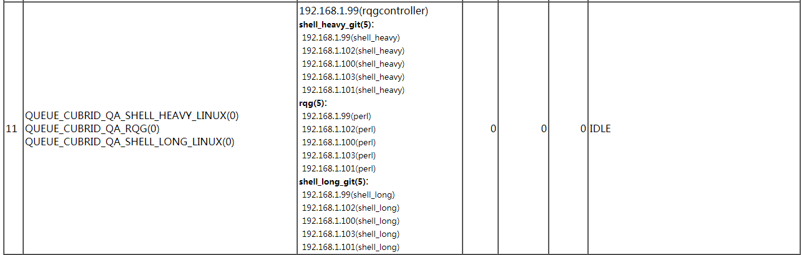

# 1. Test Objective
`shel_heavy` test is a kind of the shell test. The test cases that require big disk size or big memory or with heavy workload are categorized as shell_heavy.
# 2. Execute shell_heavy Test
To perform the `shell_heavy` test, we need to install CTP first.
## 2.1 Install CTP
1. Checkout CTP 
    ```bash
    cd ~
    git clone https://github.com/CUBRID/cubrid-testtools.git
    cd ~/cubrid-testtools 
    git checkout develop
    cp -rf CTP ~/
    ```
2. Create and config `CTP/conf/common.conf`   
    ```
    git_user=cubridqa
    git_pwd=PASSWORD
    git_email=<CUBRIDQA DL email address>
    default_ssh_pwd=PASSWORD
    default_ssh_port=22

    grepo_service_url=rmi://192.168.1.91:11099

    qahome_db_driver=cubrid.jdbc.driver.CUBRIDDriver
    qahome_db_url=jdbc:cubrid:192.168.1.86:33080:qaresu:dba::
    qahome_db_user=dba
    qahome_db_pwd=PASSWORD

    qahome_server_host=192.168.1.86
    qahome_server_port=22
    qahome_server_user=qahome
    qahome_server_pwd=PASSWORD

    activemq_user=admin
    activemq_pwd=PASSWORD
    activemq_url=failover:tcp://192.168.1.91:61616?wireFormat.maxInactivityDurationInitalDelay=30000

    mail_from_nickname=CUBRIDQA_BJ
    mail_from_address=<CUBRIDQA DL e-mail address>
    ```
3. Add path to `.bash_profile`
    ```
    export CTP_HOME=$HOME/CTP
    export CTP_BRANCH_NAME=develop
    export CTP_SKIP_UPDATE=0
    export PATH=$JAVA_HOME/bin:$CTP_HOME/bin:$CTP_HOME/common/script:$PATH
    ```

## 2.2 Checkout shell_heavy Test Cases   
The shell_heavy test cases are in the https://github.com/CUBRID/cubrid-testcases-private-ex repository.  
```
$ cd ~
$ git clone https://github.com/CUBRID/cubrid-testcases-private-ex.git
$ ls ~/cubrid-testcases-private-ex/
shell  shell_heavy
```
```
$ ls ~/cubrid-testcases-private-ex/shell_heavy/
_01_cursor_holdability      _06_issues        bug_bts_13188    bug_bts_17504  bug_bts_5359  bug_xdbms48  cbrd_21070  config
_02_group_and_async_commit  _09_64bit         bug_bts_14738_1  bug_bts_17550  bug_bts_5868  cbrd_20591   cbrd_21119  issue_5765_timezone_support
_04_misc                    _26_apricot_qa    bug_bts_14738_2  bug_bts_17599  bug_bts_6995  cbrd_21003   cbrd_21186
_05_addition                _27_aprium_qa     bug_bts_14894    bug_bts_20481  bug_bts_7233  cbrd_21020   cbrd_21361
_05_multitbl_query_01       _29_features_920  bug_bts_14980    bug_bts_5188   bug_bts_7313  cbrd_21036   cbrd_21362
_05_multitbl_query_02       bug_bts_10295     bug_bts_17460    bug_bts_5349   bug_bts_8675  cbrd_21049   cbrd_21378
```
## 2.3 Quick Start
1. Install CUBRID   
    ```
    run_cubrid_install http://192.168.1.91:8080/REPO_ROOT/store_01/10.2.0.8368-b85a234/drop/CUBRID-10.2.0.8368-b85a234-Linux.x86_64-debug.sh
    ```
2. Configure a config file   
    Touch an empty file `shell_heavy.conf` and set `scenario` path.  
    The `scenario` can be a path to a test case folder or a path to a folder that includes many test cases. 
    ```
    # path to a test case folder
    scenario=${HOME}/cubrid-testcases-private-ex/shell_heavy/_06_issues/_18_2h/online_index/cbrd_22447/cases

    # path to a folder that includes many test cases
    #scenario=${HOME}/cubrid-testcases-private-ex/shell_heavy/_06_issues
    ```
    To know more about the configurations, see https://github.com/CUBRID/cubrid-testtools/blob/develop/CTP/conf/shell.conf.
3. Run
    ```
    ctp.sh shell -c ./shell_heavy.conf
    ```
    Output:
    ```
    $ ctp.sh shell -c ./shell_heavy.conf

    ====================================== SHELL ==========================================
    [SHELL] TEST STARTED (Thu Aug 15 18:43:11 KST 2019)

    [SHELL] CONFIG FILE: /home/may/shell_heavy.conf

    testcase_retry_num=0
    testcase_timeout_in_secs=7200
    scenario=${HOME}/cubrid-testcases-private-ex/shell_heavy/_06_issues/_18_2h/online_index/cbrd_22447/cases/


    ----------END OF FILE----------
    Available Env: [local]
    Continue Mode: false
    Build Number: 10.2.0.8398-48e1a3c
    ...
    ============= TEST ==================
    [ENV START] local
    STARTED
    [TESTCASE] cubrid-testcases-private-ex/shell_heavy/_06_issues/_18_2h/online_index/cbrd_22447/cases/cbrd_22447.sh EnvId=local [OK]
    [ENV STOP] local
    ============= PRINT SUMMARY ==================
    Test Category:shell
    Total Case:1
    Total Execution Case:1
    Total Success Case:1
    Total Fail Case:0
    Total Skip Case:0

    TEST COMPLETE
    [SHELL] TEST END (Thu Aug 15 18:48:00 KST 2019)
    [SHELL] ELAPSE TIME: 289 seconds
    ```
    Results and logs:  
    All results and logs will be saved in the `CTP/result/shell/` folder. The current execution log will be saved in the `current_runtime_logs` folder and it will be backuped as `shell_result_10.2.0.8398-48e1a3c_64bits_0_2019.8.15_6.48.0.tar.gz` when it finishes.
    ```
    $ cd CTP/result/shell/   
    $ ls 
    current_runtime_logs  shell_result_10.2.0.8398-48e1a3c_64bits_0_2019.8.15_6.48.0.tar.gz
    $ ll current_runtime_logs
    total 44
    -rw-rw-r--. 1 may may   911 Aug 15 18:43 check_local.log
    -rw-rw-r--. 1 may may     2 Aug 15 18:43 current_task_id
    -rw-rw-r--. 1 may may   102 Aug 15 18:43 dispatch_tc_ALL.txt
    -rw-rw-r--. 1 may may   102 Aug 15 18:47 dispatch_tc_FIN_local.txt
    -rw-rw-r--. 1 may may   569 Aug 15 18:48 feedback.log
    -rw-rw-r--. 1 may may  2583 Aug 15 18:43 main_snapshot.properties
    -rw-rw-r--. 1 may may     0 Aug 15 18:43 monitor_local.log
    -rw-rw-r--. 1 may may 12687 Aug 15 18:48 test_local.log
    -rw-rw-r--. 1 may may   154 Aug 15 18:47 test_status.data
    $ tar tvf shell_result_10.2.0.8398-48e1a3c_64bits_0_2019.8.15_6.48.0.tar.gz 
    drwxrwxr-x may/may           0 2019-08-15 18:43 home/may/CTP/result/shell/current_runtime_logs/
    -rw-rw-r-- may/may        2583 2019-08-15 18:43 home/may/CTP/result/shell/current_runtime_logs/main_snapshot.properties
    -rw-rw-r-- may/may         911 2019-08-15 18:43 home/may/CTP/result/shell/current_runtime_logs/check_local.log
    -rw-rw-r-- may/may         569 2019-08-15 18:48 home/may/CTP/result/shell/current_runtime_logs/feedback.log
    -rw-rw-r-- may/may           2 2019-08-15 18:43 home/may/CTP/result/shell/current_runtime_logs/current_task_id
    -rw-rw-r-- may/may         154 2019-08-15 18:47 home/may/CTP/result/shell/current_runtime_logs/test_status.data
    -rw-rw-r-- may/may       12687 2019-08-15 18:48 home/may/CTP/result/shell/current_runtime_logs/test_local.log
    -rw-rw-r-- may/may           0 2019-08-15 18:43 home/may/CTP/result/shell/current_runtime_logs/monitor_local.log
    -rw-rw-r-- may/may         102 2019-08-15 18:43 home/may/CTP/result/shell/current_runtime_logs/dispatch_tc_ALL.txt
    -rw-rw-r-- may/may         102 2019-08-15 18:47 home/may/CTP/result/shell/current_runtime_logs/dispatch_tc_FIN_local.txt
    ```
    
## 2.4 Execute test on multiple nodes    
CTP supports executing test cases on multiple nodes in parallel.
1. CTP and CUBRID should be installed and cubrid-testcases-private-ex should be checked out on each test node.
2. Configure a config file  
Touch an empty file shell_heavy_parallel.conf, then define test nodes.
    ```
    # path to a folder that includes multiple test cases
    scenario=${HOME}/cubrid-testcases-private-ex/shell_heavy/_06_issues/_12_1h/

    # test node 1
    env.instance1.ssh.host=192.168.1.118
    env.instance1.ssh.port=22
    env.instance1.ssh.user=may
    env.instance1.ssh.pwd=PASSWORD

    # test node 2
    env.instance2.ssh.host=192.168.1.124
    env.instance2.ssh.port=22
    env.instance2.ssh.user=may
    env.instance2.ssh.pwd=PASSWORD
    ```
3. Run
    ```
    ctp.sh shell -c shell_heavy_parallel.conf
    ```
    Output:
    ```
    $ ctp.sh shell -c shell_heavy_parallel.conf 

    ====================================== SHELL ==========================================
    [SHELL] TEST STARTED (Thu Aug 15 19:50:30 KST 2019)

    [SHELL] CONFIG FILE: /home/may/shell_heavy_parallel.conf

    scenario=${HOME}/cubrid-testcases-private-ex/shell_heavy/_06_issues/_12_1h/
    env.instance1.ssh.user=may
    env.instance2.ssh.pwd=PASSWORD
    env.instance1.ssh.pwd=PASSWORD
    env.instance2.ssh.user=may
    env.instance2.ssh.host=192.168.1.124
    env.instance1.ssh.port=22
    env.instance1.ssh.host=192.168.1.118
    env.instance2.ssh.port=22


    ----------END OF FILE----------
    Available Env: [instance1, instance2]
    Continue Mode: false
    Build Number: 10.2.0.8398-48e1a3c
    ...
    ============= TEST ==================
    [ENV START] instance1
    [ENV START] instance2
    [TESTCASE] cubrid-testcases-private-ex/shell_heavy/_06_issues/_12_1h/bug_bts_6753_1/cases/bug_bts_6753_1.sh EnvId=instance2 [OK]
    [TESTCASE] cubrid-testcases-private-ex/shell_heavy/_06_issues/_12_1h/bug_bts_7075/cases/bug_bts_7075.sh EnvId=instance2 [OK]
    [TESTCASE] cubrid-testcases-private-ex/shell_heavy/_06_issues/_12_1h/bug_bts_8403/cases/bug_bts_8403.sh EnvId=instance2 [OK]
    [ENV STOP] instance2
    [TESTCASE] cubrid-testcases-private-ex/shell_heavy/_06_issues/_12_1h/bug_bts_6683/cases/bug_bts_6683.sh EnvId=instance1 [OK]
    [ENV STOP] instance1
    ============= PRINT SUMMARY ==================
    Test Category:shell
    Total Case:4
    Total Execution Case:4
    Total Success Case:4
    Total Fail Case:0
    Total Skip Case:0

    TEST COMPLETE
    [SHELL] TEST END (Thu Aug 15 20:45:09 KST 2019)
    [SHELL] ELAPSE TIME: 3279 seconds
    [may@func43 ~]$ 
    ```
## 2.5 Execute one test case
If you only want to execute one test case, you can simply execute the test case script.   
In this case, you need to export an `init_path` at first.   
```
export init_path=$CTP_HOME/shell/init_path
```
Then execute the test case script.
```
cd ${HOME}/cubrid-testcases-private-ex/shell_heavy/_06_issues/_18_2h/online_index/cbrd_22447/cases
sh cbrd_22447.sh
```
You can see the cbrd_22447.result to check the result. 
```
$ cat cbrd_22447.result
cbrd_22447-1 : OK
```
## 2.6 Execute one test case repeatedly
Sometimes QA needs to execute a test case repeatedly to verify a hard reproducing issue. In this case, we can use `CTP/shell/init_path/run_shell.sh`. 
```
$ sh ~/CTP/shell/init_path/run_shell.sh -h
usage: run_shell [OPTION]
    --enable-report           Enable to send report for test status
    --extend-script <arg>     Extended script file to define how to
                              execute test case and verify failure.
 -h,--help                    List help
    --issue <arg>             Url link to issue CBRD-xxxx. This info will
                              be described in mail text
    --loop                    Execute with loop infinitely till there is
                              failure checked.
    --mailcc <arg>            The CC who receive mail
    --mailto <arg>            The TO who receive mail
    --maxloop <arg>           Set max loop to execute test
    --maxtime <arg>           Set max time in seconds to execute test
    --next-build-url <arg>    Find next build in the url
    --prompt-continue <arg>   true or false to load previous data
    --report-cron <arg>       Define a time to send a mail
    --update-build            Upgrade CUBRID build when new build comes.
                              The 4th figure in version number will be
                              used to compare.
```
To send email report and update to new build, we need add following settings to `CTP/conf/common.conf`
```
# get builds, is used by <--update-build> option
cubrid_build_list_url=http://192.168.1.91:8080/REPO_ROOT/list.jsp

# to send email, is used by <--mailcc> and <--mailto> options
mail_from_nickname=CUBRIDQA_BJ
mail_from_address=<CUBRIDQA DL email address>
```
Typical Usage:
```
~/CTP/shell/init_path/run_shell.sh --enable-report --report-cron='0 0 9,13,18 * * ?' --issue="http://jira.cubrid.org/browse/CBRD-xxxx"  --mailto="Someone<email address>" --mailcc="<CUBRIDQA DL email address>" --loop --update-build 
```
Please refer to http://jira.cubrid.org/browse/CUBRIDQA-215 to use it.     

# 3. Deploy Regression Test Environment
## 3.1 Test Machines

No. | role | user | ip | hostname | Tools to deploy
--|--|--|--|--|--
0 | Controller node | rqgcontroller | 192.168.1.99 | func24 | CTP
1 | Test node | shell_heavy | 192.168.1.99 | func24 | CTP, cubrid-testcases-private-ex
2 | Test node | shell_heavy | 192.168.1.100 | func25 | CTP, cubrid-testcases-private-ex
3 | Test node | shell_heavy | 192.168.1.101 | func26 | CTP, cubrid-testcases-private-ex
4 | Test node | shell_heavy | 192.168.1.102 | func27 | CTP, cubrid-testcases-private-ex
5 | Test node | shell_heavy | 192.168.1.103 | func28 | CTP, cubrid-testcases-private-ex

**Controller node** listens to test messages and starts a test when there is a test message. It will distribute test cases to each test node for execution.  
**Test nodes** execute test cases in parallel.

## 3.2 On Controller Node
1. Install CTP   
Follow the steps in [2.1 Install CTP](#21-install-ctp)   
2. Configurations for shell_heavy test   
    Create a config file named `CTP/conf/shell_template_for_shell_heavy.conf` and configure as below.
    ```
    # shell_template_for_shell_heavy.conf 
    default.cubrid.cubrid_port_id=1578
    default.broker1.BROKER_PORT=30790
    default.broker1.APPL_SERVER_SHM_ID=30790
    default.broker2.BROKER_PORT=33791
    default.broker2.APPL_SERVER_SHM_ID=33791
    default.ha.ha_port_id=59979

    env.99.ssh.host=192.168.1.99
    env.99.ssh.port=22
    env.99.ssh.user=shell_heavy
    env.99.ssh.pwd=PASSWORD

    env.100.ssh.host = 192.168.1.100
    env.100.ssh.port = 22
    env.100.ssh.user = shell_heavy
    env.100.ssh.pwd = PASSWORD

    env.101.ssh.host = 192.168.1.101
    env.101.ssh.port = 22
    env.101.ssh.user = shell_heavy
    env.101.ssh.pwd = PASSWORD

    env.102.ssh.host = 192.168.1.102
    env.102.ssh.port = 22
    env.102.ssh.user = shell_heavy
    env.102.ssh.pwd = PASSWORD

    env.103.ssh.host = 192.168.1.103
    env.103.ssh.port = 22
    env.103.ssh.user = shell_heavy
    env.103.ssh.pwd = PASSWORD

    scenario=${HOME}/cubrid-testcases-private-ex/shell_heavy
    test_continue_yn=yes
    cubrid_download_url=
    testcase_exclude_from_file=${HOME}/cubrid-testcases-private-ex/shell_heavy/config/daily_regression_test_excluded_list_linux.conf
    testcase_update_yn=true
    testcase_git_branch=develop
    testcase_timeout_in_secs=10800
    test_platform=linux
    test_category=shell_heavy
    testcase_exclude_by_macro=LINUX_NOT_SUPPORTED
    testcase_retry_num=2
    delete_testcase_after_each_execution_yn=false
    enable_check_disk_space_yn=true

    feedback_type=database
    feedback_notice_qahome_url=http://192.168.1.86:8080/qaresult/shellImportAction.nhn?main_id=<MAINID>

    owner_email=<owner email address>
    cc_email=<CUBRIDQA DL email address>

    git_user=cubridqa
    git_email=<CUBRIDQA DL email address>
    git_pwd=PASSWORD

    feedback_db_host=192.168.1.86
    feedback_db_port=33080
    feedback_db_name=qaresu
    feedback_db_user=dba
    feedback_db_pwd=PASSWORD
    ```
    When you need to test shell_heavy_debug, then need to copy `CTP/conf/shell_template_for_shell_heavy.conf` as `CTP/conf/shell_template_for_shell_heavy_debug.conf`.   
    If there is no corresponding template config file, it will uses the `CTP/conf/shell_template.conf` file.   
    If none of these configuration files exist, the test will end with error like `[SHELL] ERROR: Not found configuration file`.
3. Start Consumer   
    Create a script `$HOME/start_test.sh` like below.
    ```
    $ cat ~/start_test.sh
    nohup start_consumer.sh -q QUEUE_CUBRID_QA_SHELL_HEAVY_LINUX -exec run_shell &
    ```
    In the current daily qa test, the `shell_heavy`, `shell_long`, and `RQG` tests are using the same test machines, so we use one controllar to listen to the three test messages. The `start_test.sh` is like below in the daily qa test environment. 
    ```
    nohup start_consumer.sh -q QUEUE_CUBRID_QA_SHELL_HEAVY_LINUX,QUEUE_CUBRID_QA_RQG,QUEUE_CUBRID_QA_shell_heavy_LINUX -exec run_shell,run_shell,run_shell  &
    ```
    Start Consumer   
    ```
    $ cd ~
    $ sh start_test.sh
    ```
    Note: If you want to stop listening, execute `sh ~/cubrid_scheduler/stop_consumer.sh`.

## 3.3 On Test Nodes
1. Install CTP   
Follow the steps in [2.1 Install CTP](#21-install-ctp), install the CTP to each test node.
2. Edit `.bash_profile`   
    Add following settings to `~/.bash_profile` then source it.
    ```
    # for code coverage test
    export GCOV_PREFIX=/home/shell_heavy
    export GCOV_PREFIX_STRIP=2

    # to generage core dump file
    ulimit -c unlimited
    ```
3. Checkout test cases   
Follow the steps in [2.2 Checkout shell_heavy test cases](#22-checkout-shell_heavy-test-cases), checkout the shell_heavy test cases to each test node.
4. Install CUBRID
    ```
    run_cubrid_install http://192.168.1.91:8080/REPO_ROOT/store_01/10.2.0.8368-b85a234/drop/CUBRID-10.2.0.8368-b85a234-Linux.x86_64.sh
    ```
# 4. Regression Tests
We perform shell_heavy test for every CI builds and perform shell_heavy code coverage test for monthly. You can find the settings from http://qahome.cubrid.org/qaresult/job/job.conf   
## 4.1 Daily Regressoin test
When the build server has a new build and meet the conditions of the crontab task, a shell_leavy test will be executed. If there is something wrong and need to run shell_leavy test again, you can send a test message.
### Check for test config  
Go to `controller node`, check `CTP/conf/shell_template_for_shell_heavy.conf`. This config file is only for regression test. We usually don't modify it except we have new test nodes.
### Send test message  
1. Login to message server `message@192.168.1.91` 
2. Send shell_heavy test message  
    For daily QA, we run shell_heavy test with a release build. 
    ```
    sender.sh QUEUE_CUBRID_QA_SHELL_HEAVY_LINUX http://192.168.1.91:8080/REPO_ROOT/store_01/10.2.0.8274-0350ce7/drop/CUBRID-10.2.0.8274-0350ce7-Linux.x86_64.sh shell_heavy default
    ```
3. Send shell_heavy_debug test message   
For FT(Full Test, usually perform it before release), we also need to perform `shell_heavy_debug`, which is run shell_heavy test cases with a debug build. 
    ```
    sender.sh QUEUE_CUBRID_QA_SHELL_HEAVY_LINUX http://192.168.1.91:8080/REPO_ROOT/store_01/10.2.0.8274-0350ce7/drop/CUBRID-10.2.0.8274-0350ce7-Linux.x86_64-debug.sh shell_heavy_debug default
    ```
## 4.2 Verify Test Result
### Check if there is the test result  
  
* Go to QA homepage and click the CI build, wait for the page loading, see the 'Function' tab and find the shell_heavy result.
* The `Fail` column includes `Total` and `New` columns, the number in `Total` links to the whole failed cases, and the number in `New` links to the new failed cases that compared with previous build.  
* The `shell_heavy` in the `Category` column links to the test cases that have been finished at the moment.  
  
You can choose the `ALL`, `OK`, and `NOK` filters as you need.  
* If it shows 'NO RESULT (OR RUNNING)' as bellow, you need to find the reason. 
    
Usually, it caused by insufficient disk space or test is waiting for shell_long or RQG tests finish. The `shell_long`, `RQG`, and `shell_heavy` are executed sequentially. You can check it from the [Test Machines](http://10.113.153.154:10086/qaresult/monitor/checkQueue.nhn) link in the QA homepage.  
  
    
### Verify Failed test cases
Please refer to [result overview](https://github.com/CUBRID/cubrid-testtools/blob/a066d8861858fa49885c77796515890b3f35b062/CTP/doc/shell/shell_guide.md#result-overview) and [verfy the failed cases](https://github.com/CUBRID/cubrid-testtools/blob/a066d8861858fa49885c77796515890b3f35b062/CTP/doc/shell/shell_guide.md#verfy-the-failed-cases) of shell guide. 

### Check Elapse Time  
Usually a shell_heavy test takes 20000s ~ 30000s, if the test didn't finish in 30000s, you need to check why the test is so slow. It may because there is a server crash, server hangs up, or performance drop.

## 4.3 Code Coverage Test
Code coverage test starts on the last Sunday of each month.

### Send shell_heavy code coverage testing message
1. Log into message server `message@192.168.1.91`.
2. Using the `sender_code_coverage_testing_message.sh` to send a code coverate test message.
    ```
    cd manual/
    sh sender_code_coverage_testing_message.sh QUEUE_CUBRID_QA_SHELL_HEAVY_LINUX http://192.168.1.91:8080/REPO_ROOT/store_01/10.2.0.8270-c897055/drop/CUBRID-10.2.0.8270-c897055-gcov-Linux.x86_64.tar.gz http://192.168.1.91:8080/REPO_ROOT/store_01/10.2.0.8270-c897055/drop/cubrid-10.2.0.8270-c897055-gcov-src-Linux.x86_64.tar.gz shell_heavy
    ```
### Verify shell_heavy code coverage testing result
Go to QA homepage and find the 'code coverage' node in the left area, click the link of latest result.  
  
Click the shell_heavy link.  
  
There is a coverage rate of lines. Its coverage rate of lines is usually in 41.7%~42%. You can see the expected rate from http://jira.cubrid.org/browse/CUBRIDQA-851.  


## 4.4 Report issues
Here are the issues that you can refer to http://jira.cubrid.org/browse/CBRD-22880.
Please read [Issue Reporting Guide for QA](http://jira.cubrid.org/browse/CUBRIDQA-1?focusedCommentId=4739243&page=com.atlassian.jira.plugin.system.issuetabpanels:comment-tabpanel#comment-4739243), [Template for Crash Issues](http://jira.cubrid.org/browse/CUBRIDQA-1?focusedCommentId=4739244&page=com.atlassian.jira.plugin.system.issuetabpanels:comment-tabpanel#comment-4739244), and [How to Report Regression Crash Issues](http://jira.cubrid.org/browse/CUBRIDQA-1?focusedCommentId=4739245&page=com.atlassian.jira.plugin.system.issuetabpanels:comment-tabpanel#comment-4739245) to report issues.

# 5. Shell_heavy Test Case
The current shell_heavy test case is located in the https://github.com/CUBRID/cubrid-testcases-private-ex/tree/develop/shell_heavy repository. The directory structure, naming rule, and convention rules of shell_heavy test case are definitely same as that of shell and shell_long test cases. Please refer to [8. shell case standards](https://github.com/CUBRID/cubrid-testtools/blob/a066d8861858fa49885c77796515890b3f35b062/CTP/doc/shell/shell_guide.md#8-shell-case-standards) or [5. Test Case Specification](https://github.com/CUBRID/cubrid-testtools/blob/fbc476b6b76e8a93fe7af21ce726bb29c14380b5/doc/shell_long/README.md#5test-case-specification) to write test case.

