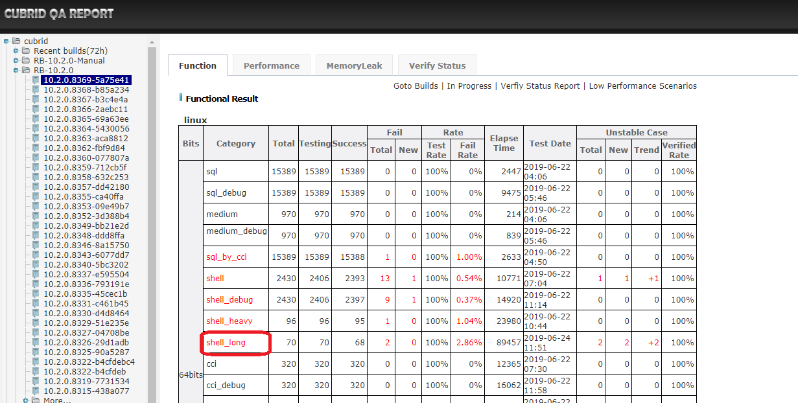
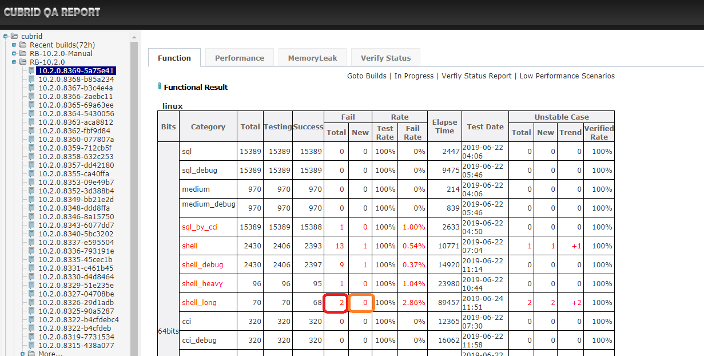
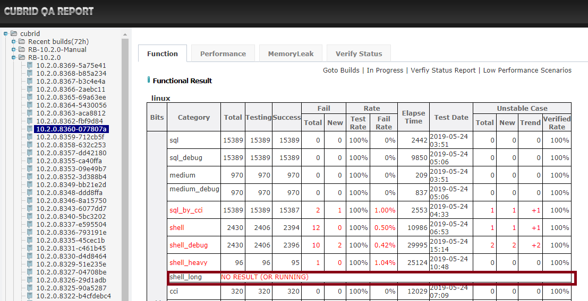
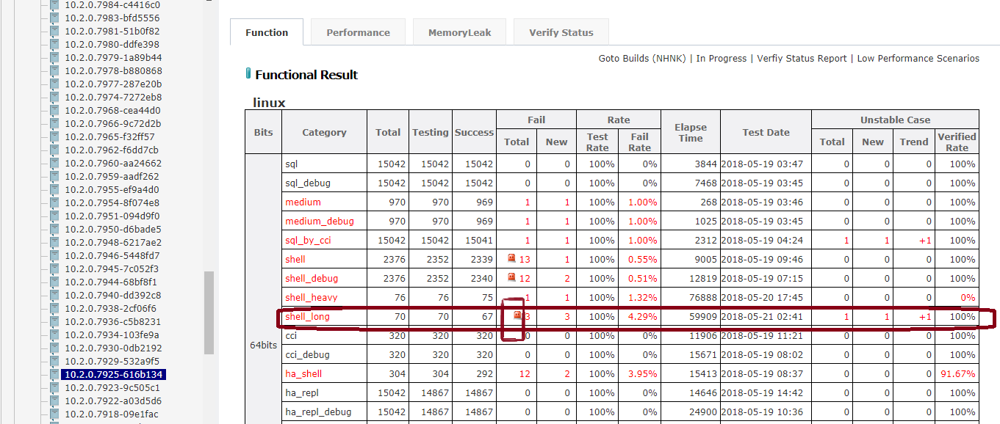
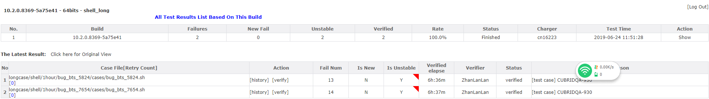
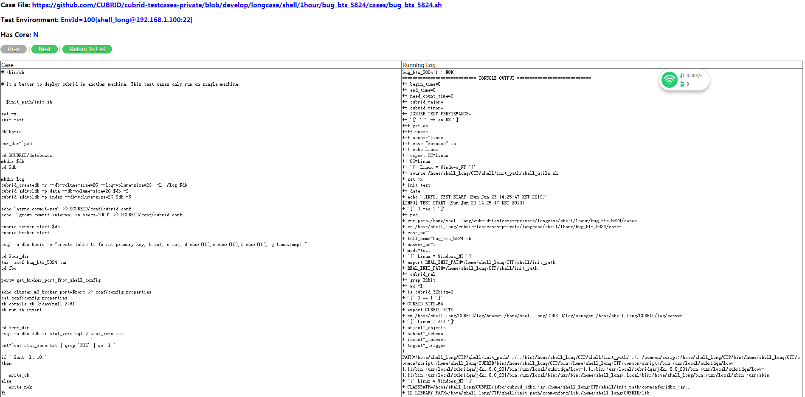
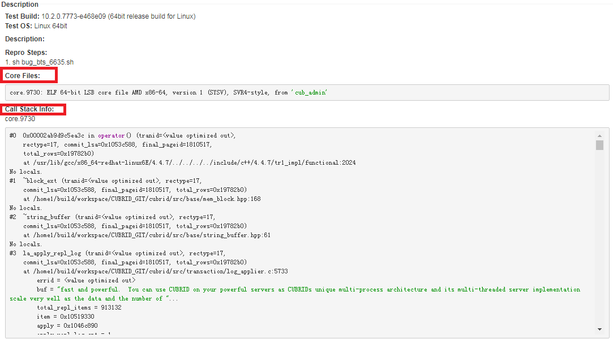
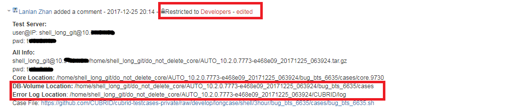

# 1. Test Objective  
This guide is to introduce how to execute shell_long test suite via test tool CTP.  The shell_long test case specification is exactly same as general SHELL test case's. The only difference between them is that shell_long test cases ask a little long time to execute.     

# 2. Test Introduction  
## 2.1 CTP test tool
Please refer to [ctp usage for shell](https://github.com/CUBRID/cubrid-testtools/blob/develop/doc/shell/shell_guide.md#2-ctp-introduction)   
the CTP usage for shell_long regression test is as below   
```bash
ctp.sh shell -c ~/CTP/conf/shell_runtime.conf
```
for regression test, we will copy `shell_template_for_shell_long.conf` to `shell_runtime.conf`   
```
BUILD_SCENARIOS="shell_long"
shell_config_template=${CTP_HOME}/conf/shell_template_for_${BUILD_SCENARIOS}.conf
shell_fm_test_conf="${CTP_HOME}/conf/shell_runtime.conf"
cp -f ${shell_config_template} ${shell_fm_test_conf}
ctp.sh shell -c $shell_fm_test_conf
```
## 2.2  Shell_long Test Cases
The existed shell long test cases are located in `path/to/cubrid-testcases-private/longcase/shell`  
```
$ cd cubrid-testcases-private/longcase/
$ find ./ -name "*.sh"                              
./5hour/bug_bts_16594/cases/bug_bts_16594.sh
./5hour/bug_bts_4707/cases/bug_bts_4707.sh
./5hour/bug_bts_7288/cases/bug_bts_7288.sh
./5hour/bug_bts_16581/cases/bug_bts_16581.sh
./5hour/bug_bts_6753_2/cases/bug_bts_6753_2.sh
./5hour/bug_bts_6785/cases/bug_bts_6785.sh
./5hour/bug_bts_6396/cases/bug_bts_6396.sh
./1hour/bug_bts_15629/cases/bug_bts_15629.sh
./1hour/bug_bts_15419_1_asc/cases/bug_bts_15419_1_asc.sh
./1hour/bug_bts_5222/cases/bug_bts_5222.sh
./1hour/bug_bts_17881/cases/bug_bts_17881.sh
./1hour/bug_bts_18031/cases/bug_bts_18031.sh
./1hour/bug_bts_9382/cases/bug_bts_9382.sh
./1hour/bug_bts_15419_1_desc/cases/bug_bts_15419_1_desc.sh
./1hour/bug_bts_15419_2_asc/cases/bug_bts_15419_2_asc.sh
./1hour/bug_bts_7350/cases/bug_bts_7350.sh
./1hour/_02_cursor_stress/cases/_02_cursor_stress.sh
...
./2hour/_02_cursor_stress/cases/_02_cursor_stress.sh
./2hour/bug_bts_10009/cases/bug_bts_10009.sh
./2hour/bug_bts_9969/cases/bug_bts_9969.sh
```
How to write new shell_long test cases   
please see [shell long cases specification](#5-test-case-specification)

# 3. Deploy Shell_long Regression Test
In this section, we will introduce how to deploy the Shell_long Regression Test Environment.  
## 3.1 Test Machines
For shell_long regression test, we usually have one controller node and multiple test nodes.In our regression configurations,we use five test nodes.  
**Controller node** : This node listens to test messages and starts a test when there is a test message.  
**Test node** : CUBRID server is deployed on this node,we execute test cases on it. 

Information about each test machines.
<table>
<tr>
<th>Description</th>
<th>User Name</th>
<th>IP</th>
<th>Hostname</th>
<th>Tools to deploy</th>
</tr>
<tr class="even">
<td>controller node</td>
<td>rqgcontroller</td>
<td>192.168.1.99</td>
<td>func24</td>
<td><p>CTP</p>
</td>
</tr>
<tr class="even">
<td>test node</td>
<td>shell_long</td>
<td>192.168.1.99</td>
<td>func24</td>
<td><p>CTP</p>
<p>cubrid-testcases-private</p>
</td>
</tr>
<tr class="even">
<td>test node</td>
<td>shell_long</td>
<td>192.168.1.100</td>
<td>func25</td>
<td><p>CTP</p>
<p>cubrid-testcases-private</p>
</td>
</tr>
<tr class="even">
<td>test node</td>
<td>shell_long</td>
<td>192.168.1.101</td>
<td>func26</td>
<td><p>CTP</p>
<p>cubrid-testcases-private</p>
</td>
</tr>
<tr class="even">
<td>test node</td>
<td>shell_long</td>
<td>192.168.1.102</td>
<td>func27</td>
<td><p>CTP</p>
<p>cubrid-testcases-private</p>
</td>
</tr>
<tr class="even">
<td>test node</td>
<td>shell_long</td>
<td>192.168.1.103</td>
<td>func28</td>
<td><p>CTP</p>
<p>cubrid-testcases-private</p>
</td>
</tr>
</table>

## 3.2	Test Deployments
### For all nodes
1. Install JDK
2. Add IP and hostname to /etc/hosts
```
192.168.1.99  func24  
192.168.1.100  func25    
192.168.1.101  func26  
192.168.1.102  func27  
192.168.1.103  func28   
```
3. checkout git repositories to $HOME/
```
git clone https://github.com/CUBRID/cubrid-testtools.git
cd ~/cubrid-testtools/
git checkout develop
```
### On Controller node  
1. Install CTP      
Please follow [the guide to install CTP](https://github.com/CUBRID/cubrid-testtools/blob/develop/doc/ctp_install_guide.md).

2. touch ~/CTP/conf/shell_template_for_shell_long.conf    
Here is the config file that we use for current daily QA test:
 ```
$ cat shell_template_for_shell_long.conf 
default.cubrid.cubrid_port_id=1568
default.broker1.BROKER_PORT=30090
default.broker1.APPL_SERVER_SHM_ID=30090
default.broker2.BROKER_PORT=33091
default.broker2.APPL_SERVER_SHM_ID=33091
default.ha.ha_port_id=59909

env.99.ssh.host=192.168.1.99
env.99.ssh.port=22
env.99.ssh.user=shell_long
env.99.ssh.pwd=******

env.100.ssh.host=192.168.1.100
env.100.ssh.port=22
env.100.ssh.user=shell_long
env.100.ssh.pwd=******

env.101.ssh.host=192.168.1.101
env.101.ssh.port=22
env.101.ssh.user=shell_long
env.101.ssh.pwd=******

env.102.ssh.host=192.168.1.102
env.102.ssh.port=22
env.102.ssh.user=shell_long
env.102.ssh.pwd=******

env.103.ssh.host=192.168.1.103
env.103.ssh.port=22
env.103.ssh.user=shell_long
env.103.ssh.pwd=******


scenario=${HOME}/cubrid-testcases-private/longcase/shell
test_continue_yn=false
cubrid_download_url=http://127.0.0.1/REPO_ROOT/store_02/10.1.0.6876-f9026f8/drop/CUBRID-10.1.0.6876-f9026f8-Linux.x86_64.sh
testcase_exclude_from_file=${HOME}/cubrid-testcases-private/longcase/shell/config/daily_regression_test_excluded_list_linux.conf
testcase_update_yn=true
testcase_git_branch=develop
#testcase_timeout_in_secs=604800
test_platform=linux
test_category=shell_long
testcase_exclude_by_macro=LINUX_NOT_SUPPORTED
testcase_retry_num=0
delete_testcase_after_each_execution_yn=false
enable_check_disk_space_yn=true

feedback_type=database
feedback_notice_qahome_url=http://192.168.1.86:8080/qaresult/shellImportAction.nhn?main_id=<MAINID>


owner_email=Orchid<lanlan.zhan@navercorp.com>
cc_email=CUBRIDQA<dl_cubridqa_bj_internal@navercorp.com>

git_user=cubridqa
git_email=dl_cubridqa_bj_internal@navercorp.com
git_pwd=******

feedback_db_host=192.168.1.86
feedback_db_port=33080
feedback_db_name=qaresu
feedback_db_user=dba
feedback_db_pwd=
```
When you need to test shell_long_debug, then need to copy `~/CTP/conf/shell_template_for_shell_long.conf` as `~/CTP/conf/shell_template_for_shell_long_debug.conf` 

3. touch start_test.sh  
```bash
 cat ~/start_test.sh

# If only need to listen the shell_long test message
# nohup start_consumer.sh -q QUEUE_CUBRID_QA_SHELL_LONG_LINUX -exec run_shell &

# We use one controllar to listening shell_heavy, shell_long, and RQG test messages in dailyqa.
nohup start_consumer.sh -q QUEUE_CUBRID_QA_SHELL_HEAVY_LINUX,QUEUE_CUBRID_QA_RQG,QUEUE_CUBRID_QA_SHELL_LONG_LINUX -exec run_shell,run_shell,run_shell &   
```
 4. Update ~/.bash_profile    
 ```
 $ cat .bash_profile 
# .bash_profile

# Get the aliases and functions
if [ -f ~/.bashrc ]; then
        . ~/.bashrc
fi

# User specific environment and startup programs

PATH=$PATH:$HOME/.local/bin:$HOME/bin

export PATH

export DEFAULT_BRANCH_NAME=develop
export CTP_HOME=$HOME/CTP
export CTP_BRANCH_NAME=develop
export CTP_SKIP_UPDATE=0

export CTP_HOME=~/CTP
export init_path=$CTP_HOME/shell/init_path
export RQG_HOME=~/random_query_generator
PATH=$JAVA_HOME/bin:$HOME/CTP/common/script:$PATH
```
 
5. start consumer process  
```bash
 sh start_test.sh
```

### On Test nodes
1. Install CTP  
Please follow [the guide to install CTP](https://github.com/CUBRID/cubrid-testtools/blob/develop/doc/ctp_install_guide.md).
2. Check out test cases from git to $HOME/
```
cd ~
git clone https://github.com/CUBRID/cubrid-testcases-private.git 
cd ~/cubrid-testcases-private/
git checkout develop
```
3. Install CUBRID.

4. Add following settings to ~/.bash_profile and source it.
```bash
$ cat .bash_profile
# .bash_profile

# Get the aliases and functions
if [ -f ~/.bashrc ]; then
        . ~/.bashrc
fi

# User specific environment and startup programs

PATH=$PATH:$HOME/.local/bin:$HOME/bin

export PATH

export LC_ALL=en_US

export CTP_HOME=$HOME/CTP
export LCOV_HOME=/usr/local/cubridqa/lcov-1.11

export init_path=$HOME/CTP/shell/init_path

export GCOV_PREFIX=$HOME
export GCOV_PREFIX_STRIP=2

export CTP_BRANCH_NAME="develop"
export CTP_SKIP_UPDATE="0"

export PATH=$CTP_HOME/bin:$CTP_HOME/common/script:$CUBRID/bin:$LCOV_HOME/bin:$JAVA_HOME/bin:$PATH:/usr/local/sbin:/usr/sbin

ulimit -c unlimited

#-------------------------------------------------------------------------------
# set CUBRID environment variables
#-------------------------------------------------------------------------------
. ~/.cubrid.sh
ulimit -c unlimited
```
# 4. Regression Tests
We perform shell_long test twice a week (actually it is controlled through crontab) and perform code coverage test for monthly.  
crontab task for shell_long test:
```
#######################################################################
job_shell_long.service=ON
job_shell_long.crontab=* 0 11 ? * SUN,THU
job_shell_long.listenfile=CUBRID-{1}-linux.x86_64.sh
job_shell_long.acceptversions=10.0.*.0~8999,10.1.*,10.2.*
job_shell_long.package_bits=64
job_shell_long.package_type=general

job_shell_long.test.1.scenario=shell_long
job_shell_long.test.1.queue=QUEUE_CUBRID_QA_SHELL_LONG_LINUX

#######################################################################
```


## 4.1 Daily regression test
When the build server has a new build and meet the conditions of the crontab task, a shell_long test will be executed. If there is something wrong and need to run shell_long test again, you can send a test message. 
### Send a test message
1. go to controller node, check `~/CTP/conf/shell_template_for_shell_long.conf`. This config file is only for regression test. We usually don't modify it except we have new test nodes.
2. login `message@192.168.1.91` and send test message.  
By default, it will find the `~/CTP/conf/shell_template_for_shell_long.conf` to execute. Otherwise it will find the `~/CTP/conf/shell_template.conf`   
```bash
sender.sh QUEUE_CUBRID_QA_SHELL_LONG_LINUX http://192.168.1.91:8080/REPO_ROOT/store_01/10.2.0.8268-6e0edf3/drop/CUBRID-10.2.0.8268-6e0edf3-Linux.x86_64.sh shell_long default
```

## 4.2 Verify test Results  
### Check if there is the test result  
1. Go to QA homepage and click the CI build, wait for the page loading, see the 'Function' tab and find the shell_long result.    
 

2. The category `shell_long` links to test cases that have been finished in the current test         
  

3. The `Fail` column  includes `Total` and `New` column ,The value of `Total` links to the whole failed cases, and the value of `New` links to the new failed cases compared with previous build.    
    

4. If it shows **'NO RESULT (OR RUNNING)'** as bellow, maybe you can check whether the crontab task time has not arrived or the test environments have problem.      
      

5. Here's what you might encounter:    
* Test message is in the queue(test is not started)   
  Sometimes there is another test executed such as RQG test,shell_heavy test or code coverage test. In this case, just wait for another test to complete.   
* Insufficient disk space  
  Some test case executed failed ,and on the value of `Total` column, we may see `Server crash graphic identifier`   
      
* Test is not finished as expected  
  If the CI build comes on time as usual, then you need to check why the test is so slow. It may because there is a server crash, server hangs up, or performance drop. In this case, you need to open a bug.   
  
### Check Failures   
1. failures: http://10.113.153.154:10086/qaresult/showFailResult.nhn?m=showFailVerifyItem&statid=21980&srctb=shell_main&failType=shell#  
   

2. Click each case to see [`Case` and `Running log`](http://10.113.153.154:10086/qaresult/showfile.nhn?m=showCaseFile&statid=21980&itemid=2140696&tc=shell_long&buildId=10.2.0.8369-5a75e41&filePath=longcase/shell/1hour/bug_bts_5824/cases/bug_bts_5824.sh&isSuccessFul=false)   
  

test code:  
```
if [ $cnt -lt 10 ]
then

   write_ok
else
   write_nok
fi

```
fail reason:  
```
+ cnt=17
+ '[' 17 -lt 10 ']'
+ write_nok
+ '[' -z '' ']'
+ echo '----------------- 1 : NOK'
----------------- 1 : NOK
+ echo 'bug_bts_5824-1 : NOK'
++ wc -l
```
## 4.3 Code coverage test  
Code coverage test starts on the last Sunday of each month.      
You can find the setting from http://10.113.153.154:10086/qaresult/job/job.conf     
```
#######################################################################
job_codecoverage.service=ON
job_codecoverage.crontab=0 1 10 ? * 7L
job_codecoverage.listenfile=cubrid-{1}.tar.gz
job_codecoverage.acceptversions=10.2.*
job_codecoverage.package_bits=64
job_codecoverage.package_type=general

job_codecoverage.test.1.scenario=gcov_package
job_codecoverage.test.1.queue=QUEUE_CUBRID_QA_CODE_COVERAGE
#######################################################################
job_coverage_test.service=ON
job_coverage_test.crontab=0/7 * * * * ?
job_coverage_test.listenfile=CUBRID-{1}-gcov-linux.x86_64.tar.gz
job_coverage_test.listenfile.1=cubrid-{1}-gcov-src-linux.x86_64.tar.gz
job_coverage_test.acceptversions=10.2.*
job_coverage_test.package_bits=64
job_coverage_test.package_type=coverage

job_coverage_test.test.15.scenario=shell_long
job_coverage_test.test.15.queue=QUEUE_CUBRID_QA_SHELL_LONG_LINUX
```
### Verify code coverage testing result  
1. Go to QA homepage and find the 'code coverage' node in the left area, click the link of latest result.  
     

2. Click the `shell_long` link.  
     

3. There is a coverage rate of lines. Its coverage rate of lines is usually in 40%~42%.   
     

### Send code coverage testing message    
login `message@192.168.1.91`    
Using the `sender_code_coverage_testing_message.sh` to send a code coverate test message.   
>
```bash
$ cd ~/manual
$ sh sender_code_coverage_testing_message.sh
Usage: sh  sender_code_coverage_testing_message queue url1 url2 category
``` 
Send code coverage test message:  
```bash
$ cd ~/manual
$ sh sender_code_coverage_testing_message.sh QUEUE_CUBRID_QA_SHELL_LONG_LINUX http://192.168.1.91:8080/REPO_ROOT/store_01/10.2.0.8270-c897055/drop/CUBRID-10.2.0.8270-c897055-gcov-Linux.x86_64.tar.gz http://192.168.1.91:8080/REPO_ROOT/store_01/10.2.0.8270-c897055/drop/cubrid-10.2.0.8270-c897055-gcov-src-Linux.x86_64.tar.gz shell_long    
Queue:QUEUE_CUBRID_QA_SHELL_LONG_LINUX
Build URL:http://192.168.1.91:8080/REPO_ROOT/store_01/10.2.0.8270-c897055/drop/CUBRID-10.2.0.8270-c897055-gcov-Linux.x86_64.tar.gz
Source URL:http://192.168.1.91:8080/REPO_ROOT/store_01/10.2.0.8270-c897055/drop/cubrid-10.2.0.8270-c897055-gcov-src-Linux.x86_64.tar.gz
Category:shell_long

Message: 

Message Content: Test for build 10.2.0.8270-c897055 by CUBRID QA Team, China
MSG_ID = 190705-165519-836-000001
MSG_PRIORITY = 4
BUILD_ABSOLUTE_PATH=/home/ci_build/REPO_ROOT/store_01/10.2.0.8270-c897055/drop
BUILD_BIT=0
BUILD_CREATE_TIME=1551930752000
BUILD_GENERATE_MSG_WAY=MANUAL
BUILD_ID=10.2.0.8270-c897055
BUILD_IS_FROM_GIT=1
BUILD_PACKAGE_PATTERN=CUBRID-{1}-gcov-Linux.x86_64.tar.gz
BUILD_SCENARIOS=shell_long
BUILD_SCENARIO_BRANCH_GIT=develop
BUILD_SEND_DELAY=10382567
BUILD_SEND_TIME=1562313319834
BUILD_STORE_ID=store_01
BUILD_SVN_BRANCH=RB-10.2.0
BUILD_SVN_BRANCH_NEW=RB-10.2.0
BUILD_TYPE=coverage
BUILD_URLS=http://192.168.1.91:8080/REPO_ROOT/store_01/10.2.0.8270-c897055/drop/CUBRID-10.2.0.8270-c897055-gcov-Linux.x86_64.tar.gz
BUILD_URLS_1=http://192.168.1.91:8080/REPO_ROOT/store_01/10.2.0.8270-c897055/drop/cubrid-10.2.0.8270-c897055-gcov-src-Linux.x86_64.tar.gz
BUILD_URLS_CNT=2
BUILD_URLS_KR=http://192.168.1.91:8080/REPO_ROOT/store_01/10.2.0.8270-c897055/drop/CUBRID-10.2.0.8270-c897055-gcov-Linux.x86_64.tar.gz
BUILD_URLS_KR_1=http://192.168.1.91:8080/REPO_ROOT/store_01/10.2.0.8270-c897055/drop/cubrid-10.2.0.8270-c897055-gcov-src-Linux.x86_64.tar.gz
MKEY_COVERAGE_UPLOAD_DIR=/home/codecov/cc4c/result
MKEY_COVERAGE_UPLOAD_IP=192.168.1.98
MKEY_COVERAGE_UPLOAD_PWD=******
MKEY_COVERAGE_UPLOAD_USER=codecov


Do you accept above message [Y/N]:
Y
```
queue: queue name    
url1: gcov build package url    
url2: gcov source package url    
catecory: shell_long   
 

## 4.4 Report issues
### General issue  
You can refer to http://jira.cubrid.org/browse/CBRD-21989.     


It is necessary to add such information: `Test Build`,`Test OS`,`Description`,`Repro Steps`,`Expected Result`,`Actual Result` and `Test Cases`.     
Sometimes we need save database files and logs to analyze this issue.      

### Crash issue   
Here are examples you can refer to.   
http://jira.cubrid.org/browse/CBRD-22097  
http://jira.cubrid.org/browse/CBRD-21772  

The call stack of call file is required to paste in the description.  
   

The location of the core file, DB files, and error logs are required.  
   

We can report shell_long issue though tools:    
* Click `Server crash graphic identifier`,go to list of failed cases       
* Click `REPORT ISSUE FOR BELOW CRASH`   
   
* Enter jira user and password,then click `Analyze Falure`,and click `Submit To Jira`  
   


## 4.5 Maintenance
### Delete `do_not_delete_core` Directory
There are a lot of backup files when we report crash issues,once these issus have been closed,we need to delete them.
```bash
$ cd ~/do_not_delete_core/
$ ls 
10.2.0.7925-616b134_20180521-143021.tar.gz  AUTO_10.2.0.7773-e468e09_20171225_063924.tar.gz  AUTO_10.2.0.8038-b6e1d4b_20181010_152229.tar.gz  readme.txt
```
### Check `ERROR_BACKUP` Directory
When we execute shell_long test,server appears crash or fatal error,the current db and other important information will be save in ~/ERROR_BACKUP,you need check it for each build and clear them in time.
```bash
$ cd ~/ERROR_BACKUP/
$ ls
AUTO_10.2.0.8038-b6e1d4b_20181010_152229.tar.gz  AUTO_10.2.0.8254-c015eb2_20190214_005631.tar.gz               AUTO_SERVER-START_10.2.0.8254-c015eb2_20190213_023728.tar.gz
AUTO_10.2.0.8060-689ccdd_20181019_014026.tar.gz  AUTO_10.2.0.8329-51e235e_20190413_151229.tar.gz               AUTO_SERVER-START_10.2.0.8362-fbf9d84_20190526_055005.tar.gz
AUTO_10.2.0.8060-689ccdd_20181019_040434.tar.gz  AUTO_10.2.0.8349-bb21e2d_20190428_190725.tar.gz               AUTO_SERVER-START_10.2.0.8362-fbf9d84_20190526_055233.tar.gz
AUTO_10.2.0.8107-a05cfaa_20181028_053656.tar.gz  AUTO_10.2.0.8362-fbf9d84_20190526_060734.tar.gz
AUTO_10.2.0.8254-c015eb2_20190213_025432.tar.gz  AUTO_SERVER-START_10.2.0.8254-c015eb2_20190213_020024.tar.gz
```  
# 5.Test Case Specification
## 5.1 Requirements
export init_path=$HOME/CTP/shell/init_path

## 5.2 How To Write Test Case    
It is the same with shell test cases  
   * Test cases: The file extension is ``.sh``, and it is located in ``cases`` subdirectory, naming rule: ``/path/to/test_name/cases/test_name.sh``  
   eg: cubrid-testcases-private/longcase/shell/5hour/bug_bts_4707/cases/bug_bts_4707.sh  
   * Example for reference  
    
     ```
     #!/bin/sh
     # to initialize the environment variables which are required by case
     . $init_path/init.sh
     # to support RQG regression, the environment variables and functions in rqg_init.sh should be initialized, so just need uncomment the below statement($init_path/rqg_init.sh), 
     # if you want to understand the functions which will be used in RQG case, please refer to $init_path/rqg_init.sh  
     # . $init_path/rqg_init.sh
     init test
     dbname=tmpdb

     cubrid_createdb $dbname
	
     dosomethings
     ...
	
     if [condition]
     then
	        # Print testing result according to the condition, PASS means ok, otherwise nok
	        write_ok
     else
	        write_nok
     fi
	
     cubrid server stop $dbname
     cubrid broker stop
	
     cubrid deletedb $dbname
     # clean environment
     finish
	  ```
## 5.3 Example Test Cases
```
$ cat bug_bts_14571.sh 
#!/bin/sh
. $init_path/init.sh
init test
set -x

dbname=db14571
cubrid server stop $dbname
cubrid broker stop 
cubrid deletedb $dbname
rm *.log *.err

cubrid_createdb $dbname --db-volume-size=20M --log-volume-size=20M
cubrid start server $dbname
cubrid broker start 

csql -u dba $dbname -i schema.sql

if [ "$OS" != "Linux" ]; then
        xgcc -o prepare prepare.c -I${CUBRID}/include -L${CUBRID}/bin -L${CUBRID}/lib -lcascci ${MODE}
else
        xgcc -o prepare prepare.c -I${CUBRID}/include -L${CUBRID}/lib -lcascci ${MODE}
fi

port=`get_broker_port_from_shell_config`
./prepare localhost $port $dbname

csql -udba $dbname -c "create index idx_1 on t1 (a)" > result_1.log 2> error_1.log &
sleep 3
csql -udba $dbname -c "create index idx_2 on t1 (b)" > result_2.log 2> error_2.log &
sleep 60
csql -udba $dbname -c "select * from db_index where class_name = 't1'" > result_3.log

if test -s error_1.log; then
  write_nok
else
   write_ok
fi

if test -s error_2.log; then
  write_nok
else
   write_ok
fi

sed -i 's/[^(]*[$)]//g' error_2.log
format_csql_output result_3.log
compare_result_between_files result_3.log bug_bts_14571.answer

cubrid service stop $dbname
if [ `cat bug_bts_14571.result | grep NOK | wc -l ` -ne 0 ] && [ $OS == Windows_NT ]
then
    curr_time=$(date '+%Y-%m-%d-%H-%M-%S')
    mkdir -p $TEST_BIG_SPACE/../bug_bts_14571_$curr_time
    cp -rf $CUBRID $TEST_BIG_SPACE/../bug_bts_14571_$curr_time
    cp -rf ../../bug_bts_14571 $TEST_BIG_SPACE/../bug_bts_14571_$curr_time
fi

cubrid deletedb $dbname
finish  
```
    
## 5.4 Common Functions For Shell_long Cases  
please refer to [shell guide](https://github.com/CUBRID/cubrid-testtools/blob/develop/doc/shell_guide.md#74-functions-in-initsh)

**Notice: you can view $init_path/init.sh for more information**  


