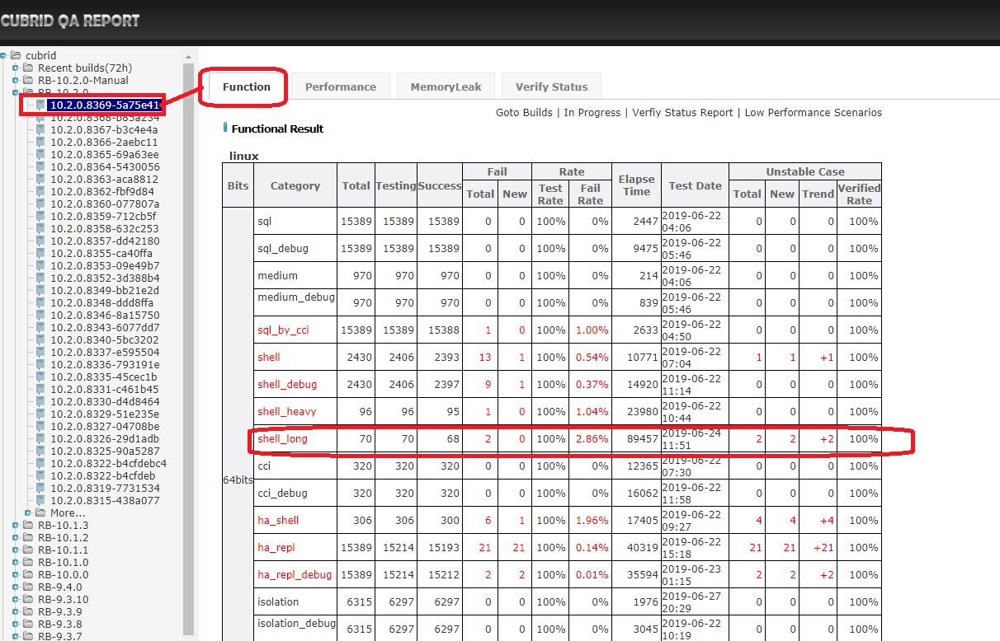
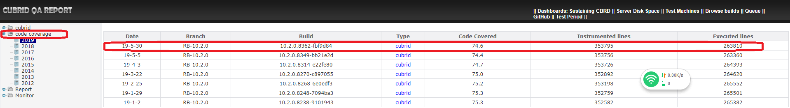
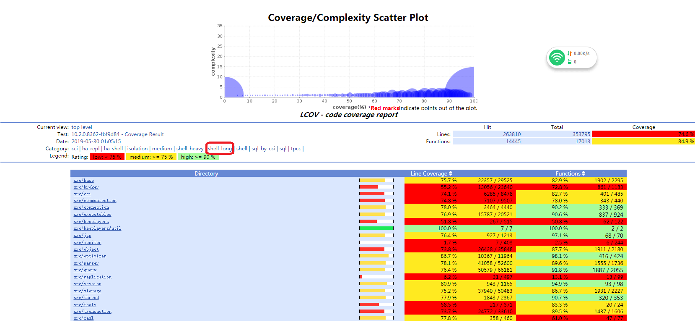
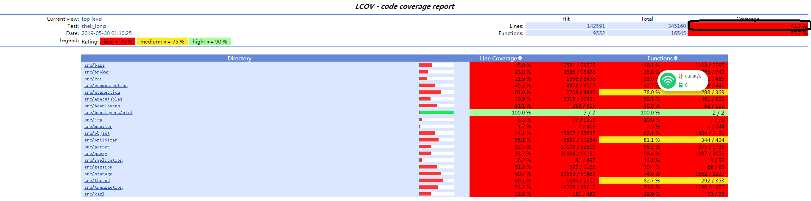
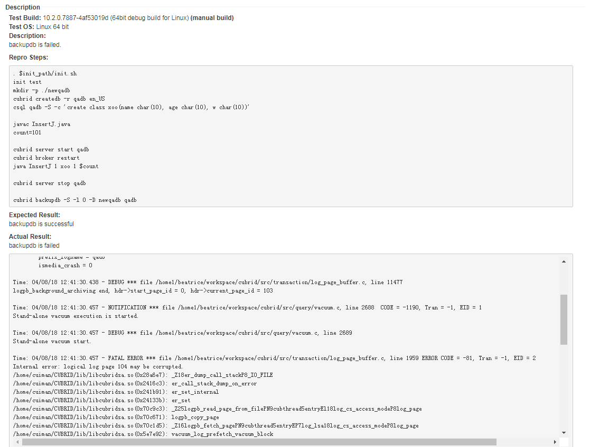
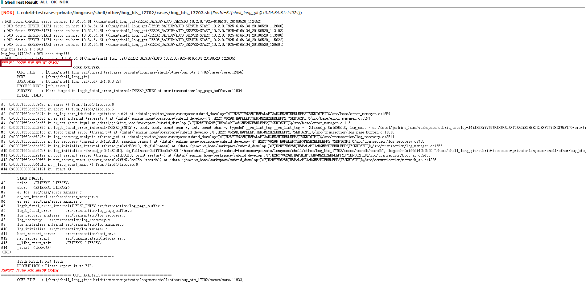
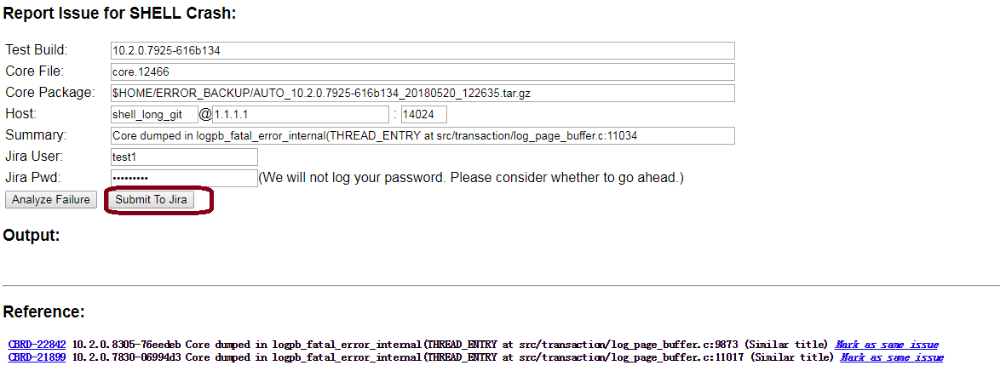

# 1. Test Objective  
This guide is to introduce how to execute shell_long test suite via test tool CTP.  The shell_long test case specification is exactly same as general SHELL test case's. The only difference between them is that shell_long test cases ask a little long time to execute.     

# 2. Execute Shell_long Test
Please refer to [these sections of shell_heavy guide](shell_heavy_guide.md#2-execute-shell_heavy-test) to execute shell_long test. Below we just list some difference between them.   
* ## Configuration file  
	Create shell_long test configuration file as below:   
	File `CTP/conf/shell_long.conf`
	```
	# path to a test case folder
	scenario=${HOME}/cubrid-testcases-private/longcase/shell/1hour/bug_bts_9382
	```
	>Note: scenario should be a path to a folder but not a file.

* ## Shell_long test cases
	Generally, we check out test cases from git repository. Shell long test cases are located in  https://github.com/CUBRID/cubrid-testcases-private/tree/develop/longcase.      
	```
	$ cd ~
	$ git clone https://github.com/CUBRID/cubrid-testcases-private.git
	$ ls ~/cubrid-testcases-private/longcase
	shell
	$ cd shell/
	$ ls
	_04_misc  _06_issues  1hour  2hour  _30_banana_qa  _32_features_930  3hour  5hour  config  other
	```

# 3. Deploy Regression Test Environment
In this section, we will introduce how to deploy the Shell_long Regression Test Environment.  
## 3.1 Test Machines
For current daily regression test, there are one controller node and five test nodes.      
**Controller node** : This node listens to test messages and starts a test when there is a test message.    
**Test node** : CUBRID server is deployed on this node, we execute test cases on it.     

Information about each test machines.    

Description|User Name|IP|Hostname|Tools to deploy
--|--|--|--|--
Controller node|rqgcontroller|192.168.1.99|func24|CTP
Test node|shell_long|192.168.1.99|func24|CTP,cubrid-testcases-private
Test node|shell_long|192.168.1.100|func25|CTP,cubrid-testcases-private
Test node|shell_long|192.168.1.101|func26|CTP,cubrid-testcases-private
Test node|shell_long|192.168.1.102|func27|CTP,cubrid-testcases-private
Test node|shell_long|192.168.1.103|func28|CTP,cubrid-testcases-private
## 3.2	Deploy Test Environment
### On Controller node  
* ### Install CTP        
	Please follow [the guide to install CTP](ctp_install_guide.md#3-install-ctp-as-regression-test-platform). Then create shell_long test configuration.
	File `~/CTP/conf/shell_template_for_shell_long.conf`:   
	 ```
	$ cat shell_template_for_shell_long.conf 
	default.cubrid.cubrid_port_id=1568
	default.broker1.BROKER_PORT=30090
	default.broker1.APPL_SERVER_SHM_ID=30090
	default.broker2.BROKER_PORT=33091
	default.broker2.APPL_SERVER_SHM_ID=33091
	default.ha.ha_port_id=59909

	env.99.ssh.host=192.168.1.99
	env.99.ssh.port=22
	env.99.ssh.user=shell_long
	env.99.ssh.pwd=******

	env.100.ssh.host=192.168.1.100
	env.100.ssh.port=22
	env.100.ssh.user=shell_long
	env.100.ssh.pwd=******

	env.101.ssh.host=192.168.1.101
	env.101.ssh.port=22
	env.101.ssh.user=shell_long
	env.101.ssh.pwd=******

	env.102.ssh.host=192.168.1.102
	env.102.ssh.port=22
	env.102.ssh.user=shell_long
	env.102.ssh.pwd=******

	env.103.ssh.host=192.168.1.103
	env.103.ssh.port=22
	env.103.ssh.user=shell_long
	env.103.ssh.pwd=******


	scenario=${HOME}/cubrid-testcases-private/longcase/shell
	test_continue_yn=false
	cubrid_download_url=http://127.0.0.1/REPO_ROOT/store_02/10.1.0.6876-f9026f8/drop/CUBRID-10.1.0.6876-f9026f8-Linux.x86_64.sh
	testcase_exclude_from_file=${HOME}/cubrid-testcases-private/longcase/shell/config/daily_regression_test_excluded_list_linux.conf
	testcase_update_yn=true
	testcase_git_branch=develop
	#testcase_timeout_in_secs=604800
	test_platform=linux
	test_category=shell_long
	testcase_exclude_by_macro=LINUX_NOT_SUPPORTED
	testcase_retry_num=0
	delete_testcase_after_each_execution_yn=false
	enable_check_disk_space_yn=true

	feedback_type=database
	feedback_notice_qahome_url=http://192.168.1.86:8080/qaresult/shellImportAction.nhn?main_id=<MAINID>


	owner_email=Orchid<lanlan.zhan@navercorp.com>
	cc_email=CUBRIDQA<dl_cubridqa_bj_internal@navercorp.com>

	git_user=cubridqa
	git_email=dl_cubridqa_bj_internal@navercorp.com
	git_pwd=******

	feedback_db_host=192.168.1.86
	feedback_db_port=33080
	feedback_db_name=qaresu
	feedback_db_user=dba
	feedback_db_pwd=
	```
	>Note: when you need to test shell_long_debug, copy `~/CTP/conf/shell_template_for_shell_long.conf` as `~/CTP/conf/shell_template_for_shell_long_debug.conf` 

* ### Create quick start script     
	File `start_test.sh` 
	```bash
	 cat ~/start_test.sh

	# If only need to listen the shell_long test message
	# nohup start_consumer.sh -q QUEUE_CUBRID_QA_SHELL_LONG_LINUX -exec run_shell &

	# We use one controllar to listening shell_heavy, shell_long, and RQG test messages in dailyqa.
	nohup start_consumer.sh -q QUEUE_CUBRID_QA_SHELL_HEAVY_LINUX,QUEUE_CUBRID_QA_RQG,QUEUE_CUBRID_QA_SHELL_LONG_LINUX -exec run_shell,run_shell,run_shell &   
	```
* ### Configure .bash_profile      
	 ```
	export DEFAULT_BRANCH_NAME=develop
	export CTP_HOME=$HOME/CTP
	export CTP_BRANCH_NAME=develop
	export CTP_SKIP_UPDATE=0
	export init_path=$HOME/CTP/shell/init_path

	ulimit -c unlimited
	export LC_ALL=en_US

	. $HOME/.cubrid.sh
	export PATH=$CTP_HOME/bin:$CTP_HOME/common/script:$JAVA_HOME/bin:/usr/local/bin:/bin:/usr/bin:$PATH
	```
### On Test nodes
* ### Install CTP    
	Please follow [the guide to install CTP](ctp_install_guide.md#3-install-ctp-as-regression-test-platform).
* ### Check out test cases   
	```
	cd ~
	git clone https://github.com/CUBRID/cubrid-testcases-private.git 
	cd ~/cubrid-testcases-private/
	git checkout develop
	```
* ### Install CUBRID.    

* ### Add following settings to ~/.bash_profile and source it.
	```bash
	$ cat .bash_profile
	# .bash_profile

	# Get the aliases and functions
	if [ -f ~/.bashrc ]; then
			. ~/.bashrc
	fi

	# User specific environment and startup programs

	PATH=$PATH:$HOME/.local/bin:$HOME/bin

	export PATH

	export LC_ALL=en_US

	export CTP_HOME=$HOME/CTP
	export LCOV_HOME=/usr/local/cubridqa/lcov-1.11

	export init_path=$HOME/CTP/shell/init_path

	export GCOV_PREFIX=$HOME
	export GCOV_PREFIX_STRIP=2

	export CTP_BRANCH_NAME="develop"
	export CTP_SKIP_UPDATE="0"

	export PATH=$CTP_HOME/bin:$CTP_HOME/common/script:$CUBRID/bin:$LCOV_HOME/bin:$JAVA_HOME/bin:$PATH:/usr/local/sbin:/usr/sbin

	ulimit -c unlimited

	#-------------------------------------------------------------------------------
	# set CUBRID environment variables
	#-------------------------------------------------------------------------------
	. ~/.cubrid.sh
	ulimit -c unlimited
	```
# 4. Regression Test Sustaining
We perform shell_long test twice a week (actually it is controlled through crontab) and perform code coverage test for monthly.  
Crontab task for shell_long test is as below:
```
#######################################################################
job_shell_long.service=ON
job_shell_long.crontab=* 0 11 ? * SUN,THU
job_shell_long.listenfile=CUBRID-{1}-linux.x86_64.sh
job_shell_long.acceptversions=10.0.*.0~8999,10.1.*,10.2.*
job_shell_long.package_bits=64
job_shell_long.package_type=general

job_shell_long.test.1.scenario=shell_long
job_shell_long.test.1.queue=QUEUE_CUBRID_QA_SHELL_LONG_LINUX

#######################################################################
```
## 4.1 Daily regression test
When the build server has a new build and meet the conditions of the crontab task, the shell_long regression test will be started. If there is something wrong and need to run shell_long test again, you can send a test message. 
### Start the listener
```bash
$ cd ~
$ sh start_test.sh &
$ tail -f nohup.out
```
### Send a test message
Login `message@192.168.1.91` and send test message.  
By default, it will find the `~/CTP/conf/shell_template_for_shell_long.conf` to execute. Otherwise it will find the `~/CTP/conf/shell_template.conf`   
```bash
sender.sh QUEUE_CUBRID_QA_SHELL_LONG_LINUX http://192.168.1.91:8080/REPO_ROOT/store_01/10.2.0.8268-6e0edf3/drop/CUBRID-10.2.0.8268-6e0edf3-Linux.x86_64.sh shell_long default
```
### Verify test result 
* ### Check whether there are results
	Open [QA homepage](http://qahome.cubrid.org/qaresult/index.nhn), then navigate as below to find shell_long test result.   
	    
	If some test shows 'NO RESULT', we need investigate reasons and resolve it.
* ### Both Test Rate and Verified Rate should be 100%
	In above picture, the figures with red color mean number of failures. Click it to open verification page. Then follow the same way as [shell test's](shell_guide.md#41-verify-regression-test-results) to verify all failures. Both Test Rate and Verified Rate should be 100%.
   
## 4.2 Code coverage test  
Code coverage test starts on the last Sunday of each month.      
You can find the setting from http://qahome.cubrid.org/qaresult/job/job.conf     
```
#######################################################################
job_codecoverage.service=ON
job_codecoverage.crontab=0 1 10 ? * 7L
job_codecoverage.listenfile=cubrid-{1}.tar.gz
job_codecoverage.acceptversions=10.2.*
job_codecoverage.package_bits=64
job_codecoverage.package_type=general

job_codecoverage.test.1.scenario=gcov_package
job_codecoverage.test.1.queue=QUEUE_CUBRID_QA_CODE_COVERAGE
#######################################################################
job_coverage_test.service=ON
job_coverage_test.crontab=0/7 * * * * ?
job_coverage_test.listenfile=CUBRID-{1}-gcov-linux.x86_64.tar.gz
job_coverage_test.listenfile.1=cubrid-{1}-gcov-src-linux.x86_64.tar.gz
job_coverage_test.acceptversions=10.2.*
job_coverage_test.package_bits=64
job_coverage_test.package_type=coverage

job_coverage_test.test.15.scenario=shell_long
job_coverage_test.test.15.queue=QUEUE_CUBRID_QA_SHELL_LONG_LINUX
```
### Send code coverage testing message    
Login `message@192.168.1.91`, using the `sender_code_coverage_testing_message.sh` script to send a code coverate test message.   
>
```bash
$ cd ~/manual
$ sh sender_code_coverage_testing_message.sh
Usage: sh  sender_code_coverage_testing_message queue url1 url2 category
``` 
Example to send code coverage test message:  
```bash
$ cd ~/manual
$ sh sender_code_coverage_testing_message.sh QUEUE_CUBRID_QA_SHELL_LONG_LINUX http://192.168.1.91:8080/REPO_ROOT/store_01/10.2.0.8270-c897055/drop/CUBRID-10.2.0.8270-c897055-gcov-Linux.x86_64.tar.gz http://192.168.1.91:8080/REPO_ROOT/store_01/10.2.0.8270-c897055/drop/cubrid-10.2.0.8270-c897055-gcov-src-Linux.x86_64.tar.gz shell_long    
Queue:QUEUE_CUBRID_QA_SHELL_LONG_LINUX
Build URL:http://192.168.1.91:8080/REPO_ROOT/store_01/10.2.0.8270-c897055/drop/CUBRID-10.2.0.8270-c897055-gcov-Linux.x86_64.tar.gz
Source URL:http://192.168.1.91:8080/REPO_ROOT/store_01/10.2.0.8270-c897055/drop/cubrid-10.2.0.8270-c897055-gcov-src-Linux.x86_64.tar.gz
Category:shell_long

Message: 

Message Content: Test for build 10.2.0.8270-c897055 by CUBRID QA Team, China
MSG_ID = 190705-165519-836-000001
MSG_PRIORITY = 4
BUILD_ABSOLUTE_PATH=/home/ci_build/REPO_ROOT/store_01/10.2.0.8270-c897055/drop
BUILD_BIT=0
BUILD_CREATE_TIME=1551930752000
BUILD_GENERATE_MSG_WAY=MANUAL
BUILD_ID=10.2.0.8270-c897055
BUILD_IS_FROM_GIT=1
BUILD_PACKAGE_PATTERN=CUBRID-{1}-gcov-Linux.x86_64.tar.gz
BUILD_SCENARIOS=shell_long
BUILD_SCENARIO_BRANCH_GIT=develop
BUILD_SEND_DELAY=10382567
BUILD_SEND_TIME=1562313319834
BUILD_STORE_ID=store_01
BUILD_SVN_BRANCH=RB-10.2.0
BUILD_SVN_BRANCH_NEW=RB-10.2.0
BUILD_TYPE=coverage
BUILD_URLS=http://192.168.1.91:8080/REPO_ROOT/store_01/10.2.0.8270-c897055/drop/CUBRID-10.2.0.8270-c897055-gcov-Linux.x86_64.tar.gz
BUILD_URLS_1=http://192.168.1.91:8080/REPO_ROOT/store_01/10.2.0.8270-c897055/drop/cubrid-10.2.0.8270-c897055-gcov-src-Linux.x86_64.tar.gz
BUILD_URLS_CNT=2
BUILD_URLS_KR=http://192.168.1.91:8080/REPO_ROOT/store_01/10.2.0.8270-c897055/drop/CUBRID-10.2.0.8270-c897055-gcov-Linux.x86_64.tar.gz
BUILD_URLS_KR_1=http://192.168.1.91:8080/REPO_ROOT/store_01/10.2.0.8270-c897055/drop/cubrid-10.2.0.8270-c897055-gcov-src-Linux.x86_64.tar.gz
MKEY_COVERAGE_UPLOAD_DIR=/home/codecov/cc4c/result
MKEY_COVERAGE_UPLOAD_IP=192.168.1.98
MKEY_COVERAGE_UPLOAD_PWD=******
MKEY_COVERAGE_UPLOAD_USER=codecov


Do you accept above message [Y/N]:
Y
```
queue: queue name    
url1: gcov build package url    
url2: gcov source package url    
catecory: shell_long   
### Verify code coverage testing result  
1. Go to QA homepage and find the 'code coverage' node in the left area, click the link of latest result.  
     

2. Click the `shell_long` link.  
     

3. There is a coverage rate of lines. Its coverage rate of lines is usually in 40%~42%.   
      

## 4.3 Report issues
Please refer to [`report issues of shell test`](shell_guide.md#43-report-issues).     
### General issue  
You can refer to http://jira.cubrid.org/browse/CBRD-21989.     


It is necessary to add such information: `Test Build`,`Test OS`,`Description`,`Repro Steps`,`Expected Result`,`Actual Result` and `Test Cases`.     
Sometimes we need save database files and logs to analyze this issue.      

### Crash issue
Here are examples you can refer to.   
http://jira.cubrid.org/browse/CBRD-22097  
http://jira.cubrid.org/browse/CBRD-21772  
 
We can report crash issue though tools:        
* #### Click `REPORT ISSUE FOR BELOW CRASH`
	   
* #### Enter jira user and password,then click `Analyze Falure`,and click `Submit To Jira`  
	   

## 4.4 Maintenance
### Delete `do_not_delete_core` Directory
There are a lot of backup files when we report crash issues,once these issus have been closed,we need to delete them.
```bash
$ cd ~/do_not_delete_core/
$ ls 
10.2.0.7925-616b134_20180521-143021.tar.gz  AUTO_10.2.0.7773-e468e09_20171225_063924.tar.gz  AUTO_10.2.0.8038-b6e1d4b_20181010_152229.tar.gz  readme.txt
```
### Check `ERROR_BACKUP` Directory
When we execute shell_long test,server appears crash or fatal error,the current db and other important information will be save in ~/ERROR_BACKUP,you need check it for each build and clear them in time.
```bash
$ cd ~/ERROR_BACKUP/
$ ls
AUTO_10.2.0.8038-b6e1d4b_20181010_152229.tar.gz  AUTO_10.2.0.8254-c015eb2_20190214_005631.tar.gz               AUTO_SERVER-START_10.2.0.8254-c015eb2_20190213_023728.tar.gz
AUTO_10.2.0.8060-689ccdd_20181019_014026.tar.gz  AUTO_10.2.0.8329-51e235e_20190413_151229.tar.gz               AUTO_SERVER-START_10.2.0.8362-fbf9d84_20190526_055005.tar.gz
AUTO_10.2.0.8060-689ccdd_20181019_040434.tar.gz  AUTO_10.2.0.8349-bb21e2d_20190428_190725.tar.gz               AUTO_SERVER-START_10.2.0.8362-fbf9d84_20190526_055233.tar.gz
AUTO_10.2.0.8107-a05cfaa_20181028_053656.tar.gz  AUTO_10.2.0.8362-fbf9d84_20190526_060734.tar.gz
AUTO_10.2.0.8254-c015eb2_20190213_025432.tar.gz  AUTO_SERVER-START_10.2.0.8254-c015eb2_20190213_020024.tar.gz
```  
# 5.Test Case Specification 
The directory structure, naming rule, and convention rules of shell_long test case are definitely same as that of shell test cases. Please refer to [5. Shell Case Standards ](shell_guide.md#5-shell-case-standards) to write test cases.


  
    


