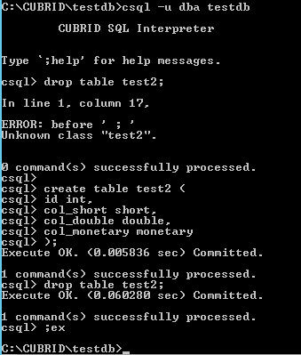

# Test Objective
SQL is basic but important feature of one RDBMS product. CUBRID as a comprehensive relational database management system supports not only standard SQL but also native extension.  
In order to test SQL feature, we designed two suites SQL and MEDIUM which include all kinds of DDL, DML and so on.  
Typically, SQL and MEDIUM perform tests via JDBC interface on both Linux and Windows platform as regression test. And we also introduce SQL_BY_CCI suite which execute SQL test cases via CCI interface. In this guide, I would introduce SQL, MEDIUM and SQL_BY_CCI tests.  
  
# General SQL Test  
## Test deployment  
* Install CTP  
Please follow guides to [install CTP on Linux platform](https://github.com/CUBRID/cubrid-testtools/blob/develop/doc/ctp_install_guide.md#1-install-ctp-in-linux-platform) or [install CTP on Windows platform](https://github.com/CUBRID/cubrid-testtools/blob/develop/doc/ctp_install_guide.md#2-install-ctp-in-windows-platform).
    * SQL test  
    Prepare test configuration file ~/CTP/conf/sql.conf    
	    ```
		  #Copyright (c) 2016, Search Solution Corporation. All rights reserved.
		  #--------------------------------------------------------------------
		  #
		  #Redistribution and use in source and binary forms, with or without 
		  #modification, are permitted provided that the following conditions are met:
		  #
		  #  * Redistributions of source code must retain the above copyright notice, 
		  #    this list of conditions and the following disclaimer.
		  #
		  #  * Redistributions in binary form must reproduce the above copyright 
		  #    notice, this list of conditions and the following disclaimer in 
		  #    the documentation and/or other materials provided with the distribution.
		  #
		  #  * Neither the name of the copyright holder nor the names of its contributors may be used to endorse or promote products 
		  #    derived from this software without specific prior written permission.
		  #
		  #THIS SOFTWARE IS PROVIDED BY THE COPYRIGHT HOLDERS AND CONTRIBUTORS "AS IS" AND ANY EXPRESS OR IMPLIED WARRANTIES, 
		  #INCLUDING, BUT NOT LIMITED TO, THE IMPLIED WARRANTIES OF MERCHANTABILITY AND FITNESS FOR A PARTICULAR PURPOSE ARE 
		  #DISCLAIMED. IN NO EVENT SHALL THE COPYRIGHT HOLDER OR CONTRIBUTORS BE LIABLE FOR ANY DIRECT, INDIRECT, INCIDENTAL, 
		  #SPECIAL, EXEMPLARY, OR CONSEQUENTIAL DAMAGES (INCLUDING, BUT NOT LIMITED TO, PROCUREMENT OF SUBSTITUTE GOODS OR 
		  #SERVICES; LOSS OF USE, DATA, OR PROFITS; OR BUSINESS INTERRUPTION) HOWEVER CAUSED AND ON ANY THEORY OF LIABILITY, 
		  #WHETHER IN CONTRACT, STRICT LIABILITY, OR TORT (INCLUDING NEGLIGENCE OR OTHERWISE) ARISING IN ANY WAY OUT OF THE 
		  #USE OF THIS SOFTWARE, EVEN IF ADVISED OF THE POSSIBILITY OF SUCH DAMAGE.

		  # SQL section - a section for CTP tool configuration when executing sql/medium testing
		  [sql]
		  # The location of your testing scenario
		  scenario=${HOME}/cubrid-testcases/sql
		  # Configure an alias name for testing result
		  test_category=sql
		  # Config file for I18N client charset configuration and init session parameter via 'set system parameter xxx'
		  jdbc_config_file=test_default.xml
		  # Config database charset for db creation
		  db_charset=en_US
		  # If test need do make locale or not
		  need_make_locale=yes

		  # SQL cubrid.conf section - a section for cubrid.conf configuration
		  [sql/cubrid.conf]
		  # To decide if the Java store procedure will be used when testing
		  java_stored_procedure=yes
		  # Allow scenario to change database system parameter
		  test_mode=yes
		  # To increase the speed of execution
		  max_plan_cache_entries=1000
		  # To increase the speed of execution
		  unicode_input_normalization=no
		  # To change port of cubrid_port_id to avoid port conflict
		  cubrid_port_id=1285
		  # In order to simulate the scenario customer use
		  ha_mode=yes
		  # To reduce the lock wait time to fast testing execution
		  lock_timeout=10sec

		  # SQL cubrid_ha.conf section - a section for ha related configuration
		  [sql/cubrid_ha.conf]
		  # Once ha_mode=yes is configured in cubrid.conf, you will require to configure cubrid_ha.conf except ha_db_list 
		  ha_mode=yes
		  # To reduce memory use
		  ha_apply_max_mem_size=300
		  # To set what port will be used for ha_port_id
		  ha_port_id=12859

		  # SQL cubrid_broker.conf query editor section - a section to change parameters under query_editor
		  [sql/cubrid_broker.conf/%query_editor]
		  # To close one service to avoid port conflict and reduce configuration complexity
		  SERVICE=OFF

		  # SQL cubrid_broker.conf broker1 section - a section to change parameters under broker1
		  [sql/cubrid_broker.conf/%BROKER1]
		  # To change broker port to avoid port conflict, if you are sure the port will not conflict, just ignore.
		  BROKER_PORT=33285
		  # To change ID of shared memory used by CAS, if you are sure the port will not conflict, just ignore.
		  APPL_SERVER_SHM_ID=33285

		  # SQL cubrid_broker.conf broker section - a section to configure parameters under broker section
		  [sql/cubrid_broker.conf/broker]
		  # To change the identifier of shared memory to avoid conflict to cause server start fail
		  MASTER_SHM_ID=32851
		```
	* SQL_BY_CCI test  
    touch and configure ~/CTP/conf/sql_by_cci_template.conf  
	Add cci configuration "sql_interface_type=cci" to sql.conf
    * Windows test  
    touch and configure ~/CTP/conf/sql.conf   
	Modify configuration "jdbc_config_file=test_default.xml" to "jdbc_config_file = test_win.xml","ha_mode=no" to "ha_mode=yes" in sql.conf 
* configure ~/.bash_profile
    ```
    export TZ='Asia/Seoul'
	export LC_ALL=en_US
    ```
    source ~/.bash_profile
* Install CUBRID  
On Linux systems,use the sh installation file to install cubrid.  
    ```
    sh CUBRID-10.2.0.8414-294c026-Linux.x86_64-debug.sh
    ```
On Windows systems,use the msi installation file to install cubrid for the first time.  
* Check out test cases  
    ```
    cd ~  
    git clone https://github.com/CUBRID/cubrid-testcases.git 
    ```
     It‘s difference between SQL and MEDIUM,  there is a unload file cubrid-testcases/medium/files/mdb.tar.gz that is used to MEDIUM test.(The files mdb_indexes,mdb_schema and mdb_objects are in the mdb.tar.gz archive)
    * MEDIUM test
        ```
        cubrid createdb testdb en_US  
        cubrid loaddb -u dba -d mdb_objects -s mdb_schema -i mdb_indexes  testdb
        ```

## Executed Test
### CTP  
* Execute with interactive mode via CTP  
run ctp.sh  
  Modify the working directory and configuration parameters in the file CTP/conf/sql.conf:scenario=${HOME}/cubrid-testcases/sql
  * SQL
    ```
    ctp.sh sql -c CTP/conf/sql.conf --interactive
    ```
  * MEDIUM
    ```
    ctp.sh medium -c CTP/conf/sql.conf --interactive
    ```
  * SQL_BY_CCI
    ```
    ctp.sh sql -c CTP/conf/sql.conf --interactive
    ```
* Execute each test suite via CTP   
run test
  ```
  ======================================  Welcome to Interactive Mode ======================================  
  Usage: 
      help         print the usage of interactive
      run <arg>    the path of case file to run
      run_cci <arg>    the path of case file to run_cci by cci driver
      quit         quit interactive mode 

  For example:
      run .                                                 #run the current directory cases
      run ./_001_primary_key/_002_uniq                      #run the cases which are based on the relative path
      run test.sql                                          #run the test.sql file
      run /home/user1/dailyqa/trunk/scenario/sql/_02_object #run the cases which are based on the absolute path
      run_cci ./_001_primary_key/_002_uniq                  #run the cases which are based on the relative path
      run_cci ./_001_primary_key/_002_uniq/test.sql         #run the cases file
  sql>run .
  ```

    

  You can view the results on the web page:
  ```
    $ ctp.sh webconsole start
    Config: /home/sql1/CTP/conf/webconsole.conf
    Web Root: /home/sql1/CTP/sql/webconsole
    Begin to start 

    Done
    URL:  http://192.168.1.76:7777
  ```
  
    

### csql  
   * cubrid createdb testdb en_US  
   * cubrid server start testdb
   * csql -u dba testdb  
    
    
# Regression Test Deployment  
* Test Machines  

    No|role|user|ip|hostname|QUEUE_NAME|run_name
    :---:|:--:|:---:|:---:|:---:|:---:|:---:
    1|Test node|sql1|192.168.1.76|func01|QUEUE_CUBRID_QA_SQL_LINUX_GIT|run_sql
    2|Test node|sql2|192.168.1.76|func01|QUEUE_CUBRID_QA_SQL_LINUX_GIT|run_sql
    3|Test node|sql3|192.168.1.76|func01|QUEUE_CUBRID_QA_SQL_LINUX_GIT|run_sql
    4|Test node|sqlbycci|192.168.1.76|func01|QUEUE_CUBRID_QA_SQL_CCI_LINUX_GIT|run_sql_by_cci
    5|Test node|sql|192.168.1.77|func02|QUEUE_CUBRID_QA_SQL_PERF_LINUX|run_sql
    6|Test node|qa|192.168.1.161|winfunc01|QUEUE_CUBRID_QA_SQL_WIN64|run_sql  
* Install reference [CTP_install_guide](https://github.com/Zhaojia2019/cubrid-testtools/blob/guide/doc/ctp_install_guide.md#3-install-ctp-as-regression-test-platform) 
* Linux Queue configure    
    touch start_test.sh  
    ```
    stop_consumer.sh 
    prefix=`date "+%Y%m%d%H%M%S"`
    cp nohup.out nohup.out.$prefix
    echo "" > nohup.out
    nohup start_consumer.sh -q [QUEUE_NAME] -exec [run_name] &
    ```       
* Windows Queue configure   
    touch start_test.sh
    ```
    start_test.sh
    rm nohup.out
    nohup start_consumer.sh -q [QUEUE_NAME] -exec [run_name] &
    ```
* sh start_test.sh  

* send test message  
  login message@192.168.1.91 and send test message like:  
  ```
  sender.sh  [QUEUE_NAME]  [CI_BUILD] [Category] default
  ```
  [QUEUE_NAME]:Message queue name  
  [CI_BUILD]:Corresponds to the build installation package address
  [Category]:sql,sql_debug,sql_by_cci,medium,medium_debug  
  
  eg: run SQL test
  sender.sh QUEUE_CUBRID_QA_SQL_LINUX_GIT http://192.168.1.91:8080/REPO_ROOT/store_01/10.2.0.8369-5a75e41/drop/CUBRID-10.2.0.8369-5a75e41-Linux.x86_64-debug.sh sql_debug default  
   
# Regression Test Sustaining  
* Daily regression test  
When the build server has a new build, a SQL test will be executed. If there is something wrong and need to run SQL test again, you can send a test message.   
How to view qahome results:  
Go to QA homepage and click the CI build, wait for the page loading, then click the 'Function',look at the case of Fail  


* Code coverage test  
	* VERIFY CODE COVERAGE TESTING RESULT  
	Go to QA homepage and find the ‘code coverage’ node in the left area, click the link of latest result.  
	  
	Click the Category(SQL,MEDIUM,SQL_BY_CCI) link.   
	  
	There is a coverage rate of lines. Its SQL and SQL_BY_CCI coverage rate of lines is usually in 58%~60%, the MEDIUM coverage rate of lines is usually in 30%~31%.  
	

	* SEND CODE COVERAGE TESTING MESSAGE  
	sh  sender_code_coverage_testing_message.sh [QUEUE_NAME]  [COVERAGE_BUILD] [Category] default
	eg:
      ```
      cd manual
      sh  sender_code_coverage_testing_message.sh QUEUE_CUBRID_QA_SQL_LINUX_GIT_test http://192.168.1.91:8080/REPO_ROOT/store_01/10.2.0.8270-c897055/drop/CUBRID-10.2.0.8270-c897055-gcov-Linux.x86_64.tar.gz http://192.168.1.91:8080/REPO_ROOT/store_01/10.2.0.8270-c897055/drop/cubrid-10.2.0.8270-c897055-gcov-src-Linux.x86_64.tar.gz  sql
      ```
* Report issues  
	* SQL ISSUE  
	You can refer to http://jira.cubrid.org/browse/CBRD-22721   
      
      
	It is also necessary to add this information in the comment to facilitate the developers to find the information they need. Note that choose Restricted to Developers since they have they contain sensitive information such as IP, port, password, etc..  
* how to verify issue?  
	```
	Test Build: 10.2.0.8239-1f051a0 debug
	Test OS: Linux 64bit
	Test Result: Pass.
	Add test case for this issue: 

	Close this issue.
	```
# Test Case Specification  
* When add a test case for a bug fix, add a case to path  
	cubrid-testcases/sql/_13_issues/_{yy}_{1|2}h/cases with naming rules:  
	    cbrd_xxxxx.sql  
	    cbrd_xxxxx_1.sql  
	    cbrd_xxxxx_2.sql  
	    cbrd_xxxxx_xasl.sql  


* When add a test case for a feature test, add a case to path  
	cubrid-testcases/sql/_{no}_{release_code}/cbrd_xxxxx_{feature}/cases with naming rules:   
	    {any_structured_name}.sql

* How to make a SQL test case  
	A SQL test cases follows following basic structure:  
	any_testcase_folder/cases/case_file.sql  
	any_testcase_folder/answers/case_file.answer  
	any_testcase_folder/answers/case_file.answer_WIN (If the answers are different in Windows)  
	any_testcase_folder/answers/case_file.answer_cci (If the answers are different in CCI)  
  
	A SQL file goes to 'cases' folder, an answer file goes to 'answers' folder, and they should be in the same folder.The test case and answer should have the same name.
 
* Notes for writing case:  
  * CREATE TABLE should be preceded by DROP TABLE if exists.  
    drop table if exists t1;  
  * All schema objects created should be dropped.  
  * All session variables created should be dropped.  
  * All system parameters should be reset as default  
  We need to restore the system parameters after the test, so as not to affect other test execution   
  * Add ORDER BY for a select statement to make result stable.  
  * Answer should be stable.  
  * Don't write too much queries in one test case file, it's hard to verify when the case fails. You can separate them into several files.  
  * Avoid time-consuming queries.  
  * If need to print a query plan, add '--@queryplan' in front of the query. Or add an empty file like below:  
    /path/to/cases/case_file.sql  
    /path/to/cases/case_file.queryPlan  (make sure to output query plan info)  
    

