# 1. Test Objective
SQL is basic but important feature of one RDBMS product. CUBRID as a comprehensive relational database management system supports not only standard SQL but also native extension.  
In order to test SQL feature, we designed two suites SQL and MEDIUM which include all kinds of DDL, DML and so on.  
Typically, SQL and MEDIUM perform tests via JDBC interface on both Linux and Windows platform as regression test. And we also introduce SQL_BY_CCI suite which execute SQL test cases via CCI interface. In this guide, I would introduce SQL, MEDIUM and SQL_BY_CCI tests.  
  
# 2. General SQL Test  
## 2.1 SQL Test  
* Step 1: Install CTP  
Please follow guides to [install CTP on Linux platform](https://github.com/CUBRID/cubrid-testtools/blob/develop/doc/ctp_install_guide.md#1-install-ctp-in-linux-platform) or [install CTP on Windows platform](https://github.com/CUBRID/cubrid-testtools/blob/develop/doc/ctp_install_guide.md#2-install-ctp-in-windows-platform).
* Step 2: Install CUBRID  
  We prepare to test CUBRID. Please follow its guide to install CUBRID.
  Suppose that you install CUBRID as $HOME/CUBRID

  Add to `.bash_profile`:
    ```
    . .cubrid.sh 
    ```    
* Step 3: Test configuration:  
  Prepare test configuration file ~/CTP/conf/sql.conf  
	```
	  #Copyright (c) 2016, Search Solution Corporation. All rights reserved.
	  #--------------------------------------------------------------------
	  #
	  #Redistribution and use in source and binary forms, with or without 
	  #modification, are permitted provided that the following conditions are met:
	  #
	  #  * Redistributions of source code must retain the above copyright notice, 
	  #    this list of conditions and the following disclaimer.
	  #
	  #  * Redistributions in binary form must reproduce the above copyright 
	  #    notice, this list of conditions and the following disclaimer in 
	  #    the documentation and/or other materials provided with the distribution.
	  #
	  #  * Neither the name of the copyright holder nor the names of its contributors may be used to endorse or promote products 
	  #    derived from this software without specific prior written permission.
	  #
	  #THIS SOFTWARE IS PROVIDED BY THE COPYRIGHT HOLDERS AND CONTRIBUTORS "AS IS" AND ANY EXPRESS OR IMPLIED WARRANTIES, 
	  #INCLUDING, BUT NOT LIMITED TO, THE IMPLIED WARRANTIES OF MERCHANTABILITY AND FITNESS FOR A PARTICULAR PURPOSE ARE 
	  #DISCLAIMED. IN NO EVENT SHALL THE COPYRIGHT HOLDER OR CONTRIBUTORS BE LIABLE FOR ANY DIRECT, INDIRECT, INCIDENTAL, 
	  #SPECIAL, EXEMPLARY, OR CONSEQUENTIAL DAMAGES (INCLUDING, BUT NOT LIMITED TO, PROCUREMENT OF SUBSTITUTE GOODS OR 
	  #SERVICES; LOSS OF USE, DATA, OR PROFITS; OR BUSINESS INTERRUPTION) HOWEVER CAUSED AND ON ANY THEORY OF LIABILITY, 
	  #WHETHER IN CONTRACT, STRICT LIABILITY, OR TORT (INCLUDING NEGLIGENCE OR OTHERWISE) ARISING IN ANY WAY OUT OF THE 
	  #USE OF THIS SOFTWARE, EVEN IF ADVISED OF THE POSSIBILITY OF SUCH DAMAGE.

	  # SQL section - a section for CTP tool configuration when executing sql/medium testing
	  [sql]
	  # The location of your testing scenario
	  scenario=${HOME}/cubrid-testcases/sql
	  # Configure an alias name for testing result
	  test_category=sql
	  # Config file for I18N client charset configuration and init session parameter via 'set system parameter xxx'
	  jdbc_config_file=test_default.xml
	  # Config database charset for db creation
	  db_charset=en_US
	  # If test need do make locale or not
	  need_make_locale=yes

	  # SQL cubrid.conf section - a section for cubrid.conf configuration
	  [sql/cubrid.conf]
	  # To decide if the Java store procedure will be used when testing
	  java_stored_procedure=yes
	  # Allow scenario to change database system parameter
	  test_mode=yes
	  # To increase the speed of execution
	  max_plan_cache_entries=1000
	  # To increase the speed of execution
	  unicode_input_normalization=no
	  # To change port of cubrid_port_id to avoid port conflict
	  cubrid_port_id=1285
	  # In order to simulate the scenario customer use
	  ha_mode=yes
	  # To reduce the lock wait time to fast testing execution
	  lock_timeout=10sec

	  # SQL cubrid_ha.conf section - a section for ha related configuration
	  [sql/cubrid_ha.conf]
	  # Once ha_mode=yes is configured in cubrid.conf, you will require to configure cubrid_ha.conf except ha_db_list 
	  ha_mode=yes
	  # To reduce memory use
	  ha_apply_max_mem_size=300
	  # To set what port will be used for ha_port_id
	  ha_port_id=12859

	  # SQL cubrid_broker.conf query editor section - a section to change parameters under query_editor
	  [sql/cubrid_broker.conf/%query_editor]
	  # To close one service to avoid port conflict and reduce configuration complexity
	  SERVICE=OFF

	  # SQL cubrid_broker.conf broker1 section - a section to change parameters under broker1
	  [sql/cubrid_broker.conf/%BROKER1]
	  # To change broker port to avoid port conflict, if you are sure the port will not conflict, just ignore.
	  BROKER_PORT=33285
	  # To change ID of shared memory used by CAS, if you are sure the port will not conflict, just ignore.
	  APPL_SERVER_SHM_ID=33285

	  # SQL cubrid_broker.conf broker section - a section to configure parameters under broker section
	  [sql/cubrid_broker.conf/broker]
	  # To change the identifier of shared memory to avoid conflict to cause server start fail
	  MASTER_SHM_ID=32851
	```
  Add below to .bash_profile: 
  ``` 
  export TZ='Asia/Seoul'
  export LC_ALL=en_US
  ``` 
  Note: Time zone `Asia/Seoul` is requried by test cases.
* Step 4: Check out test cases
  ```
  cd ~/
  git clone https://github.com/CUBRID/cubrid-testcases.git 
  cd cubrid-testcases
  git checkout develop  
  ```
* Step 5: Run test
  ```
  ctp.sh sql -c ~/CTP/conf/sql.conf
  ```
* Step 6: Examine test result
  * When the test is completed, CTP will print the summary result message, please see the example of SQL result for reference
	```
	-----------------------
	Fail:0
	Success:1
	Total:1
	Elapse Time:193
	Test Result Directory:/home/user/CTP/sql/result/y2016/m3schedule_linux_sql_64bit_24202122_10.0.0_1376
	Test Log:/home/user/CTP/sql/log/sql_10.0.0.1376_1458818452.log
	-----------------------

	-----------------------
	Testing End!
	-----------------------
	```
  * Alternatively, you can use the webconsole of CTP to check results(the current webconsole feature only support SQL and MEDIUM)  
    ```
    $ bin/ctp.sh webconsole start
    Config: /home/user/CTP/conf/webconsole.conf
    Web Root: /home/user/CTP/sql/webconsole
    Begin to start ...
        
    Done
    URL:  http://127.0.0.1:8888
    ```  
    Please open the ``URL`` with your browser to see the details  
    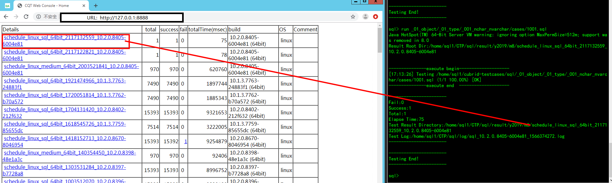  
## 2.2 MEDIUM Test 
  MEDIUM test is similar to [SQL test](#21-sql-test) except that MEDIUM database is loaded from a backuped files.  
  Let's prepare MEDIUM config file ~/CTP/conf/medium.conf which copy from SQL config file.   
  ```
  cp ~/CTP/conf/sql.conf ~/CTP/conf/medium.conf  
  ```
  Then change parameters as below:  
  ```
  [sql] 
  ...
  scenario=${HOME}/cubrid-testcases/medium
  data_file=${HOME}/cubrid-testcases/medium/files/mdb.tar.gz
  ...
  ```

  Then start MEDIUM test:
  ```
  ctp.sh sql -c ~/CTP/conf/medium.conf
  ```
  Other steps are same as SQL test.
## 2.3 SQL_BY_CCI Test  
  SQL_BY_CCI test is similar to [SQL test](#21-sql-test). 
  ```
  cp ~/CTP/conf/sql.conf ~/CTP/conf/sql_by_cci.conf  
  ```
  Then change file sql_by_cci.conf:  
  ```
  [sql]
  ...
  sql_interface_type=cci
  ...
  ```

  Then start SQL_BY_CCI test:
  ```
  ctp.sh sql -c ~/CTP/conf/sql_by_cci.conf
  ```
  How to examine sql_by_cci test result?  
  After run_cci XXX/cases/XXX.sql will generate XXX/cases/XXX.result, you can locate the problem by comparing the answer and result.
  ```
  diff XXX/cases/XXX.result  XXX/answers/XXX.answer
  ```
  Other steps are same as SQL test.
## 2.4 SQL and MEDIUM tests on Windows platform
  Windows test is similar to [SQL test](#21-sql-test).  
  Change parameters as below: 
  ```
  [sql]
  ...
  jdbc_config_file = test_win.xml
  [sql/cubrid.conf]
  ...
  ha_mode=no  
  [sql/cubrid_ha.conf]
  ...
  ha_mode=no
  ...
  ```
  Other steps are same as SQL test.
## 2.5 Execute Test with interactive mode
  Option `--interactive` can be used to enable interactive mode execution in CTP.
  With this option, we may execute one sql file or a batch of sql files in a folder.
  ```
  ctp.sh sql -c CTP/conf/sql.conf --interactive
  ```
  ```
  ======================================  Welcome to Interactive Mode ======================================  
  Usage: 
      help         print the usage of interactive
      run <arg>    the path of case file to run
      run_cci <arg>    the path of case file to run_cci by cci driver
      quit         quit interactive mode 

  For example:
      run .                                                 #run the current directory cases
      run ./_001_primary_key/_002_uniq                      #run the cases which are based on the relative path
      run test.sql                                          #run the test.sql file
      run /home/user1/dailyqa/trunk/scenario/sql/_02_object #run the cases which are based on the absolute path
      run_cci ./_001_primary_key/_002_uniq                  #run the cases which are based on the relative path
      run_cci ./_001_primary_key/_002_uniq/test.sql         #run the cases file
  sql>run .
  ```

  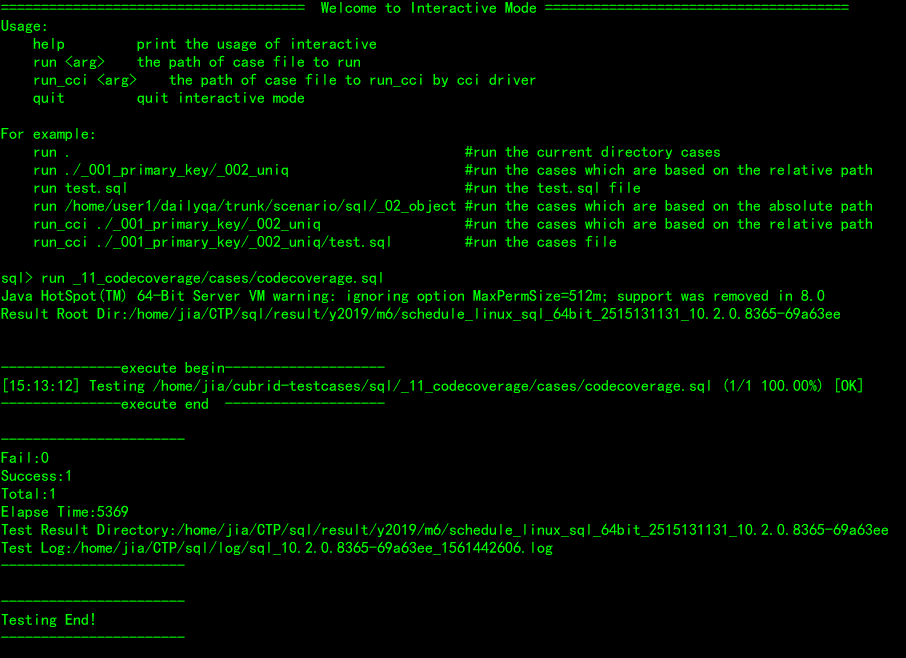  

  Alternatively, you can use the webconsole of CTP to check results.
    
# 3. Regression Test Deployment  
## 3.1 Deployment overview    
  No|role|user|ip|hostname|QUEUE_NAME|run_name
  :---:|:--:|:---:|:---:|:---:|:---:|:---:
  1|Test node|sql1|192.168.1.76|func01|QUEUE_CUBRID_QA_SQL_LINUX_GIT|run_sql
  2|Test node|sql2|192.168.1.76|func01|QUEUE_CUBRID_QA_SQL_LINUX_GIT|run_sql
  3|Test node|sql3|192.168.1.76|func01|QUEUE_CUBRID_QA_SQL_LINUX_GIT|run_sql
  4|Test node|sqlbycci|192.168.1.76|func01|QUEUE_CUBRID_QA_SQL_CCI_LINUX_GIT|run_sql_by_cci
  5|Test node|sql|192.168.1.77|func02|QUEUE_CUBRID_QA_SQL_PERF_LINUX|run_sql
  6|Test node|qa|192.168.1.161|winfunc01|QUEUE_CUBRID_QA_SQL_WIN64|run_sql 
## 3.2 Installation 
* [Install CTP as Regression Test platform](https://github.com/CUBRID/cubrid-testtools/blob/develop/doc/ctp_install_guide.md#3-install-ctp-as-regression-test-platform) 
* Configure tests
  * SQL  
  You can refer to [2. General SQL Test:SQL Test](#2-general-sql-test) about CTP/conf/sql.conf.
  * MEDIUM  
  You can refer to [2. General SQL Test:MEDIUM Test](#2-general-sql-test) about CTP/conf/medium.conf.
  * SQL_BY_CCI  
  You can refer to [2. General SQL Test:SQL_BY_CCI Test](#2-general-sql-test) about CTP/conf/sql_by_cci.conf.
* Check out test cases
  ```
  cd ~/
  git clone https://github.com/CUBRID/cubrid-testcases.git  
  ```
* Modify .bash_profile
  ```
  export CTP_HOME=$HOME/CTP
  export CTP_SKIP_UPDATE=0
  export CTP_BRANCH_NAME=develop
  . ~/.cubrid.sh
  export PATH=$HOME/CTP/bin:$HOME/CTP/common/script:$PATH:$HOME/.local/bin:$PATH:$HOME/bin

  export TZ='Asia/Seoul'
  export LC_ALL=en_US
  ```
* Add quick start script file    
  * Queue configure   
      touch start_test.sh
      ```
      stop_consumer.sh 
      prefix=`date "+%Y%m%d%H%M%S"`
      cp nohup.out nohup.out.$prefix
      echo "" > nohup.out
      nohup start_consumer.sh -q QUEUE_CUBRID_QA_SQL_LINUX_GIT -exec run_sql &
      ``` 
  * sh start_test.sh  

* send test message  
  login message@192.168.1.91 and send test message like:  
  ```
  sender.sh QUEUE_CUBRID_QA_SQL_LINUX_GIT [CI_BUILD] sql_debug default
  ```
  [CI_BUILD]:Corresponds to the build installation package address  
  
  eg: run SQL test
  sender.sh QUEUE_CUBRID_QA_SQL_LINUX_GIT http://192.168.1.91:8080/REPO_ROOT/store_01/10.2.0.8369-5a75e41/drop/CUBRID-10.2.0.8369-5a75e41-Linux.x86_64-debug.sh sql_debug default  
   
# 4. Regression Test Sustaining  
* Daily regression test  
When the build server has a new build, a SQL test will be executed. If there is something wrong and need to run SQL test again, you can send a test message.   
How to view qahome results:  
Go to QA homepage and click the CI build, wait for the page loading, then click the 'Function',look at the case of Fail  
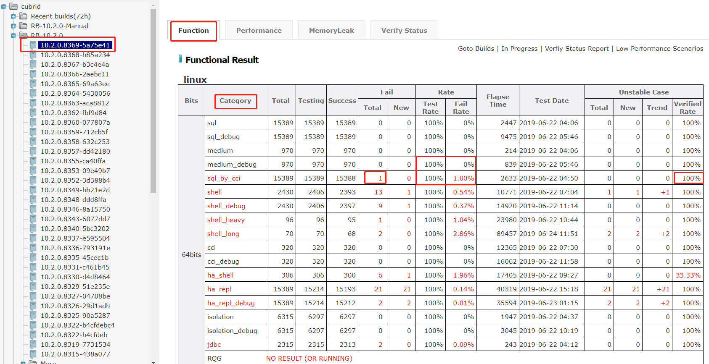

* Code coverage test  
	* VERIFY CODE COVERAGE TESTING RESULT  
	Go to QA homepage and find the ‘code coverage’ node in the left area, click the link of latest result.  
	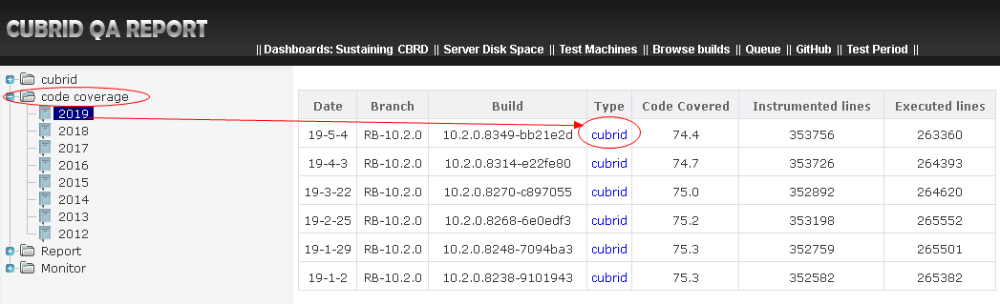  
	Click the Category(SQL,MEDIUM,SQL_BY_CCI) link.   
	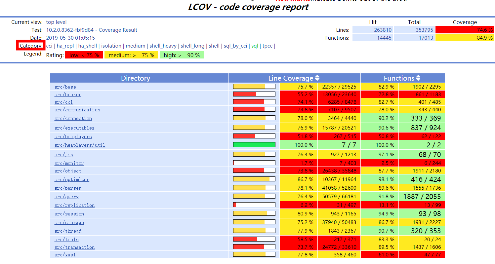  
	There is a coverage rate of lines. Its SQL and SQL_BY_CCI coverage rate of lines is usually in 58%~60%, the MEDIUM coverage rate of lines is usually in 30%~31%.  
	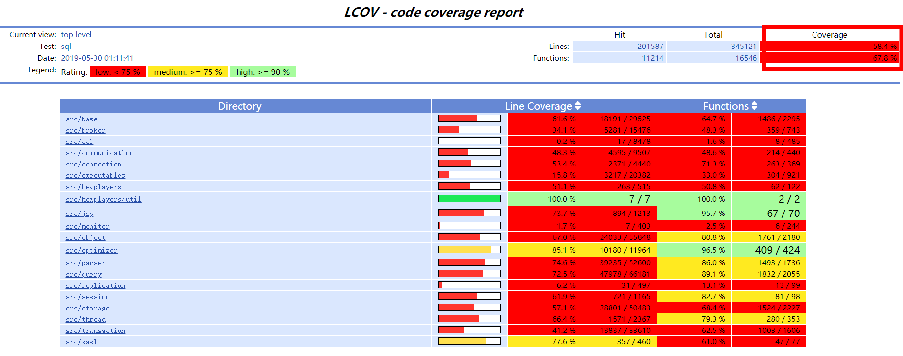

	* Send Code Coverage Testing Message  
	sh  sender_code_coverage_testing_message.sh [QUEUE_NAME]  [COVERAGE_BUILD] [Category] default
	eg:
      ```
      cd manual
      sh  sender_code_coverage_testing_message.sh QUEUE_CUBRID_QA_SQL_LINUX_GIT_test http://192.168.1.91:8080/REPO_ROOT/store_01/10.2.0.8270-c897055/drop/CUBRID-10.2.0.8270-c897055-gcov-Linux.x86_64.tar.gz http://192.168.1.91:8080/REPO_ROOT/store_01/10.2.0.8270-c897055/drop/cubrid-10.2.0.8270-c897055-gcov-src-Linux.x86_64.tar.gz  sql
      ```
* Report issues  
	* SQL ISSUE  
	You can refer to http://jira.cubrid.org/browse/CBRD-22721   
    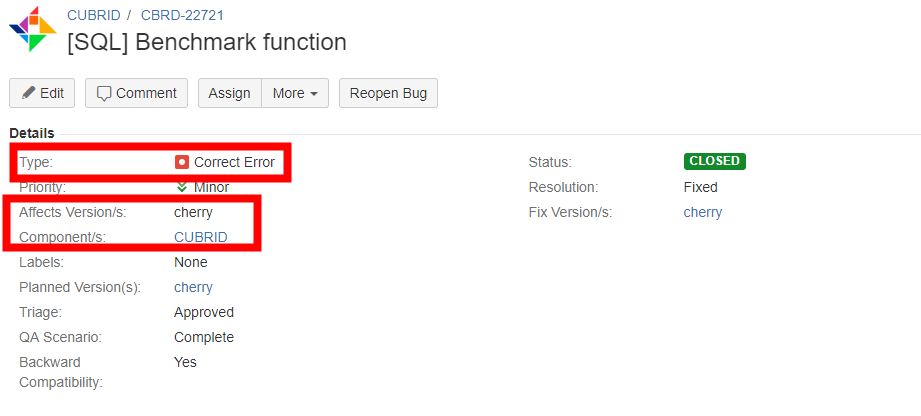  
    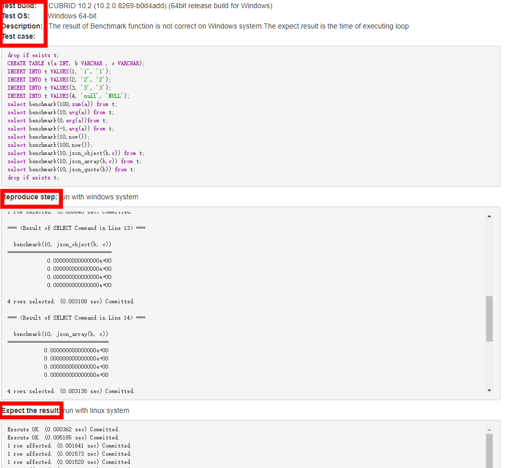  
	It is also necessary to add this information in the comment to facilitate the developers to find the information they need. Note that choose Restricted to Developers since they have they contain sensitive information such as IP, port, password, etc..  
* how to verify issue?  
	```
	Test Build: 10.2.0.8239-1f051a0 debug
	Test OS: Linux 64bit
	Test Result: Pass.
	Add test case for this issue: 

	Close this issue.
	```
# 5. How to make a SQL test case  
* A SQL test cases follows following basic structure:  
	any_testcase_folder/cases/case_file.sql  
	any_testcase_folder/answers/case_file.answer  
	any_testcase_folder/answers/case_file.answer_WIN (If the answers are different in Windows)  
	any_testcase_folder/answers/case_file.answer_cci (If the answers are different in CCI)    
	A SQL file goes to 'cases' folder, an answer file goes to 'answers' folder, and they should be in the same folder.  
  The test case and answer should have the same name.  
* When add a test case for a bug fix, add a case to path  
	cubrid-testcases/sql/_13_issues/_{yy}_{1|2}h/cases with naming rules:  
	    cbrd_xxxxx.sql  
	    cbrd_xxxxx_1.sql  
	    cbrd_xxxxx_2.sql  
	    cbrd_xxxxx_xasl.sql  


* When add a test case for a feature test, add a case to path  
	cubrid-testcases/sql/_{no}_{release_code}/cbrd_xxxxx_{feature}/cases with naming rules:   
	    {any_structured_name}.sql

* To make an answer file, follow steps 1~9
  * step 1/9: run ctp.sh sql with interactive mode  
  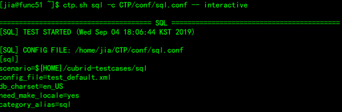 
  * step 2/9: wait for testing ready  
  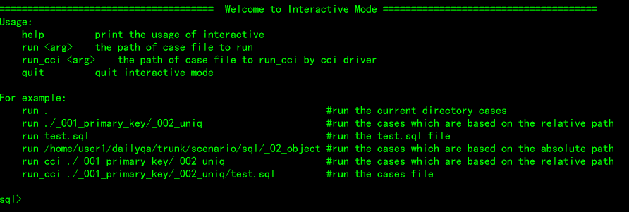 
  * step 3/9: change directory to test cases folder, touch an empty answer file, then run the test
case. The ctp.sh supports to run a single test case or a test case folder. Please read the
'Usage' and examples in the screen  
  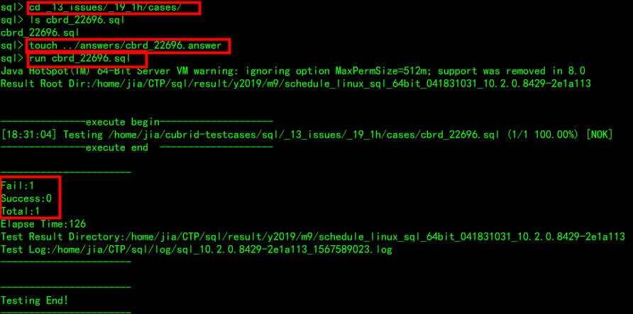 
  * step 4/9: check the result is correct. then copy it as answer. Please notice that before copying as answer,
please confirm query results one by one in sql file. Never submit incorrect answer.  
  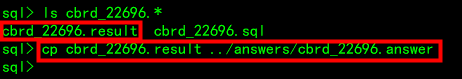 
  * step 5/9: run test case again and check the result is success.  
  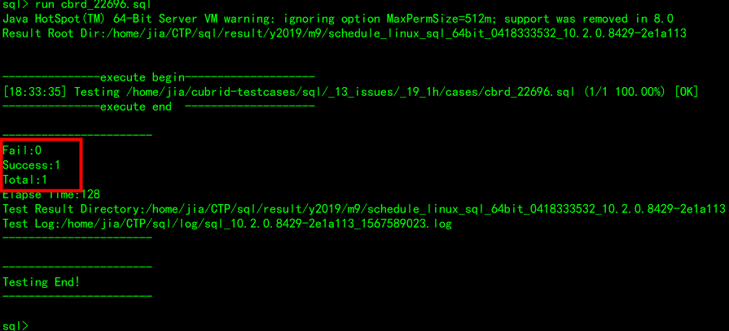 
  * step 6/9: run the test case using CCI by 'run_cci' command to check if there is a difference  
  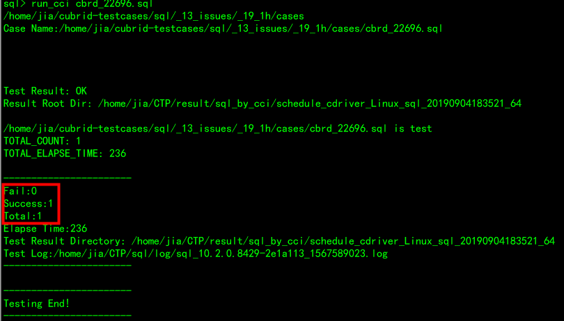 
  * step 7/9: If the result is failed and the different result is expected, then copy the result as a cci answer.  
    ```
    cp cbrd_22696.result ../answers/cbrd_22696.answer_cci
    ```
  * step 8/9: You also need to execute above steps in a Windows OS to check the test case is pass. If it has different result and it is expected, then add a windows answer as well.  
    ```
    cp cbrd_22696.result ../answers/cbrd_22696.answer_WIN 
    ```
  * step 9/9: commit the sql file and answer files to git repository.   
 
# 6. Test Case Specification
* Notes for writing case:  
  * CREATE TABLE should be preceded by DROP TABLE if exists.  
    drop table if exists t1;  
  * All schema objects created should be dropped.  
  * All session variables created should be dropped.  
  * All system parameters should be reset as default  
  We need to restore the system parameters after the test, so as not to affect other test execution   
  * Add ORDER BY for a select statement to make result stable.  
  * Answer should be stable.  
  * Don't write too much queries in one test case file, it's hard to verify when the case fails. You can separate them into several files.  
  * Avoid time-consuming queries.  
  * If need to print a query plan, add '--@queryplan' in front of the query. Or add an empty file like below:  
    /path/to/cases/case_file.sql  
    /path/to/cases/case_file.queryPlan  (make sure to output query plan info)  
    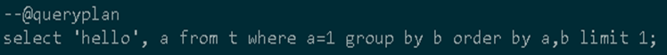

