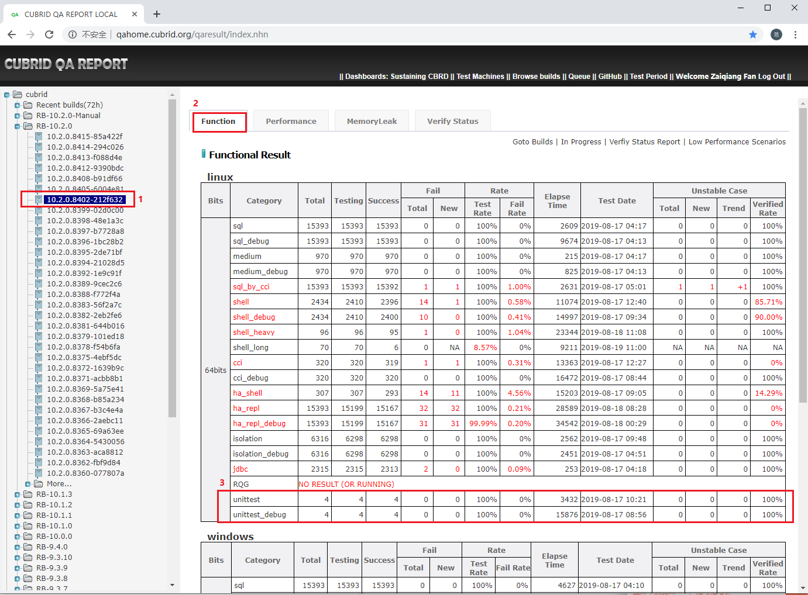
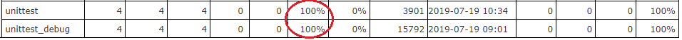
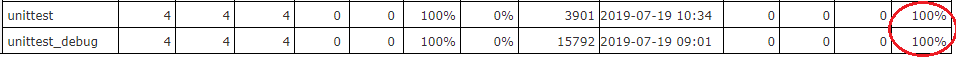
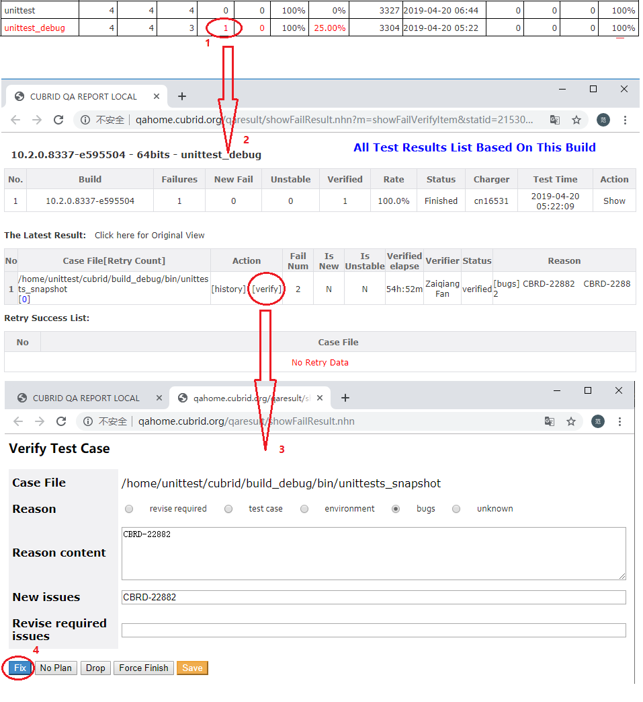

# 1. Test Objective

Unittest cases are provided by developers for the purpose of unit test. In order to enhance quality of CUBRID, these unittest cases were decided to add to daily regression test and execute on both release and debug build. In this guide, the detail usage will be introduced.

# 2. Unittest Test Usage

## 2.1 Quick Start

Let's show an example that how to execute unittest test via CTP.

### Step 1: Prepare test cases

Test cases are written in C or C++ programming language by developers. We need compile them to make executable test cases.

Download cubrid source codes from [git repository of CUBRID](https://github.com/CUBRID/cubrid.git) or package (cubrid-<build id>.tar.gz) in CI build:
  
    wget http://192.168.1.91:8080/REPO_ROOT/store_01/10.2.0.8414-294c026/drop/cubrid-10.2.0.8414-294c026.tar.gz
    tar xzvf cubrid-10.2.0.8414-294c026.tar.gz
    cd cubrid-10.2.0.8414-294c026
    
    # generate test cases of unittest based on release build
    sh build.sh  -t 64 -m release -b build_release 
    
    # generate test cases of unittest_debug on debug build
    # sh build.sh -t 64 -m debug -b build_debug
    
After compile, we may get unittest test cases as below:

    ./build_release/bin/unittests_area
    ./build_release/bin/unittests_bit
    ./build_release/bin/unittests_lf
    ./build_release/bin/unittests_snapshot
  
Then, export `CUBRID` environment variable in order that CTP may find cases by it.

Add to `~/.bash_profile`:
    
    export CUBRID=$HOME/cubrid-10.2.0.8414-294c026

### Step 2: Install CTP

Please refer to guide to [install CTP in Linux platform](ctp_install_guide.md#1-install-ctp-in-linux-platform).

Then prepare test configuration as below:
File CTP/conf/unittest.conf:

    test_category = unittest
    test_platform = linux
    build_id = 10.2.0.8414-294c026
    build_bits = 64bits
    feedback_type = file
    
### Step 3: Start to test

    ctp.sh unittest -c CTP/conf/unittest.conf
    
Output:

    ====================================== UNITTEST ==========================================
    [UNITTEST] TEST STARTED (Wed Aug 28 07:06:54 KST 2019)

    [UNITTEST] CONFIG FILE: /home/unittest/CTP/conf/unittest.conf

    feedback_type=file
    test_category=unittest
    build_bits=64bits
    test_platform=linux
    build_id=10.2.0.8414-294c026

    ----------END OF FILE----------
    => Init Step:

    => List Step:
    /home/unittest/cubrid/build_release/bin/unittests_area
    /home/unittest/cubrid/build_release/bin/unittests_bit
    /home/unittest/cubrid/build_release/bin/unittests_lf
    /home/unittest/cubrid/build_release/bin/unittests_snapshot

    => Execute Step:
    [TESTCASE-1] /home/unittest/cubrid/build_release/bin/unittests_area [SUCC]
    [TESTCASE-2] /home/unittest/cubrid/build_release/bin/unittests_bit [SUCC]
    [TESTCASE-3] /home/unittest/cubrid/build_release/bin/unittests_lf [SUCC]
    [TESTCASE-4] /home/unittest/cubrid/build_release/bin/unittests_snapshot [SUCC]
    => Finish Step:

    Success num: 4, Fail_num: 0, Skipped(macro): 0, Skipped(temp): 0, Total Scenario: 4
    Test Rate: 100.0%
    Success Rate: 100.0%
    [UNITTEST] TEST END (Wed Aug 28 07:56:15 KST 2019)
    [UNITTEST] ELAPSE TIME: 2961 seconds

### Step 4: Examine test result

Test result will be saved in directory `CTP/result/unittest/current_runtime_logs`. 
You may get detail information in file `feedback.log`.

## 2.2 Completed parameters

    # Configure 'unittest' for release build, 'unittest_debug' for debug build.
    test_category = unittest
    test_platform = linux
    
    # Specify test build used
    build_id = 10.2.0.8415-85a422f
    
    # Specify build bits used
    build_bits = 64bits
    
    # Configure 'file' or 'database'.
    # 'file': test result will be saved to CTP/result/unittest/current_runtime_logs/feedback.log
    # 'database': test result will be saved to QA homepage database.
    feedback_type = database
    feedback_db_host = 192.168.1.86
    feedback_db_port = 33080
    feedback_db_name = qaresu
    feedback_db_user = dba
    feedback_db_pwd = 
    
    # When configure 'feedback_type=database', once test is done, it would notice QA homepage to generate verification.
    feedback_notice_qahome_url = http://192.168.1.86:6060/qaresult/shellImportAction.nhn?main_id=<MAINID>    

# 3. Unittest Test Case Specification

Actually, there is no specific conventions to follow in order to judge which execution is OK or NOK. Currently, below logic is applied:

    if [ `cat ${unittestlog} | grep -i 'fail\|Unit tests failed' | wc -l ` -eq 0 -a `cat ${unittestlog} | grep -i 'OK\|success' | wc -l ` -ne 0 ]; then
        IS_SUCC=true
    else
        IS_SUCC=false
    fi

So, for a test case execution, if test output has no `'fail'` keyword, and has `'OK'` or `'success'` keyword, it can be regarded as pass.

# 4. Regression Test Deployment

## 4.1 Deployment overview

<table>
<tr>
<th>Description</th>
<th>User Name</th>
<th>IP</th>
<th>Hostname</th>
<th>Tools to deploy</th>
</tr>
<tr class="even">
<td>Test node</td>
<td>unittest</td>
<td>192.168.1.98</td>
<td>func23</td>
<td> cubrid  
 CTP  
  
 </td>
</tr>
</table>

## 4.2 Installation

* ### Install CTP as regression test

    Please follow guide below to install CTP to `$HOME/CTP`:
    https://github.com/CUBRID/cubrid-testtools/blob/develop/doc/ctp_install_guide.md#2-install-ctp-as-regression-test-in-linux-platform

* ### Configure unittest test

    File $HOME/CTP/conf/unittest_template.conf
    
      test_category=unittest
      test_platform=linux
      build_id=<build_id>
      build_bits=64bits

      feedback_notice_qahome_url=http://192.168.1.86:6060/qaresult/shellImportAction.nhn?main_id=<MAINID>

      feedback_type=database
      feedback_db_host=192.168.1.86
      feedback_db_port=33080
      feedback_db_name=qaresu
      feedback_db_user=dba
      feedback_db_pwd=    
    
* ### Modify `.bash_profile`

    Add below to `~/.bash_profile`:

        export CUBRID=$HOME/cubrid
        
* ### Add quick start script file

    File ~/start_test.sh
    
        start_consumer.sh -q QUEUE_CUBRID_QA_UNITTEST_LINUX -exec run_unittest
        
# 5. Regression Test Sustaining

## 5.1 How to start test?

*  ### Start test daemon process:

    Log into test server, keep daemon process for start_test.sh:

        nohup sh start_test.sh &

    After startup, it will keep listening to new test messages. Once there is new message, it will fire the test immediately. Except CI test messages which were generated automatically, you may send test message by manual.
  
* ### Send test message same as daily configuration:

    Log into message server (message@192.168.1.91) first.
    
    **For `'unittest'` message:**

      [message@qa03 ~]$ sender.sh QUEUE_CUBRID_QA_UNITTEST_LINUX http://192.168.1.91:8080/REPO_ROOT/store_01/10.1.3.7765-265e708/drop/cubrid-10.1.3.7765-265e708.tar.gz unittest default

      Message: 

      Message Content: Test for build 10.1.3.7765-265e708 by CUBRID QA Team, China
      MSG_ID = 190828-141045-222-000001
      MSG_PRIORITY = 4
      BUILD_ABSOLUTE_PATH=/home/ci_build/REPO_ROOT/store_01/10.1.3.7765-265e708/drop
      BUILD_BIT=0
      BUILD_CREATE_TIME=1566444939000
      BUILD_GENERATE_MSG_WAY=MANUAL
      BUILD_ID=10.1.3.7765-265e708
      BUILD_IS_FROM_GIT=1
      BUILD_PACKAGE_PATTERN=cubrid-{1}.tar.gz
      BUILD_SCENARIOS=unittest
      BUILD_SCENARIO_BRANCH_GIT=release/10.1
      BUILD_SEND_DELAY=524106
      BUILD_SEND_TIME=1566969045221
      BUILD_STORE_ID=store_01
      BUILD_SVN_BRANCH=RB-10.1.3
      BUILD_SVN_BRANCH_NEW=RB-10.1.0
      BUILD_TYPE=general
      BUILD_URLS=http://192.168.1.91:8080/REPO_ROOT/store_01/10.1.3.7765-265e708/drop/cubrid-10.1.3.7765-265e708.tar.gz
      BUILD_URLS_CNT=1
      BUILD_URLS_KR=http://192.168.1.91:8080/REPO_ROOT/store_01/10.1.3.7765-265e708/drop/cubrid-10.1.3.7765-265e708.tar.gz

      Do you accept above message [Y/N]:   Y     

    **For `'unittest_debug'` message:**
    
      [message@qa03 ~]$ sender.sh QUEUE_CUBRID_QA_UNITTEST_LINUX http://192.168.1.91:8080/REPO_ROOT/store_01/10.1.3.7765-265e708/drop/cubrid-10.1.3.7765-265e708.tar.gz unittest_debug default

    After test, related test result will be shown in QA homepage.
  
## 5.2 Verify test Results  

* ### Check if there is unittest test result

    Open QA home (http://qahome.cubrid.org), navigate to find unittest test result as below. If there is no any result, you need to find the reason out.
    
    
    
* ### Test Rate should be 100%

    It means the `Testing` is equal to the sum of `Success` and `Fail(Total)`.
    
    
* ### Verified Rate should be 100%    

    The verified rate should be 100% as below.
    
    
    If there is a failed test case, you need to verify it following below:
    
    
    Note: 
    
    New issues : It is link to a jira issue which reported by this case.
    
    Revise required issues: It is link to a jira issue which lead to change in test case and answer.
   
    Regarding as how to report an issue when there is failure, please refer to http://jira.cubrid.org/browse/CBRD-22882 as an example.
  
  
